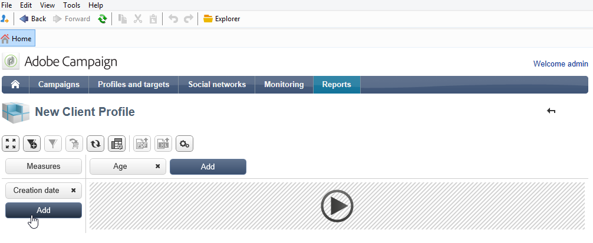

# 使用多维数据集浏览数据{#use-cubes-to-create-reports}

使用多维数据集创建报告，并识别和选择数据库中的数据。 您可以：

* 根据多维数据集创建报告。 [了解详情](#explore-the-data-in-a-report)。
* 收集数据库中的数据，并将其分组到列表中，例如，识别和构建目标和投放。 [了解详情](#build-a-target-population)。
* 将透视表插入报表中，引用其中的现有多维数据集。 [了解详情](#insert-a-pivot-table-into-a-report)。

## 在报表中浏览数据 {#explore-the-data-in-a-report}

### 第1步 — 基于多维数据集创建报告 {#step-1---create-a-report-based-on-a-cube}

配置[多维数据集后](cube-indicators.md)，可将其用作创建新报告的模板。

要基于现有多维数据集创建报告，请执行以下步骤：

1. 单击&#x200B;**[!UICONTROL Create]**&#x200B;选项卡的&#x200B;**[!UICONTROL Reports]**&#x200B;按钮，然后选择刚刚创建的多维数据集。

   

1. 单击&#x200B;**[!UICONTROL Create]**&#x200B;按钮确认：这会将您转到报告配置和查看页面。

   默认情况下，前两个可用尺寸以行和列提供，但表中不显示任何值。 要生成表，请单击主图标：

   

1. 可以切换尺寸的轴、删除它们、添加新测量等。 要实现此目的，请使用相应的图标。

   

   这些操作详见下文。

### 第2步 — 选择行和列 {#step-2---select-lines-and-columns}

默认显示显示多维数据集的前两个维（在本例中是年龄和城市）。

每个轴上的&#x200B;**[!UICONTROL Add]**&#x200B;按钮允许您添加维度。

1. 选择要显示在表的行和列中的尺寸。 为此，请拖放可用的维度。
1. 从列表中选择要添加到表中的维：
   

1. 然后选择此尺寸的参数。

   

   这些参数取决于所选维的数据类型。

   例如，对于日期，可以使用多个级别。 有关详细信息，请参阅[显示度量](customize-cubes.md#display-measures)。

   在这种情况下，可以使用以下选项：

   

   您可以：

   * 加载期间展开数据：默认情况下，每次更新报表时都会显示这些值（默认值：否）。
   * 在行末显示合计：当数据以列显示时，附加选项允许您在行末显示合计：向表中添加一列（默认值：是）。
   * 应用排序：列的值可以根据值、标签或度量进行排序（默认值：按值）。
   * 按升序(a-z， 0-9)或降序(z-a， 9-0)显示值。
   * 更改加载时要显示的列数（默认情况下： 200）。

1. 单击&#x200B;**[!UICONTROL Ok]**&#x200B;确认：该维度已添加到现有维度。

   表上方的黄色横幅显示您已进行更改：单击&#x200B;**[!UICONTROL Save]**&#x200B;按钮进行保存。

   

### 步骤3 — 配置要显示的度量 {#step-3---configure-the-measures-to-display}

定义行和列后，选择要显示的度量。 默认情况下，只显示一个度量。

要添加和配置度量，请执行以下步骤：

1. 单击 **[!UICONTROL Measures]** 按钮。

   

1. 使用&#x200B;**[!UICONTROL Use a measure]**&#x200B;按钮，选择现有度量之一。

   

   选择要显示的信息和格式选项。 选项列表取决于测量类型。

   

   通过标题中的&#x200B;**[!UICONTROL Edit the configuration of the pivot table]**&#x200B;图标，还可以使用整体度量值配置。

   

   然后，您可以选择是否显示度量标签。 [了解详情](customize-cubes.md#configure-the-display)。

1. 您可以基于现有度量构建新度量。 为此，请单击&#x200B;**[!UICONTROL Create a measure]**&#x200B;并进行配置。

   

   可用的测量类型如下：

   * 测量组合：此类型的测量允许您使用现有测量构建新测量：

     可用的运算符有：和、差、乘和速率。

   * 比例：此类型的测量使您能够计算针对给定维度测量的记录数。 您可以根据维度或子维度计算比例性。
   * 变量：通过此度量，可计算某个级别值的变量。
   * 标准偏差：通过此类度量，可计算每组单元格内与平均值之间的偏差。 例如，您可以比较所有现有区段的购买量。

   创建之后，度量会添加到报表中。

   

   创建测量后，可以对其进行编辑并更改其配置。 为此，请单击&#x200B;**[!UICONTROL Measures]**&#x200B;按钮，然后浏览到要编辑的度量的选项卡。

   然后单击&#x200B;**[!UICONTROL Edit the dynamic measure]**&#x200B;以访问设置菜单。

## 构建目标群体 {#build-a-target-population}

通过使用多维数据集构建报表，您可以从表中收集数据并将其保存在列表中。

要将群体分组到列表中，请执行以下步骤：

1. 单击包含要收集的群体的单元格以选择它们，然后单击&#x200B;**[!UICONTROL Add to cart]**&#x200B;图标。

   

   为此，可根据需要多次收集各种用户档案

1. 单击&#x200B;**[!UICONTROL Show cart]**&#x200B;按钮以查看其内容，然后再运行导出。

   

1. 使用&#x200B;**[!UICONTROL Export]**&#x200B;按钮将购物车中的项目分组到列表中。

   输入列表名称并选择要执行的导出类型。

   

   单击&#x200B;**[!UICONTROL Start]**&#x200B;以运行导出。

1. 导出完成后，将显示一条消息，确认其执行和已处理的记录数。

   

   您可以保存购物车的内容或将其清空。

   新列表可通过&#x200B;**[!UICONTROL Profiles and targets]**&#x200B;选项卡使用。

   

## 在报表中插入数据透视表 {#insert-a-pivot-table-into-a-report}

要创建表并浏览多维数据集中的数据，请执行以下步骤：

1. 创建一个具有单个页面的新报表，并在其中插入数据透视表。

   

1. 在该页的&#x200B;**[!UICONTROL Data]**&#x200B;选项卡中，选择一个多维数据集以处理它包含的维并显示计算的度量。

   

   这样，您就可以构建要显示的报表。 有关详细信息，请参阅[第2步 — 选择行和列](#step-2---select-lines-and-columns)。
