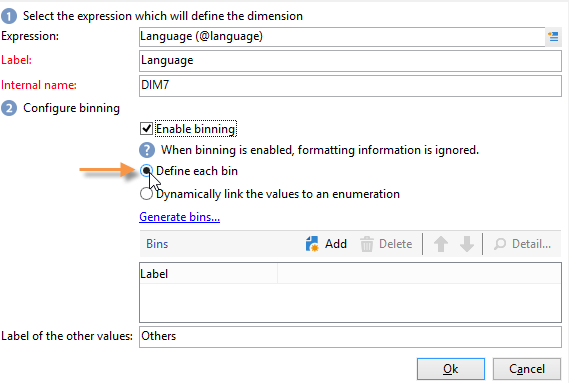
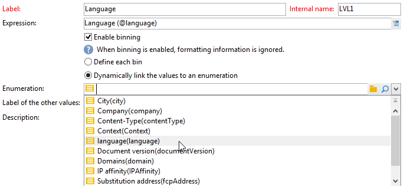
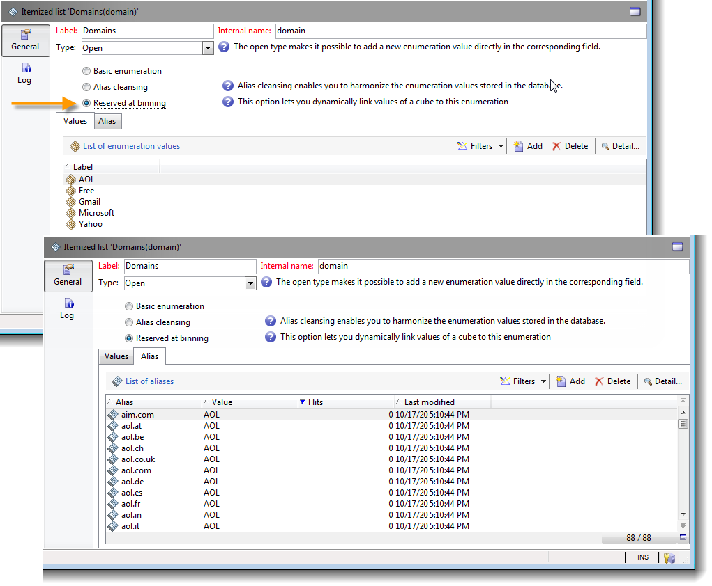
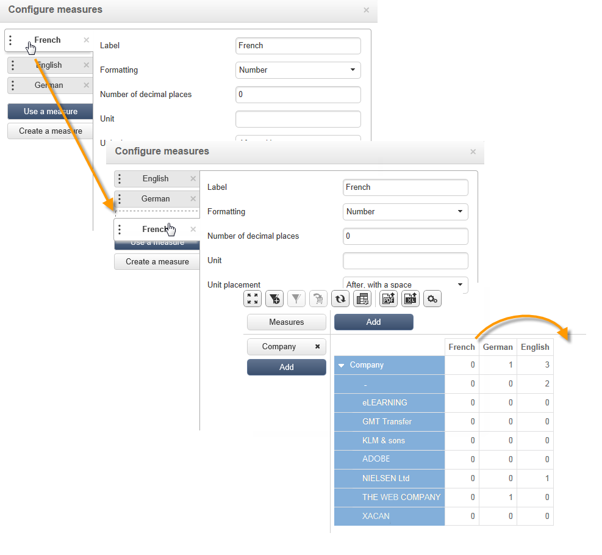
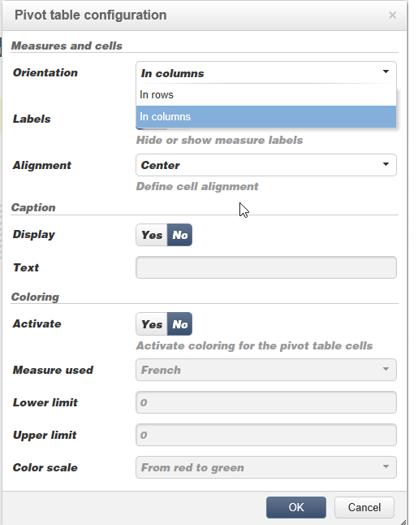

# 自定义多维数据集{#cube-custom}

## 数据量化 {#data-binning}

使用数据绑定通过根据条件对值进行分组来简化数据显示。 根据可用的信息，您可以定义年龄组、将电子邮件域分组在一起、限制为值枚举、明确限制数据在专用行或列中显示和分组所有其他数据等。

总体而言，提供了三种类型的量化：

1. 使用手动定义的值范围。 例如，年龄、平均购物车、打开的投放数量等)。 有关更多信息，请参阅 [定义每个纸盒](#defining-each-bin).
1. 根据枚举的值，动态地：仅显示枚举中包含的值，所有其他值都将分组到“其他”中。 有关更多信息，请参阅 [动态管理垃圾桶](#dynamically-managing-bins).
1. 使用值范围，将所有其他值分组到一起。 例如，18至25岁、26至59岁和其他人。 有关更多信息，请参阅 [创建值范围](#creating-value-ranges).

要启用量化，请在创建尺寸时选中相应的框。

您可以手动创建二进制文件或将它们链接到现有枚举。

Adobe Campaign还为自动绑定提供了助手：可以将值划分为N个组，或根据数据库中最频繁的值进行分组。

### 定义每个纸盒 {#define-each-bin}

要单独创建每个bin，请选择 **[!UICONTROL Define each bin]** 选项并使用表创建各种回收箱。

单击 **[!UICONTROL Add]** 按钮，用于创建新框并列出将分组到框中的值。

在以下示例中，语言分为三类：英语/德语/荷兰语、法语/意大利语/西班牙语和其他语言。

可以使用SQL掩码将多个值组合到一个过滤器中。 要执行此操作，请选中 **[!UICONTROL Yes]** 在 **[!UICONTROL Use an SQL mask]** 列并输入要应用的SQL过滤器 **[!UICONTROL Value or expression]** 列。

<!--In the example below, all email domains that start with **yahoo** (yahoo.fr, yahoo.com, yahoo.be, etc.), or with **ymail** (ymail.com, ymail.eu, etc.) will be grouped under the label **YAHOO!**, as well as addresses with the **rocketmail.com** domain.-->

### 动态管理回收站 {#dynamically-manage-bins}

可以通过枚举动态管理值。 这意味着仅显示枚举中包含的值。 当枚举值改变时，将自动调整多维数据集的内容。

要创建此类型的值量化，请应用以下步骤：

1. 创建新维度并启用量化。
1. 选择 **[!UICONTROL Dynamically link the values to an enumeration]** 选项并选择匹配的明细列表。

   

   每当更新枚举值时，将自动地调整匹配的二进制文件。

要了解有关明细列表的详细信息，请参阅 [此页面](../../v8/config/ui-settings.md#enumerations).

### 创建值范围 {#create-value-ranges}

您可以根据所需的间隔将值分组到多个范围中。

要手动定义范围，请单击 **[!UICONTROL Add]** 按钮并选择 **[!UICONTROL Define a range]** ：

然后指定下限和上限，并单击 **[!UICONTROL Ok]** 以确认。

### 自动生成回收站 {#generate-bins-automatically}

也可以自动生成垃圾桶。 要执行此操作，请单击 **[!UICONTROL Generate bins...]** 链接。

您可以：

* **[!UICONTROL Recover the most frequently used values]**

   如果您生成4个二进制文件，将显示这4个最常用的值，而其他值将被计数并分组到“其他”类别中。

* **[!UICONTROL Generate bins in the form of slots]**

   对于同一示例，Adobe Campaign会自动创建4个大小相同的值槽以在数据库中显示值。

在这种情况下，将忽略事实架构中选择的过滤器。

### 明细列表 {#enumerations}

为了提高报表的相关性和可读性，您可以使用Adobe Campaign创建特定的明细列表，将不同的值重新分组到同一个框中。 这些明细列表（保留用于量化）将在多维数据集中引用，然后显示在报表中。

Adobe Campaign还提供了域枚举，用于显示数据库中按ISP重新分组的所有联系人的电子邮件域列表，如以下示例所示：

它使用以下模板构建：

要使用此枚举创建报告，请使用以下方式创建多维数据集 **[!UICONTROL Email domain]** 维度。 选择 **[!UICONTROL Enable binning]** option then **[!UICONTROL Dynamically link the values to an enumeration]**. 然后选择 **域** 如上所示的明细列表。 所有未指定别名的值都将重组到 **其他** 标签。

接下来，基于此多维数据集创建一个报告以显示值。

您只需修改明细列表，即可更新相关报表。 例如，创建 **Adobe** 值并添加 **adobe.com** 别名和报表会自动更新为枚举级别的Adobe值。

此 **[!UICONTROL Domains]** 枚举用于生成显示域列表的内置报告。 要调整这些报告的内容，您可以编辑此列表。

您可以创建保留用于清单的其他枚举，并在其他多维数据集中使用它们：所有别名值都将在第一个枚举选项卡中指定的清单中重新分组。

要了解有关明细列表的详细信息，请参阅 [此页面](../../v8/config/ui-settings.md#enumerations).

## 多维数据集中的聚合 {#calculate-and-use-aggregates}

最大数据量可以在聚合中计算。

在处理大量数据时，聚合很有用。 它们会根据专用工作流框中定义的设置自动更新，以将最近收集的数据集成到指标中

聚合在每个多维数据集的相关选项卡中定义。

>[!NOTE]
>
>可以在聚合本身中配置用于更新聚合计算的工作流，也可以通过链接到相关多维数据集的外部工作流更新聚合。

要创建新聚合，请应用以下步骤：

1. 单击 **[!UICONTROL Aggregates]** 选项卡，然后单击 **[!UICONTROL Add]** 按钮。
1. 输入聚合的标签，然后添加要计算的维度。
1. 选择一个维和一个级别。 对每个维度和每个级别重复此过程。
1. 单击 **[!UICONTROL Workflow]** 选项卡，创建聚合工作流。

   * 此 **[!UICONTROL Scheduler]** 利用活动，可定义计算更新的频率。 有关调度程序的详细信息，请参见 [本节](../../automation/workflow/scheduler.md).
   * 此 **[!UICONTROL Aggregate update]** 通过活动，您可以选择要应用的更新模式：全部或部分。

      默认情况下，会在每次计算期间执行完全更新。 要启用部分更新，请选择相关选项并定义更新条件。

## 定义度量 {#define-measures}

测量类型定义于 **[!UICONTROL Measures]** 立方的选项卡。 您可以计算总和、平均值、偏差等。

您可以根据需要创建任意数量的度量：然后选择要显示或隐藏在表中的度量。 如需详细信息，请参阅[此部分](#displaying-measures)。

要定义新度量，请应用以下步骤：

1. 单击 **[!UICONTROL Add]** 按钮，并选择要计算的度量类型和公式。

   

1. 如有必要，并根据运算符，选择操作涉及的表达式。

   此 **[!UICONTROL Advanced selection]** 按钮可让您创建复杂的计算公式。 如需详细信息，请参阅[此部分](../../automation/workflow/query.md)。

1. 此 **[!UICONTROL Filter the measure data...]** 链接允许您限制计算字段，并仅将其应用于数据库中的特定数据。

   

1. 输入度量的标签并添加说明，然后单击 **[!UICONTROL Finish]** 创建它。

## 自定义度量 {#display-measures}

您可以根据需要配置表中度量的显示：

* 度量的显示顺序。 [了解详情](#display-sequence)
* 要在报表中显示/隐藏的信息。 [了解详情](#configuring-the-display)
* 要显示的度量：百分比、总计、小数位数等。 [了解详情](#changing-the-type-of-measure-displayed)

### 显示序列  {#display-sequence}

通过配置多维数据集中计算的度量 **[!UICONTROL Measures]** 按钮。

移动线条以更改显示顺序。 在以下示例中，法国数据被移动到列表底部：这意味着它将显示在最后一列。

### 配置显示 {#configuring-the-display}

可以针对每个测量单独执行测量、线和列的配置，也可以针对整体执行配置。 通过特定图标，可访问显示模式选择窗口。

* 单击 **[!UICONTROL Edit the configuration of the pivot table]** 图标以访问配置窗口。

   可选择是否显示度量的标签以及配置其布局（行或列）。

利用颜色选项，可突出显示重要值以方便阅读。

### 更改显示的度量类型 {#changing-the-type-of-measure-displayed}

在每个度量中，您可以定义要应用的单位和格式。

## 共享您的报告 {#share-a-report}

配置报告后，您可以保存报告并与其他操作员共享。

要执行此操作，请单击 **[!UICONTROL Show the report properties]** 图标并启用 **[!UICONTROL Share this report]** 选项。

指定报告所属的类别及其相关性。 <!--For more on this, refer in [this page](../../reporting/using/configuring-access-to-the-report.md#report-display-context) to the **Display sequence** and **Defining the filtering options** sections.-->

要确认这些更改，您需要保存报告。

## 创建过滤器 {#create-filters}

可以创建用于查看数据部分的过滤器。

操作步骤：

1. 单击 **[!UICONTROL Add a filter]** 图标。

   

1. 选择过滤器关注的维度

1. 选择筛选器的类型及其精度级别。

   

1. 创建过滤器后，该过滤器将显示在报表上方。

   单击筛选条件以进行编辑。 单击该十字可将其删除。

   您可以根据需要组合任意数量的过滤器：它们全部将显示在此区域中。

   

每次修改过滤器（添加、删除和更改）时，都必须重新计算报表。

也可以基于所选内容创建过滤器。 要执行此操作，请选择源单元格、行和列，然后单击 **[!UICONTROL Add a filter]** 图标。

要选择行、列或单元格，请左键单击它。 要取消选择，请再次单击。

过滤器将自动应用并添加到报表上方的过滤器区域。

