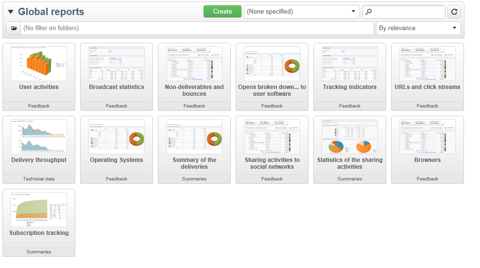

# 全局报告 {#global-reports}

这些报告涉及整个数据库中的数据活动。 要查看报表仪表板，请转到 **[!UICONTROL Reports]** 选项卡。

要显示报表，请单击其名称。 默认情况下，可以使用以下报表：

>[!NOTE]
>
>此部分仅显示链接到投放的报告。

* **[!UICONTROL Delivery throughput]** ：请参阅 [投放吞吐量](#delivery-throughput).
* **[!UICONTROL Browsers]** ：请参阅 [浏览器](#browsers).
* **[!UICONTROL Sharing to social networks]** ：请参阅 [分享到社交网络](#sharing-to-social-networks).
* **[!UICONTROL Statistics on sharing activities]** ：请参阅 [共享活动统计信息](#statistics-on-sharing-activities).
* **[!UICONTROL Operating systems]** ：请参阅 [操作系统](#operating-systems).
* **[!UICONTROL URLs and click streams]** ：请参阅 [URL和点击流](delivery-reports.md#urls-and-click-streams).
* **[!UICONTROL Tracking indicators]** ：请参阅 [跟踪指标](delivery-reports.md#tracking-indicators).
* **[!UICONTROL Non-deliverables and bounces]** ：请参阅 [无法投放项和退回](#non-deliverables-and-bounces).
* **[!UICONTROL User activities]** ：请参阅 [用户活动](#user-activities).
* **[!UICONTROL Subscription tracking]** ：请参阅 [订阅跟踪](#subscription-tracking).
* **[!UICONTROL Delivery summary]** ：请参阅 [投放摘要](delivery-reports.md#delivery-summary).
* **[!UICONTROL Delivery statistics]** ：请参阅 [投放统计信息](#delivery-statistics).
* **[!UICONTROL Breakdown of opens]** ：请参阅 [打开的细分](#breakdown-of-opens).

## 投放吞吐量 {#delivery-throughput}

此报表包含有关给定时段内整个平台的投放吞吐量的信息。 用于衡量邮件传送速度的标准是每小时发送的邮件数和邮件大小（以位/秒为单位）。在下面的示例中，第一个图表用蓝色显示成功投放，用橙色显示错误投放的数量。

您可以通过更改时间刻度来配置显示的值： 1小时视图、3小时视图、24小时视图等。 单击 **[!UICONTROL Refresh]** 以确认您的选择。

>[!NOTE]
>
>您还可以使用监控每小时发送的投放数量 [控制面板](https://experienceleague.adobe.com/docs/control-panel/using/sftp-management/sftp-storage-management.html).
>
>所有管理员用户都可访问控制面板。[此页面](https://experienceleague.adobe.com/docs/control-panel/using/discover-control-panel/managing-permissions.html?lang=zh-Hans#discover-control-panel)详细介绍了授予用户管理员访问权限的步骤。
>

## 用户活动 {#user-activities}

此报表以图表形式显示每半小时、每小时或每日的打开数、点击数和事务数细目。

可以使用以下选项：

* **[!UICONTROL Opens]** ：打开的邮件总数。 不考虑文本格式的电子邮件。 [了解详情](metrics-calculation.md#tracking-opens-)。
* **[!UICONTROL Clicks]** ：投放中链接的点击总数。 对退订链接和镜像页面的点击次数不包含在内。
<!--
* **[!UICONTROL Transactions]** : Total number of transactions after a message is received. In order for a transaction to be taken into account, a transaction type webtracking tag must be inserted into the matching web page. Webtracking configuration is presented in [this section](../../configuration/using/about-web-tracking.md).
-->

## 无法投放项和退回 {#non-deliverables-and-bounces}

此报表显示无法投放的细分以及每个Internet域的退回细分。

此 **[!UICONTROL Number of messages processed]** 表示投放服务器处理的消息总数。 该值低于某些投放已停止或暂停（在服务器处理之前）时要投放的消息数。

**[!UICONTROL Breakdown of errors by type]**

>[!NOTE]
>
>此报告中显示的错误会触发隔离过程。 有关隔离管理的更多信息，请参阅 [隔离管理](../send/quarantines.md).

此报表的第一部分以值表和图表的形式显示了无法投放的细分。

对于每种错误类型，我们具有：

* 此类型的错误消息数，
* 与有错误的消息总数相比，有此类型错误的消息所占的百分比；
* 与已处理的消息总数相比，此类型的错误消息的百分比。

使用以下指示器：

* **[!UICONTROL User unknown]** ：投放期间生成的错误类型，指示电子邮件地址无效。
* **[!UICONTROL Invalid domain]** ：发送投放时生成的错误类型，指示电子邮件地址的域错误或不存在。
* **[!UICONTROL Inbox full]** ：在尝试投放五次后生成的错误类型，旨在指示收件人的收件箱中包含的消息过多。
* **[!UICONTROL Account disabled]** ：发送投放时生成的错误类型，指示地址不再存在。
* **[!UICONTROL Rejected]** ：当IAP（互联网访问提供商）拒绝地址时生成的错误类型，例如，应用安全规则（反垃圾邮件软件）之后。
* **[!UICONTROL Unreachable]** ：消息分发字符串中发生的错误类型：SMTP中继上的事件、域名暂时不可访问等
* **[!UICONTROL Not connected]** ：错误类型，指示收件人的手机在发送时关闭或与网络断开连接。

  >[!NOTE]
  >
  >此指标与上的投放相关 [移动渠道](../send/send.md) 仅限。

  通过单击 `[+]` 符号。 对于每个错误类型，您可以按域显示错误消息的细分。

**[!UICONTROL Breakdown of errors per domain]**

此报表的第二部分以值表和图表的形式显示每个Internet域的错误细分情况。

对于每个域名，我们具有：

* 此域有错误的消息数，
* 与该域处理的消息总数相比，该域出现错误的消息百分比。
* 此域的错误消息占错误消息总数的百分比。

通过单击 [+] 符号。 对于每个域类型，您可以按错误类型显示错误消息的细目。

>[!NOTE]
>
>此报告中显示的域名在多维数据集级别定义。 要更改这些值，请编辑 **[!UICONTROL Delivery logs (broadlogrcp)]** 多维数据集。 如需详细信息，请参阅[此部分](gs-cubes.md)。此 **[!UICONTROL Others]** 类别包括不属于特定类的域名。

## 浏览器 {#browsers}

此报表可显示相关时段内投放收件人使用的Internet浏览器细目。

>[!NOTE]
>
>此报表中显示的值是估计值：仅考虑已点击投放的收件人。

**全局统计信息**

有关浏览器使用的全局统计信息以值表和图表的形式显示。

使用以下指示器：

* **[!UICONTROL Visitors]** ：定向（每个Internet浏览器）并已至少单击一次投放的收件人总数。
* **[!UICONTROL Pages viewed]** ：在一次投放（每个Internet浏览器）中对所有投放的链接的总点击次数。
* **[!UICONTROL Usage rate]** ：此比率表示访客（每个互联网浏览器）相对于访客总数的细分情况。

**每个浏览器的统计信息**

在全局统计值表中，可以单击每个浏览器名称查看它们的使用情况统计信息。

统计以曲线、图表和值表的形式呈现。

此 **[!UICONTROL History]** 曲线表示此浏览器每日的出勤率。 该比率是每天访客数（在此浏览器上）与当天访问率最高的访客数之比。

此 **[!UICONTROL Breakdown per version]** 图表表示每个版本的访客数与（此浏览器上的）访客总数的对比细目。

值表使用以下指标：

* **[!UICONTROL Global rate]** ：此比率表示每个版本的访客与（所有浏览器上）访客总数的细分情况。
* **[!UICONTROL Relative rate]** ：此比率表示每个版本的访客与（此浏览器上的）访客总数的细分情况。

<!--
### Sharing to social networks {#sharing-to-social-networks}

Viral marketing lets delivery recipients share information with their contact network: they can add a link to their profile (Facebook, Twitter, etc.) or send a message to a friend. Each share and each access to shared information is tracked within the delivery. For more information on viral marketing, refer to [this section](../../delivery/using/viral-and-social-marketing.md).

This report shows the breakdown of shared and opened messages per social network (Facebook, Twitter, etc.) and/or per email.

**[!UICONTROL Email delivery statistics]**

In the email delivery statistics, two values are displayed:

* **[!UICONTROL Number of messages to be delivered]** : Total number of messages processed during delivery analysis.
* **[!UICONTROL Number of successful deliveries]** : Number of messages processed successfully.

**[!UICONTROL Sharing activities and mail open statistics]**

The central table shows the statistics on email shares and opens.

In the **[!UICONTROL Shares]** column, we have the following indicators:

* **[!UICONTROL No. of sharing activities]** : Total number of messages shared on each social network. This value equals the total number of clicks on the icon of the matching **[!UICONTROL Links for sharing to social networks]** personalization block.
* **[!UICONTROL Breakdown]** : This rate represents the breakdown of shares per social network, in relation to the total number of shares.
* **[!UICONTROL Sharing rate]** : This rate represents the breakdown of shares per social network, in relation to the number of messages to be delivered.

In the **[!UICONTROL Opens]** column, we have the following indicators:

* **[!UICONTROL No. of opens]** : Total number of messages opened by people whom the message was forwarded to (via the **[!UICONTROL Links for sharing to social networks]** personalization block). This value equals the number of times the mirror page was displayed. Opens by delivery recipients are not taken into account.
* **[!UICONTROL Breakdown]** : This rate represents the breakdown of opens per social network, in relation to the total number of opens.
* **[!UICONTROL Rate of opens]** : This rate represents the breakdown of opens per social network, in relation to the total number of shares.

**[!UICONTROL Breakdown of sharing activities and opens]**

This section includes two charts which represent the breakdown of sharing activities and opens per social network.

## Statistics on sharing activities {#statistics-on-sharing-activities}

This report shows the evolution of shares to social media in time.

For more information on viral marketing, refer to [this section](../../delivery/using/viral-and-social-marketing.md).

Statistics are presented in the form of a table of values and a chart.

The following indicators are used:

* **[!UICONTROL New contacts]** : Number of new subscriptions following the reception of a message shared via email. This value matches the number of people who received a message shared via email, clicked the **[!UICONTROL Subscription link]** and filled in the subscription form. 
* **[!UICONTROL Opens]** : Total number of messages opened by people whom the message was transferred to (via the **[!UICONTROL Link for sharing to social networks]** personalization block). This value equals the number of times the mirror page was displayed. Opens by delivery recipients are not taken into account.
* **[!UICONTROL Sharing activities]** : Total number of messages shared via social networks. This value matches the total number of clicks on the icon of the **[!UICONTROL Links for sharing to social networks]** personalization block.
-->

## 操作系统 {#operating-systems}

此报表显示相关期间内投放收件人使用的操作系统的细目。

>[!NOTE]
>
>此报表中显示的值是估计值：仅考虑已点击投放的收件人。

**全局统计信息**

操作系统的全局使用情况统计信息以值表和图表的形式呈现。

使用以下指示器：

* **[!UICONTROL Visitors]** ：在投放中至少单击一次的目标收件人（每个操作系统）每日平均总数。
* **[!UICONTROL Pages viewed]** ：所有投放的投放链接（每个操作系统）每日平均点击总数。
* **[!UICONTROL Rate of use]** ：此比率表示访客（每个操作系统）相对于访客总数的细分情况。

**每个操作系统的统计信息**

在全局统计信息值表中，单击每个操作系统的名称可查看每个操作系统的统计信息。

统计以曲线、图表和值表的形式呈现。

此 **[!UICONTROL History]** 曲线表示每天使用此操作系统的速率。 此比率是每日（在此操作系统上）访客数与最高出席人数当日所计量的访客数之比率。

此 **[!UICONTROL Breakdown by version]** 图表表示每个版本的访客相对于此操作系统上的访客总数的细分情况。

值表使用以下指标：

* **[!UICONTROL Global rate]** ：此比率表示访客（每个版本）相对于整个操作系统的访客总数的细分情况。
* **[!UICONTROL Relative rate]** ：此比率表示相对于此操作系统的访客总数的访客细分（每个版本）。

## 订阅跟踪 {#subscription-tracking}

通过此报告，您可以监视信息服务的订阅。 它显示订阅和退订。

您可以通过单击 **[!UICONTROL Profiles and targets > Services and subscriptions]** 主页或浏览器的节点。 选择所需的订阅，然后单击 **[!UICONTROL Reports]** 选项卡。 此 **[!UICONTROL Subscriptions tracking]** 报告默认可用。 通过它，可查看一段时间内的订阅和退订趋势以及忠诚度比率。 您可以通过下拉列表配置此数据的表示形式。 单击 **[!UICONTROL Refresh]** 以验证所选配置。

如需详细信息，请参阅[此页面](../start/subscriptions.md)。

此 **[!UICONTROL Number subscribed to date]** 表示当前订阅的总人数。

**[!UICONTROL Overall evolution of subscriptions]**

值表使用以下指标：

* **[!UICONTROL Subscribers]** ：相关期间的订阅者总数。
* **[!UICONTROL Subscriptions]** ：相关期间的订阅数。
* **[!UICONTROL Unsubscriptions]** ：相关期间的退订次数。
* **[!UICONTROL Evolution]** ：取消订阅数减去订阅数。 根据订阅者总数计算比率。
* **[!UICONTROL Loyalty]** ：相关时段订阅者的忠诚度比率。

**[!UICONTROL Subscription evolution curves]**

此图表显示了相关时期的订阅和退订的演变。

## 投放统计信息 {#delivery-statistics}

此报表可按Internet域、已处理和发送的所有消息、硬退信和软退信、打开次数、点击次数和退订次数显示细分。

使用以下指示器：

* **[!UICONTROL Emails processed]** ：投放服务器处理的消息总数。
* **[!UICONTROL Delivered]** ：成功处理的消息数与已处理的消息总数相比的百分比。
* **[!UICONTROL Hard bounces]** ：相对于已处理消息总数的“硬”退回次数百分比。
* **[!UICONTROL Soft bounces]** ：与处理的消息总数相比的“软”退回次数百分比。

  >[!NOTE]
  >
  >有关硬退信和软退信的更多信息，请参阅 [此页面](../send/quarantines.md).

* **[!UICONTROL Opens]** ：与成功处理的邮件数相比，至少打开过一次邮件的目标收件人人数的百分比。
* **[!UICONTROL Clicks]** ：与成功处理的消息数相比，已至少单击一次投放的人员数的百分比。
* **[!UICONTROL Unsubscription]** ：与成功处理的消息数相比，取消订阅链接的点击数百分比。

## 打开的细分 {#breakdown-of-opens}

此报表显示相关期间按操作系统、设备和浏览器划分的打开次数。 为每个类别使用了两个图表。第一个图表显示有关计算机和移动设备上的打开的统计数据。第二个图表显示仅与移动设备上的打开有关的统计数据。

打开数对应于打开的邮件总数。 文本格式的电子邮件不计算在内。 有关跟踪打开的详细信息，请参阅 [本节](metrics-calculation.md#tracking-opens-).

>[!NOTE]
>
>浏览器和操作系统名称构成了已向其打开消息的浏览器用户代理发送的信息的一部分。 Adobe Campaign使用设备信息推断设备类型。
