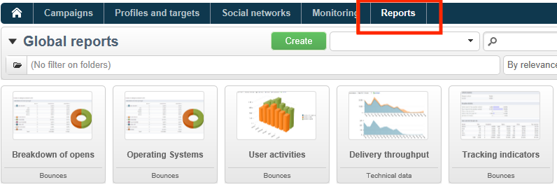
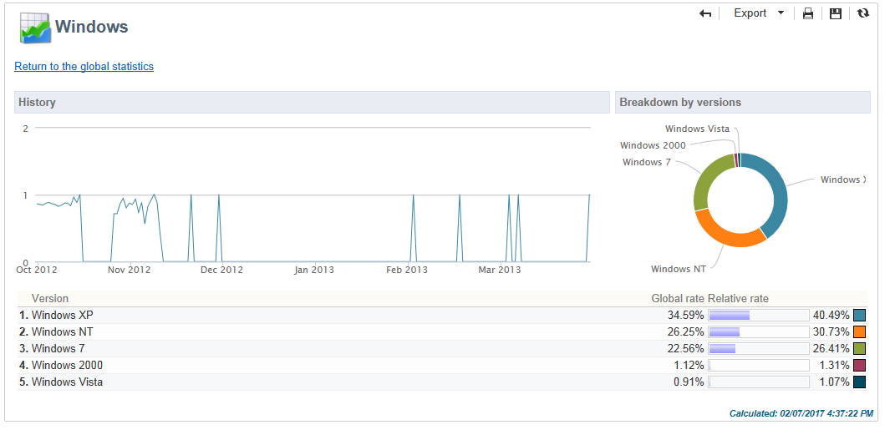
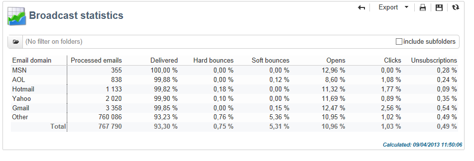

# 全局报告 {#global-reports}

这些报告涉及整个数据库中数据的活动。 要查看报表功能板，请转到 **[!UICONTROL Reports]** 选项卡。

要显示报表，请单击其名称。 默认情况下，可以使用以下报表：

>[!NOTE]
>
>此部分仅显示链接到投放的报表。

* **[!UICONTROL Delivery throughput]** :请参阅 [投放吞吐量](#delivery-throughput).
* **[!UICONTROL Browsers]** :请参阅 [浏览器](#browsers).
* **[!UICONTROL Sharing to social networks]** :请参阅 [共享到社交网络](#sharing-to-social-networks).
* **[!UICONTROL Statistics on sharing activities]** :请参阅 [关于共享活动的统计资料](#statistics-on-sharing-activities).
* **[!UICONTROL Operating systems]** :请参阅 [操作系统](#operating-systems).
* **[!UICONTROL URLs and click streams]** :请参阅 [URL和点击流](delivery-reports.md#urls-and-click-streams).
* **[!UICONTROL Tracking indicators]** :请参阅 [跟踪指标](delivery-reports.md#tracking-indicators).
* **[!UICONTROL Non-deliverables and bounces]** :请参阅 [无法交付项和退回](#non-deliverables-and-bounces).
* **[!UICONTROL User activities]** :请参阅 [用户活动](#user-activities).
* **[!UICONTROL Subscription tracking]** :请参阅 [订阅跟踪](#subscription-tracking).
* **[!UICONTROL Delivery summary]** :请参阅 [投放摘要](delivery-reports.md#delivery-summary).
* **[!UICONTROL Delivery statistics]** :请参阅 [投放统计](#delivery-statistics).
* **[!UICONTROL Breakdown of opens]** :请参阅 [打开次数的划分](#breakdown-of-opens).

## 投放吞吐量 {#delivery-throughput}

此报表包含有关给定时段内整个平台的投放吞吐量的信息。 为了测量消息的传送速度，标准是每小时发送的消息数和消息的大小（以位/秒为单位）。 在以下示例中，第一个图表以蓝色显示成功投放，以橙色显示错误投放的数量。

您可以通过更改时间刻度来配置显示的值：1小时查看、3小时查看、24小时查看等。 单击 **[!UICONTROL Refresh]** 以确认您的选择。

>[!NOTE]
>
>您还可以使用 [控制面板](https://experienceleague.adobe.com/docs/control-panel/using/sftp-management/sftp-storage-management.html).
>
>所有管理员用户都可访问控制面板。[此页面](https://experienceleague.adobe.com/docs/control-panel/using/discover-control-panel/managing-permissions.html?lang=zh-Hans#discover-control-panel)详细介绍了授予用户管理员访问权限的步骤。

## 用户活动 {#user-activities}

此报表以图表形式显示每半小时、每小时或每天的打开数、点击数和交易记录的细分。

可以使用以下选项：

* **[!UICONTROL Opens]** :已打开的消息总数。 未考虑文本格式的电子邮件。 [了解详情](metrics-calculation.md#tracking-opens-)。
* **[!UICONTROL Clicks]** :投放中链接的总点击次数。 取消订阅链接和镜像页面的点击量不会被考虑在内。
<!--
* **[!UICONTROL Transactions]** : Total number of transactions after a message is received. In order for a transaction to be taken into account, a transaction type webtracking tag must be inserted into the matching web page. Webtracking configuration is presented in [this section](../../configuration/using/about-web-tracking.md).
-->

## 无法投放项和退回 {#non-deliverables-and-bounces}

此报表显示了无法交付项的细分以及每个互联网域的退回细分。

的 **[!UICONTROL Number of messages processed]** 表示投放服务器处理的消息总数。 此值小于停止或暂停某些投放时（服务器处理之前）要投放的消息数。

**[!UICONTROL Breakdown of errors by type]**

>[!NOTE]
>
>此报表中显示的错误会触发隔离过程。 如需有关隔离管理的详细信息，请参阅 [隔离管理](../send/quarantines.md).

此报表的第一部分以值表和图表的形式显示无法交付项的划分。

对于每种错误类型，我们都有：

* 此类型的错误消息数，
* 出现此类型错误的消息数与出现错误的消息总数的百分比，
* 此类型的错误消息与已处理消息总数的百分比。

使用以下指标：

* **[!UICONTROL User unknown]** :投放期间生成的错误类型，用于指示电子邮件地址无效。
* **[!UICONTROL Invalid domain]** :发送投放以指示电子邮件地址的域错误或不存在时生成的错误类型。
* **[!UICONTROL Inbox full]** :5次投放尝试表明收件人的收件箱包含过多邮件后，生成的错误类型。
* **[!UICONTROL Account disabled]** :发送投放时生成的错误类型，用于指示地址不再存在。
* **[!UICONTROL Rejected]** :当地址被IAP（互联网访问提供商）拒绝时(例如，在应用安全规则（防垃圾邮件软件）之后)生成的错误类型。
* **[!UICONTROL Unreachable]** :消息分发字符串中发生的错误类型：SMTP中继事件、域名临时不可到达等
* **[!UICONTROL Not connected]** :表示发送时收件人的手机已关闭或断开与网络的连接的错误类型。

   >[!NOTE]
   >
   >此指示器与上的投放相关 [移动渠道](../send/send.md) 仅。

   您可以通过单击 `[+]` 符号。 对于每种错误类型，您可以按域显示错误消息的划分。

**[!UICONTROL Breakdown of errors per domain]**

此报告的第二部分以值表和图表的形式显示每个Internet域的错误细分。

对于每个域名，我们具有：

* 此域中出错的消息数，
* 与针对此域处理的消息总数相比，此域出错的消息百分比，
* 此域的错误消息与错误消息总数的百分比。

您可以通过单击 [+] 符号。 对于每种域类型，您可以按错误类型显示错误消息的划分。

>[!NOTE]
>
>此报表中显示的域名在多维数据集级别定义。 要更改这些值，请编辑 **[!UICONTROL Delivery logs (broadlogrcp)]** 多维数据集。 如需详细信息，请参阅[此部分](gs-cubes.md)。的 **[!UICONTROL Others]** 类别包括不属于特定类的域名。

## 浏览器 {#browsers}

此报表显示投放收件人在相关时段使用的Internet浏览器的细目。

>[!NOTE]
>
>此报表中显示的值是估计值：将只考虑已单击投放的收件人。

**全局统计**

有关浏览器使用情况的全局统计信息以值表和图表的形式呈现。

使用以下指标：

* **[!UICONTROL Visitors]** :已定向并且已至少点击一次投放的收件人总数（每个Internet浏览器）。
* **[!UICONTROL Pages viewed]** :投放中（每个Internet浏览器）所有投放的链接总点击次数。
* **[!UICONTROL Usage rate]** :此比率表示访客（每个Internet浏览器）与访客总数之间的关联。

**每个浏览器的统计信息**

在全局统计值表中，您可以单击每个浏览器名称以查看其使用情况统计信息。

统计数据以曲线、图表和值表的形式呈现。

的 **[!UICONTROL History]** 曲线表示此浏览器每天的出席率。 比率是每日（在此浏览器上）访客数与当天以最高出勤率测量的访客数之比。

的 **[!UICONTROL Breakdown per version]** 图表表示与（在此浏览器上）访客总数相比，每个版本的访客数细分。

值表使用以下指标：

* **[!UICONTROL Global rate]** :此比率表示与所有浏览器上的访客总数相比，每个版本的访客的细分情况。
* **[!UICONTROL Relative rate]** :此比率表示与访客总数（在此浏览器上）相比，每个版本的访客的细分情况。

<!--
### Sharing to social networks {#sharing-to-social-networks}

Viral marketing lets delivery recipients share information with their contact network: they can add a link to their profile (Facebook, Twitter, etc.) or send a message to a friend. Each share and each access to shared information is tracked within the delivery. For more information on viral marketing, refer to [this section](../../delivery/using/viral-and-social-marketing.md).

This report shows the breakdown of shared and opened messages per social network (Facebook, Twitter, etc.) and/or per email.

**[!UICONTROL Email delivery statistics]**

In the email delivery statistics, two values are displayed:

* **[!UICONTROL Number of messages to be delivered]** : Total number of messages processed during delivery analysis.
* **[!UICONTROL Number of successful deliveries]** : Number of messages processed successfully.

**[!UICONTROL Sharing activities and mail open statistics]**

The central table shows the statistics on email shares and opens.

In the **[!UICONTROL Shares]** column, we have the following indicators:

* **[!UICONTROL No. of sharing activities]** : Total number of messages shared on each social network. This value equals the total number of clicks on the icon of the matching **[!UICONTROL Links for sharing to social networks]** personalization block.
* **[!UICONTROL Breakdown]** : This rate represents the breakdown of shares per social network, in relation to the total number of shares.
* **[!UICONTROL Sharing rate]** : This rate represents the breakdown of shares per social network, in relation to the number of messages to be delivered.

In the **[!UICONTROL Opens]** column, we have the following indicators:

* **[!UICONTROL No. of opens]** : Total number of messages opened by people whom the message was forwarded to (via the **[!UICONTROL Links for sharing to social networks]** personalization block). This value equals the number of times the mirror page was displayed. Opens by delivery recipients are not taken into account.
* **[!UICONTROL Breakdown]** : This rate represents the breakdown of opens per social network, in relation to the total number of opens.
* **[!UICONTROL Rate of opens]** : This rate represents the breakdown of opens per social network, in relation to the total number of shares.

**[!UICONTROL Breakdown of sharing activities and opens]**

This section includes two charts which represent the breakdown of sharing activities and opens per social network.

## Statistics on sharing activities {#statistics-on-sharing-activities}

This report shows the evolution of shares to social media in time.

For more information on viral marketing, refer to [this section](../../delivery/using/viral-and-social-marketing.md).

Statistics are presented in the form of a table of values and a chart.

The following indicators are used:

* **[!UICONTROL New contacts]** : Number of new subscriptions following the reception of a message shared via email. This value matches the number of people who received a message shared via email, clicked the **[!UICONTROL Subscription link]** and filled in the subscription form. 
* **[!UICONTROL Opens]** : Total number of messages opened by people whom the message was transferred to (via the **[!UICONTROL Link for sharing to social networks]** personalization block). This value equals the number of times the mirror page was displayed. Opens by delivery recipients are not taken into account.
* **[!UICONTROL Sharing activities]** : Total number of messages shared via social networks. This value matches the total number of clicks on the icon of the **[!UICONTROL Links for sharing to social networks]** personalization block.
-->

## 操作系统 {#operating-systems}

此报表显示了投放收件人在有关期间使用的操作系统的细目。

>[!NOTE]
>
>此报表中显示的值是估计值：将只考虑已单击投放的收件人。

**全局统计**

操作系统的全局使用统计数据以值表和图表的形式呈现。

使用以下指标：

* **[!UICONTROL Visitors]** :点击投放至少一次的目标收件人（每个操作系统）总数的每日平均值。
* **[!UICONTROL Pages viewed]** :所有投放的投放链接（每个操作系统）的每日平均点击次数。
* **[!UICONTROL Rate of use]** :此比率表示访客（每个操作系统）与访客总数之间的关联。

**每个操作系统的统计信息**

在全局统计信息值表中，单击每个操作系统的名称以查看每个操作系统的统计信息。

统计数据以曲线、图表和值表的形式呈现。

的 **[!UICONTROL History]** 曲线表示此操作系统每天的使用率。 此比率是每日（在此操作系统上）访客数与在出勤率最高的当天测量的访客数之比。

的 **[!UICONTROL Breakdown by version]** 图表表示每个版本的访客相对于此操作系统上的访客总数的划分。

值表使用以下指标：

* **[!UICONTROL Global rate]** :此比率表示访客（每个版本）与整个操作系统中的访客总数之间的细分。
* **[!UICONTROL Relative rate]** :此比率表示访客（每个版本）与此操作系统的访客总数之间的关系。

## 订阅跟踪 {#subscription-tracking}

此报告可让您监控信息服务订阅情况。 它显示订阅和退订。

通过单击 **[!UICONTROL Profiles and targets > Services and subscriptions]** 主页或资源管理器的节点。 选择所需的订阅，然后单击 **[!UICONTROL Reports]** 选项卡。 的 **[!UICONTROL Subscriptions tracking]** 报表默认可用。 它允许您查看订阅和退订趋势以及一段时间内的忠诚度比率。 您可以通过下拉列表配置此数据的表示形式。 单击 **[!UICONTROL Refresh]** 验证所选配置。

如需详细信息，请参阅[此页面](../start/subscriptions.md)。

的 **[!UICONTROL Number subscribed to date]** 表示当前订阅的总人数。

**[!UICONTROL Overall evolution of subscriptions]**

值表使用以下指标：

* **[!UICONTROL Subscribers]** :有关期间的订户总数。
* **[!UICONTROL Subscriptions]** :有关期间的订阅数。
* **[!UICONTROL Unsubscriptions]** :有关期间的退订次数。
* **[!UICONTROL Evolution]** :取消订阅数减去订阅数。 该速率基于订阅者总数计算。
* **[!UICONTROL Loyalty]** :相关时段的订阅者忠诚度比率。

**[!UICONTROL Subscription evolution curves]**

此图表显示了相关期间订阅和退订的演变情况。

## 投放统计信息 {#delivery-statistics}

此报表显示按互联网域、处理和发送的所有消息、硬退回和软退回、打开、点击和退订的细分。

使用以下指标：

* **[!UICONTROL Emails processed]** :投放服务器处理的消息总数。
* **[!UICONTROL Delivered]** :成功处理的消息数量与已处理消息总数的百分比。
* **[!UICONTROL Hard bounces]** :“硬”退回次数与已处理消息总数的百分比。
* **[!UICONTROL Soft bounces]** :“软”退回次数与已处理消息总数的百分比。

   >[!NOTE]
   >
   >有关硬退回和软退回的更多信息，请参阅 [本页](../send/quarantines.md).

* **[!UICONTROL Opens]** :至少打开一次消息的目标收件人数量与成功处理的消息数量之比。
* **[!UICONTROL Clicks]** :与成功处理的消息数量相比，点击投放至少一次的人数百分比。
* **[!UICONTROL Unsubscription]** :退订链接的点击次数与成功处理消息数的百分比。

## 打开的细分 {#breakdown-of-opens}

此报表显示了在相关时段内，操作系统、设备和浏览器的打开次数的细分情况。 对于每个类别，使用两个图表。 第一个报表显示有关计算机和移动设备上打开次数的统计信息。 第二个显示仅与移动设备上的打开次数相关的统计信息。

打开次数对应于已打开的消息总数。 不会计算文本格式电子邮件。 有关“跟踪”打开的更多信息，请参阅 [此部分](metrics-calculation.md#tracking-opens-).

>[!NOTE]
>
>浏览器和操作系统名称构成了浏览器用户代理发送的已打开消息的信息的一部分。 Adobe Campaign利用其设备信息推导设备类型。
