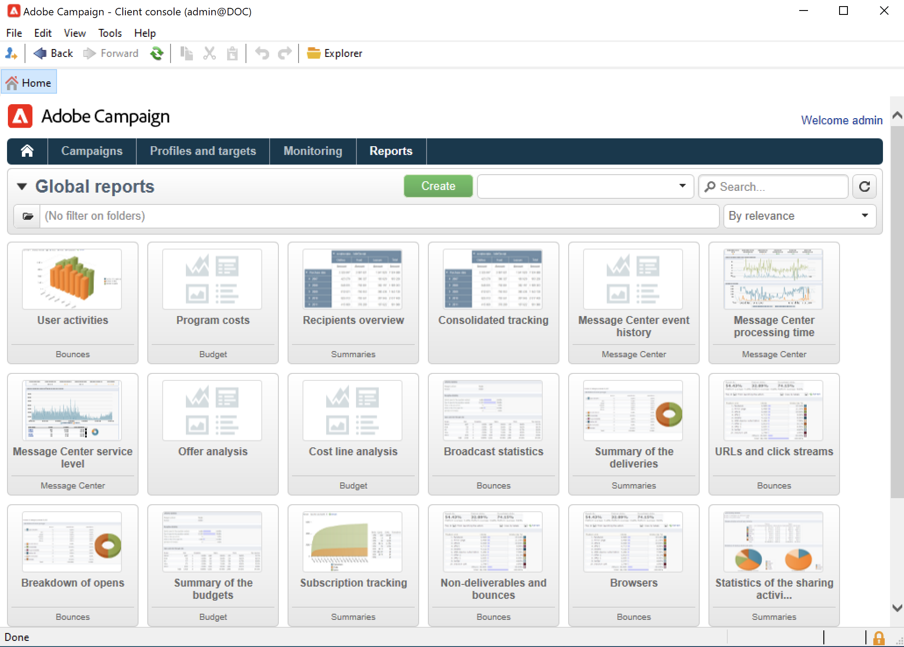

# 报告入门{#gs-ac-reports}

Adobe Campaign提供本页中列出的一组报表工具。

* **多维数据集**

  Adobe Campaign附带直观的数据探索工具，可用于创建动态报表。

  使用Marketing Analytics功能来分析和测量数据、计算统计数据、简化和优化报告创建和计算。 您可以创建报告并构建目标群体，并将这些群体存储到列表中，以便在Adobe Campaign中用于定位或分段任务。

  

  根据查询、计算和卷的复杂性，这些报告中分析的数据可以通过查询收集，并预聚合到列表（数据管理类型工作流）或多维数据集（使用Marketing Analytics）中。 它将以透视表或组列表的形式显示。

  如需详细信息，请参阅[此小节](gs-cubes.md)。

* **内置报告**

  Adobe Campaign附带有关投放、营销策划、平台活动、可选功能等的报告。 这些报告可通过它们相关的各种功能获取。 它们可以根据您的特定需求进行调整。

  使用&#x200B;**报告**&#x200B;选项卡访问这些报告。

  

  如需详细信息，请参阅[此小节](built-in-reports.md)。

* **描述性数据分析**

  Adobe Campaign提供了一个可视化工具，用于生成有关数据库中数据的统计信息。 您可以使用专用助手创建描述性分析报告，并根据需要调整其内容和布局。

  使用&#x200B;**[!UICONTROL Tools > Descriptive analysis...]**&#x200B;菜单创建新报告。

  

  促销活动描述性分析报表存在于[Campaign Classicv7文档](https://experienceleague.adobe.com/docs/campaign-classic/using/reporting/analyzing-populations/about-descriptive-analysis.html?lang=zh-Hans){target="_blank"}中。

* **自定义报告**

  使用Adobe Campaign创建有关数据库中数据的报表。 创建这些组件后，可在相应的上下文中访问它们。

  [Campaign Classicv7文档](https://experienceleague.adobe.com/docs/campaign-classic/using/reporting/creating-new-reports/about-reports-creation-in-campaign.html?lang=zh-Hans){target="_blank"}中详细介绍了创建报告的步骤。 高级用户可自行创建个性化报表。
