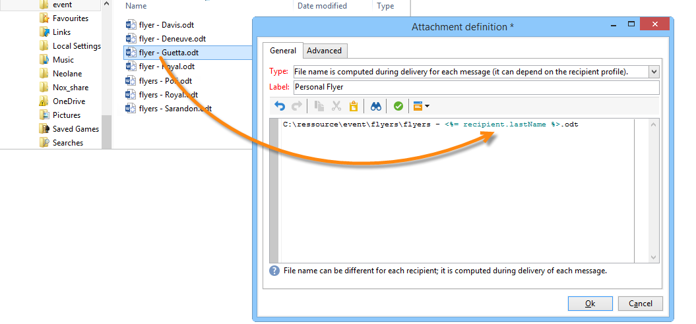
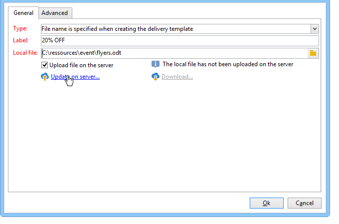
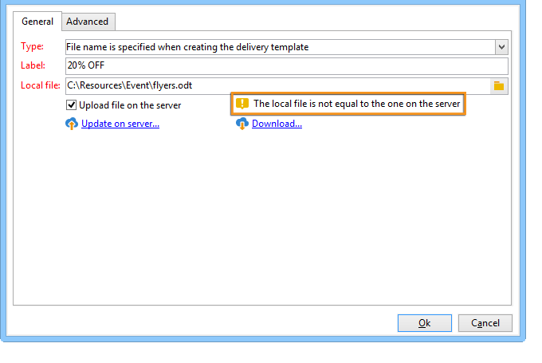

# 将文件附加到电子邮件{#attaching-files}

## 关于电子邮件附件 {#about-email-attachments}

您可以将一个或多个文件附加到电子邮件投放。

>[!NOTE]
>
>为了避免出现性能问题，建议每封电子邮件不要包含多个附件。 可以从Campaign选项列表中配置建议的阈值。 请参阅[Campaign Classic文档](https://experienceleague.adobe.com/docs/campaign-classic/using/installing-campaign-classic/appendices/configuring-campaign-options.html#delivery)。

可能存在两种情况：

* 选择文件并按原样将其附加到投放。
* 为每个收件人个性化附件内容。 在这种情况下，您需要创建一个&#x200B;**计算附件**：附件的名称是在每封邮件的传递时计算的，具体取决于收件人。 如果您有&#x200B;**可变数字打印**&#x200B;选项，则内容也可以在交付时个性化，并转换为PDF格式。

>[!NOTE]
>
>此类配置通常在投放模板中执行。 有关详细信息，请参见此 [ 页面](../send/create-templates.md)。

## 护栏 {#attachments-guardrails}

为避免性能问题，电子邮件中包含的图像不能超过100 KB。 默认设置的此限制可以从`NmsDelivery_MaxDownloadedImageSize`选项更改。 但是，Adobe强烈建议避免在电子邮件投放中使用大型图像。

Adobe还建议限制附加文件的大小和数量。 默认情况下，您只能将一个文件作为附件添加到电子邮件中。 可通过`NmsDelivery_MaxRecommendedAttachments`选项配置此阈值。

在[Campaign Classic文档](https://experienceleague.adobe.com/docs/campaign-classic/using/installing-campaign-classic/appendices/configuring-campaign-options.html#delivery)的Campaign选项列表中了解详情。

## 附加本地文件 {#attaching-a-local-file}

要将本地文件附加到投放，请执行以下步骤。

>[!NOTE]
>
>您可以将多个文件附加到投放。 附件可以是任何格式，包括压缩格式。

1. 单击 **[!UICONTROL Attachments]** 链接。
1. 单击 **[!UICONTROL Add]** 按钮。
1. 单击&#x200B;**[!UICONTROL File...]**&#x200B;以选择要附加到投放的文件。

   

您还可以直接将文件拖放到投放&#x200B;**[!UICONTROL Attachments]**&#x200B;字段中，或使用投放助理工具栏中的&#x200B;**[!UICONTROL Attach]**&#x200B;图标，

选择文件后，会立即将其上传到服务器，以便在交付时可用。 它列在&#x200B;**[!UICONTROL Attachments]**&#x200B;字段中。

## 创建计算附件 {#creating-a-calculated-attachment}

创建计算附件时，可以在分析或投放每封邮件期间计算附件的名称，并可依赖收件人。 您还可以对其进行个性化并转换为PDF。

要创建个性化附件，请执行以下步骤：

1. 单击 **[!UICONTROL Attachments]** 链接。
1. 单击&#x200B;**[!UICONTROL Add]**&#x200B;按钮，然后选择&#x200B;**[!UICONTROL Calculated attachment]**。
1. 从&#x200B;**[!UICONTROL Type]**&#x200B;下拉列表中选择计算类型：

可以使用以下选项：

* 创建投放模板时指定了&#x200B;**文件名**
* **文件的内容已个性化，并在每封邮件的投放期间转换为PDF**
* **文件名是在投放分析期间计算的（它不能依赖于收件人配置文件）**
* **文件名是在每个收件人交付时计算的（它可以依赖于收件人）**

### 附加本地文件 {#attach-a-local-file}

如果附件是本地文件，请选择选项： **[!UICONTROL File name is specified when creating the delivery template]**。 在本地选择文件并将其上载到服务器上。 按照下面的步骤进行操作：

1. 在&#x200B;**[!UICONTROL Local file]**&#x200B;字段中选择要上传的文件。
1. 根据需要指定标签。 在消息传送系统中查看时，标签会替换文件名。 如果未指定任何内容，则默认使用文件名。

   

1. 如有必要，请选择&#x200B;**[!UICONTROL Upload file on the server]**，然后单击&#x200B;**[!UICONTROL Update on server]**&#x200B;开始传输。

   

然后，文件即可在服务器上使用，以附加到从此模板创建的不同投放中。

### 附加个性化消息 {#attach-a-personalized-message}

选项&#x200B;**[!UICONTROL The file content is personalized and converted into PDF format at the time of delivery for each message]**&#x200B;允许您选择具有个性化字段的文件，如预期收件人的姓氏和名字。

对于此类附件，请应用以下配置步骤：

1. 选择要上传的文件。
1. 根据需要指定标签。
1. 选择&#x200B;**[!UICONTROL Upload file on the server]**，然后单击&#x200B;**[!UICONTROL Update on server]**&#x200B;开始传输。
1. 您可以显示预览。 要实现此目的，请选择收件人。

   

1. 分析您的投放，然后启动它。

   每个收件人都会收到一个附加到投放的个性化PDF。

   

### 附加计算文件 {#attach-a-calculated-file}

您可以在投放准备期间计算附件名称。 要执行此操作，请选择选项&#x200B;**[!UICONTROL The file name is calculated during delivery analysis (it cannot depend on the recipient)]**。

>[!NOTE]
>
>仅当外部进程或工作流发送投放时，才使用此选项。

1. 指定要应用于附件的标签。
1. 在定义窗口中指定文件的访问路径及其确切名称。

   >[!IMPORTANT]
   >
   >文件必须存在于服务器上。

   

1. 分析，然后开始投放。

   可以在分析日志中看到文件名计算。

   

### 附加个性化文件 {#attach-a-personalized-file}

选择附件时，您可以选择选项&#x200B;**[!UICONTROL The file name is calculated during delivery for each recipient (it can depend on the recipient)]**。 然后，您可以使用要发送的文件名映射收件人个性化数据。

>[!NOTE]
>
>仅当外部进程或工作流发送投放时，才使用此选项。

1. 指定要应用于附件的标签。
1. 在定义窗口中指定文件的访问路径及其确切名称。 如果文件名是个性化的，则可以为相关值使用个性化字段。

   

   >[!IMPORTANT]
   >
   >文件必须存在于服务器上。

1. 分析，然后开始投放。

   在以下示例中，根据使用合并字段定义的名称选择附加文件。

   

### 附件设置 {#attachment-settings}

对于前两个选项，您可以通过选择相应的选项来选择&#x200B;**[!UICONTROL Upload file on the server]**。 **[!UICONTROL Update the file on the server]**&#x200B;链接允许您开始上传。

将显示一条消息，告知您文件已上传到服务器：

对于文件更改，将显示警告消息：

**[!UICONTROL Advanced]**&#x200B;选项卡允许您定义附加文件的高级选项：

* 您可以定义过滤器选项，以避免将附加文件发送给所有收件人。 选项&#x200B;**[!UICONTROL Enable filtering of recipients who will receive the attachment]**&#x200B;激活用于定义收件人选择脚本的输入字段，该脚本必须在JavaScript中输入。
* 您可以编写文件名的脚本以便对其进行个性化。

  在窗口中输入文本，并使用下拉列表中提供的个性化字段。 在以下示例中，文件名进行了个性化设置，包含今天的日期和收件人名称。

  
