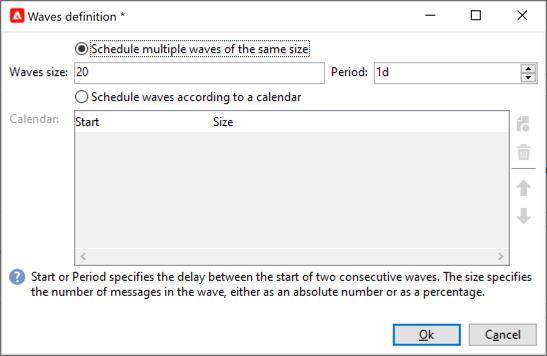

# 配置和发送投放 {#configure-delivery}

访问投放参数以配置更多设置并定义消息发送方式。您可以定义投放[优先级](#delivery-priority)，设置[波次](#sending-using-multiple-waves)，并测试投放发送。 完成此配置后，您可以按照[此部分](#confirm-delivery)中的说明确认发送。 然后立即发送消息，或根据投放[计划](#schedule-delivery-sending)发送消息。

## 设置其他参数 {#delivery-additional-parameters}

在发送投放之前，您可以通过&#x200B;**[!UICONTROL Delivery]**&#x200B;选项卡在投放属性中定义发送参数。

### 投放优先级 {#delivery-priority}

使用&#x200B;**[!UICONTROL Delivery priority]**&#x200B;选项，通过设置投放的优先级将投放的发送顺序从&#x200B;**[!UICONTROL Very low]**&#x200B;更改为&#x200B;**[!UICONTROL Very high]**（默认值为&#x200B;**[!UICONTROL Normal]**）。

### 批次数量 {#delivery-batch-quantity}

使用&#x200B;**[!UICONTROL Message batch quantity]**&#x200B;选项定义在同一XML传递包中分组的邮件数。 如果参数设置为0，则消息将自动分组。 包大小由计算`<delivery size>/1024`定义，每个包最小为8条，最大为256条消息。

>[!IMPORTANT]
>
>通过复制现有投放创建投放时，此参数会重置。

### 测试投放发送

使用&#x200B;**[!UICONTROL Test SMTP delivery]**&#x200B;选项测试通过SMTP发送的邮件。 处理投放直至连接到 SMTP 服务器，但不发送：对于投放的每个收件人，Campaign 连接到 SMTP 提供商服务器，执行 SMTP RCPT TO 命令，并在执行 SMTP DATA 命令之前关闭连接。

>[!NOTE]
>
>* 不得在中间源中设置此选项。
>
>* 请参阅[Campaign Classic v7文档](https://experienceleague.adobe.com/docs/campaign-classic/using/installing-campaign-classic/additional-configurations/configure-delivery-settings.html?lang=zh-Hans#smtp-relay){target="_blank"}以了解有关SMTP服务器配置的更多信息。

## 使用多批次发送 {#sending-using-multiple-waves}

要平衡负荷，您可以将投放分为多个批。 配置批次数量及其相对于整个投放的比例。

### 启用批次 {#enable-waves}

要定义波段，请执行以下步骤：

1. 打开投放属性并浏览到&#x200B;**[!UICONTROL Delivery]**&#x200B;选项卡。
1. 启用&#x200B;**[!UICONTROL Send using multiple waves]**&#x200B;选项，然后单击&#x200B;**[!UICONTROL Define waves...]**&#x200B;链接。

   

### 配置批次 {#config-waves}

>[!NOTE]
>
>您只能定义两个连续波形之间的大小和延迟。 无法配置每个波次的收件人选择标准。

您可以定义每个批次的大小，或将其添加到日历中。

* **定义每个批次的大小**。 例如，如果您在相应字段中输入&#x200B;**[!UICONTROL 30%]**，则每个波次将代表投放中包含的30%的消息，但最后一个波次除外，后者将代表10%的消息。

  在&#x200B;**[!UICONTROL Period]**&#x200B;字段中，指定两个连续批次开始之间的延迟。 例如，如果输入&#x200B;**[!UICONTROL 2d]**，则第一个波段将立即开始，第二个波段将在两天内开始，第三个波段将在四天内开始，依此类推。

  

* **定义发送每个批次的日历**。  例如，第一波表示投放中包含的消息总数的25%，将立即开始。 接下来的两个批次将完成投放，并设置为以六小时间隔开始。

  在&#x200B;**[!UICONTROL Start]**&#x200B;列中，指定两个连续批次开始之间的延迟。 在&#x200B;**[!UICONTROL Size]**&#x200B;列中，输入固定数字或百分比。

  

### 波动计划检查 {#check-waves}

特定分类规则&#x200B;**[!UICONTROL Wave scheduling check]**&#x200B;可确保在上一波次的计划早于投放有效期。 在投放属性的&#x200B;**[!UICONTROL Typology]**&#x200B;选项卡中配置的营销活动类型及其规则显示在[此部分](../../automation/campaign-opt/campaign-typologies.md#typology-rules)<!--ref TBC-->中。

>[!IMPORTANT]
>
>* 确保最后一个批次不超过&#x200B;**[!UICONTROL Validity]**&#x200B;选项卡中定义的投放截止日期。 否则，某些消息可能不会发送。 在[本节](delivery-failures.md#valid-period)中了解有关投放有效期的更多信息。
>
>* 在配置最后批次时，还必须为重试设置足够的时间。 在[本节](delivery-failures.md#retries)中了解有关重试的详细信息。

### 监测批次 {#monitor-waves}

要监控您的发送，请浏览到投放日志。 查看[此页面](send.md)

您可以看到已在已处理批次中发送的投放（**[!UICONTROL Sent]**&#x200B;状态）以及将在剩余批次中发送的投放（**[!UICONTROL Pending]**&#x200B;状态）。

### 批次样本 {#samples-waves}

以下两个示例是使用多个批次的最常见用例。

* **启动过程中**

  使用新平台发送电子邮件时，Internet服务提供商(ISP)会怀疑无法识别的IP地址。 如果突然发送大量电子邮件，ISP通常会将其标记为垃圾邮件。

  要避免被标记为垃圾邮件，您可以逐步增加使用批次发送的数量。 这应该可以确保启动阶段的顺利发展，并帮助您降低地址无效的总比率。

  为此，请使用&#x200B;**[!UICONTROL Schedule waves according to a calendar]**&#x200B;选项。 例如，将第一个波次设置为10%，将第二个波次设置为15%，以此类推。

  

* **具有呼叫中心的营销活动**

  通过电话管理忠诚度促销活动时，贵组织处理致电订阅者的能力有限。

  使用批次，您可以将消息数量限制为每天20条，例如，考虑呼叫中心的每日处理能力。

  为此，请选择&#x200B;**[!UICONTROL Schedule multiple waves of the same size]**&#x200B;选项。 输入&#x200B;**[!UICONTROL 20]**&#x200B;作为波次大小，并在&#x200B;**[!UICONTROL Period]**&#x200B;字段中输入&#x200B;**[!UICONTROL 1d]**。

  

## 确认投放 {#confirm-delivery}

当投放已配置并准备好发送时，请确保在确认发送之前已运行投放分析。

为此，请执行以下步骤。

1. 单击&#x200B;**[!UICONTROL Send]**，选择所需的操作。

   * 要立即发送投放，请选择&#x200B;**[!UICONTROL Deliver as soon as possible]**。
   * 要安排在以后的日期发送，请选择&#x200B;**[!UICONTROL Postpone the delivery]**。 [了解详情](#schedule-delivery-sending)

1. 单击 **[!UICONTROL Analyze]**。有关更多信息，请参阅[此小节](delivery-analysis.md)。

   

1. 完成后，单击&#x200B;**[!UICONTROL Confirm delivery]**&#x200B;以启动邮件的投放。

   

1. 您可以关闭投放向导，并从&#x200B;**[!UICONTROL Delivery]**&#x200B;选项卡中跟踪投放的执行情况，可通过此投放的详细信息或投放列表访问该选项卡。

   有关更多信息，请参阅以下部分：

   * [监测投放](send.md)
   * [了解投放失败](delivery-failures.md)

<!--About message tracking-->

## 安排发送投放 {#schedule-delivery-sending}

您可以推迟邮件的投放，以便计划内容的投放或管理销售压力并避免过度营销。

1. 单击&#x200B;**[!UICONTROL Send]**&#x200B;按钮并选择&#x200B;**[!UICONTROL Postpone delivery]**&#x200B;选项。

1. 在&#x200B;**[!UICONTROL Contact date]**&#x200B;字段中指定开始日期。

   

1. 开始投放分析并确认投放发送。 但是，在&#x200B;**[!UICONTROL Contact date]**&#x200B;字段中给定的日期之前，不会开始投放发送。

   >[!IMPORTANT]
   >
   >开始分析后，您定义的联系日期即是固定的。 如果修改此日期，则必须重新启动分析，以便考虑所做的修改。

   

在投放列表中，投放将以&#x200B;**[!UICONTROL Pending]**&#x200B;状态显示。

也可以通过投放的&#x200B;**[!UICONTROL Scheduling]**&#x200B;按钮在上游配置计划。

这样，您可以将投放推迟到以后的日期，或将投放保存在临时日程表中。

* **[!UICONTROL Schedule delivery (no automatic execution)]**&#x200B;选项允许您计划投放的临时分析。

  保存此配置后，投放将更改为&#x200B;**[!UICONTROL Targeting pending]**&#x200B;状态。 分析将在指定的日期启动。

* 使用&#x200B;**[!UICONTROL Schedule delivery (automatic execution on planned date)]**&#x200B;选项可以指定交货日期。

  单击&#x200B;**[!UICONTROL Send]**&#x200B;并选择&#x200B;**[!UICONTROL Postpone delivery]**，然后启动分析并确认投放。 分析完成后，投放目标已准备就绪，并在指定日期自动发送消息。

日期和时间以当前运算符的时区表示。 通过位于联系日期输入字段下方的&#x200B;**[!UICONTROL Time zone]**&#x200B;下拉列表，您可以将输入的日期和时间自动转换为所选时区。

例如，如果您安排在伦敦时间8点自动执行投放，则该时间将自动转换为所选时区：

<!--
## Adjust delivery failure management {#delivery-failure-management}

### Configure retries {#configure-retries}

Temporarily undelivered messages due to a **Soft** or **Ignored** error are subject to an automatic retry. The delivery failure types and reasons are presented in this [section](../../delivery/using/understanding-delivery-failures.md#delivery-failure-types-and-reasons).

>[!IMPORTANT]
>
>For hosted or hybrid installations, if you have upgraded to the [Enhanced MTA](../../delivery/using/sending-with-enhanced-mta.md), the retry settings in the delivery are no longer used by Campaign. Soft bounce retries and the length of time between them are determined by the Enhanced MTA based on the type and severity of the bounce responses coming back from the message's email domain.

For on-premise installations and hosted/hybrid installations using the legacy Campaign MTA, the central section of the **[!UICONTROL Delivery]** tab for delivery parameters indicates how many retries should be performed the day after the delivery and the minimum delay between retries.

By default, five retries are scheduled for the first day of the delivery with a minimum interval of one hour spread out over the 24 hours of the day. One retry per day is programmed after that and until the delivery deadline, which is defined in the **[!UICONTROL Validity]** tab (see [Defining validity period](#defining-validity-period)).

### Define the validity period {#define-validity-period}

When the delivery has been launched, the messages (and any retries) can be sent until the delivery deadline. This is indicated in the delivery properties, via the **[!UICONTROL Validity]** tab.

* The **[!UICONTROL Delivery duration]** field lets you enter the limit for global delivery retries. This means that Adobe Campaign sends the messages beginning on the start date, and then, for messages returning an error only, regular, configurable retries are performed until the validity limit is reached.

  You can also choose to specify dates. To do this, select **[!UICONTROL Explicitly set validity dates]**. In this case, the delivery and validity limit dates also let you specify the time. The current time is used by default, but you can modify this directly in the input field.

  >[!IMPORTANT]
  >
  >For hosted or hybrid installations, if you have upgraded to the [Enhanced MTA](../../delivery/using/sending-with-enhanced-mta.md), the **[!UICONTROL Delivery duration]** setting in your Campaign email deliveries will be used only if set to **3.5 days or less**. If you define a value higher than 3.5 days, it will not be taken into account.

* **Validity limit of resources**: The **[!UICONTROL Validity limit]** field is used for uploaded resources, mainly for the mirror page and images. The resources on this page are valid for a limited time (to save disk space).

  The values in this field can be expressed in the units listed in [this section](../../platform/using/adobe-campaign-workspace.md#default-units).
-->
