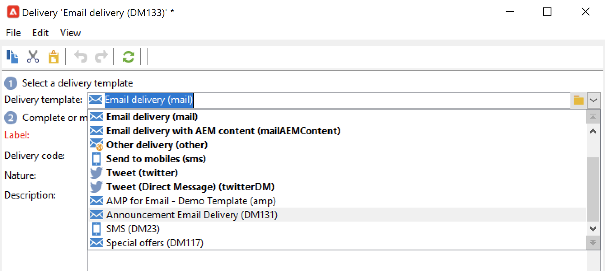

# 使用投放模板 {#work-with-delivery-template}

## 投放模板入门

每个投放都是基于模板创建的。 模板是一种配置，可重复使用它来推动和标准化您的实施。 您可以使用内置或自定义模板。

模板可以包括部分或完整配置设置，例如：

* [类型规则](../../automation/campaign-opt/campaign-typologies.md)
* 发件人和回复地址
* 基本[个性化块](../send/personalization-blocks.md)
* 指向[镜像页面](../send/mirror-page.md)的链接和退订链接
* 内容、公司徽标或签名
* 其他投放属性，例如资源有效性、重试参数或隔离设置。

 [通过观看视频了解此功能](#delivery-template-video)

投放模板存储在资源管理器的&#x200B;**[!UICONTROL Resources > Templates > Delivery templates]**&#x200B;文件夹中。 在Adobe Campaign中，您可以使用两种类型的模板：

1. Adobe Campaign **内置**&#x200B;投放模板 — 每个渠道都有内置模板可用。 不得修改或删除它们。 它们包括每个投放渠道的基本配置。 作为管理员，您可以设置默认值，或限制最终用户使用某些功能，例如修改跟踪参数、发件人电子邮件地址等。 内置模板在模板列表中以粗体显示。

1. **自定义**&#x200B;投放模板 — 作为Adobe Campaign管理员，您可以创建新投放模板。 最佳实践是复制和更新内置模板，而不是从头开始创建模板。 例如，您可以配置电子邮件投放模板，当用户从此模板创建投放时，只需要输入文本或HTML内容。 所有其他设置均已定义。

>[!NOTE]
>
>可用的模板取决于您的访问权限、实例配置和上下文。 例如，在创建信息服务时，可以链接确认消息的投放模板：然后只能访问其目标映射为订阅映射的模板。 其他模板在此上下文中不可见。 有关详细信息，请参阅[选择目标映射](../audiences/target-mappings.md)和[服务和订阅](../start/subscriptions.md)。

## 创建模板 {#create-a-delivery-template}

要创建投放模板，您可以复制内置模板或将现有投放转换为模板。 您也可以从头开始创建投放模板，但不建议这样做。 这些方法详见下文。

### 复制现有模板{#copy-an-existing-template}

Campaign为每个渠道提供了一组内置模板：电子邮件、推送、短信、直邮等。

创建投放模板的最简单方法是复制和自定义内置模板。

要复制投放模板，请执行以下步骤：

1. 浏览Adobe Campaign资源管理器中的&#x200B;**[!UICONTROL Resources > Templates > Delivery templates]**。
1. 选择内置投放模板。 内置模板在列表中加粗。
1. 右键单击并选择&#x200B;**[!UICONTROL Duplicate]**。

   

1. 定义模板设置并保存新模板。

   

该模板已添加到投放模板列表中。您现在可以在创建新投放时选择它。

### 将现有投放转换为模板 {#convert-an-existing-delivery}

投放可以转换为模板，以便执行新的重复投放操作。

要将投放转换为模板，请执行以下步骤：

1. 从可通过Campaign资源管理器的&#x200B;**[!UICONTROL Campaign management]**&#x200B;节点访问的投放列表中选择投放。

1. 右键单击并选择&#x200B;**[!UICONTROL Actions > Save as template...]**。

   

1. 编辑投放属性并选择必须保存新模板的文件夹（在&#x200B;**[!UICONTROL Folder]**&#x200B;字段中）以及必须基于此模板创建投放的文件夹（在&#x200B;**[!UICONTROL Execution folder]**&#x200B;字段中）。

   

### 创建新的模板 {#create-a-new-template}

>[!NOTE]
>
>为避免配置错误，Adobe 建议您[复制内置模板](#copy-an-existing-template)并自定义其属性，而不是创建新模板。

要从头开始配置投放模板，请执行以下步骤：

1. 浏览到Campaign资源管理器中的&#x200B;**资源**&#x200B;文件夹，然后选择&#x200B;**模板**&#x200B;和&#x200B;**投放模板**。
1. 单击工具栏中的&#x200B;**新建**&#x200B;以创建新的投放模板。
1. 设置文件夹的&#x200B;**标签**&#x200B;和&#x200B;**内部名称**。
1. 保存并重新打开模板。
1. 从&#x200B;**属性**&#x200B;按钮，调整设置。
1. 在&#x200B;**常规**&#x200B;选项卡中，确认或更改在&#x200B;**执行文件夹**、**文件夹**&#x200B;和&#x200B;**路由**&#x200B;下拉菜单中选定的位置。
1. 使用您的电子邮件主题和目标群体完成&#x200B;**电子邮件参数**&#x200B;类别。
1. 添加您的&#x200B;**HTML内容**&#x200B;以个性化您的模板，您可以显示[镜像页面链接](../send/mirror-page.md)和退订链接。
1. 选择&#x200B;**预览**&#x200B;选项卡。 在&#x200B;**测试个性化**&#x200B;下拉菜单中，选择&#x200B;**收件人**&#x200B;以预览您的模板作为所选配置文件。
1. 单击&#x200B;**保存**。 您的模板现已准备就绪，可用于投放。

## 使用模板 {#use-a-delivery-template}

### 从模板创建投放 {#create-a-delivery-from-a-template}

要基于现有模板创建投放，请从可用投放模板列表中选择模板。

如果看不到模板，请单击字段右侧的&#x200B;**[!UICONTROL Select link]**&#x200B;文件夹以浏览Campaign文件夹。

从&#x200B;**[!UICONTROL Folder]**&#x200B;字段中选择所需的目录，或单击&#x200B;**[!UICONTROL Display sub-levels]**&#x200B;图标以显示当前目录子树中目录的内容。

选择要使用的投放模板，然后单击&#x200B;**[!UICONTROL Ok]**。

### 执行模板 {#execute-a-template}

您可以直接从模板列表启动模板执行，而无需先创建投放。 投放模板可以手动执行（如下所述），也可以由事件触发（在设置时间执行，当文件在服务器中可用等），如[此部分](https://experienceleague.adobe.com/en/docs/campaign/automation/workflows/wf-activities/action-activities/delivery)中所述。

要手动执行模板，请执行以下步骤：

1. 选择要执行的模板并右键单击。 选择 **[!UICONTROL Actions>Execute the delivery template...]**。

   您也可以使用&#x200B;**[!UICONTROL File>Actions>Execute the delivery template...]**。

   

1. 输入投放参数并单击&#x200B;**[!UICONTROL Send]**。

此操作在与模板关联的文件夹中生成投放。 此投放的名称是从中创建该投放的投放模板的名称。

## 教程视频 {#delivery-template-video}

### 如何配置投放模板

以下视频演示了如何为临时投放配置模板。

>[!VIDEO](https://video.tv.adobe.com/v/342082?quality=12)

### 如何设置投放模板属性

以下视频介绍了如何设置投放模板属性，并详细说明每个属性。

>[!VIDEO](https://video.tv.adobe.com/v/338969?quality=12)

### 如何部署临时投放模板

此视频介绍了如何部署临时电子邮件投放模板，并说明了电子邮件投放与投放工作流之间的区别。

>[!VIDEO](https://video.tv.adobe.com/v/338965?quality=12)

[此处](https://experienceleague.adobe.com/docs/campaign-learn/tutorials/getting-started/introduction-to-adobe-campaign.html){target="_blank"}提供了其他Campaign操作方法视频。
