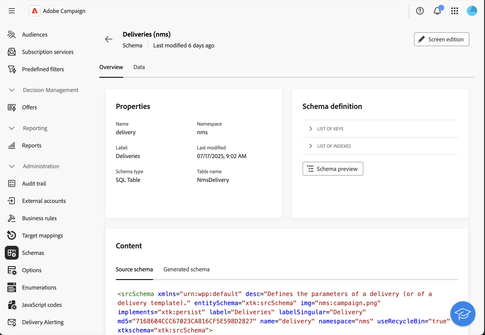

# 自定义渠道入门 {#gs-custom-channel}

Adobe Campaign允许您创建与第三方集成的自定义外部或API渠道。 然后，您可以根据这些渠道编排和执行投放。

投放创建和发送可在客户端控制台和Web UI中执行。 但是，自定义通道配置只能在客户端控制台中执行。

要了解如何基于自定义渠道创建和发送投放，请参阅此[页面](https://experienceleague.adobe.com/docs/campaign-web/v8/msg/gs-custom-channel.html){target="_blank"}。

以下是在客户端控制台中配置新自定义渠道的步骤。 这些步骤对于自定义外部和API渠道是通用的：

1. 配置架构，[阅读更多](#configure-schema)
1. 创建新的外部帐户，[了解更多](#create-ext-account)
1. 创建新投放模板，[了解更多](#create-template)

自定义API渠道需要其他配置。 [了解更多信息](#api-additional)

## 配置架构{#configure-schema}

首先，您需要配置架构以将新渠道添加到可用渠道列表。

1. 在Campaign Explorer中，选择&#x200B;**管理** > **配置** > **数据架构**。

1. 创建架构扩展以使用新渠道扩展&#x200B;**messageType** [枚举](../config/enumerations.md)。

   例如：

   ```
   <enumeration basetype="byte" default="mail" label="Channel" name="messageType">
   <value desc="My Webpush" img="ncm:channels.png" label="My Webpush" name="webpush"
          value="122"/>
   </enumeration>
   ```

   {zoomable="yes"}

## 创建新的外部帐户{#create-ext-account}

然后，您需要创建新的路由外部帐户。

1. 在Campaign Explorer中，选择&#x200B;**管理** > **平台** > **外部帐户**。

1. 创建新的外部帐户。

1. 选择渠道并更改投放模式。 为自定义外部渠道选择&#x200B;**外部**，为自定义API渠道选择&#x200B;**批量**。

   {zoomable="yes"}

## 创建新投放模板{#create-template}

现在，让我们创建与新渠道关联的新模板。

1. 在Campaign Explorer中，选择&#x200B;**资源** > **模板** > **投放模板**。

1. 创建新模板。

1. 单击&#x200B;**属性**&#x200B;并选择正确的文件夹和路由。

   {zoomable="yes"}

新渠道现已可用。 您可以基于此渠道创建和执行投放。

## 自定义API其他配置{#api-additional}

以下是配置自定义API渠道的主要其他步骤。

### 扩展模式{#api-additional-schema}

从客户端控制台中，使用自定义渠道所需的所有其他属性扩展&#x200B;**交付**&#x200B;架构。

有关架构扩展的更多信息，请参阅此[页面](../dev/extend-schema.md)。

### 设置自定义屏幕定义{#api-additional-screen}

从Campaign Web UI中，设置自定义屏幕定义：

1. 打开&#x200B;**投放**&#x200B;架构，然后单击&#x200B;**屏幕版本**。

   {zoomable="yes"}

1. 选择与您的渠道对应的选项卡，并定义字段在投放内容屏幕中的显示方式。 有关屏幕编辑的详细信息，请参阅此[页面](https://experienceleague.adobe.com/docs/campaign-web/v8/conf/schemas.html#fields){target="_blank"}。

   {zoomable="yes"}

1. 在模拟内容的&#x200B;**预览**&#x200B;部分中，选择专用JSPP。 这是可选的。 这将在投放模拟屏幕中激活预览。 [了解更多信息](#api-additional-preview)

### 配置预览{#api-additional-preview}

此配置是可选的。 如果要在Web UI中的投放模拟屏幕中激活预览，则需要在客户端控制台中配置专用JSSP。

当您在Web UI的投放模拟屏幕中单击&#x200B;**打开预览**&#x200B;时，URL中传递了以下参数：

`https://adobe.campaign.adobe.com/cus/webPushMessagePreview.jssp?deliveryId=%40ToPzTurO9aGzQxYcMArBbA%3D%3D&id=%40oF8Fi17txuLmtiOFj4OIjQ%3D%3D`

* `deliveryId`：投放标识符
* `id`：配置文件标识符

在客户端控制台中，选择&#x200B;**管理** > **配置** > **动态JavaScript页面**，然后创建新的JSSP。 以下是需要检索的参数示例。

```
<%@ page import="xtk:shared/nl.js"
%><%
  NL.require("/nl/core/shared/core.js")
    .require('/nl/core/jsspcontext.js')
    .require('/nl/core/shared/dataTypes.js')
    .require('/nl/core/schema.js');
    
  //response.setContentType("text/plain");
  var parameters = request.parameters;
  var deliveryId = decryptString(parameters.deliveryId);
  var oldUserContext = logonEscalation("neolane")
  
   var delivery = xtk.queryDef.create(<queryDef schema="nms:delivery" operation="getIfExists">
                                         <select>
                                           <node expr="[WebpushParameters/@richMediaOptions]" alias="@richMediaOptions"/>
                                           <node expr="[WebpushParameters/@mediaUrlInfo]" alias="@mediaUrlInfo"/>
                                           <node expr="[WebpushParameters/@WebpushMessageType]"/>
                                         </select>
                                         <where>
                                           <condition expr={"@id = " + NL.XTK.toXTKString(deliveryId)}/>
                                         </where>
                                       </queryDef>).ExecuteQuery();

  // Restore previous context
  logonWithContext(oldUserContext)
%>

<!DOCTYPE html ...
```

### 技术实施{#api-additional-technical}

根据您的自定义渠道，您将需要配置应用程序的其他部分，例如：外部帐户、目标映射、适用于API的Javascript代码等。

