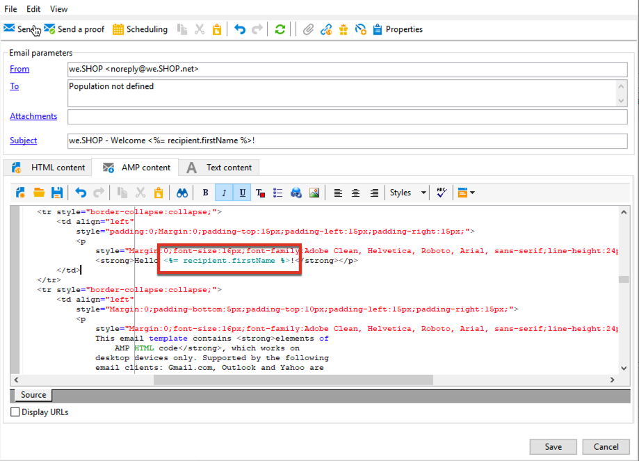

# 定义交互式内容{#defining-interactive-content}

Adobe Campaign允许您使用交互式[AMP for Email](https://amp.dev/about/email/)格式，该格式可用于在特定条件下发送动态电子邮件。

使用AMP for Email，您可以：
* 测试将AMP电子邮件投放到正确配置的特定地址。
* 向相应的提供商注册后，将AMP电子邮件投放Gmail或Mail.ru地址。

有关测试和发送AMP电子邮件的详细信息，请参阅[此部分](#targeting-amp-email)。

此功能通过Adobe Campaign中的专用包提供。 根据您的权限和部署模型，您可以安装此包，也可以联系Adobe为您安装此包。

## 关于电子邮件的AMP {#about-amp-for-email}

使用&#x200B;**AMP for Email**&#x200B;新格式在邮件中包含AMP组件，并通过丰富的可操作内容改善电子邮件体验。 借助电子邮件中直接提供的现代应用程序功能，收件人可以动态地与消息本身中的内容进行交互。

例如：
* 使用AMP编写的电子邮件可以包含交互式元素，例如图像轮播。
* 消息中的内容保持最新。
* 收件人无需离开收件箱即可响应表单。

AMP for Email与现有电子邮件兼容。 除了HTML和/或纯文本之外，邮件的AMP版本还作为新的MIME部分嵌入到电子邮件中，从而确保所有电子邮件客户端的兼容性。

有关AMP for Email格式、规范和要求的详细信息，请参阅[AMP开发人员文档](https://amp.dev/documentation/guides-and-tutorials/learn/email-spec/amp-email-format/?format=email)。

 [通过观看视频了解此功能](#amp-email-video)

## 在Adobe Campaign中使用AMP for Email的关键步骤 {#key-steps-to-use-amp}

要使用Adobe Campaign成功测试和发送AMP电子邮件，请执行以下步骤：
1. 创建电子邮件并在Adobe Campaign中构建AMP内容。 查看[使用Adobe Campaign生成AMP电子邮件内容](#build-amp-email-content)。
1. 确保遵循支持AMP格式的电子邮件提供商的所有投放要求。 请参阅[AMP以了解电子邮件投放要求](#amp-for-email-delivery-requirements)。
1. 定义目标时，请确保选择能够显示AMP格式的收件人。 请参阅[定位AMP电子邮件](#targeting-amp-email)。

   >[!NOTE]
   >
   >目前，您只能将AMP电子邮件发送至[特定的电子邮件地址](#testing-amp-delivery-for-selected-addresses)（用于测试目的），或在[注册](#delivering-amp-emails-by-registering)之后，向受支持的电子邮件客户端发送。

1. 像往常一样发送电子邮件。 请参阅[发送AMP电子邮件](#sending-amp-email)。

## 在Adobe Campaign中构建AMP电子邮件内容 {#build-amp-email-content}

要使用AMP格式构建电子邮件，请执行以下步骤。

>[!IMPORTANT]
>
>确保遵循[AMP开发人员文档](https://amp.dev/documentation/guides-and-tutorials/learn/email_fundamentals/?format=email)中详述的AMP电子邮件要求和规范。 您还可以查阅[AMP以了解电子邮件最佳实践](https://amp.dev/documentation/guides-and-tutorials/develop/amp_email_best_practices/?format=email)。

1. 创建电子邮件投放时，请选择任意模板。

   >[!NOTE]
   >
   >特定AMP模板包含您可以使用的主要功能的示例：产品列表、轮播、双重选择加入、调查和高级服务器请求。

1. 单击&#x200B;**[!UICONTROL AMP content]**&#x200B;选项卡。

   

1. 根据需要编辑AMP内容。

   >[!NOTE]
   >
   >有关构建您的第一个AMP电子邮件的详细信息，请参阅[AMP开发人员文档](https://amp.dev/documentation/guides-and-tutorials/start/create_email/?format=email)。

   例如，您可以使用AMP模板中的产品列表组件，并维护来自第三方系统甚至Adobe Campaign内的产品列表。 无论何时调整价格或其他元素，当收件人从其邮箱打开电子邮件时，都会自动反映此价格。

1. 与Adobe Campaign中的HTML格式一样，您通常需要通过个性化字段和个性化块来个性化AMP内容。

   

1. 完成编辑后，请选择整个AMP内容并将其复制粘贴到[AMP基于Web的验证器](https://validator.ampproject.org)或类似的网站上。

   >[!NOTE]
   >
   >确保从屏幕顶部的下拉列表中选择&#x200B;**AMP4 EMAIL**。

   

   错误将内联标记。

   >[!NOTE]
   >
   >Adobe Campaign AMP编辑器并非为内容验证而设计。 使用外部网站（如[AMP基于Web的验证器](https://validator.ampproject.org)）检查您的内容是否正确。

1. 在AMP内容通过验证之前，根据需要进行修改。

   

1. 要预览您的内容，请将验证的内容复制并粘贴到[AMP Playground](https://playground.amp.dev)或类似的网站中。

   >[!NOTE]
   >
   >确保从屏幕顶部的下拉列表中选择&#x200B;**AMP for Email**。

   

   >[!NOTE]
   >
   >您不能直接在Adobe Campaign中预览AMP内容。 使用外部网站，如[AMP Playground](https://playground.amp.dev)。

1. 返回Adobe Campaign并将验证的内容复制粘贴到&#x200B;**[!UICONTROL AMP content]**&#x200B;选项卡中。

1. 切换到&#x200B;**[!UICONTROL HTML content]**&#x200B;或&#x200B;**[!UICONTROL Text content]**&#x200B;选项卡，并至少为这两种格式之一定义内容。

   >[!IMPORTANT]
   >
   >如果除AMP内容之外，您的电子邮件不包含HTML或纯文本版本，则无法发送电子邮件。

## 电子邮件投放要求的AMP {#amp-for-email-delivery-requirements}

在Adobe Campaign中构建AMP内容时，您必须符合要投放动态电子邮件的条件，这些条件特定于收件人的电子邮件提供商。

目前有两个电子邮件提供商支持测试此格式：Gmail和Mail.ru。

在相应的[Gmail](https://developers.google.com/gmail/ampemail?)和[Mail.ru](https://postmaster.mail.ru/amp)开发人员文档中详细介绍了在Gmail帐户上测试采用AMP格式的投放所需的所有步骤和规范。

特别是，必须满足以下要求：
* 遵循[Gmail](https://developers.google.com/gmail/ampemail/security-requirements)和[Mail.ru](https://postmaster.mail.ru/amp/#howto)特定的AMP安全要求。
* AMP MIME部分必须包含[有效的AMP文档](https://amp.dev/documentation/guides-and-tutorials/learn/validation-workflow/validate_emails/?format=email)。
* AMP MIME部分必须小于100KB。

您还可以查阅Gmail[&#128279;](https://developers.google.com/gmail/ampemail/tips)文档的提示和已知限制。

## 定位AMP电子邮件 {#targeting-amp-email}

目前，您可以分两步尝试发送AMP电子邮件：

1. Adobe Campaign允许您测试向经适当配置的选定电子邮件地址投放AMP支持的动态电子邮件，以验证其内容和行为。 请参阅[测试选定地址的AMP电子邮件投放](#testing-amp-delivery-for-selected-addresses)。

1. 列入允许列表测试后，您可以通过向相关电子邮件提供商注册以将您的发件人域添加到，将投放或促销活动作为AMP for Email计划的一部分发送。 请参阅向电子邮件提供商[&#128279;](#delivering-amp-emails-by-registering)注册以传递AMP电子邮件。

### 测试选定地址的AMP电子邮件投放 {#testing-amp-delivery-for-selected-addresses}

您可以测试将动态消息从Adobe Campaign发送到选定的电子邮件地址。

>[!NOTE]
>
>只有Gmail和Mail.ru支持测试AMP格式。

列入允许列表对于Gmail，您必须先将正在使用的发件人地址添加到Adobe Campaign中，以发送您定位的Gmail帐户。

操作步骤：
1. 确保为相关电子邮件提供商选中启用动态电子邮件的选项。
1. 复制投放的&#x200B;**[!UICONTROL From]**&#x200B;字段中显示的发件人地址，并将其粘贴到电子邮件提供商帐户设置的相应部分。

有关详细信息，请参阅[Gmail](https://developers.google.com/gmail/ampemail/testing-dynamic-email)开发人员文档。

要测试向Mail.ru地址发送AMP电子邮件，请按照[Mail.ru开发人员文档](https://postmaster.mail.ru/amp/#howto)中的步骤操作（**如果您是用户**&#x200B;部分）。

### 通过向电子邮件提供商注册投放AMP电子邮件 {#delivering-amp-emails-by-registering}

列入允许列表您可以尝试通过向支持的电子邮件提供商进行注册来发送动态电子邮件，以便将您的发件人域添加到。

>[!NOTE]
>
>只有Gmail和Mail.ru支持AMP格式。

使用几个地址测试后，您可以将AMP电子邮件发送到任何Gmail地址。 为此，您必须向Google注册，并等待其答复。 按照[Gmail](https://developers.google.com/gmail/ampemail/register)开发人员文档中提供的步骤进行操作。 成功注册后，您便成为授权发件人。

若要将AMP电子邮件发送到Mail.ru地址，请按照[Mail.ru开发人员文档](https://postmaster.mail.ru/amp/#howto) (**如果您是电子邮件发件人，请按照**&#x200B;部分列出的要求和步骤操作。

## 发送AMP电子邮件 {#sending-amp-email}

在AMP内容和回退准备就绪并定义兼容目标后，您可以像往常一样发送电子邮件。

目前只有Gmail和Mail.ru在某些条件下支持AMP格式。 您可以定位来自其他电子邮件提供商的地址，但这些提供商将收到您电子邮件的HTML或纯文本版本。

>[!IMPORTANT]
>
>如果除AMP内容之外，您的电子邮件不包含HTML或纯文本版本，则无法发送电子邮件。

匹配的收件人邮箱中将显示电子邮件的AMP版本。

例如，如果您在电子邮件中包含产品列表，则在第三方系统中编辑价格时，每当收件人再次在其邮箱中打开电子邮件时，价格将自动调整。

>[!NOTE]
>
>默认情况下，**[!UICONTROL AMP inclusion]**&#x200B;选项设置为&#x200B;**[!UICONTROL No]**。

## 教程视频 {#amp-email-video}

以下视频介绍如何在 Adobe Campaign 中激活 AMP 并展示其用法。

>[!VIDEO](https://video.tv.adobe.com/v/29940?quality=12&learn=on)
