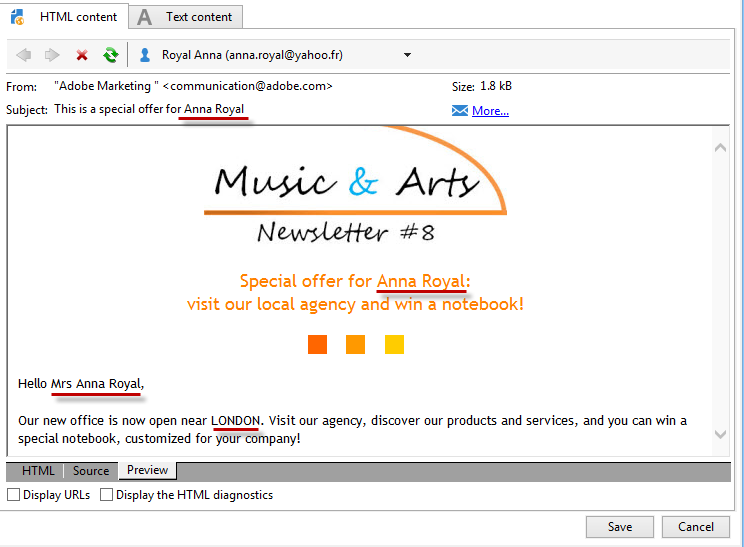
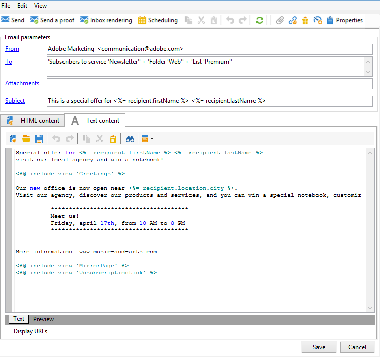
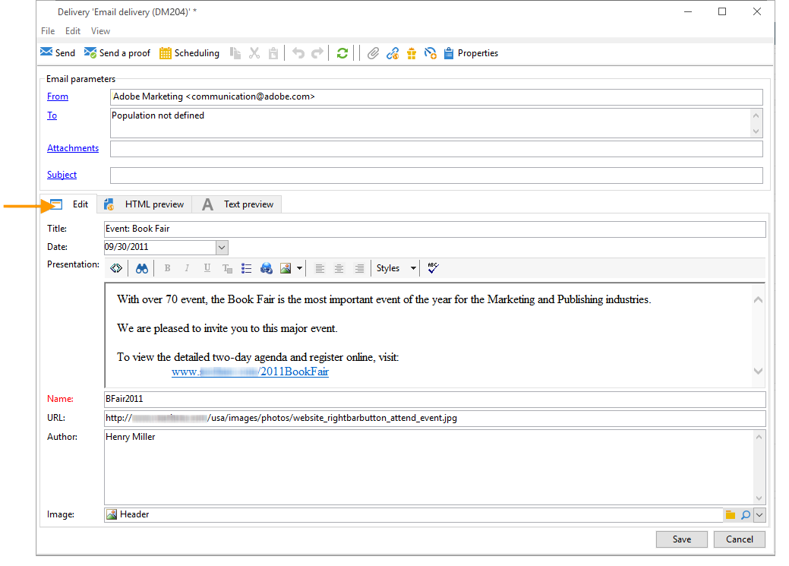

# 定义电子邮件的内容 {#defining-the-email-content}

## 发件人 {#sender}

要定义将出现在已发送邮件标题中的发件人名称和地址，请单击&#x200B;**[!UICONTROL From]**&#x200B;链接。

在此窗口中，您可以输入创建电子邮件标头所需的所有信息。 此信息可以个性化。 要实现此目的，请使用输入字段右侧的按钮插入个性化字段。

要了解如何插入和使用个性化字段，请参阅[此章节](personalize.md)。

>[!NOTE]
>
>* 默认情况下，使用发件人的地址进行回复。
>* 标头参数不能为空。 默认情况下，它们包含配置部署向导时输入的值。
>* 发件人的地址是允许发送电子邮件的必备项（RFC标准）。
>* Adobe Campaign检查所输入电子邮件地址的语法。

>[!CAUTION]
>
>为了避免出现可投放性问题，必须存在与为投放和回复指定的地址对应的电子邮件帐户，并且必须对其进行监控。 请与系统管理员核实。

## 消息主题 {#message-subject}

消息的主题在相应字段中配置。 您可以直接在字段中输入该值，或单击&#x200B;**[!UICONTROL Subject]**&#x200B;链接以输入脚本。 利用个性化链接，可在主题中插入数据库字段。

>[!IMPORTANT]
>
>消息主题为必填项。

发送消息时，字段内容将由收件人用户档案中的值替换。

例如，在上面的消息中，使用来自每个收件人的用户档案的数据，为每个收件人个性化消息主题。

>[!NOTE]
>
>[此部分](personalize.md)中介绍了个性化字段的使用。

您还可以使用&#x200B;**[!UICONTROL Insert emoticon]**&#x200B;弹出窗口将表情符号插入主题行。

## 消息内容 {#message-content}

>[!IMPORTANT]
>
>出于隐私原因，我们建议对所有外部资源使用HTTPS。

消息的内容在投放配置窗口的下半部分中定义。

默认情况下，根据收件人偏好设置，消息将以HTML或文本格式发送。 我们建议创建两种格式的内容，以确保在任何邮件系统中均可正确显示消息。 有关详情，请参阅[选择消息格式](email-parameters.md#selecting-message-formats)。

* 要导入HTML内容，请使用&#x200B;**[!UICONTROL Open]**&#x200B;按钮。 您还可以将源代码直接粘贴到&#x200B;**[!UICONTROL Source]**&#x200B;子选项卡中。

  如果您使用数字内容编辑器(DCE)，请参阅[Campaign Classic文档](https://experienceleague.adobe.com/docs/campaign-classic/using/designing-content/editing-html-content/use-case-creating-an-email-delivery.html#step-3---selecting-a-content)。

  >[!IMPORTANT]
  >
  >必须预先创建HTML内容，然后将其导入Adobe Campaign。 HTML编辑器不是为内容创建而设计的。

  **[!UICONTROL Preview]**&#x200B;子选项卡允许您查看收件人的每个内容的呈现。 将内容的个性化字段和条件元素替换为所选用户档案的相应信息。

  通过工具栏按钮可访问HTML页面的标准操作和格式参数。

  

  您可以在来自本地文件或Adobe Campaign中图像库的消息中插入图像。 为此，请单击&#x200B;**[!UICONTROL Image]**&#x200B;图标并选择相应的选项。

  

  可以通过文件夹树中的&#x200B;**[!UICONTROL Resources>Online>Public resources]**&#x200B;文件夹访问库图像。 另请参阅[添加图像](#adding-images)。

  使用工具栏中的最后一个按钮，可插入个性化字段。

  >[!NOTE]
  >
  >[此部分](personalize.md)中介绍了个性化字段的使用。

  通过页面底部的选项卡，可显示所创建页面的HTML代码，并查看消息及其个性化内容的呈现。 要启动此显示，请单击&#x200B;**[!UICONTROL Preview]**，然后使用工具栏中的&#x200B;**[!UICONTROL Test personalization]**&#x200B;按钮选择一个收件人。 您可以从定义的目标中选择收件人，也可以选择其他收件人。

  

  您可以验证HTML消息。 您还可以查看电子邮件标头的内容。

  

* 要导入文本内容，请使用&#x200B;**[!UICONTROL Open]**&#x200B;按钮或&#x200B;**[!UICONTROL Text Content]**&#x200B;选项卡，以文本格式显示时输入消息的内容。 使用工具栏按钮访问对内容的操作。 利用最后一个按钮，可插入个性化字段。

  

  对于HTML格式，单击页面底部的&#x200B;**[!UICONTROL Preview]**&#x200B;选项卡以查看消息的呈现及其个性化设置。

  

## 定义交互式内容 {#amp-for-email-format}

Adobe Campaign允许您尝试新的交互式[AMP for Email](https://amp.dev/about/email/)格式，该格式可用于在特定条件下发送动态电子邮件。

有关更多信息，请参阅[此小节](defining-interactive-content.md)。

## 使用内容管理 {#using-content-management}

您可以使用内容管理表单，直接在投放助手中定义投放的内容。 为此，必须在投放属性的&#x200B;**[!UICONTROL Advanced]**&#x200B;选项卡中引用要使用的内容管理的发布模板。

通过附加选项卡，可输入将根据内容管理规则自动集成和设置格式的内容。

>[!NOTE]
>
>有关Adobe Campaign中内容管理的更多信息，请参阅[Campaign Classic文档](https://experienceleague.adobe.com/docs/campaign-classic/using/sending-messages/content-management/about-content-management.html?lang=zh-Hans)。

## 插入表情符号 {#inserting-emoticons}

您可以在电子邮件内容中插入表情符号。

1. 单击&#x200B;**[!UICONTROL Insert emoticon]**&#x200B;图标。
1. 从弹出窗口中选择表情符号。

   

1. 完成后单击&#x200B;**[!UICONTROL Close]**&#x200B;按钮。

若要自定义表情符号列表，请参阅此[页面](customizing-emoticon-list.md)。

## 添加图像 {#adding-images}

HTML格式电子邮件投放可以包含图像。 通过投放助手，您可以导入包含图像的HTML页面，或直接使用HTML编辑器通过&#x200B;**[!UICONTROL Image]**&#x200B;图标插入图像。

### 护栏 {#img-guardrails}

为避免性能问题，电子邮件中包含的图像不能超过100 KB。 默认设置的此限制可以从`NmsDelivery_MaxDownloadedImageSize`选项更改。 但是，Adobe强烈建议避免在电子邮件投放中使用大型图像。

在[Campaign Classic文档](https://experienceleague.adobe.com/docs/campaign-classic/using/installing-campaign-classic/appendices/configuring-campaign-options.html#delivery)中了解有关Campaign选项列表的更多信息。

### 图像类型 {#img-types}

图像可以是：

* 本地映像或从服务器调用的映像
* 存储在Adobe Campaign公共资源库中的图像

  可通过Adobe Campaign层次结构的&#x200B;**[!UICONTROL Resources > Online]**&#x200B;节点访问公共资源。 它们分组在库中，可以包含在电子邮件中，但也可以用于营销活动或任务，或者用于内容管理。

* 与Adobe Experience Cloud共享的资源。 请参阅[Campaign Classic文档](https://experienceleague.adobe.com/docs/campaign-classic/using/integrating-with-adobe-experience-cloud/asset-sharing/sharing-assets-with-adobe-experience-cloud.html)。

### 插入和管理图像 {#manage-images}

利用投放助手，可将本地图像或存储在库中的图像添加到消息的内容中。 为此，请单击HTML内容工具栏中的&#x200B;**[!UICONTROL Image]**&#x200B;按钮。

>[!IMPORTANT]
>
>为了使收件人能够查看他们收到的邮件中包含的图像，这些邮件必须在可从外部访问的服务器上可用。

要通过投放助手管理图像，请执行以下操作：

1. 单击工具栏中的&#x200B;**[!UICONTROL Tracking & Images]**&#x200B;图标。
   

1. 在&#x200B;**[!UICONTROL Upload images]**&#x200B;选项卡中选择&#x200B;**[!UICONTROL Images]**。
1. 然后，您可以选择是否希望在电子邮件中包含图像。
   

* 您可以手动上传图像，而无需等待投放分析阶段。 为此，请单击&#x200B;**[!UICONTROL Upload the images straightaway...]**&#x200B;链接。
* 您可以指定其他路径来访问跟踪服务器上的图像。 为此，请在&#x200B;**[!UICONTROL Images URL]**&#x200B;字段中输入它。 此值将覆盖安装助手参数中定义的值。

在投放助手中打开包含图像的HTML内容时，将会显示一条消息，根据投放参数，为您提供立即上传图像的选项。

>[!IMPORTANT]
>
> 在手动上传或发送消息期间会修改图像URL。
> 

### 用例：发送包含图像的消息 {#uc-images}

以下是包含四个图像的投放示例：

这些图像来自本地目录或网站，您可以通过&#x200B;**[!UICONTROL Source]**&#x200B;选项卡进行验证。

单击&#x200B;**[!UICONTROL Tracking & Images]**&#x200B;图标，然后单击&#x200B;**[!UICONTROL Images]**&#x200B;选项卡以开始检测消息中的图像。

对于每个检测到的图像，可以查看其状态：

* 如果图像存储在本地或位于其他服务器上，即使此服务器从外部可见（例如，在Internet网站上），也将被检测为&#x200B;**[!UICONTROL Not yet online]**。
* 如果图像在创建另一个投放时提前上传，则检测到图像为&#x200B;**[!UICONTROL Already online]**。
* 在部署向导中，您可以定义未启用图像检测的URL：上传这些图像将为&#x200B;**[!UICONTROL Skipped]**。

>[!NOTE]
>
>图像根据其内容而不是其访问路径进行标识。 这意味着以前以其他名称或不同目录上传的映像将被检测为&#x200B;**[!UICONTROL Already online]**。

在分析阶段，图像会自动上传到服务器，以便从外部访问，但必须预先上传的本地图像除外。

您可以继续工作并上传图像，以便其他Adobe Campaign操作员能够查看这些图像。 如果您与他人协作，可能会发现此工具非常有用。 为此，请单击&#x200B;**[!UICONTROL Upload the images straightaway...]**&#x200B;将图像上传到服务器。

>[!NOTE]
>
>然后修改电子邮件中图像的URL，特别是其名称。

图像联机后，您可以从消息的&#x200B;**[!UICONTROL Source]**&#x200B;选项卡查看对其名称和路径的更改。

如果选择&#x200B;**[!UICONTROL Include the images in the email]**，则可以选择要包含在相应列中的图像。

>[!NOTE]
>
>如果消息中包含本地图像，则必须确认对消息源代码的更改。

## 插入个性化条形码{#insert-a-barcode}

条形码生成模块允许您创建符合许多常见标准的多种条形码，包括2D条形码。

可以使用使用客户条件定义的值动态地生成条形码作为位图。 电子邮件营销活动中可包含个性化的条形码。 收件人可以打印邮件并向发行公司显示以供扫描（例如，在结帐时）。

要在电子邮件中插入条形码，请将光标置于要显示条码的内容中，然后单击个性化按钮。 选择 **[!UICONTROL Include > Barcode...]**。

然后，根据您的需求配置以下元素：

1. 选择条形码类型。

   * 对于1D格式，Adobe Campaign提供以下类型：Codabar、代码128、GS1-128（以前称为EAN-128）、UPC-A、UPC-E、ISBN、EAN-8、代码39、交错式2（共5个）、POSTNET和皇家邮件(RM4SCC)。

     1D条形码示例：

     

   * DataMatrix和PDF417类型涉及2D格式。

     2D条形码示例：

     

   * 要插入QR码，请选择此类型并输入要应用的纠错率。 此比率定义重复的信息量以及对恶化的容差。

     

     QR代码示例：

     

1. 输入要插入到电子邮件中的条形码大小：通过配置小数位数，可以将条形码的大小从x1增大到x10。
1. **[!UICONTROL Value]**&#x200B;字段允许您定义条形码的值。 值可以匹配特殊选件，可以是标准的函数，也可以是链接到客户的数据库字段的值。

   此示例显示了一个EAN-8类型的条形码，其中添加了收件人的帐号。 若要添加此帐号，请单击&#x200B;**[!UICONTROL Value]**&#x200B;字段右侧的个性化按钮，然后选择&#x200B;**[!UICONTROL Recipient > Account number]**。

   

1. **[!UICONTROL Height]**&#x200B;字段允许您通过更改条形码之间的间距来配置条形码的高度，而不更改条形码的宽度。

   根据条形码的类型，没有限制性条目控制。 如果条码值不正确，它将仅在&#x200B;**预览**&#x200B;模式下可见，在此模式下，条码将以红色划出。

   >[!NOTE]
   >
   >分配给条码的值取决于其类型。 例如，EAN-8类型应恰好有8个数字。
   >
   >**[!UICONTROL Value]**&#x200B;字段右侧的个性化按钮允许您在值本身之外添加数据。 只要条码标准接受它，这就会丰富条码。
   >
   >例如，如果您使用GS1-128类型条形码，并且希望输入除值之外的收件人帐号，请单击个性化按钮并选择&#x200B;**[!UICONTROL Recipient > Account number]**。 如果正确输入了所选收件人的帐号，则条码会考虑该帐号。

配置这些元素后，即可最终确定电子邮件并将其发送。 为避免出现错误，请始终确保内容显示正确，然后再通过单击&#x200B;**[!UICONTROL Preview]**&#x200B;选项卡执行投放。

>[!NOTE]
>
>如果条形码的值不正确，其位图将以红色划掉。

