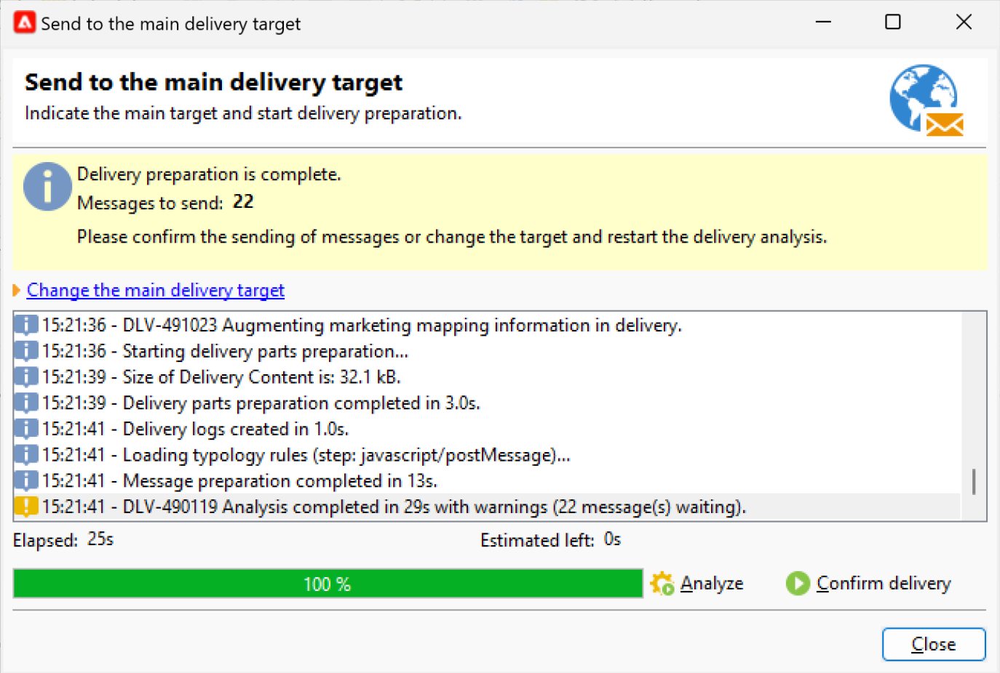

# 投放分析 {#analyze-delivery}

分析是投放准备步骤。 定义目标受众并准备好并测试消息内容后，即可启动该活动。 在投放分析期间，会计算目标群体并准备投放内容。 完成后，即可发送投放。

## 开始分析 {#start-the-analysis}

要准备投放，请确保已定义投放内容和目标，并按照以下步骤操作：

1. 在投放窗口中，单击 **[!UICONTROL Send]** 按钮。
1. 选择 **[!UICONTROL Deliver as soon as possible]** 以执行受众计算和内容准备，以便立即发送。 您还可以将投放推迟到以后的日期，或在不准备内容的情况下获取群体估计。

   

1. 单击 **[!UICONTROL Analyze]** 以手动启动分析。 进度栏显示分析的进度。

   在投放分析期间会应用一组检查规则。 这些规则在 **类型**，在 **[!UICONTROL Typology]** 选项卡。 在 [此部分](../../automation/campaign-opt/campaign-typologies.md).

   默认情况下，对于电子邮件，分析涵盖以下几点：

   * 批准对象
   * 批准URL和图像
   * 批准URL标签
   * 批准退订链接
   * 检查校样的大小
   * 检查有效期
   * 检查波的调度

1. 您可以随时通过单击 **[!UICONTROL Stop]** 按钮。

   在准备阶段期间不会发送消息。 因此，您可以开始或取消分析，而不会产生任何风险。

   >[!IMPORTANT]
   >
   >运行时，分析会冻结投放（或校样）。 投放（或验证）的任何更改都必须随后进行其他分析，然后才能适用。

分析完成后，窗口的上半部分会指示投放准备是否完成或是否发生任何错误。 列出了所有验证步骤、警告和错误。 彩色图标显示消息类型：

* 蓝色图标表示信息性消息。
* 黄色图标表示非关键处理错误。
* 红色图标表示阻止发送投放的严重错误。

   {width="800" align="left"}

1. 单击 **[!UICONTROL Close]** 以纠正错误（如果有）。 进行更改后，重新启动分析，单击 **[!UICONTROL Analyze]**.

   >[!NOTE]
   >
   >单击 **[!UICONTROL Change the main delivery target]** 链接。 利用此选项，可更改目标群体的定义并重新开始分析。

1. 检查分析结果后，单击 **[!UICONTROL Confirm delivery]** 将消息发送到主目标。

## 分析设置 {#analysis-settings}

浏览到 **[!UICONTROL Analysis]** 选项卡，用于定义在分析阶段准备消息的设置。

{width="800" align="left"}

利用此选项卡，可访问以下选项：

* **[!UICONTROL Label and code of the delivery]** :此部分中的选项用于在投放分析阶段计算这些字段的值。 的 **[!UICONTROL Compute the execution folder during the delivery analysis]** 字段会计算将在分析阶段包含此提交操作的文件夹的名称。

* **[!UICONTROL Approval mode]** :利用此字段，可在分析完成后定义手动或自动提交。

   如果在分析期间生成警告（例如，如果某些字符在投放的主题中突出显示等），则可以配置投放以定义是否应仍执行该投放。 默认情况下，用户必须在分析阶段结束时确认消息的发送：此为 **手动** 验证。

   从相应字段的下拉列表中选择其他批准模式。

   可以使用以下批准模式：

   * **[!UICONTROL Manual]**:在分析阶段结束时，用户必须确认投放以开始发送。 为此，请单击 **[!UICONTROL Start]** 按钮来启动投放。
   * **[!UICONTROL Semi-automatic]**:如果分析阶段未生成警告消息，则自动开始发送。
   * **[!UICONTROL Automatic]**:发送在分析阶段结束时自动开始，而与其结果无关。

* **[!UICONTROL Start job in a detached process]** :利用此选项，可以在单独的流程中启动投放分析。 默认情况下，分析函数使用Adobe Campaign应用程序服务器进程(web nlserver)。 通过选择此选项，您可确保即使在应用程序服务器出现故障时也能完成分析。
* **[!UICONTROL Log SQL queries generated during the analysis in the journal]** :此选项在分析阶段将SQL查询日志添加到投放日志。
* **[!UICONTROL Ignore personalization scripts during sending]** :此选项允许您绕过对HTML内容中JavaScript指令的解释。 它们将按原样显示在已交付的内容中。 这些指令在 `<%=` 标记。

