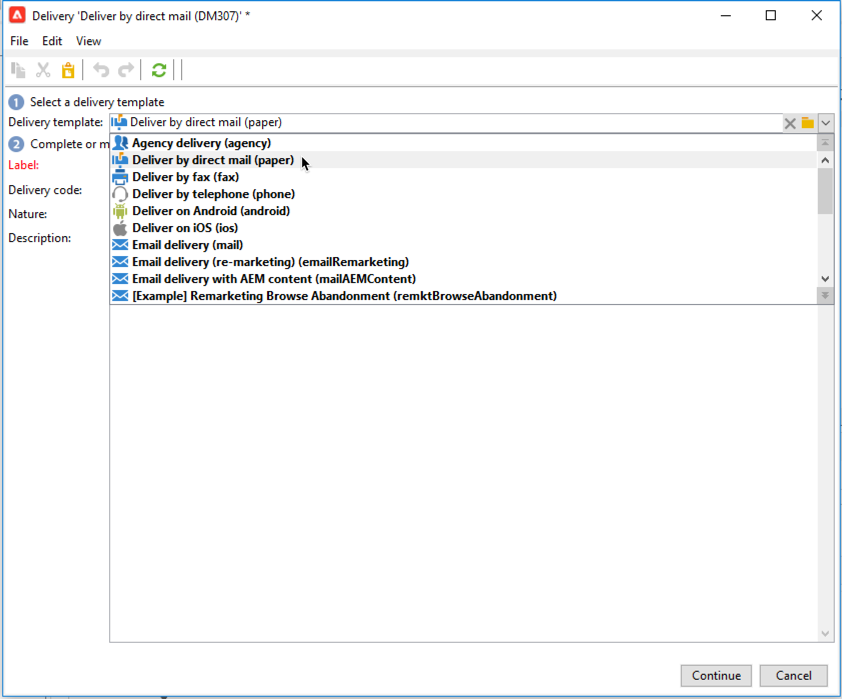
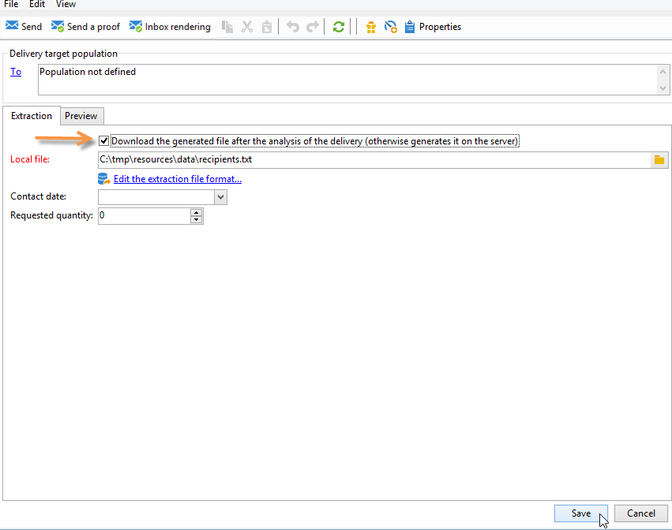

# 创建直邮投放

直邮投放允许您生成包含目标群体数据的提取文件。 然后，您可以与将向其定向群体投放消息的提供商共享此文件。

生成文件的步骤如下：

1. [创建投放](#creating-a-direct-mail-delivery)
1. [定义受众](#defining-the-direct-mail-audience)
1. [定义文件的内容](#defining-the-direct-mail-content)
1. [验证投放](#validating)
1. [开始投放](#start-delivery)

## 创建投放{#creating-a-direct-mail-delivery}

根据模板创建直邮投放。 您可以复制和配置&#x200B;**[!UICONTROL Deliver by direct mail (paper)]**&#x200B;内置模板。

要创建新的直邮投放，请执行以下步骤：

>[!NOTE]
>
>有关投放创建的全局概念在[此部分](../start/create-message.md)中介绍。

1. 创建新投放，例如从投放仪表板。
1. 选择投放模板&#x200B;**通过直邮（纸张）投放**。

   

1. 使用标签、代码和描述标识投放。 如需详细信息，请参阅[此小节](../start/create-message.md#create-the-delivery)。
1. 单击&#x200B;**继续**&#x200B;以确认此信息并显示消息配置窗口。

## 定义受众{#defining-the-direct-mail-audience}

收件人用户档案必须至少包含其姓名和邮政地址。

邮政地址是计算字段。 默认情况下，地址最多可包含六行：第一行包含名字和姓氏，下一行包含邮政地址（门牌号码等），最后一行包含邮政编码和城镇或城市。 可以在nms:recipient架构中查看默认计算的postalAddress字段的定义。

如果名称、邮政编码字段和城镇/城市字段不为空，则认为地址完整。 将从直邮投放中排除任何地址不完整的收件人。

可在[此部分](../start/create-message.md#target-population)中了解详情。

## 定义文件的内容{#defining-the-direct-mail-content}

使用提取向导定义要导出到输出文件中的信息（列）。

包含提取数据的文件的名称在&#x200B;**[!UICONTROL File]**&#x200B;字段中定义。 利用字段右侧的按钮，可使用个性化字段创建文件名。

默认情况下，将创建提取文件并将其存储在服务器上。 您可以将其保存在计算机上。 为此，请检查&#x200B;**[!UICONTROL Download the generated file after the analysis of the delivery]**。 在这种情况下，您需要指明本地存储目录的访问路径以及文件名。

对于直邮投放，提取的内容在&#x200B;**[!UICONTROL Edit the extraction file format...]**&#x200B;链接中定义。

利用此链接，可访问提取助理并定义要导出到输出文件中的信息（列）。

您可以在提取文件中插入个性化URL。 有关详细信息，请参阅Adobe Campaign Classic [文档](https://experienceleague.adobe.com/docs/campaign-classic/using/designing-content/web-forms/publishing-a-web-form.html){target="_blank"}。

>[!NOTE]
>
>此助理包括导出助理的详细步骤Adobe Campaign Classic [文档](https://experienceleague.adobe.com/docs/campaign-classic/using/getting-started/importing-and-exporting-data/generic-imports-exports/executing-export-jobs.html){target="_blank"}。

## 验证投放{#validating}

检查分析结果和输出文件的内容。

在营销活动上下文中，在提取日期创建提取文件。 您可以查看提取文件的内容、批准该文件或更改格式并根据需要重新启动提取。 文件获得批准后，即可向路由器发送通知电子邮件。 请参阅[此页面](https://experienceleague.adobe.com/docs/campaign/automation/campaign-orchestration/marketing-campaign-approval.html?lang=zh-Hans){target="_blank"}以了解详情。

[本节](../start/create-message.md#validate-the-delivery)介绍了验证投放时的全局概念。

直邮投放的输出文件在投放分析期间生成。 文件的内容取决于所选的输出列（请参阅此[节文件](#defining-the-direct-mail-content)）。

>[!NOTE]
>
>此[部分](delivery-analysis.md)中详细介绍了分析阶段。

在分析阶段，会生成文件，但不更新有关收件人的信息（即投放日志）。 因此，您可以取消此作业而不运行任何风险。

在单击&#x200B;**[!UICONTROL Confirm delivery]**&#x200B;之前，请检查分析结果和输出文件的内容。 确认消息允许您启动投放。

发送确认会启动指定文件中的数据提取。

然后，您可以关闭此助手，并通过&#x200B;**[!UICONTROL Delivery]**&#x200B;选项卡查看投放日志，可通过投放详细信息访问选项卡。

您可以从投放属性的&#x200B;**[!UICONTROL Analysis]**&#x200B;选项卡配置投放日志检索模式。

有两种模式：

* **[!UICONTROL Messages are considered sent after validation]** （默认模式）：在此函数模式下，当操作员确认发送（其状态从“待处理投放”传递到“已发送”）并且投放自动设置为&#x200B;**[!UICONTROL Finished]**&#x200B;时，将更新所有broadlog。
* **[!UICONTROL A file of results determines the messages that are sent and those that have failed]** ：此模式允许您通过服务提供商发送的外部文件更新broadlog。 在这种情况下，需要使用工作流来处理此信息，以便更新broadlog状态。

  >[!NOTE]
  >
  >在这种情况下，一旦更新了broadlog，用户还需要将投放的状态更改为&#x200B;**[!UICONTROL Finished]**。

## 开始投放{#start-delivery}

验证提取文件后，单击&#x200B;**确认投放**&#x200B;确认消息可让您启动投放。

确认会启动指定文件中的数据提取。

在营销活动上下文中，当所有批准都获得后，将通过一个特殊工作流创建提取文件，在默认配置中，当直邮投放挂起提取时，将自动启动该工作流。 可在[此部分](https://experienceleague.adobe.com/docs/campaign/automation/campaign-orchestration/marketing-campaign-deliveries.html?lang=zh-Hans){target="_blank"}中了解详情。
