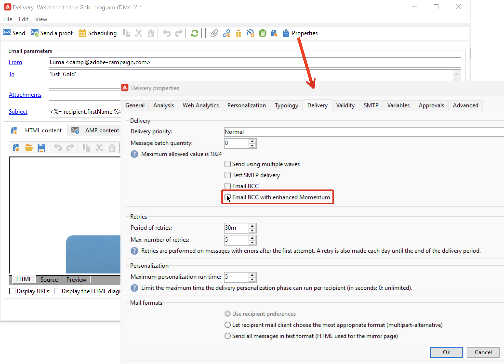

# 将邮件副本发送到密件抄送地址 {#bcc}

<!--
>[!NOTE]
>
>This capability is available starting Campaign v8.3. To check your version, refer to [this section](../start/compatibility-matrix.md#how-to-check-your-campaign-version-and-buildversion)-->

## 关于电子邮件密送 {#gs-bcc}

您可以配置Adobe Campaign以保留从您的平台发送的电子邮件副本。 此选项允许您使用专用的密件抄送（密件抄送）电子邮件地址发送邮件，可以从此处使用外部系统处理和存档邮件。
Adobe Campaign本身不会管理存档文件。 然后，对应于所发送电子邮件的.eml文件可以传送到远程服务器，如SMTP电子邮件服务器。

存档目标是您选择的密件抄送电子邮件地址，该地址对投放收件人保持不可见。 定义密件抄送电子邮件地址后，您必须在 [投放模板](create-templates.md) 级别。

  作为托管Cloud Service用户， [联系人Adobe](../start/campaign-faq.md#support){target="_blank"} 用于传达要用于归档的密件抄送电子邮件地址。

>[!CAUTION]
>
>出于隐私原因，密件抄送电子邮件必须由能够安全存储个人身份信息(PII)的归档系统处理。

## 启用电子邮件密送 {#enable-bcc}

为特定对象启用密件抄送 [投放模板](create-templates.md)，请按照以下步骤操作：

1. 在Campaign资源管理器中，浏览到投放模板文件夹。 默认情况下，投放模板存储在 **[!UICONTROL Resources]** > **[!UICONTROL Templates]** > **[!UICONTROL Delivery templates]** 文件夹。
1. 编辑要通过密送更新的投放模板。
1. 单击 **[!UICONTROL Properties]** 按钮。
1. 从 **[!UICONTROL Delivery]** 选项卡，检查 **[!UICONTROL Email BCC]** 选项。

   

1. 单击 **[!UICONTROL Ok]** 确认。

基于此模板的每个投放的所有已发送消息的副本将发送到为您的平台配置的电子邮件密件抄送地址。

## 护栏和建议 {#recommendations-bcc}

将电子邮件密送与Adobe Campaign结合使用时，以下护栏和推荐适用：

* 您只能使用一个密件抄送电子邮件地址。

* 确保密件抄送地址有足够的接收容量来存档发送的所有电子邮件。

* 电子邮件密送 <!--with Enhanced MTA--> 在发送给收件人之前发送给密件抄送电子邮件地址，这可能会导致即使原始投放可能已退回，仍发送密件抄送消息。 有关退回的详细信息，请参阅 [了解投放失败](delivery-failures.md).

* 发送到密件抄送地址的电子邮件不得打开和点进，因为这些活动在中被考虑在内 **[!UICONTROL Total opens]** 和 **[!UICONTROL Clicks]** 在发送分析中，可能会导致计算错误。

<!--Only successfully sent emails are taken in account, bounces are not.-->
