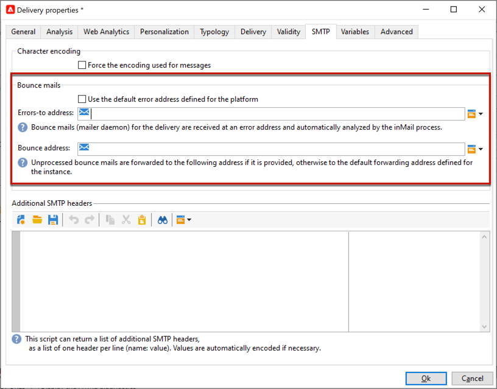

# 电子邮件参数 {#email-parameters}

此部分介绍投放属性中特定于电子邮件投放的可用选项和参数。

## 使用电子邮件密送 {#email-bcc}

您可以配置Adobe Campaign以保留从您的平台发送的电子邮件副本。 [此页面](email-bcc.md)中详细介绍了此选项。

## 选择消息格式 {#selecting-message-formats}

您可以更改已发送电子邮件的格式。 为此，请编辑投放属性并单击&#x200B;**[!UICONTROL Delivery]**&#x200B;选项卡。

在窗口的下半部分选择电子邮件的格式：

* **[!UICONTROL Use recipient preferences]** （默认模式）

  根据收件人用户档案中存储的数据(默认存储在&#x200B;**[!UICONTROL email format]**&#x200B;字段(@emailFormat)中)定义消息格式。 如果收件人希望以特定格式接收消息，则会将该格式用于发送的邮件。如果未填写该字段，则会发送multipart-alternative消息（请参阅下文）。

* **[!UICONTROL Let recipient mail client choose the most appropriate format]**

  该消息包含两种格式：文本和HTML。 接收时显示的格式取决于收件人邮件软件的配置(multipart-alternative)。

  >[!IMPORTANT]
  >
  >此选项包括文档的两个版本。 因此，它会降低投放吞吐量，因为消息大小更大。

* **[!UICONTROL Send all messages in text format]**

  消息以文本格式发送。 HTML格式不会发送，但仅当收件人单击消息时，才会用于镜像页面。

<!--
>[!NOTE]
>
>For more on defining the email content, see [this section]().-->

## 设置字符编码 {#character-encoding}

在投放参数的&#x200B;**[!UICONTROL SMTP]**&#x200B;选项卡中，**[!UICONTROL Character encoding]**&#x200B;部分允许您设置特定编码。

默认编码为UTF-8。 如果某些收件人的电子邮件提供商不支持UTF-8标准编码，您可能需要设置特定编码以正确向电子邮件的收件人显示特殊字符。

例如，您希望发送包含日语字符的电子邮件。 为确保向日本的收件人正确显示所有字符，您可能需要使用支持日语字符的编码而不是标准UTF-8。

为此，请选择&#x200B;**[!UICONTROL Force the encoding used for messages]**&#x200B;部分中的&#x200B;**[!UICONTROL Character encoding]**&#x200B;选项，然后从显示的下拉列表中选择编码。

## 管理退回电子邮件 {#managing-bounce-emails}

通过投放属性的&#x200B;**[!UICONTROL SMTP]**&#x200B;选项卡，还可以配置退回邮件的管理。

* **[!UICONTROL Errors-to-address]**：默认情况下，平台的默认错误框中会收到退回的电子邮件，但您可以为投放定义特定的错误地址。

* **[!UICONTROL Bounce address]**：您还可以定义将未处理的退回电子邮件转发到的其他地址。 利用此地址，可调查应用程序无法自动限定电子邮件时退回的原因。

其中每个字段都可以使用专用图标进行个性化。 在[本节](personalization-fields.md)中了解个性化字段的更多信息。

有关退回邮件管理的详细信息，请参阅[此部分](delivery-failures.md#bounce-mail-management)。

## 启用一键式列表取消订阅 {#one-click-list-unsubscribe}

一键式列表取消订阅URL是显示在电子邮件发件人信息旁边的链接或按钮，收件人只需单击一下即可立即选择退出您的邮件列表。<!--[Learn more](https://experienceleague.adobe.com/docs/deliverability-learn/deliverability-best-practice-guide/additional-resources/campaign/acc-technical-recommendations.html?lang=zh-Hans#list-unsubscribe){target="_blank"}-->

它在ISP的电子邮件界面中显示为&#x200B;**取消订阅**&#x200B;链接。 例如：

必须添加名为List-Unsubscribe的SMTP标头，以确保实现最佳可投放性管理，并可用作“报告为垃圾邮件”图标的替代图标。 事实上，使用此功能可降低投诉率，并有助于保护您的声誉。

>[!IMPORTANT]
>
>要在电子邮件标头中显示一键式取消订阅URL，收件人的电子邮件客户端必须支持此功能。

要启用此功能，请在投放属性的&#x200B;**[!UICONTROL Addition of One-click List-Unsubscription Header]**&#x200B;选项卡中选择&#x200B;**[!UICONTROL SMTP]**&#x200B;选项。

>[!NOTE]
>
>默认启用此选项。

<!--
>[!WARNING]
>
>If you uncheck this option in the delivery template, it will still be enabled by default in the deliveries created from this template. You need to enable the option again at the delivery level.-->

根据电子邮件客户端及其用于执行选择退出的方法，单击电子邮件标头中的&#x200B;**取消订阅**&#x200B;链接可能会产生以下影响：

* 如果电子邮件客户端使用&#x200B;**One-Click** List-Unsubscribe方法，收件人将直接选择退出。

  >[!NOTE]
  >
  >主要ISP，例如Google和Yahoo！ 要求发件人遵守&#x200B;**一键式列表取消订阅**。

* 如果电子邮件客户端不支持一键式列表取消订阅，则仍可使用&#x200B;**&quot;mailto&quot;** List-Unsubscribe方法，该方法会向电子邮件标头中指定的取消订阅地址发送预填充的电子邮件。

  您可以在标头中显式设置地址，也可以使用动态地址（例如，使用&lt;%=errorAddress%>或选项“NmsEmail_DefaultErrorAddr”，该选项可通过部署向导进行设置）。

>[!NOTE]
>
>您还可以手动设置[One-Click List-Unsubscribe](https://experienceleague.adobe.com/zh-hans/docs/deliverability-learn/deliverability-best-practice-guide/additional-resources/campaign/acc-technical-recommendations?lang=en#one-click-list-unsubscribe){target="_blank"}和[&quot;mailto&quot; List-Unsubscribe](https://experienceleague.adobe.com/zh-hans/docs/deliverability-learn/deliverability-best-practice-guide/additional-resources/campaign/acc-technical-recommendations?lang=en#mailto-list-unsubscribe){target="_blank"}方法。 Experience Cloud [可投放性最佳实践指南](https://experienceleague.adobe.com/docs/deliverability-learn/deliverability-best-practice-guide/additional-resources/campaign/acc-technical-recommendations.html?lang=zh-Hans#list-unsubscribe){target="_blank"}中介绍了详细步骤。

## 添加SMTP标头 {#adding-smtp-headers}

可以将SMTP标头添加到投放。 为此，请使用投放中&#x200B;**[!UICONTROL SMTP]**&#x200B;选项卡的相关部分。

在此窗口中输入的脚本必须引用以下形式每行一个标头： **name:value**。

如有必要，将自动对值进行编码。

>[!IMPORTANT]
>
>高级用户可随时添加脚本以插入其他SMTP标头。
>
>此脚本的语法必须符合此内容类型的要求：没有未使用的空格，没有空行等。

## 生成镜像页面 {#generating-mirror-page}

镜像页面是可通过 Web 浏览器在线访问的 HTML 页面。其内容与电子邮件的内容相同。如果收件人尝试在收件箱中查看电子邮件时遇到渲染问题或图像损坏，此功能会很有用。

在[本节](mirror-page.md)中了解如何插入指向镜像页面的链接
