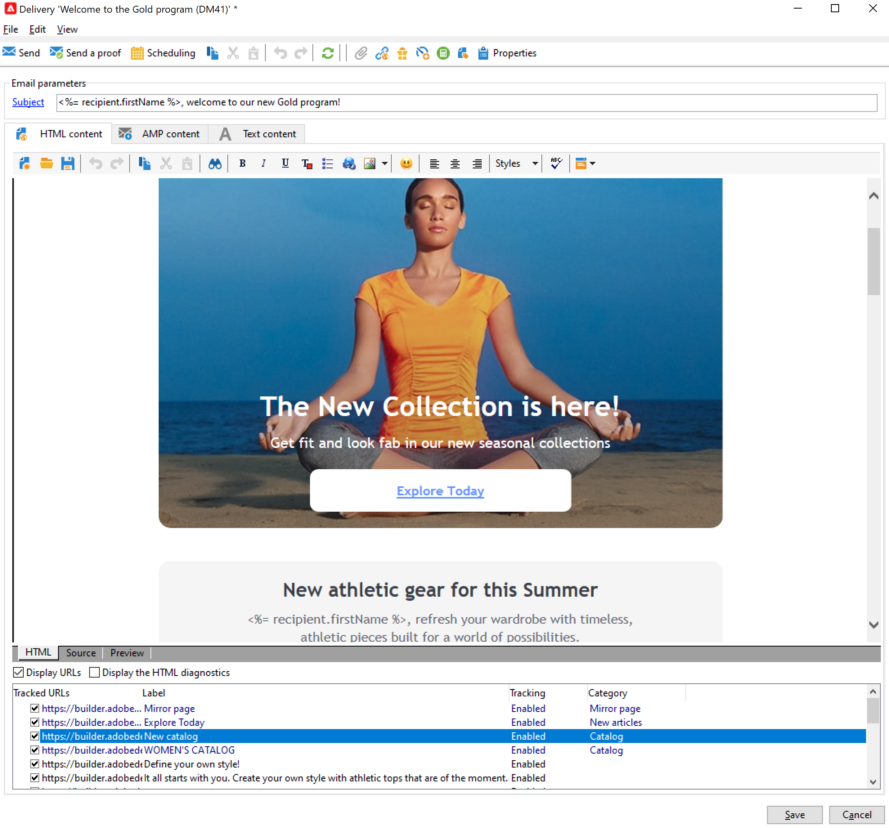

# 设计和发送电子邮件

电子邮件投放可让您向目标群体发送个性化电子邮件。 [了解详情](../send/send.md)

## 创建您的第一个电子邮件投放

创建上下文相关的个性化电子邮件，使它们提供的体验与客户的其他体验保持一致。

在以下示例中，您将了解在Adobe Campaign中设计电子邮件投放的步骤，该投放包含个性化数据、指向外部URL的链接和指向镜像页面的链接。

1. **创建投放**

   要创建新投放，请浏览到 **营销活动** 选项卡，单击 **投放** 并单击 **创建** 按钮时，发送电子邮件给现有投放列表的上方。

   

1. **选择模板**

   选择投放模板，然后为您的投放命名。 此名称仅对Adobe Campaign控制台的用户可见，收件人不可见，但此标题将显示在投放列表中。 单击 **[!UICONTROL Continue]**。

   

1. **导入您的内容**

   单击 **来源** 选项卡，以粘贴HTML内容。

   

1. **个性化您的消息**

   * 添加收件人的名字和姓氏

     要在消息内容中插入目标用户档案的名字和姓氏，请将光标置于要插入它们的位置，然后单击工具栏中的最后一个图标，然后单击 **[!UICONTROL Include]** 并选择 **[!UICONTROL Greetings]**.

     

     浏览到“预览”选项卡，通过选择收件人来检查个性化。

     

     在中了解有关个性化选项的更多信息 [本节](personalize.md).

   * 插入跟踪链接

     要通过图像或文本将投放收件人转至外部地址，请选择该地址并单击 **[!UICONTROL Add a link]** 图标。

     在中输入链接的URL **URL** 字段使用以下格式 **https://www.myURL.com**，然后确认。

     

   * 添加镜像页面

     要允许收件人在Web浏览器中查看投放内容，请添加指向的链接 [镜像页面](mirror-page.md) 您消息的内容。

     将光标放在要插入此链接的位置，单击工具栏中的最后一个图标，然后单击 **[!UICONTROL Include]** 并选择 **[!UICONTROL link to mirror page]**.

     在中了解有关管理镜像页面的更多信息 [本节](mirror-page.md#link-to-mirror-page).

1. 您可以为电子邮件定义其他参数，如将邮件副本发送到BBC地址、更改邮件格式、设置特定编码等。 在[此章节](email-parameters.md)中了解更多信息。

1. 内容准备就绪后，单击 **保存**：它现在显示在您的投放列表中，位于 **[!UICONTROL Campaigns > Deliveries]** 选项卡。

您的第一个电子邮件投放已准备就绪。 您现在需要定义受众、验证投放并发送它。

请参阅此以了解如何导入电子邮件内容 [用例](https://experienceleague.adobe.com/docs/campaign/automation/workflows/use-cases/deliveries/load-delivery-content.html).

请在以下部分中了解详情：

<!--[Design an email in Campaign]-->
* [创建和使用电子邮件模板](../send/create-templates.md)
* [选择电子邮件的受众](../audiences/gs-audiences.md)
* [验证投放并发送校样](preview-and-proof.md)
* [配置并发送投放](configure-and-send.md)

## 测试和验证电子邮件

Campaign提供了多种方式，可在将电子邮件发送给受众之前测试和验证电子邮件。 了解如何在中预览和测试您的电子邮件内容 [本节](../send/preview-and-proof.md).

您可以：

* [  发送验证](preview-and-proof.md)
* [添加种子地址](../audiences/test-profiles.md)
* [检查投放分析日志](delivery-analysis.md)

