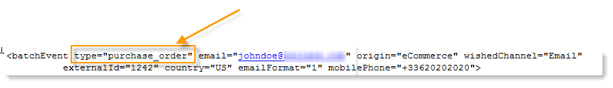
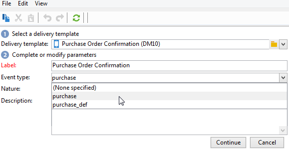

# 事件处理 {#event-processing}

在事务性消息传递的上下文中，事件由外部信息系统生成，并通过&#x200B;**[!UICONTROL PushEvent]**&#x200B;和&#x200B;**[!UICONTROL PushEvents]**&#x200B;方法发送到Adobe Campaign。 [本节](event-description.md)中介绍了这些方法。

此事件包含链接到事件的数据，例如：

* 其[类型](transactional.md#create-event-types)：订单确认、在网站上创建帐户等，
* 电子邮件地址或电话号码，
* 在投放之前扩充和个性化事务型消息的任何其他信息：客户联系信息、消息语言、电子邮件格式等。

事件数据示例：

要处理事务性消息事件，需对执行实例应用以下步骤：

1. [事件集合](#event-collection)
1. [事件传输到消息模板](#routing-towards-a-template)
1. 使用个性化数据扩充事件
1. [投放执行](delivery-execution.md)
1. [回收链接投放失败的事件](#event-recycling)(通过Adobe Campaign工作流)

完成所有步骤后，每个目标收件人都会收到个性化消息。

## 收集事件 {#event-collection}

信息系统生成的事件可以使用两种模式收集：

* 通过调用SOAP方法，您可以在Adobe Campaign中推送事件：通过PushEvent方法，您可以一次发送一个事件；通过PushEvents方法，您可以一次发送多个事件。 [了解详情](event-description.md)。

* 通过创建工作流，您可以通过导入文件或通过SQL网关及[联合数据访问](../connect/fda.md)模块恢复事件。

收集事件后，在等待链接到[消息模板](transactional-template.md)时，将按照执行实例的实时队列和批处理队列之间的技术工作流对事件进行划分。

>[!NOTE]
>
>在执行实例上，**[!UICONTROL Real time events]**&#x200B;或&#x200B;**[!UICONTROL Batch events]**&#x200B;文件夹不能设置为视图，因为这会导致访问权限问题。 有关将文件夹设置为视图的详细信息，请参阅[此部分](../audiences/folders-and-views.md#turn-a-folder-to-a-view)。

## 将事件传输到模板 {#event-to-template}

在执行实例上发布消息模板后，将自动生成两个模板：一个链接到实时事件，另一个链接到批处理事件。

传送步骤包括将事件链接到相应的消息模板，具体基于：

* 在事件本身的属性中指定的事件类型：

  

* 在消息模板属性中指定的事件类型：

  

默认情况下，路由依赖以下信息：

* 事件类型
* 要使用的渠道（默认为：电子邮件）
* 基于发布日期的最新投放模板

## 检查事件状态 {#event-statuses}

在&#x200B;**Event history**&#x200B;文件夹或Explorer中，所有已处理的事件都分组到单个视图中。 它们可以按事件类型或&#x200B;**状态**&#x200B;分类。

可能的状态包括：

* **挂起**

   * 待处理事件可以是刚刚收集且尚未处理的事件。 **[!UICONTROL Number of errors]**&#x200B;列显示值0。 尚未链接电子邮件模板。
   * 待处理事件也可以是已处理但确认有误的事件。 **[!UICONTROL Number of errors]**&#x200B;列显示的值不是0。 要了解何时再次处理此事件，请参阅&#x200B;**[!UICONTROL Process requested on]**&#x200B;列。

* **待处理投放**
该事件已处理，并且已链接投放模板。 电子邮件正在等待投放，并且已应用经典投放流程。 有关详细信息，您可以打开投放。
* **已发送**，**已忽略**&#x200B;和&#x200B;**传递错误**
这些投放状态可通过**updateEventsStatus**&#x200B;工作流恢复。 有关详细信息，您可以打开相关的投放。
* **事件未涵盖**
事务性消息传递路由阶段失败。 例如，Adobe Campaign未找到用作事件模板的电子邮件。
* **事件已过期**
已达到最大发送尝试次数。 该事件被视为null。

## 回收事件 {#event-recycling}

如果特定渠道上的消息投放失败，Adobe Campaign可以使用其他渠道重新发送消息。 例如，如果短信渠道投放失败，则使用电子邮件渠道重新发送消息。

为此，您需要配置一个工作流，该工作流会重新创建具有&#x200B;**投放错误**&#x200B;状态的所有事件，并为它们分配不同的渠道。

>[!CAUTION]
>
>此步骤只能使用工作流执行，因此仅供专家用户使用。 有关更多信息，请与您的Adobe客户经理联系。
