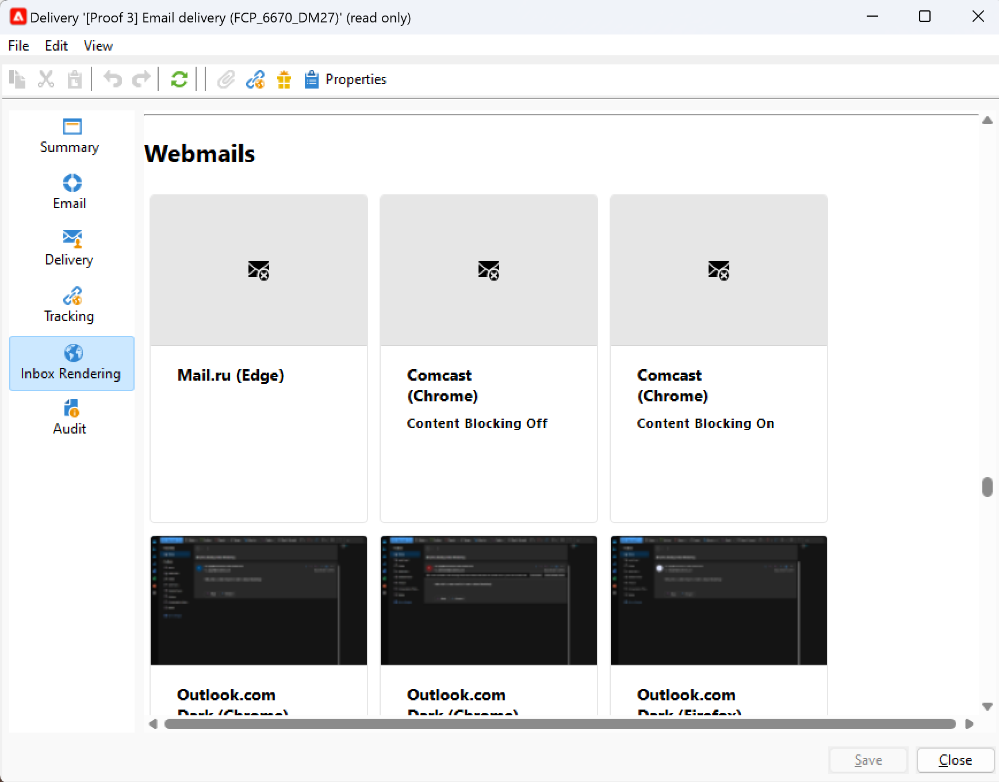

# 收件箱呈现{#inbox-rendering}

## 关于收件箱呈现 {#about-inbox-rendering}

在点击&#x200B;**发送**&#x200B;按钮之前，请确保以最佳方式在各种Web客户端、Web邮件和设备上向收件人显示您的消息。

为了实现此功能，Adobe Campaign利用基于[Litmus](https://litmus.com/email-testing){target="_blank"}网络的电子邮件测试解决方案来捕获渲染，并在专用报告中提供它们。 这样，您便可以在不同的接收环境中预览所发送的消息，并检查主要台式机和应用程序中的兼容性。

>[!CAUTION]
>收件箱渲染与[定期投放](../../automation/workflow/recurring-delivery.md)不兼容。

Litmus是一款功能丰富的电子邮件验证和预览应用程序。 它允许电子邮件内容创建者在70多个电子邮件呈现器中预览其邮件内容，如Gmail收件箱或Apple Mail客户端。

可用于Adobe Campaign中&#x200B;**收件箱呈现**&#x200B;的移动设备、消息传递和网络邮件客户端已列在[Litmus网站](https://litmus.com/email-testing){target="_blank"}上（单击&#x200B;**查看所有电子邮件客户端**）。

>[!NOTE]
>
>测试投放中的个性化不需要收件箱呈现。 可以使用Adobe Campaign工具（如&#x200B;**[!UICONTROL Preview]**&#x200B;和[验证](preview-and-proof.md#send-proofs)）检查Personalization。

## 关于Litmus标记 {#about-litmus-tokens}

由于Litmus是第三方服务，因此它在基于每次使用信用的模型上运行。 每次用户调用Litmus功能时，积分都会被扣除。

在Adobe Campaign中，点数对应于可用渲染（称为令牌）的数量。

>[!NOTE]
>
>可用的Litmus令牌数量取决于您购买的Campaign许可证。 检查您的许可协议。

每次在投放中使用&#x200B;**[!UICONTROL Inbox rendering]**&#x200B;功能时，生成的每次渲染都会将您的可用令牌减少一次。

>[!IMPORTANT]
>
>令牌用于代表每个单独的渲染，而不是整个收件箱呈现报表，这意味着：
>
>* 每次生成收件箱呈现报告时，每个消息客户端都会减少一个令牌：一个令牌用于Outlook 2000呈现，一个用于Outlook 2010呈现，一个用于Apple Mail 9呈现，等等。
>* 对于同一投放，如果再次生成收件箱渲染，则可用令牌的数量将再次减少生成的渲染的数量。
>

剩余可用令牌的数量显示在[收件箱呈现报告](#inbox-rendering-report)中。

通常，收件箱呈现功能用于测试新设计电子邮件的HTML框架。 每次渲染大约需要70个令牌（具体取决于通常测试的环境数量）。 但是，在某些情况下，您可能需要多个收件箱呈现报告才能完全测试您的投放。 因此，可能需要更多令牌才能完成多项检查。

## 访问收件箱呈现报告 {#accessing-the-inbox-rendering-report}

创建电子邮件投放并定义其内容及定向群体后，请执行以下步骤。

有关创建、设计和定位投放的更多信息，请参阅此[页面](defining-the-email-content.md)。

1. 在投放的顶部栏上，单击&#x200B;**[!UICONTROL Inbox rendering]**&#x200B;按钮。

1. 选择&#x200B;**[!UICONTROL Analyze]**&#x200B;以启动捕获进程。

   

   已发送校样。 发送电子邮件后几分钟内，即可在该验证中访问渲染缩略图。 有关发送校样的更多信息，请参阅[此章节](preview-and-proof.md#send-proofs)。

1. 发送后，验证会显示在投放列表中。 双击它。

   

1. 转到验证的&#x200B;**收件箱渲染**&#x200B;选项卡。

   

   此时将显示收件箱呈现报告。

## 收件箱呈现报告 {#inbox-rendering-report}

此报告按照收件人的外观显示收件箱呈现。 根据收件人打开电子邮件投放的方式，渲染可能会有所不同：在浏览器中、移动设备上或通过电子邮件应用程序。

顶部部分通过图形颜色编码表示表示对接收的消息、不需要的（垃圾邮件）、未接收的消息或待接收的消息的数量进行重新分区。

{width="40%" align="left"}

将鼠标悬停在图表上以显示每种颜色的详细信息。 单击列表上的项目可隐藏或显示图表中的相应类别。

报告正文分为三部分： **[!UICONTROL Mobile]**、**[!UICONTROL Desktop]**&#x200B;和&#x200B;**[!UICONTROL Webmails]**。 向下滚动报告，可显示分组到这三个类别中的所有渲染。

要获取各个报告的详细信息，请单击相应的卡。将针对所选的接收方式显示对应的渲染。

