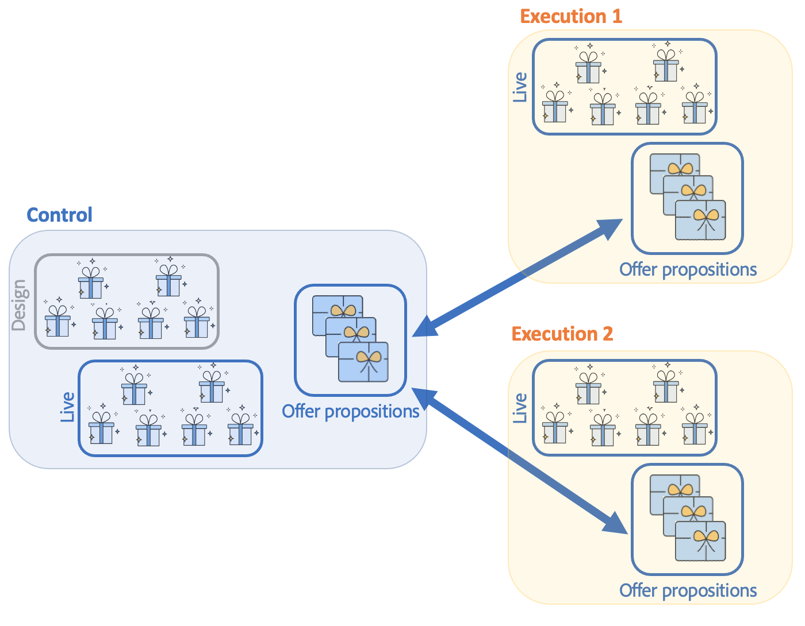

# 了解Campaign交互环境和架构

## 环境 {#environments}

管理选件时，每个定向维度都使用两个环境：

* A **设计** 选件管理器负责创建和分类选件、编辑选件，以及启动批准流程以便使用它们的环境。 此环境中还定义了每个类别的规则、可在其中显示选件的选件空间以及用于定义选件资格的预定义过滤器。

   还可以在在线环境中手动发布类别。

   详细说明了批准优惠的流程 [在此部分中](interaction-offer.md#approve-offers).

* A **live** 在环境中，可以找到设计环境中已批准的选件以及在设计环境中配置的各种选件空间、过滤器、类别和规则。 在调用选件引擎期间，引擎将始终使用实时环境中的选件。

选件仅部署在批准过程中选择的选件空间上。 因此，选件可能处于实时状态，但在同样处于实时状态的选件空间上不可用。

## 入站和出站交互 {#interaction-types}

Adobe Campaign交互模块提出了两种类型的交互：

* **入站** 由联系人发起的交互。 [了解详情](interaction-present-offers.md)
* **出站** 由促销活动投放管理器启动的交互。 [了解详情](interaction-send-offers.md)

这两种交互可以在 **统一模式** （针对单个联系人计算选件），或 **批量模式** （为一组联系人计算选件）。 通常，集客交互以统一模式进行，出站交互以批处理模式进行。 然而，可能有一些例外， [事务性消息](transactional.md) 例如，其中以单一模式执行叫客交互。

一旦能够或必须显示选件（根据执行的配置），选件引擎就会发挥中介作用：它通过组合收到的关于联系人的数据和应用程序中指定的可应用的不同规则，自动计算可用联系人的最佳可能选件。


## 分布式架构

为了能够支持可扩展性并在集客渠道24/7提供服务， **互动** 模块在分布式架构中实现。 此类架构已与 [消息中心](../dev/architecture.md#transac-msg-archi) 和由多个实例组成：

* 一个或多个专用于出站渠道并包含营销和环境设计基础的控制实例
* 专用于入站渠道的一个或多个执行实例


控制实例专用于集客渠道并包含目录的在线版本。 每个执行实例都是独立的，并且专用于一个联系人区段（例如，每个国家/地区一个执行实例）。 必须在执行时直接执行对选件引擎的调用（每个执行实例一个特定URL）。 由于实例之间的同步不是自动的，因此来自同一联系人的交互必须通过同一实例发送。

### 同步 {#synchronization}

选件同步是通过包执行的。 在执行实例中，所有目录对象都以外部帐户名称为前缀。 这意味着同一执行实例上可以支持多个控制实例（例如，开发和生产实例）。

>[!CAUTION]
>
>使用简短且明确的内部名称。

选件会自动部署，然后在执行和控制实例时发布。

在所有联机实例上，将禁用在设计环境中删除的选件。 在清除期（在每个实例的部署助手中指定）和滑动期（在传入命题的分类规则中指定）之后，将在所有实例上自动删除过时的命题和选件。



将为每个环境和外部帐户创建一个工作流，以便进行命题同步。 可以针对每个环境和外部帐户调整同步频率。

您必须了解以下同步机制：

* 如果您使用从匿名环境到已识别环境的回退函数，则这两个环境必须位于同一执行实例上。
* 多个执行实例之间的同步不会实时执行。 必须将同一联系人的交互发送到同一实例。 控制实例必须专用于出站渠道（非实时）。
* 营销数据库未自动同步。 权重和资格规则中使用的营销数据必须在执行实例上重复。 此过程不是标准的，您必须在集成期间进行开发。
* 命题同步完全由FDA连接执行。
* 如果您在同一实例上使用交互和消息中心，则在这两种情况下都将通过FDA协议进行同步。

### 包配置 {#packages-configuration}

直接链接到的任何架构扩展 **互动** （优惠、建议、收件人等） 必须在执行实例上部署。

的 **互动** 包安装在所有实例（控制和执行）上。 还提供了两个其他包：一个包用于控制实例，另一个包用于每个执行实例。

>[!NOTE]
>
>安装包时， **long** 类型字段 **nms：建议** 表（如命题标识）成为 **int64** 类型字段。 此类数据在 [Campaign Classicv7文档](https://experienceleague.adobe.com/docs/campaign-classic/using/configuring-campaign-classic/schema-reference/schema-structure.html?lang=en#mapping-the-types-of-adobe-campaign-dbms-data){target=&quot;_blank&quot;}。

在每个实例上配置数据保留持续时间(通过 **[!UICONTROL Data purge]** )。 在执行实例中，此时段必须对应于类型学规则（滑动周期）和要计算的资格规则所必需的历史深度。

在控制实例上：

1. 为每个执行实例创建一个外部帐户：

   

   * 填写标签并添加一个简短且明确的内部名称。
   * 选择 **[!UICONTROL Execution instance]**。
   * 勾选 **[!UICONTROL Enabled]** 选项。
   * 完成执行实例的连接参数。
   * 每个执行实例都必须链接到ID。 此ID是在您单击 **[!UICONTROL Initialize connection]** 按钮。
   * 检查使用的应用程序类型： **[!UICONTROL Message Center]**, **[!UICONTROL Interaction]**，或两者兼有。
   * 输入使用的FDA帐户。 必须在执行实例上创建运算符，并且必须在相关实例的数据库上具有以下读写权限：

      ```
      grant SELECT ON nmspropositionrcp, nmsoffer, nmsofferspace, xtkoption, xtkfolder TO user;
      grant DELETE, INSERT, UPDATE ON nmspropositionrcp TO user;
      ```
   >[!NOTE]
   >
   >必须在执行实例上授权控制实例的IP地址。

1. 配置环境：

   

   * 添加执行实例列表。
   * 对于每个同步周期，指定同步周期和筛选条件（例如，按国家/地区）。

      >[!NOTE]
      >
      >如果遇到错误，您可以查阅同步工作流和选件通知。 这些工作流可在应用程序的技术工作流中找到。

如果出于优化原因，执行实例上只复制了部分营销数据库，则可以指定链接到环境的受限架构，以允许用户仅使用执行实例上可用的数据。 您可以使用在执行实例中不可用的数据创建选件。 要实现此目的，您必须通过限制出站渠道(**[!UICONTROL Taken into account if]** 字段。


### 维护选项 {#maintenance-options}

以下是控制实例上可用的维护选项列表：

>[!CAUTION]
>
>这些选项只能用于特定的维护案例。

* **`NmsInteraction_LastOfferEnvSynch_<offerEnvId>_<executionInstanceId>`**:环境在给定实例上同步的上次日期。
* **`NmsInteraction_LastPropositionSynch_<propositionSchema>_<executionInstanceIdSource>_<executionInstanceIdTarget>`**:来自给定架构的建议从一个实例同步到另一个实例的最后日期。
* **`NmsInteraction_MapWorkflowId`**:一个选项，其中包含已生成的所有同步工作流的列表。

执行实例中提供以下选项：

**NmsExecutionInstanceId**:包含实例ID的选项。

### 软件包安装 {#packages-installation}

如果您的实例之前没有 **互动** 包，无需迁移。 默认情况下，建议表将在安装包后以64位为单位显示。

>[!CAUTION]
>
>根据实例中现有建议的数量，此操作可能需要一些时间。

* 如果您的实例很少或没有建议，则无需手动修改建议表。 在安装包后，将完成修改。
* 如果您的实例有许多建议，最好在安装控制包并运行它们之前更改建议表的结构。 我们建议在活动较少的时段内运行查询。

>[!NOTE]
>
>如果您在建议表中执行了特定配置，请相应地调整查询。


有两种方法：

**工作表** （推荐）

```
CREATE TABLE NmsPropositionRcp_tmp AS SELECT * FROM nmspropositionrcp WHERE 0=1;
ALTER TABLE nmspropositionrcp_tmp
  ALTER COLUMN ipropositionid TYPE bigint,
  ALTER COLUMN iinteractionid TYPE bigint;
INSERT INTO nmspropositionrcp_tmp SELECT * FROM nmspropositionrcp;
DROP TABLE nmspropositionrcp;
CREATE INDEX proposition_id ON NmsPropositionRcp (ipropositionid);
CREATE INDEX nmspropositionrcp_deliveryid ON NmsPropositionRcp (ideliveryid);
CREATE INDEX nmspropositionrcp_lastmodified ON NmsPropositionRcp (tslastmodified);
CREATE INDEX nmspropositionrcp_offerid ON NmsPropositionRcp (iofferid);
CREATE INDEX nmspropositionrcp_offerspaceid ON NmsPropositionRcp (iofferspaceid);
CREATE INDEX nmspropositionrcp_recipientidid ON NmsPropositionRcp (irecipientid);
ALTER TABLE nmspropositionrcp_tmp RENAME TO nmspropositionrcp;
```

**更改表**

```
ALTER TABLE nmspropositionrcp
  ALTER COLUMN ipropositionid TYPE bigint,
  ALTER COLUMN iinteractionid TYPE bigint;
```
