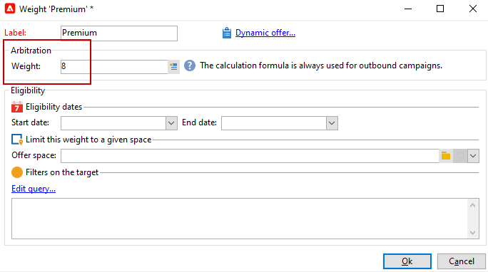

# 创建优惠

要创建优惠，请按照以下步骤操作：

1. 浏览至&#x200B;**[!UICONTROL Campaigns]**&#x200B;选项卡，然后单击&#x200B;**[!UICONTROL Offers]**&#x200B;链接。

1. 单击 **[!UICONTROL Create]** 按钮。

1. 更改标签并选择优惠应属于的类别。

1. 单击&#x200B;**[!UICONTROL Save]**&#x200B;以创建优惠。

   该优惠在平台中可用，并且可以配置其内容。

## 资格设置

您现在可以使用&#x200B;**[!UICONTROL Eligibility]**&#x200B;选项卡定义：

* 优惠的资格期。 [了解详情](#eligibility-period)
* 过滤器优惠目标。 [了解详情](#filters-on-the-target)
* 优惠权重。 [了解详情](#offer-weight)

### 优惠资格期{#eligibility-period}

在优惠的&#x200B;**[!UICONTROL Eligibility]**&#x200B;选项卡中，定义优惠的资格期。 使用下拉列表在日历中选择开始和结束日期。


在此期间之外，将不选择优惠。 如果您还为优惠类别配置了资格日期，则限制最严格的期限将适用。

### 在目标{#filters-on-the-target}上添加过滤器

在优惠的&#x200B;**[!UICONTROL Eligibility]**&#x200B;选项卡中，将过滤器应用于优惠目标。

要执行此操作，请单击&#x200B;**[!UICONTROL Edit query]**&#x200B;链接，然后选择要应用的筛选器。


如果已创建预定义过滤器，则可以从用户过滤器的列表中选择。 [了解详情](interaction-predefined-filters.md)。


### 设置优惠权重{#offer-weight}

要使引擎能够在目标符合的优惠之间做出决定，您需要为优惠分配一个或多个权重。 如有必要，您还可以将过滤器应用于目标，或限制权重将应用到的优惠空间。 较之权重较少的优惠，更青睐具有更显着权重的优惠。

您可以为同一优惠配置多个权重，例如，区分子时段、特定目标甚至优惠空间。

例如，优惠可以具有A权重（对于年龄在18到25岁之间的联系人）和B权重（对于超过该范围的联系人）。 如果优惠在整个夏季都符合条件，它还可以在7月获得A权重，在8月获得B权重。

>[!NOTE]
>
>可以根据权重所属类别的参数临时修改指定的优惠。 [了解详情](interaction-offer-catalog.md#creating-offer-categories)。

要在优惠中创建权重，请应用以下步骤：

1. 在优惠的&#x200B;**[!UICONTROL Eligibility]**&#x200B;选项卡中，单击&#x200B;**[!UICONTROL Add]**。

   

1. 更改标签并分配权重。 默认值为 1。

   

   >[!CAUTION]
   >
   >如果未输入权重(0)，则目标将不被视为有资格获得优惠。

1. 如果您希望权重在给定期间内应用，请定义资格日期。

   

1. 如有必要，将权重限制为特定优惠空间。

   

1. 对目标应用滤镜。

   

1. 单击&#x200B;**[!UICONTROL OK]**&#x200B;保存权重。

   

   >[!NOTE]
   >
   >如果目标有资格对所选优惠进行多个权重，引擎将保持最佳（最高）权重。 在调用优惠引擎时，每个联系人的优惠最多被选择一次。

### 优惠合格规则{#a-summary-of-offer-eligibility-rules}摘要

配置完成后，合格规则摘要将在优惠仪表板上可用。

要视图它，请单击&#x200B;**[!UICONTROL Schedule and eligibility rules]**&#x200B;链接。


## 创建优惠内容{#creating-the-offer-content}

使用&#x200B;**[!UICONTROL Content]**&#x200B;选项卡定义优惠内容。


1. 定义优惠内容的各种参数。

   * **[!UICONTROL Title]** :指定要在优惠中显示的标题。警告：这不是引用优惠的标签，该标签在&#x200B;**[!UICONTROL General]**&#x200B;选项卡中定义。
   * **[!UICONTROL Destination URL]** :指定优惠的URL。它必须开始为“http://”或“https://”。
   * **[!UICONTROL Image URL]** :指定优惠图像的URL或访问路径。
   * **[!UICONTROL HTML content]** /  **[!UICONTROL Text content]** :在要使用的选项卡中输入优惠的正文。要生成跟踪，**[!UICONTROL HTML content]**&#x200B;必须由HTML元素组成，这些元素可以包含在`<div>`类型元素中。 例如，HTML页中`<table>`元素的结果将如下所示：

   ```
      <div> 
       <table>
        <tr>
         <th>Month</th>
         <th>Savings</th>   
        </tr>   
        <tr>    
         <td>January</td>
         <td>$100</td>   
        </tr> 
       </table> 
      </div>
   ```

   了解如何在[本节](interaction-offer-spaces.md#configuring-the-status-when-the-proposition-is-accepted)中定义接受URL。

   

   要查找在优惠空间配置过程中定义的必填字段，请单击&#x200B;**[!UICONTROL Content definitions]**&#x200B;链接以显示列表。 [了解详情](interaction-offer-spaces.md)。

   

   在此示例中，优惠必须包括标题、图像、HTML内容和目标URL。

## 预览优惠{#previewing-the-offer}

配置优惠内容后，您可以预览优惠，就像的收件人一样。

操作步骤：

1. 单击&#x200B;**[!UICONTROL Preview]**&#x200B;选项卡。

   

1. 选择要视图的优惠的表示形式。

   

1. 如果您已个性化了优惠内容，请选择优惠目标以实现视图个性化。

   

<!--

## Create a hypothesis on an offer {#creating-a-hypothesis-on-an-offer}

You can create hypotheses on your offer propositions. This lets you determine the impact of your offers on purchases carried out for the product concerned.

>[!NOTE]
>
>These hypotheses are carried out via Response Manager. Please check your license agreement.

Hypotheses carried out on an offer proposition are referenced in their **[!UICONTROL Measure]** tab.

Creating hypotheses is detailed in [this page](../../campaign/using/about-response-manager.md).

-->

## 批准和激活优惠{#approve-offers}

您现在可以批准并激活优惠，以使其在&#x200B;**实时**&#x200B;环境中可用。

:arrow_upper_right:有关详细信息，请参阅[Campaign Classic文档](https://experienceleague.adobe.com/docs/campaign-classic/using/managing-offers/managing-an-offer-catalog/approving-and-activating-an-offer.html?lang=en#approving-offer-content)

## 管理优惠演示{#offer-presentation}

活动允许您使用推荐规则控制优惠建议流。 这些规则特定于活动交互，它们是&#x200B;**类型规则**。 它们允许您根据已向优惠提出的建议的历史来排除收件人。 它们在环境中引用。

:arrow_upper_right:有关详细信息，请参阅[Campaign Classic文档](https://experienceleague.adobe.com/docs/campaign-classic/using/managing-offers/managing-an-offer-catalog/managing-offer-presentation.html?lang=en#managing-offers)

## 优惠模拟

模拟模块允许您在将您的主张发送到收件人之前，测试属于类别或环境的优惠的分布。

模拟会考虑之前应用于优惠及其推荐规则的上下文和合格规则。 这样，您无需实际使用优惠或在征求优惠建议意见时，即可测试和优化各种目标版本，因为模拟对目标收件人没有影响。

:arrow_upper_right:有关优惠模拟的详细信息，请参阅[Campaign Classic文档](https://experienceleague.adobe.com/docs/campaign-classic/using/managing-offers/simulating-offers/about-offers-simulation.htm)
