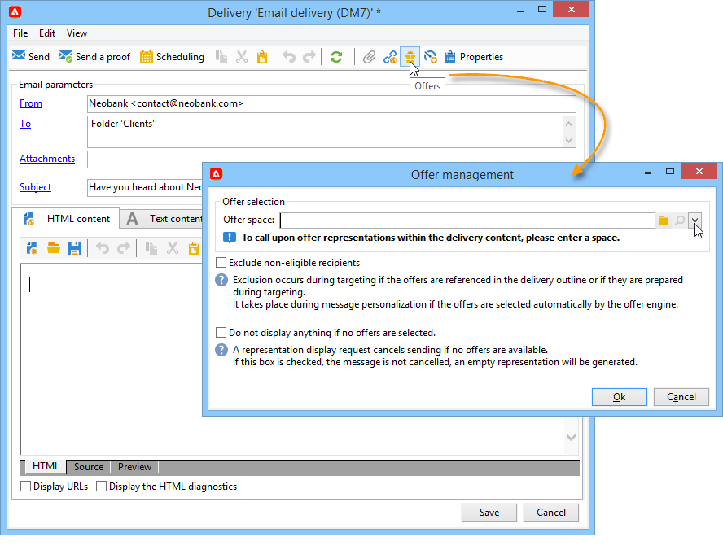

# 发送优惠

为了使优惠引擎能够选择优惠，它已在&#x200B;**实时**&#x200B;环境中被批准并可用。 [了解详情](interaction-offer.md#approve-offers)

通过出站通信渠道进行优惠演示是通过直邮、电子邮件或移动投放。 您还可以将统一模式与事务消息（消息中心）一起使用。

## 在投放{#offer-into-a-delivery}中插入优惠

要将优惠建议插入投放，请执行以下步骤：

1. 在投放窗口中，单击&#x200B;**优惠**&#x200B;图标。

   

1. 选择与您的优惠环境匹配的空间。

   

1. 要优化引擎选择的优惠，请选择要显示的优惠是其一部分的类别，或者选择一个/多个主题。 我们建议一次仅使用其中一个字段以避免超载限制。

   

   

1. 指定要插入优惠主体的投放数。

   

1. 根据需要选择&#x200B;**[!UICONTROL Exclude non-eligible recipients]**&#x200B;选项。 [了解详情](#parameters-for-calling-offer-engine)。

   

1. 如果需要，请选择&#x200B;**[!UICONTROL Do not display anything if no offers are selected]**&#x200B;选项。 [了解详情](#parameters-for-calling-offer-engine)。

   

1. 使用合并字段将属性插入投放内容。 可用建议的数量取决于引擎调用的配置方式，其顺序取决于优惠的优先级。

   

1. 完成内容，测试并发送投放。

   

### 优惠引擎{#parameters-for-calling-offer-engine}的参数

* **[!UICONTROL Space]** :优惠环境的空间，必须选择该空间才能激活优惠引擎。
* **[!UICONTROL Category]** :优惠排序的特定文件夹。如果未指定类别，则优惠引擎将考虑环境中包含的所有优惠，除非选择了主题。
* **[!UICONTROL Themes]** :在类别中定义的关键字。这些优惠用作过滤器，通过在一组类别中选择它们，您可以优化要显示的数。
* **[!UICONTROL Number of propositions]** :引擎返回的可插入优惠主体的投放数。如果未将优惠插入消息中，则仍将生成，但不显示。
* **[!UICONTROL Exclude non-eligible recipients]** :通过此选项，可以激活或取消激活排除收件人的选项，这些优惠的合格用户数量不足。符合条件的建议的数目可能低于请求的建议的数目。 如果选中此框，则收件人将从该投放中排除没有足够建议的用户。 如果您不选择此选项，这些收件人将不会被排除，但它们将没有请求的建议数。
* **[!UICONTROL Do not display anything if no offer is selected]** :此选项允许您选择在其中一项主张不存在时如何处理消息。选中此框后，将不显示缺少命题的表示，并且此命题的消息中不显示任何内容。 如果未选中该框，则消息本身在发送过程中会被取消，收件人将不再接收任何消息。

## 以工作流发送优惠

多个工作流活动允许您定义优惠的显示方式：

* 扩充
* 优惠引擎
* 单元格优惠

### 扩充 {#enrichment}

**扩充**&#x200B;活动允许您添加优惠或指向投放收件人的优惠的链接。

:arrow_upper_right:有关扩充活动的详细信息，请参阅[Campaign Classic文档](https://experienceleague.adobe.com/docs/campaign-classic/using/automating-with-workflows/targeting-activities/enrichment.html)

例如，您可以在收件人查询之前为投放数据进行扩充。

有两种方法可指定优惠建议。

* 指定优惠或优惠引擎调用。
* 引用指向优惠的链接。

#### 指定优惠或对优惠引擎的调用{#specifying-an-offer-or-a-call-to-the-offer-engine}

配置&#x200B;**查询**&#x200B;活动后：

1. 添加并打开&#x200B;**扩充**&#x200B;活动。
1. 在 **[!UICONTROL Enrichment]** 选项卡中，选择 **[!UICONTROL Add data]**。
1. 在要添加的数据类型中选择&#x200B;**[!UICONTROL An offer proposition]**。

   

1. 为将添加的命题指定标识符和标签。
1. 指定优惠选择。 有两种可能的选项：

   * **[!UICONTROL Search for the best offer in a category]** :选中此选项并指定优惠引擎调用参数(优惠空间、类别或主题、联系日期、要保留的优惠数)。引擎将根据这些参数自动计算要添加的优惠。 我们建议同时完成&#x200B;**[!UICONTROL Category]**&#x200B;或&#x200B;**[!UICONTROL Theme]**&#x200B;字段，而不是同时完成这两个字段。

      

   * **[!UICONTROL A predefined offer]** :选中此选项并指定优惠空间、特定优惠和联系日期，以直接配置要添加的优惠，无需调用优惠引擎。

      

1. 然后，配置与所选投放对应的活动渠道。 [了解详情](#offer-into-a-delivery)。

   >[!NOTE]
   >
   >可用于预览的建议的数量取决于在扩充活动中执行的配置，而不是直接在投放中执行的任何可能的配置。

#### 引用指向优惠{#referencing-a-link-to-an-offer}的链接

您还可以在&#x200B;**扩充**&#x200B;活动中引用指向优惠的链接。

为此请执行以下操作步骤：

1. 在活动的&#x200B;**[!UICONTROL Enrichment]**&#x200B;选项卡中选择&#x200B;**[!UICONTROL Add data]**。
1. 在选择要添加的数据类型的窗口中，选择&#x200B;**[!UICONTROL A link]**。
1. 选择要建立的链接类型及其目标。 在这种情况下，目标是优惠模式。

   

1. 在扩充活动(此处为收件人表)中指定入站表数据与优惠表之间的联接。 例如，您可以将优惠代码链接到收件人。

   

1. 然后，配置与所选投放对应的活动渠道。 [了解详情](#offer-into-a-delivery)。

   >[!NOTE]
   >
   >预览可用的建议数取决于投放中执行的配置。

#### 存储优惠排名和权重{#storing-offer-rankings-and-weights}

默认情况下，当使用&#x200B;**扩充**&#x200B;活动来传送优惠时，其排名和权重不会存储在命题表中。

>[!NOTE]
>
>默认情况下，**[!UICONTROL Offer engine]**&#x200B;活动会存储此信息。

但是，您可以按如下方式存储此信息：

1. 在放置在优惠之后和投放活动之前的扩充活动中创建对查询引擎的调用。 [了解详情](#specifying-an-offer-or-a-call-to-the-offer-engine)。
1. 在活动的主窗口中，选择&#x200B;**[!UICONTROL Edit additional data...]**。

   

1. 为排名添加&#x200B;**[!UICONTROL @rank]**&#x200B;列，为优惠权重添加&#x200B;**[!UICONTROL @weight]**。

   

1. 确认添加内容并保存工作流。

投放自动存储优惠的排名和权重。 此信息显示在投放的&#x200B;**[!UICONTROL Offers]**&#x200B;选项卡中。

### 优惠引擎 {#offer-engine}

**[!UICONTROL Offer engine]**&#x200B;活动还允许您在投放之前指定对优惠引擎的调用。

:arrow_upper_right:有关&#x200B;**优惠引擎**&#x200B;活动的详细信息，请参阅[Campaign Classic文档](https://experienceleague.adobe.com/docs/campaign-classic/using/automating-with-workflows/targeting-activities/offer-engine.html)

该活动与使用引擎调用的&#x200B;**扩充**&#x200B;活动具有相同的原理，通过在投放之前使用引擎计算的优惠丰富入站人口数据。

配置&#x200B;**查询**&#x200B;活动后：

1. 添加并打开&#x200B;**[!UICONTROL Offer engine]**&#x200B;活动。
1. 填写各种可用字段以指定对优惠引擎参数(优惠空间、类别或主题、联系日期、要保留的优惠数)的调用。 引擎将根据这些参数自动计算要添加的优惠。

   >[!CAUTION]
   >
   >如果您使用此活动，则只会存储投放中使用的优惠建议。

   

1. 然后，配置与所选投放对应的活动渠道。 [了解详情](#inserting-an-offer-proposition-into-a-delivery)。

### 单元格优惠 {#offers-by-cell}

**[!UICONTROL Offers by cell]**&#x200B;活动允许您将入站人口(例如，从查询)分布到多个区段，并指定每个区段显示的优惠。

:arrow_upper_right:有关&#x200B;**按单元格**&#x200B;优惠的详细信息，请参阅[Campaign Classic文档](https://experienceleague.adobe.com/docs/campaign-classic/using/automating-with-workflows/targeting-activities/offers-by-cell.html)

要执行此操作，请使用以下过程：

1. 在指定活动填充后添加&#x200B;**[!UICONTROL Offers by cell]**&#x200B;目标，然后打开它。
1. 在&#x200B;**[!UICONTROL General]**&#x200B;选项卡中，选择要显示优惠空间的优惠。
1. 在&#x200B;**[!UICONTROL Cells]**&#x200B;选项卡中，使用&#x200B;**[!UICONTROL Add]**&#x200B;按钮指定不同的子集：

   * 使用可用的过滤和限制规则指定子集填充。
   * 然后选择要向子集显示的优惠。 可用优惠是在上一步选择的优惠环境上符合条件的。

      

1. 然后，配置与所选投放对应的活动渠道。

<!--

## Delivering with delivery outlines {#delivering-with-delivery-outlines}

You can also present offers in a delivery using delivery outlines.

For more information on delivery outlines, refer to the Campaign - MRM guide.

1. Create a new campaign or access an existing campaign.
1. Access the delivery outlines via the campaign's **[!UICONTROL Edit]** > **[!UICONTROL Documents]** tab.
1. Add an outline then insert as many offers as you like into it by right-clicking on the outline and selecting **[!UICONTROL New]** > **[!UICONTROL Offer]**, then save the campaign.

1. Create a delivery whose delivery outlines you have access to (for example, a direct mail delivery).
1. When editing the delivery, click **[!UICONTROL Select a delivery outline]**.

   >[!NOTE]
   >
   >Depending on the type of delivery, this option can be found in the **[!UICONTROL Properties]** > **[!UICONTROL Advanced]** menu (for email deliveries for example).

1. Using the **[!UICONTROL Offers]** button, you can then configure the offer space as well as the number of offers to present in the delivery.

1. Add the propositions into the delivery body using the personalization fields (for more on this, refer to the [Inserting an offer proposition into a delivery](#inserting-an-offer-proposition-into-a-delivery) section), or in the case of a direct mail delivery, by editing the extraction file format.

   Propositions will be selected from the offers referenced in the delivery outline.

   >[!NOTE]
   >
   >Information regarding the offer rankings and weights is only saved in the proposition table if the offers are generated directly in the delivery.
-->
