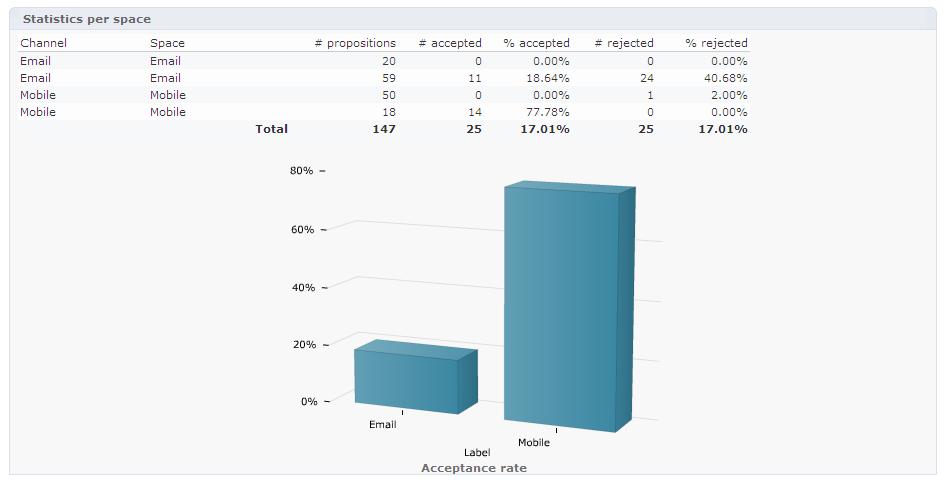

# 实时互动历史和报告

>[!NOTE]
>
>这些功能仅在线可见，且仅对 **投放管理器**.

## 优惠建议历史{#offer-proposition-history}

在您提出您的建议后，您便可以查看演示历史。

* 在选件级别，在 **[!UICONTROL Edit]** ，单击 **[!UICONTROL Propositions]**.

   

* 在收件人的用户档案中，单击 **[!UICONTROL Propositions]** 选项卡。

   

* 在选件空间级别，单击 **[!UICONTROL Propositions]** 选项卡。

   

## 优惠分析报告{#offer-analysis-report}

的 **[!UICONTROL Offer analysis]** 报表为您提供已接受或已拒绝建议的数量的概述。

统计信息按以下三个条件排序：

* 按日期：

   

* 按空格：

   

* 按投放：

   

数据可以根据报表上半部分提供的各种条件进行过滤。 选择所需的标准后，单击 **[!UICONTROL Refresh]** 链接，以将其应用到报表。
