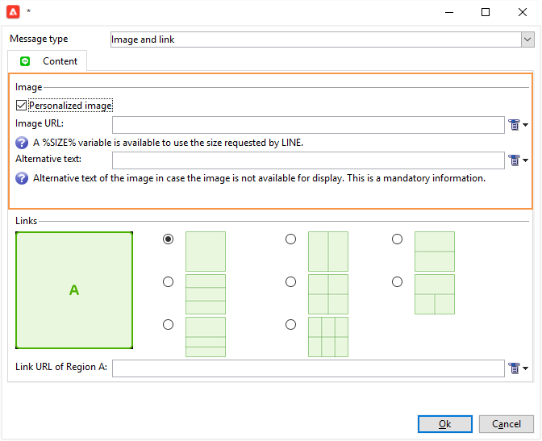

# 创建LINE投放

LINE 是一款免费即时消息、语音和视频通话应用程序，可在所有移动设备和 PC 上使用。您可以使用Adobe Campaign发送LINE消息。

[!DNL LINE]还可以与事务性消息模块结合使用，以在消费者移动设备上安装的[!DNL LINE]应用程序上发送实时消息。 有关详细信息，请参阅Campaign Classic v7文档中的此[页面](https://experienceleague.adobe.com/zh-hans/docs/campaign-classic/using/transactional-messaging/configure-transactional-messaging/transactional-messaging-architecture#transactional-messaging-and-line)。

使用[!DNL LINE]渠道的步骤如下：

1. [设置LINE渠道](#setting-up-line-channel)
1. [创建投放](#creating-the-delivery)
1. [配置内容类型](#defining-the-content)
1. [监控投放（跟踪、隔离、报告等）](#accessing-reports)

## 设置LINE渠道 {#setting-up-line-channel}

在创建[!DNL LINE]帐户和外部帐户之前，需要在实例上安装LINE包。 请联系您的Adobe代表。

您必须首先创建一个[!DNL LINE]帐户，以便随后可以将其关联到Adobe Campaign。 然后，您可以向在移动应用程序中添加了[!DNL LINE]帐户的用户发送[!DNL LINE]条消息。 外部帐户和[!DNL LINE]帐户只能由平台的功能管理员管理。

若要创建和配置[!DNL LINE]帐户，请参阅[LINE开发人员文档](https://developers.line.me/)。

### 创建和配置LINE服务 {#configure-line-service}

要创建您的[!DNL LINE]服务，请执行以下操作：

1. 从Adobe Campaign Classic主页中，选择&#x200B;**[!UICONTROL Profiles and Targets]**&#x200B;选项卡。

1. 在左侧菜单中，选择&#x200B;**[!UICONTROL Services and Subscriptions]**&#x200B;并单击&#x200B;**[!UICONTROL Create]**。

   

1. 将&#x200B;**[!UICONTROL Label]**&#x200B;和&#x200B;**[!UICONTROL Internal name]**&#x200B;添加到新服务。

1. 从&#x200B;**[!UICONTROL LINE]**&#x200B;下拉列表中选择&#x200B;**[!UICONTROL Type]**。

   

1. 单击 **[!UICONTROL Save]**。

有关订阅和服务的详细信息，请参阅[管理订阅](../../start/subscriptions.md)。

### 配置LINE外部帐户 {#configure-line-external}

创建[!DNL LINE]服务后，您需要在Adobe Campaign上配置[!DNL LINE]外部帐户：

1. 在&#x200B;**[!UICONTROL Administration]** > **[!UICONTROL Platform]**&#x200B;树结构中，单击&#x200B;**[!UICONTROL External Accounts]**&#x200B;选项卡。

1. 选择内置&#x200B;**[!UICONTROL LINE V2 routing]**&#x200B;外部帐户。

   

1. 单击外部帐户中的&#x200B;**[!UICONTROL LINE]**&#x200B;选项卡以开始配置外部帐户。 填写以下字段：

   

   * **[!UICONTROL Channel Alias]**：通过您在[!DNL LINE] > **[!UICONTROL Channels]**&#x200B;选项卡中的&#x200B;**[!UICONTROL Technical configuration]**&#x200B;帐户提供。
   * **[!UICONTROL Channel ID]**：通过您在[!DNL LINE] > **[!UICONTROL Channels]**&#x200B;选项卡中的&#x200B;**[!UICONTROL Basic Information panel]**&#x200B;帐户提供。
   * **[!UICONTROL Channel secret key]**：通过您在[!DNL LINE] > **[!UICONTROL Channels]**&#x200B;选项卡中的&#x200B;**[!UICONTROL Basic Information panel]**&#x200B;帐户提供。
   * **[!UICONTROL Access token]**：通过开发人员门户中的[!DNL LINE]帐户或通过单击&#x200B;**[!UICONTROL Get access token]**&#x200B;按钮提供。
   * **[!UICONTROL Access token expiration date]**：允许您指定Access令牌的过期日期。
   * **[!UICONTROL LINE subscription service]**：允许您指定用户将订阅的服务。

1. 完成配置后，单击 **[!UICONTROL Save]**。

1. 从&#x200B;**[!UICONTROL Explorer]**&#x200B;中，选择&#x200B;**[!UICONTROL Administration]** > **[!UICONTROL Production]** > **[!UICONTROL Technical workflows]** > **[!UICONTROL LINE workflows]**&#x200B;以检查&#x200B;**[!UICONTROL LINE V2 access token update (updateLineAccessToken)]**&#x200B;和&#x200B;**[!UICONTROL Delete blocked LINE users (deleteBlockedLineUsers)]**&#x200B;工作流是否已启动。

[!DNL LINE]现已在Adobe Campaign中配置，您可以开始创建LINE投放并发送给订阅者。

## 创建LINE传递 {#creating-the-delivery}

>[!NOTE]
>
>首次向新收件人发送[!DNL LINE]投放时，必须在投放中添加有关使用条款和同意的官方LINE消息。 在[以下链接](https://terms.line.me/OA_privacy/)上有正式消息。

要创建[!DNL LINE]投放，您必须执行以下步骤：

1. 从&#x200B;**[!UICONTROL Campaigns]**&#x200B;选项卡中，选择&#x200B;**[!UICONTROL Deliveries]**，然后单击&#x200B;**[!UICONTROL Create]**&#x200B;按钮。

   

1. 选择&#x200B;**[!UICONTROL LINE V2 delivery]**&#x200B;投放模板。

   

1. 使用&#x200B;**[!UICONTROL Label]**、**[!UICONTROL Delivery code]**&#x200B;和&#x200B;**[!UICONTROL Description]**&#x200B;标识您的投放。 如需详细信息，请参阅[此小节](../../start/create-message.md#create-the-delivery)。

1. 单击&#x200B;**[!UICONTROL Continue]**&#x200B;以创建您的投放。

1. 在投放编辑器中，选择&#x200B;**[!UICONTROL To]**&#x200B;以定位[!DNL LINE]投放的收件人。 在&#x200B;**[!UICONTROL Visitor subscriptions (nms:visitorSub)]**&#x200B;上执行定位。

   有关详细信息，请参见[此页面](../../audiences/target-mappings.md)。

   

1. 单击&#x200B;**[!UICONTROL Add]**&#x200B;以选择您的&#x200B;**[!UICONTROL Delivery target population]**。

   

1. 选择是要直接定位[!DNL LINE]订阅者，还是要根据用户的[!DNL LINE]订阅定位用户，然后单击&#x200B;**[!UICONTROL Next]**。 在此示例中，我们选择了&#x200B;**[!UICONTROL By LINE V2 subscription]**。

1. 在&#x200B;**[!UICONTROL Line-V2]**&#x200B;下拉列表中选择&#x200B;**[!UICONTROL Folder]**，然后选择[!DNL LINE]服务。 单击&#x200B;**[!UICONTROL Finish]**，然后单击&#x200B;**[!UICONTROL Ok]**&#x200B;以开始个性化您的投放。

   

1. 在投放编辑器中，单击&#x200B;**[!UICONTROL Add]**&#x200B;以添加一条或多条消息并选择&#x200B;**[!UICONTROL Content type]**。

   有关可用的其他&#x200B;**[!UICONTROL Content type]**&#x200B;的详细信息，请参阅[定义内容类型](#defining-the-content)。

   

1. 正确创建和配置投放后，可将其发送到之前定义的目标。

   有关发送投放的详细信息，请参阅[发送邮件](../configure-and-send.md)。

1. 发送邮件后，访问报告以衡量投放的有效性。

   有关[!DNL LINE]报告的详细信息，请参阅[访问报告](#accessing-reports)。

## 定义内容类型 {#defining-the-content}

要定义[!DNL LINE]投放的内容，您必须先向投放添加消息类型。 每个[!DNL LINE]投放最多可包含5条消息。

您可以在三种消息类型之间进行选择：

* [文本消息](#configuring-a-text-message-delivery)
* [图像和链接](#configuring-an-image-and-link-delivery)
* [视频消息](#configuring-a-video-message-delivery)

### 配置短信投放 {#configuring-a-text-message-delivery}

>[!NOTE]
>
>`<%@ include option='NmsServer_URL' %>/webApp/APP3?id=<%=escapeUrl(cryptString(visitor.id))%>`语法允许您在LINE消息中包含指向Web应用的链接。

**[!UICONTROL Text message]** [!DNL LINE]投放是以文本形式发送给收件人的邮件。

此类型邮件的配置类似于电子邮件中&#x200B;**[!UICONTROL Text]**&#x200B;的配置。 有关详细信息，请参阅此[页面](../defining-the-email-content.md#message-content)。

### 配置图像和链接投放 {#configuring-an-image-and-link-delivery}

**[!UICONTROL Image and link]** [!DNL LINE]投放是以图像的形式发送给收件人的消息，其中可能包含一个或多个URL。

您可以使用：

* a **[!UICONTROL Personalized image]**，

  >[!NOTE]
  >
  >您可以使用&#x200B;**%SIZE%**&#x200B;变量根据收件人移动设备的屏幕大小优化图像显示。

  

* 每个设备屏幕大小为&#x200B;**[!UICONTROL Image URL]**，

  

  **[!UICONTROL Define images per device screen size]**&#x200B;选项允许您使用不同的图像分辨率来优化移动设备上投放的可见性。 仅支持具有相同高度和宽度的图像。

  可根据屏幕大小定义图像：

   * 1040像素
   * 700像素
   * 460像素
   * 300像素
   * 240像素

  >[!CAUTION]
  >
  >每个具有链接的LINE映像都必须具有1040x1040像素大小。

  然后，您必须添加将在收件人的移动设备上弹出的替换文本。

* 和&#x200B;**[!UICONTROL Links]**。

  **[!UICONTROL Links]**&#x200B;部分允许您在不同的布局之间进行选择，这些布局会将您的图像划分为多个可单击区域。 然后，您可以为每个用户分配一个专用的&#x200B;**[!UICONTROL Link URL]**。

  

### 配置视频消息投放 {#configuring-a-video-message-delivery}

**[!UICONTROL Video message]** [!DNL LINE]投放是以视频形式发送给收件人的消息，其中可包含URL。

**[!UICONTROL Preview Image URL]**&#x200B;字段允许您添加字符限制为1000的预览图像的URL。 支持JPEG和PNG，文件大小限制为1 MB。

**[!UICONTROL Video Image URL]**&#x200B;字段允许您添加视频文件的URL，字符限制为1000。 仅支持mp4格式，文件大小限制为200 MB。

请注意，在某些设备上播放宽视频或高视频时，可能会裁剪这些视频。

## 访问报告 {#accessing-reports}

发送投放后，您可以从[!DNL LINE]通过菜单&#x200B;**[!UICONTROL Campaign Management]** > **[!UICONTROL Deliveries]**&#x200B;查看&#x200B;**[!UICONTROL Explorer]**&#x200B;报告。

>[!NOTE]
>
>跟踪报表指示点进率。 [!DNL LINE]未将未结汇率考虑在内。

对于[!DNL LINE]服务报告，请从&#x200B;**[!UICONTROL Profiles and Targets]**&#x200B;选项卡访问菜单&#x200B;**[!UICONTROL Services and Subscriptions]** > **[!UICONTROL LINE-V2]** > **[!UICONTROL Explorer]**。 然后单击&#x200B;**[!UICONTROL Reports]**&#x200B;服务中的[!DNL LINE]图标。

## 示例：创建和发送个性化LINE消息 {#example--create-and-send-a-personalized-line-message}

在本例中，我们将创建和配置一条文本消息以及包含将根据收件人进行个性化的数据的图像。

1. 通过单击[!DNL LINE]选项卡中的&#x200B;**[!UICONTROL Create]**&#x200B;按钮创建您的&#x200B;**[!UICONTROL Campaign]**&#x200B;投放。

   

1. 选择&#x200B;**[!UICONTROL LINE V2 delivery]**&#x200B;投放模板并命名您的投放。

   

1. 在投放的配置窗口中，选择目标群体。

   有关详细信息，请参阅[识别目标群体](../../start/create-message.md#target-population)。

   

1. 单击&#x200B;**[!UICONTROL Add]**&#x200B;以创建您的消息并选择&#x200B;**[!UICONTROL Content type]**。

   在此，我们首先要创建&#x200B;**[!UICONTROL Text message]**。

   

1. 将光标放在要插入个性化文本的位置，并单击下拉图标，然后选择&#x200B;**[!UICONTROL Visitor]** > **[!UICONTROL First name]**。

   

1. 按照相同的过程添加图像，在&#x200B;**[!UICONTROL Image and links]**&#x200B;下拉列表中选择&#x200B;**[!UICONTROL Message type]**。

   添加您的&#x200B;**[!UICONTROL Image URL]**。

   

1. 在&#x200B;**[!UICONTROL Links]**&#x200B;部分中，选择将图像划分为多个可单击区域的布局。

1. 为图像的每个区域分配一个URL。

   

1. 保存您的投放，然后单击&#x200B;**[!UICONTROL Send]**&#x200B;进行分析并将其发送到目标。

   将投放发送到目标。

   

