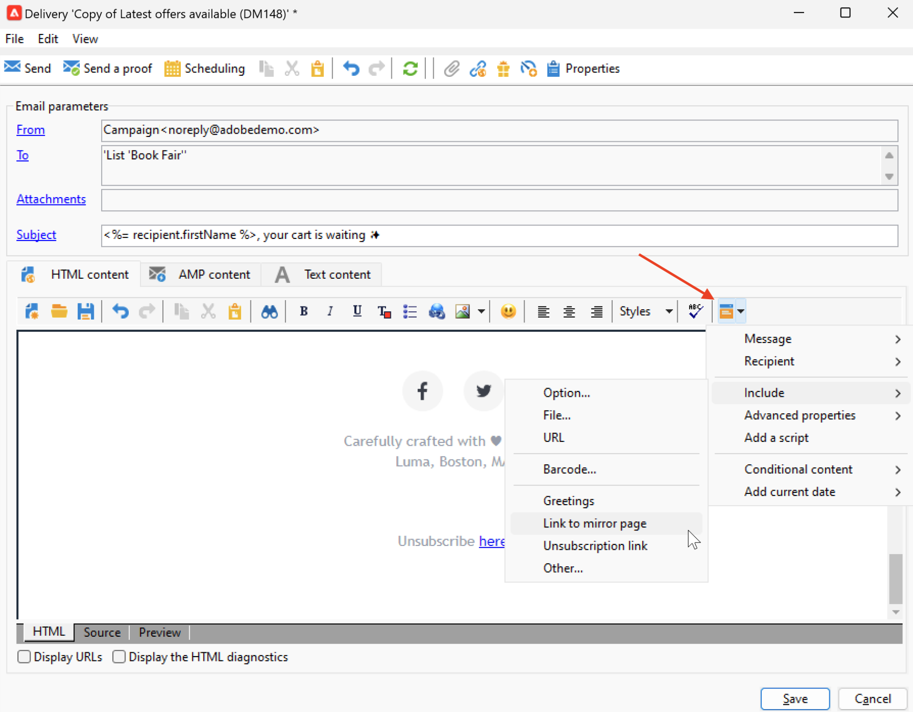

# 链接到镜像页面{#mirror-page}

## 關於映象頁面{#about-mirror-page}

镜像页面是电子邮件的在线版本。

大多数电子邮件客户端可以轻松渲染图像，但出于安全原因，某些预设可以避免显示图像。例如，如果用户尝试在收件箱中查看电子邮件时遇到渲染问题或损坏的图像，则可以浏览到电子邮件的镜像页面。此外，建议提供在线版本以方便访问或鼓励社交共享。

Adobe Campaign 生成的镜像页面包含所有个性化数据。

{width="600" align="left"}

## 添加指向镜像页面的链接{#link-to-mirror-page}

插入指向镜像页面的链接是一种好的做法。例如，此链接可以是“在浏览器中查看此电子邮件”或“在线阅读此电子邮件”。它通常位于电子邮件的页眉或页脚。

在 Adobe Campaign 中，您可以使用专用&#x200B;**个性化块**&#x200B;在电子邮件内容中插入指向镜像页面的链接。内置的&#x200B;**指向镜像页面的链接**&#x200B;个性化块会在电子邮件内容中插入以下代码：`<%@ include view='MirrorPage' %>`。

{width="800" align="left"}

如需自訂內容區塊插入的詳細資訊，請參閱 [個人化區塊](personalization-blocks.md).

## 镜像页面生成{#mirror-page-generation}

默认情况下，如果电子邮件内容不为空，并且包含指向镜像页面的链接（也称为镜像链接），则 Adobe Campaign 会自动生成镜像页面。

您可以控制电子邮件镜像页面的生成方式。投放属性中提供了选项。若要存取這些選項：

1. 瀏覽至 **[!UICONTROL Validity]** 電子郵件屬性的索引標籤。
1. 在 **映象頁面管理** 區段，核取 **[!UICONTROL Mode]** 下拉式清單。

{width="800" align="left"}

除了預設模式之外，還提供下列選項：

* **[!UICONTROL Force the generation of the mirror page]**：使用此模式可產生映象頁面，即使傳送中未插入映象頁面的連結亦然。
* **[!UICONTROL Do not generate the mirror page]**：使用此模式可避免產生映象頁面，即使連結存在於傳送中亦然。
* **[!UICONTROL Generates a mirror page accessible using only the message identifier]**：當電子郵件內容中不存在映象頁面連結時，請使用此選項在傳送記錄視窗中啟用對映象頁面內容的存取，如下所述。

## 檢查收件者的映象頁面{#mirror-page-access}

您可以存取傳送特定收件者的映象頁面內容，其中包含個人化資料。

若要存取此映象頁面：

1. 傳送傳遞後，請開啟並瀏覽至其 **[!UICONTROL Delivery]** 標籤。

1. 選取收件者並按一下 **[!UICONTROL Display the mirror page for this message...]** 連結。

   {width="800" align="left"}

   映象頁面會顯示在專用畫面中，其中包含所選收件者的個人化資料。
