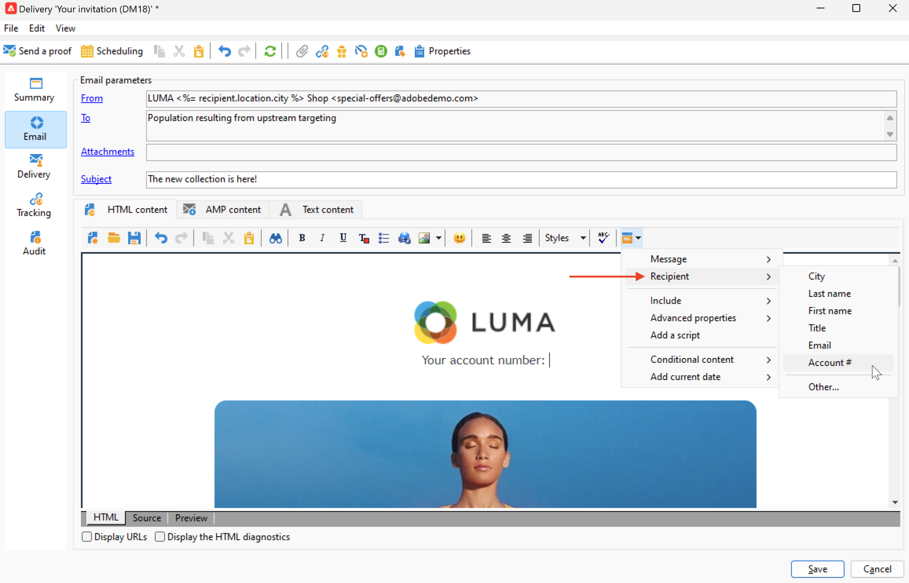

# Personalization数据源{#personalization-data}

Personalization数据可从各种类型的源中检索：Campaign数据库数据源、外部文件数据源或外部数据库数据源。

## Campaign数据库数据源

在最常见的情况下，个性化数据存储在数据库中。 例如，“收件人个性化字段”是指在收件人表中定义的所有字段、标准字段（通常为：姓氏、名字、地址、城市、出生日期等）或自定义字段。

电子邮件中的

## 外部文件数据源

您可以使用包含列中所定义的所有字段的外部文件。 此文件在消息投放定义期间用作输入。 您可以选择是否在数据库中插入这些配置文件。

要选择用作数据源的文件，请浏览到消息创建窗口中的“收件人”链接，并选择&#x200B;**在外部文件中定义**&#x200B;选项。 加载文件后，从文件&#x200B;**条目的**&#x200B;字段访问个性化选项中的收件人数据。

## FDA数据源

可以通过[联合数据访问](../connect/fda.md)从外部表中提取Personalization数据。  如果要使用外部数据库中的数据在投放中进行个性化，请收集要在工作流中使用的数据，以使其在临时表中可用。

要执行此操作，请在定位工作流中添加&#x200B;**查询**&#x200B;活动，并使用&#x200B;**添加数据……**&#x200B;链接选择外部数据库。 详细进程在[此部分](../../automation/workflow/query.md#adding-data)中提供。

然后，使用临时表中的数据将投放个性化。 配置查询活动后，从&#x200B;**Target扩展**&#x200B;条目访问个性化选项中的外部数据。

来自外部数据库的

在使用FDA中访问的外部数据时，建议使用&#x200B;**使用工作流**&#x200B;选项准备个性化数据，在专用工作流中预处理消息个性化，如下所述。

### 优化个性化 {#optimize-personalization}

您可以使用投放属性的&#x200B;**[!UICONTROL Analysis]**&#x200B;选项卡中提供的专用选项&#x200B;**[!UICONTROL Prepare the personalization data with a workflow]**&#x200B;来优化个性化。

在投放分析期间，此选项会自动创建和执行工作流，该工作流会将链接到目标的所有数据（包括来自FDA中链接的表的数据）存储在临时表中。

选中此选项可以极大地改进处理大量数据时的投放分析性能，尤其是当个性化数据通过FDA来自外部表时。 [了解详情](../connect/fda.md)。

要使用此选项，请执行以下步骤：

1. 创建营销策划。
1. 在营销活动的&#x200B;**[!UICONTROL Targeting and workflows]**&#x200B;选项卡中，将&#x200B;**查询**&#x200B;活动添加到您的工作流。
1. 将&#x200B;**[!UICONTROL Email delivery]**&#x200B;活动添加到工作流并打开它。
1. 转到&#x200B;**[!UICONTROL Delivery properties]**&#x200B;的&#x200B;**[!UICONTROL Analysis]**&#x200B;选项卡并选择&#x200B;**[!UICONTROL Prepare the personalization data with a workflow]**&#x200B;选项。
1. 配置投放并启动工作流以启动分析。

分析完成后，个性化数据会通过分析期间动态创建的临时技术工作流存储在临时表中。

此工作流在Adobe Campaign界面中不可见。 它仅用于作为快速存储和处理个性化数据的技术手段。

分析完成后，转到工作流&#x200B;**[!UICONTROL Properties]**&#x200B;并选择&#x200B;**[!UICONTROL Variables]**&#x200B;选项卡。 在这里，您可以看到可用于进行SQL调用的临时表的名称，以显示它包含的ID。

## 工作流中的Personalization数据

在工作流上下文中创建投放时，您可以使用临时工作流表中的数据。 存储在工作流临时工作表中的数据可用于个性化任务。 数据可用于个性化字段。

此数据在&#x200B;**[!UICONTROL Target extension]**&#x200B;菜单中分组。 有关详细信息，请参阅[此部分](../../automation/workflow/use-workflow-data.md#target-data)。
