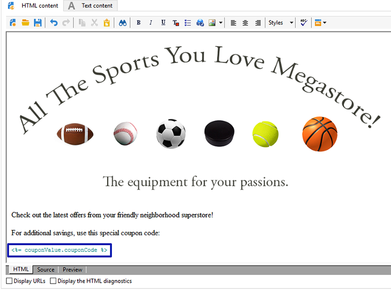

# 个性化产品建议券{#personalized-coupons}

向投放添加优惠券可增强收件人的产品和服务价值。 您可以使用Campaign优惠券模块创建一组优惠券，并预计将其添加到即将推出的营销优惠中。 当您准备好创建投放时，请分配适用的优惠券。 由于优惠券在特定时段内有效，因此分配的优惠券将唯一链接到其投放消息。 此外，Campaign会确认在发送投放之前有足够的邮件数优惠券。

>[!AVAILABILITY]
>
>优惠券管理在Campaign v8的企业(FFDA)部署上下文中不可用。 请参阅[Campaign v8文档](../architecture/enterprise-deployment.md)以了解详情。

优惠券管理依赖于必须安装的包。 要确认您拥有优惠券管理，请选中&#x200B;**[!UICONTROL Administration > Configuration > Package management > Installed packages.]**

优惠券数据可以使用CSV和XML格式导入和导出。 [了解详情](../../platform/using/get-started-data-import-export.md)。

## 创建优惠券 {#creating-a-coupon}

创建优惠券时，“优惠券管理”模块为您提供了两个选项：

* **匿名**：选定收件人或收件人列表的通用优惠券。
* **个人**：为选定收件人提供的个性化优惠券。

在执行以下步骤之前，请确保您知道要创建的优惠券类型。

1. 在营销活动树中，转到&#x200B;**[!UICONTROL Resources > Campaign management > Coupons]**。

   

1. 单击 **[!UICONTROL New]** 按钮。
1. 在&#x200B;**[!UICONTROL Label]**&#x200B;字段中输入优惠券的名称。 已在&#x200B;**[!UICONTROL Coupon code]**&#x200B;中自动输入唯一代码。 您可以保留代码或输入新代码。

   

1. 选择&#x200B;**[!UICONTROL Start date]**&#x200B;和&#x200B;**[!UICONTROL End date]**&#x200B;以设置优惠券的有效期限。
1. 在&#x200B;**[!UICONTROL Coupon type]**&#x200B;中，选择“匿名”或“个人”。

   **[!UICONTROL Anonymous coupons]** ：匿名优惠券对所有收件人都相同。 确认在&#x200B;**优惠券类型**&#x200B;菜单中选择匿名，然后单击&#x200B;**保存**&#x200B;以生成优惠券。

   **[!UICONTROL Individual coupons]** ：可使用附加优惠券代码进一步个性化单个优惠券。 例如，为体育器材商店的销售创建单个优惠券。 然而，获奖者名单很长，而且他们对一项体育运动没有同样的热情。 您可以根据运动（例如足球、足球、棒球等）为各个优惠券添加代码名称，并将每个代码发送给适用的收件人。

   1. 选择“个人”时，左下方将显示一个新选项卡“优惠券”。 转到&#x200B;**[!UICONTROL Coupons]**&#x200B;选项卡并单击&#x200B;**[!UICONTROL Add]**。
   1. 在弹出窗口提示时，为各个优惠券输入唯一代码。
   1. 单击&#x200B;**[!UICONTROL Save]**&#x200B;以生成优惠券。

   有关“优惠券”选项卡的更多详细信息，请参阅[配置单个优惠券](#configuring-individual-coupons)。

   >[!NOTE]
   >
   >可以批量导入单个优惠券。 有关导入和导出的详细信息，请参阅[此部分](../../platform/using/get-started-data-import-export.md)。

### 配置单个优惠券 {#configuring-individual-coupons}

“优惠券”选项卡仅适用于“个人优惠券”。 将优惠券与投放关联后，“优惠券”选项卡会提供以下详细信息：

* **[!UICONTROL Status]** ：优惠券可用性。
* **[!UICONTROL Redeemed on]** ：兑换优惠券的日期。
* **[!UICONTROL Channel]** ：用于发送优惠券的渠道。
* **[!UICONTROL Address]** ：收件人的电子邮件地址。

**[!UICONTROL status]**、**[!UICONTROL channel]**&#x200B;和&#x200B;**[!UICONTROL address]**&#x200B;的值已自动完成。 但是，Campaign不会恢复&#x200B;**[!UICONTROL redeemed on]**&#x200B;的值。 可以通过导入包含优惠券兑换详细信息的文件来完成这些操作。

## 在电子邮件投放中插入优惠券 {#inserting-a-coupon-into-an-email-delivery}

在下面的示例中，从主页创建投放。 有关如何创建投放的详细说明，请参阅[此章节](about-email-channel.md)。 您还可以在工作流中为投放添加优惠券。

1. 转到&#x200B;**[!UICONTROL Campaigns]**&#x200B;并选择&#x200B;**[!UICONTROL Deliveries]**。
1. 单击 **[!UICONTROL Create]**。

   

1. 在&#x200B;**[!UICONTROL Label]**&#x200B;中输入名称并单击&#x200B;**[!UICONTROL Continue]**。
1. 单击&#x200B;**[!UICONTROL To]**&#x200B;添加收件人。
1. 单击&#x200B;**[!UICONTROL Add]**&#x200B;以选择投放的收件人。 选择收件人后，单击&#x200B;**[!UICONTROL Ok]**&#x200B;以返回投放。

   

1. 输入主题并向消息中添加内容。

   

1. 在工具栏中，单击&#x200B;**[!UICONTROL Properties]**&#x200B;并选择&#x200B;**[!UICONTROL Advanced]**&#x200B;选项卡。
1. 单击&#x200B;**[!UICONTROL Coupon management]**&#x200B;的文件夹图标。

   

1. 选择优惠券并单击&#x200B;**[!UICONTROL Ok]**。 再次单击&#x200B;**[!UICONTROL Ok]**。

   

1. 单击消息以选择要放置优惠券的位置。

   

1. 单击个性化图标，根据优惠券类型选择以下选项之一：

   * 匿名优惠券： **[!UICONTROL Coupon > Coupon code]**

     

   * 单个优惠券： **[!UICONTROL Coupon value > Coupon code]**

     

     优惠券将作为代码插入消息中，而不是插入您分配的名称中。 该代码在Campaign ootb数据模型中使用。

   

1. 运行测试以确认您分配给优惠券的名称。 转到&#x200B;**[!UICONTROL Preview]**&#x200B;选项卡并单击&#x200B;**[!UICONTROL Test personalization]**。 选择测试的收件人。

   

   测试后，优惠券应显示为分配的名称而不是代码。

   

1. 在工具栏中，单击&#x200B;**[!UICONTROL Send]** （左上方）并选择发送投放的方式。

   

1. 单击 **[!UICONTROL Analyze]**。如果分析日志确认所有收件人有足够的赠券，请单击&#x200B;**[!UICONTROL Confirm delivery]**&#x200B;发送该赠券。

   

>[!NOTE]
>
>有关如何管理投放不足的优惠券的说明，请参阅[管理不足的优惠券](#managing-insufficient-coupons)

要确认投放是否成功，请执行以下操作：

1. 转到&#x200B;**[!UICONTROL Explorer > Resources > Campaign management > Coupons]**。
1. 单击&#x200B;**[!UICONTROL Deliveries]**&#x200B;选项卡。

   

   成功投放的状态显示为&#x200B;**[!UICONTROL Finished]**。

>[!NOTE]
>
>默认情况下，优惠券管理模块使用&#x200B;**nms:recipient**&#x200B;表。 [了解详情](../../configuration/using/about-data-model.md#default-recipient-table)。
>
>在此页面[中了解如何使用自定义收件人表](../../configuration/using/about-custom-recipient-table.md)。

## 管理优惠券不足 {#managing-insufficient-coupons}

如果优惠券少于消息，则投放分析停止。 在这种情况下，您可以导入更多优惠券或限制消息数量。 如果要限制消息数量，请按照下面的说明操作。

1. 转到电子邮件投放窗口。
1. 单击 **[!UICONTROL To]**。
1. 在&#x200B;**[!UICONTROL Select target]**&#x200B;中，转到&#x200B;**[!UICONTROL Exclusions]**&#x200B;选项卡。

   

1. 在排除设置部分，单击&#x200B;**[!UICONTROL Edit]**。
1. 输入要在&#x200B;**[!UICONTROL Limit delivery to...messages]**&#x200B;中发送的邮件数，然后单击&#x200B;**[!UICONTROL Ok]**。 您可以发送投放。

   

>[!NOTE]
>
>在管理有限数量的优惠券时，可通过投放工作流根据您的条件拆分投放。 如果要向选定的群体发送优惠券而不限制目标，则这是一个很好的选项。
