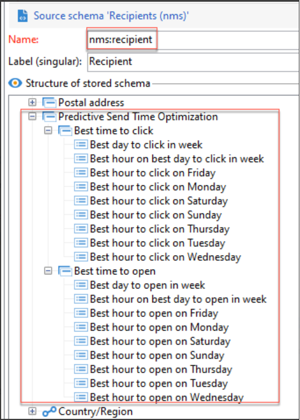

# 傳送時間最佳化和預測性參與計分{#optimize-message-delivery}

Adobe Campaign的傳送時間最佳化和預測性參與計分功能採用AI和機器學習，可以根據歷史參與量度來分析和預測開放率、最佳傳送時間和可能的流失率。

Adobe Campaign提供兩種新的機器學習模型： [預測性傳送時間最佳化](#predictive-send) 和 [預測性參與計分](#predictive-scoring). 這兩種模型都是機器學習模型，專門用於設計和提供更好的客戶歷程。

>[!CAUTION]
>
>此功能并非作为产品的一部分现成可用。它僅適用於執行Adobe Campaign Classic v7或Adobe Campaign v8的Adobe Campaign Managed Cloud Services客戶。
>
>实施需要咨询 Adobe。如需詳細資訊，請聯絡您的Adobe代表。

## 预测发送时间优化{#predictive-send}

預測性傳送時間最佳化可預測每個電子郵件開啟或點按以及推送訊息開啟的收件者設定檔的最佳傳送時間。 对于每个收件人用户档案，分数表示每个工作日的最佳发送时间以及用于获取最佳结果的最佳发送工作日。

在「預測性傳送時間最佳化」模型中，有兩個子模型：

* 打开的预测发送时间是必须向客户发送通信以最大化打开数的最佳时间

* 单击的预测发送时间是必须向客户发送通信以最大化点击数的最佳时间

**模型輸入**：傳遞記錄、追蹤記錄和設定檔屬性（非PII）

**模型輸出**：傳送訊息的最佳時機（針對開啟和點按）

输出详细信息:

* 计算一周 7 天内发送电子邮件的最佳时间（间隔时间为 1 小时）（例如：上午 9:00，上午 10:00，上午11:00）
* 该模型将指示一周中的最佳一天和当天的最佳时刻
* 每个最佳时间会计算两次：一次用于最大化打开率，一次用于最大化点击率
* 给定 16 个字段（14 个字段用于一周的天数，2 个字段用于整周）：
   * 发送电子邮件以优化星期一的点击数的最佳时间 - 值介于 0 和 23 之间
   * 发送电子邮件以优化星期一的打开数的最佳时间 - 值介于 0 和 23 之间
   * ...
   * 发送电子邮件以优化星期天的点击数的最佳时间 - 值介于 0 和 23 之间
   * 发送电子邮件以优化星期天的打开数的最佳时间 - 值介于 0 和 23 之间
   * ...
   * 发送电子邮件以优化整周的打开数的最佳日期 - 星期一到星期天
   * 发送电子邮件以优化整周的打开数的最佳时间 - 值介于 0 和 23 之间

預測性傳送時間最佳化儲存在設定檔層級：

>[!NOTE]
>
>该模型需要至少一个月的数据才能产生显著效果。這些預測性功能僅適用於電子郵件和推播頻道。

## 预测参与度评分 {#predictive-scoring}

預測性參與計分可預測收件者與訊息互動的可能性，以及在下次傳送電子郵件後7天內選擇退出（取消訂閱）的可能性。 根據與您內容的預測參與程度，這些機率進一步分成貯體：高、中或低。 這些模型也會提供取消訂閱風險百分位數排名，讓客戶瞭解特定客戶的排名與其他客戶的關聯性。

预测参与度评分使您能够：

* **选择受众**：通过使用查询活动，可以选择要与特定消息交互的受众
* **排除受众**：通过使用查询活动，可以删除要取消订阅的受众
* **个性化**：根据参与度级别对消息进行个性化（高度参与的用户将获取与未参与的用户不同的消息）

此模型使用多个分数来指示：

* **打开参与度分数/点击参与度分数**：该值与订阅者将与特定消息进行交互（打开或点击）的概率匹配。值的范围为 0.0 到 1.0。
* **取消订阅概率**：该值与收件人从电子邮件渠道取消订阅（假设已打开一封电子邮件）的概率匹配。值的范围为 0.0 到 1.0。
* **保留级别**：该值将用户分为三个级别：低、中、高。高表示最有可能坚持使用该品牌，值为低表示可能取消订阅。
* **保留的百分等级**：根据取消订阅概率而定的用户档案等级。值的范围为 0.0 到 1.0。例如，如果保留百分比等级为 0.953，则此收件人很可能坚持使用该品牌，而取消订阅的可能性则小于所有收件人的 95.3%。

>[!NOTE]
>
>这些预测功能仅适用于电子邮件投放。
>
>该模型需要至少一个月的数据才能产生显著效果。

**模型输入**：投放日志、跟踪日志和特定用户档案属性

**模型输出**：用于描述用户档案分数和类别的用户档案属性
