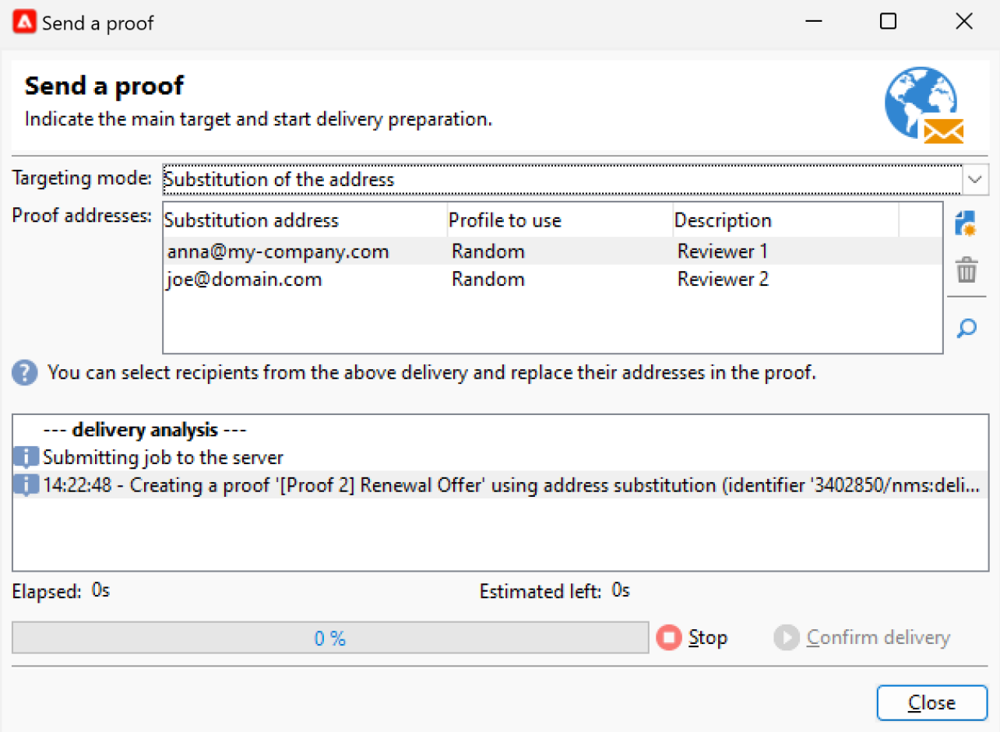

# 预览和测试电子邮件 {#preview-test}

定义消息内容后，您可以使用测试用户档案对其进行预览和测试。 如果插入[个性化内容](personalize.md)，则可以使用测试用户档案数据检查此内容在消息中的显示方式。 此外，要检测消息内容或个性化设置中可能出现的错误，请向测试用户档案发送校样。 每次进行更改时都应发送校样，以验证最新内容。

## 内容预览 {#preview-content}

在发送校样之前，最佳做法是在投放窗口的预览部分中检查消息内容。

要预览消息内容，请执行以下步骤：

1. 浏览到投放的&#x200B;**预览**&#x200B;选项卡。
1. 单击&#x200B;**[!UICONTROL Test personalization]**&#x200B;按钮以选择用于填充个性化数据的配置文件。 您可以在数据库中选择特定收件人、种子地址或从目标群体中选择用户档案（如果已定义）。 您还可以检查内容而不进行个性化。

   

1. 将生成预览，以便您检查消息渲染。 在消息预览中，个性化的元素被替换为选定的测试用户档案数据。

   

1. 选择其他测试用户档案以预览消息的每个变体的电子邮件渲染。

## 发送校样 {#send-proofs}

对于电子邮件投放，您可以发送校样以验证消息内容。 通过发送校样，可检查选择退出链接、镜像页面和任何其他链接、验证消息、验证是否显示图像、检测可能存在的错误等。 您可能还希望检查您的设计和在不同设备上的渲染。

利用校样这种特定的消息，可在将消息发送给主受众之前对消息进行测试。 校样的收件人负责批准消息：呈现、内容、个性化设置、配置。

### 校对收件人 {#proofs-recipients}

验证目标可以在投放模板中定义，或特定于投放。 在这两种情况下，都从&#x200B;**[!UICONTROL To]**&#x200B;链接浏览到目标定义屏幕，并选择&#x200B;**[!UICONTROL Target of the proofs]**&#x200B;选项卡。

从&#x200B;**[!UICONTROL Targeting mode]**&#x200B;下拉列表中选择了校对目标的类型。

* 使用&#x200B;**[!UICONTROL Definition of a specific proof target]**&#x200B;选项选择数据库中的收件人作为验证目标。
* 使用&#x200B;**[!UICONTROL Substitution of the address]**选项输入电子邮件地址并使用目标收件人数据验证内容。 可以手动输入替代地址，也可以从下拉列表中选择替代地址。 关联的枚举是替换地址(rcpAddress)。
默认情况下，会随机执行替换，但您可以通过**[!UICONTROL Detail]**&#x200B;图标从主目标中选择特定收件人。

  {width="800" align="left"}

  选择&#x200B;**[!UICONTROL Select a profile (must be included in the target)]**&#x200B;选项并选择收件人。

  {width="800" align="left"}

* 使用&#x200B;**[!UICONTROL Seed addresses]**&#x200B;选项将种子地址用作验证目标。 这些地址可以从文件导入或手动输入。

  >[!NOTE]
  >
  >种子地址不属于默认收件人表(nms：recipient)，而是在单独的表中创建的。 如果使用新数据扩展收件人表，则还必须使用相同数据扩展种子地址表。

  在[本节](../audiences/test-profiles.md)中了解有关种子地址的更多信息。

* 使用&#x200B;**[!UICONTROL Specific target and Seed addresses]**&#x200B;选项将种子地址和特定的电子邮件地址组合在一起。 随后，将在两个单独的子选项卡中定义相关配置。

### 发送校样 {#proofs-send}

要发送消息校样，请执行以下步骤：

1. 在消息定义屏幕中，单击&#x200B;**[!UICONTROL Send a proof]**&#x200B;按钮。
1. 从&#x200B;**[!UICONTROL Send a proof]**&#x200B;窗口中，检查校样收件人。
1. 单击&#x200B;**[!UICONTROL Analyze]**&#x200B;开始准备校对邮件。

   {width="800" align="left"}

1. 投放准备完成后，使用&#x200B;**[!UICONTROL Confirm delivery]**&#x200B;开始发送校样消息。

浏览到投放的&#x200B;**[!UICONTROL Audit]**&#x200B;选项卡以检查证明副本的投放。

建议在每次修改消息内容后发送校样。

>[!NOTE]
>
>在发送的验证中，指向镜像页面的链接无效。 它仅在最终邮件中激活。

### 校对属性 {#proofs-properties}

验证属性在投放属性窗口的&#x200B;**[!UICONTROL Advanced]**&#x200B;选项卡中设置。 浏览到&#x200B;**[!UICONTROL Proof properties...]**&#x200B;链接以定义参数和校样的标签。 您可以选择保留：

* 验证中的地址重复
* 证明中的列入阻止列表地址
* 验证中的隔离地址

默认情况下，验证邮件由主题中的`Proof #N`提及来标识，其中`N`是验证号。 此数字随每个证明投放分析递增。 您可以根据需要更改`proof`前缀。

{width="800" align="left"}

## 操作说明视频 {#video-proof}

了解如何为电子邮件投放发送并验证校样。

>[!VIDEO](https://video.tv.adobe.com/v/333404)
