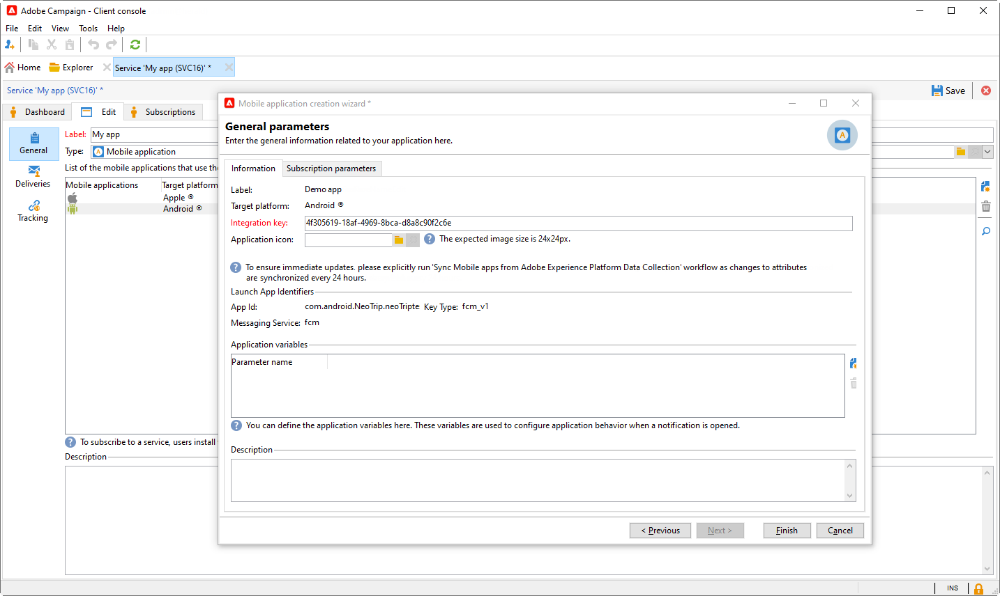
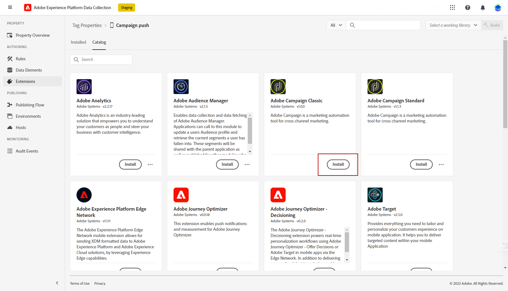

# 已修订推送通知配置 {#push-notifications-config}

Campaign v8.5引入了我们最新的推送通知服务，该服务由基于现代尖端技术构建的强大框架提供支持。 此服务旨在解锁更高级别的可扩展性，确保您的通知能够以无缝效率接触到更多受众。 通过我们增强的基础架构和优化的流程，您可以期待更高的扩展性和可靠性，使您能够以前所未有的方式吸引移动应用程序用户并与之建立联系。

>[!AVAILABILITY]
>
> 从Campaign v8.5开始，新客户可专门访问此功能，并会逐步向一组选定的客户推出。 如果您的环境是在2023年6月之前配置的，则此页不适用于您，您必须遵循详细说明的步骤 [本页内容](push-settings.md).

在此更新的实施中，要在Adobe Campaign中发送推送通知，请执行以下步骤：

1. [在Adobe Experience Platform数据收集中创建应用程序表面](#create-app-surface)

1. [在Adobe Campaign中配置应用程序设置](#push-config-campaign)

1. [在Adobe Experience Platform数据收集中创建并配置移动资产](#create-mobile-property)

1. [添加AdobeAdobe Experience Platform Assurance扩展](https://developer.adobe.com/client-sdks/documentation/platform-assurance-sdk/){target="_blank"}（推荐）

1. [将Campaign Classic添加到移动应用程序](#campaign-mobile-ap)

1. [为iOS和Android创建投放](##push-create)

>[!NOTE]
>
> 数据收集不支持旧版FCM和APNS p12。

## 在Adobe Experience Platform数据收集中创建应用程序表面 {#create-app-surface}

您需要在中添加移动应用程序推送凭据 [!DNL Adobe Experience Platform Data Collection].

需要移动设备应用程序推送凭据注册，才能授权Adobe代表您发送推送通知。 请参阅下面详述的步骤：

1. 从 [!DNL Adobe Experience Platform Data Collection]，选择 **[!UICONTROL App Surfaces]** 选项卡。

1. 单击 **[!UICONTROL Create App Surface]** 以创建新配置。

   

1. 输入 **[!UICONTROL Name]** 用于配置。

1. 从 **[!UICONTROL Mobile Application Configuration]**，选择操作系统：

   * **适用于iOS的**

     

      1. 输入移动设备应用程序 **捆绑Id** 在 **[!UICONTROL App ID (iOS Bundle ID)]** 字段。

         应用程序捆绑包ID可在以下位置找到： **常规** 中主要目标的选项卡 **XCode** Apple开发人员帐户的ID。

      1. 打开 **[!UICONTROL Push Credentials]** 以添加您的凭据。

      1. 拖放您的.p8 Apple推送通知身份验证密钥文件。

         此密钥可以从 **证书**， **标识符** 和 **配置文件** Apple开发人员帐户页面。

      1. 提供 **密钥ID**. 这是在创建p8身份验证密钥期间分配的10字符串。

         它可以在以下位置找到 **键** tab in **证书**， **标识符** 和 **配置文件** Apple开发人员帐户页面。

      1. 提供 **团队编号**. 这是一个字符串值，可以在 **会员资格** 选项卡。

   * **适用于Android**

     

      1. 提供 **[!UICONTROL App ID (Android package name)]**. 通常，包名称是中的应用程序ID `build.gradle` 文件。

      1. 切换 **[!UICONTROL Push Credentials]** 以添加您的凭据。

      1. 拖放FCM推送凭据。 有关如何获取推送凭据的更多详细信息，请参阅 [Google文档](https://firebase.google.com/docs/admin/setup#initialize-sdk){target="_blank"}.

1. 单击 **[!UICONTROL Save]** 以创建您的应用程序配置。

## 在Adobe Campaign中配置应用程序设置{#push-config-campaign}

### 创建服务 {#create-service}

在发送推送通知之前，必须在Adobe Campaign中定义iOS和Android应用程序设置。

推送通知通过专用服务发送给您的应用程序用户。 用户安装您的应用程序后，会订阅此服务：Adobe Campaign依赖此服务仅定向应用程序的订阅者。 在此服务中，您需要添加要在iOS和Android设备上发送的iOS和Android应用程序。

要创建服务以发送推送通知，请执行以下步骤：

1. 浏览至 **[!UICONTROL Profiles and Targets > Services and Subscriptions]** 选项卡，然后单击 **[!UICONTROL Create]**.

   {width="800" align="left"}

1. 输入 **[!UICONTROL Label]** 和 **[!UICONTROL Internal name]**，并选择 **[!UICONTROL Mobile application]** 类型。

   >[!NOTE]
   >
   >默认 **[!UICONTROL Subscriber applications (nms:appSubscriptionRcp)]** 目标映射已链接到收件人表。 如果要使用其他目标映射，则需要创建一个新的目标映射，并在 **[!UICONTROL Target mapping]** 服务的字段。 要了解有关目标映射的更多信息，请参阅 [此页面](../audiences/target-mappings.md).

1. 然后使用 **[!UICONTROL Add]** 图标，以定义使用此服务的移动设备应用程序。

   

### 创建移动应用程序 {#create-sapp}

创建服务后，您现在需要定义将使用此服务的移动应用程序。

>[!BEGINTABS]

>[!TAB iOS]

要为iOS设备创建应用程序，请执行以下步骤：

1. 在服务中，单击 **[!UICONTROL Add]** 然后选择 **[!UICONTROL Create an iOS application]**. 单击 **[!UICONTROL Next]**。

   

1. 从 **[!UICONTROL Launch app configurations list]** 窗口中，选择之前在此部分中创建的应用程序表面。 单击 **[!UICONTROL Next]**。

   

1. （可选）您可以使用某些变量扩充推送消息内容 **[!UICONTROL Application variables]**. 这些都是完全可自定义的，并且是发送到移动设备的消息有效负载的一部分。

   在以下示例中， **mediaURl** 和 **mediaExt** 添加变量以创建富推送通知，然后为应用程序提供要在通知中显示的图像。

   

1. 浏览至 **[!UICONTROL Subscription parameters]** 选项卡定义扩展为的映射 **[!UICONTROL Subscriber applications (nms:appsubscriptionRcp)]** 架构。

1. 浏览至 **[!UICONTROL Sounds]** 制表符以定义要播放的声音。 单击 **[!UICONTROL Add]** 和填充 **[!UICONTROL Internal name]** 字段，其中必须包含嵌入在应用程序中的文件的名称或系统声音的名称。

1. 单击 **[!UICONTROL Next]** 以开始配置开发应用程序。

1. 此 **[!UICONTROL Integration key]** 特定于每个应用程序。 它将移动应用程序链接到Adobe Campaign，并将在配置Campaign扩展时使用。

   确保相同 **[!UICONTROL Integration key]** 在Adobe Campaign中以及通过SDK在应用程序代码中定义。

   了解详情，请参阅 [开发人员文档](https://developer.adobe.com/client-sdks/documentation/adobe-campaign-classic/#configuration-keys){target="_blank"}

   >[!NOTE]
   >
   > 此 **[!UICONTROL Integration key]** 可使用字符串值完全自定义，但需要与SDK中指定的值完全相同。
   >
   > 您不能对应用程序的开发版本（沙盒）和生产版本使用相同的证书。

   

1. 从中选择图标 **[!UICONTROL Application icon]** 字段，用于将服务中的移动应用程序个性化。

1. 单击 **[!UICONTROL Next]** 以开始配置生产应用程序，并按照上面详述的相同步骤操作。 请注意，您不能使用相同的 **[!UICONTROL Integration key]** 应用程序的开发版本（沙盒）和生产版本。

1. 单击 **[!UICONTROL Finish]**。

您的iOS应用程序现在已准备好在Campaign中使用。

>[!TAB Android]

要为Android设备创建应用程序，请执行以下步骤：

1. 在服务中，单击 **[!UICONTROL Add]** 然后选择 **[!UICONTROL Create an Android application]**. 单击 **[!UICONTROL Next]**。

   

1. 从 **[!UICONTROL Launch app configurations list]** 窗口中，选择在此部分中创建的应用程序表面，然后单击 **[!UICONTROL Next]**.

   

1. 集成键特定于每个应用程序。 它将移动应用程序链接到Adobe Campaign，并将在配置Campaign扩展时使用。

   确保相同 **[!UICONTROL Integration key]** 在Adobe Campaign中以及通过SDK在应用程序代码中定义。

   了解详情，请参阅 [开发人员文档](https://developer.adobe.com/client-sdks/documentation/adobe-campaign-classic/#configuration-keys){target="_blank"}

   >[!NOTE]
   >
   > 此 **[!UICONTROL Integration key]** 可使用字符串值完全自定义，但需要与SDK中指定的值完全相同。

   

1. 从中选择图标 **[!UICONTROL Application icon]** 字段，用于将服务中的移动应用程序个性化。

1. （可选）您可以使用某些变量扩充推送消息内容 **[!UICONTROL Application variables]** 如果需要。 这些都是完全可自定义的，并且是发送到移动设备的消息有效负载的一部分。

1. 浏览至 **[!UICONTROL Subscription parameters]** 选项卡定义扩展为的映射 **[!UICONTROL Subscriber applications (nms:appsubscriptionRcp)]** 架构。

1. 单击 **[!UICONTROL Finish]**，然后单击 **[!UICONTROL Save]**。

您的Android应用程序现在已准备好在Campaign中使用。

>[!ENDTABS]

以下是FCM有效负荷名称，用于进一步个性化您的推送通知：

| 消息类型 | 可配置消息元素（FCM有效负荷名称） | 可配置选项（FCM有效负荷名称） |
|:-:|:-:|:-:|
| 数据消息 | N/A | validate_only |
| 通知消息 | title，标题，正文， android_channel_id，图标，声音，标记，颜色， click_action，图像，滚动条，粘性，可见性， notification_priority，通知优先级， notification_count   | validate_only |

## 在Adobe Experience Platform数据收集中配置移动资产 {#create-mobile-property}

1. 在数据收集主页中，访问标记菜单。

1. 单击 **[!UICONTROL New Property]**。

   

1. 键入属性的名称并选择 **[!UICONTROL Mobile]** 作为平台。

   

1. 单击 **[!UICONTROL Save]** 以创建移动资产。

1. 访问新创建的移动资产。

1. 在移动资产仪表板中，访问 **[!UICONTROL Extensions]** 菜单，然后 **[!UICONTROL Catalog]** 选项卡。

   

1. 安装 **[!DNL Adobe Campaign Classic]** 扩展。 [了解有关Campaign扩展的更多信息](https://developer.adobe.com/client-sdks/documentation/adobe-campaign-classic/#configure-campaign-classic-extension)

   

1. 填写实例详细信息：

   * **[!UICONTROL Registration endpoint]** 或 **[!UICONTROL Tracking endpoint]** URL可在 **[!UICONTROL Tools]** > **[!UICONTROL Advanced]** > **[!UICONTROL Deployment wizard]** 菜单。
   * **[!UICONTROL Integration keys]** 可以在中配置的移动设备应用程序中找到 [本节](#create-app).

   

1. 单击 **[!UICONTROL Save]**。

1. 您现在需要从发布配置 **[!UICONTROL Publishing flow]** 菜单。 [了解详情](https://developer.adobe.com/client-sdks/documentation/getting-started/create-a-mobile-property/#publish-the-configuration)

您的移动资产现在将自动与 **[!UICONTROL Adobe Experience Platform Data Collection]** 技术工作流。 [了解详情](../../automation/workflow/technical-workflows.md#list-technical-workflows)

## 将Campaign Classic添加到移动应用程序 {#campaign-mobile-app}

Adobe Experience Platform Mobile SDK有助于在移动设备应用程序中支持Adobe的Experience Cloud解决方案和服务。 SDK配置通过数据收集UI进行管理，以实现灵活配置和基于规则的可扩展集成。

[请参阅Adobe Developer文档以了解详情](https://developer.adobe.com/client-sdks/documentation/adobe-campaign-classic/#add-campaign-classic-to-your-app){target="_blank"}.

## 创建推送通知{#push-create}

在数据收集中成功配置移动应用程序后，您现在可以在Adobe Campaign中创建并发送推送通知。

请参阅 [此页面](push.md#push-create) 了解特定于iOS和Android通知投放的详细元素。
