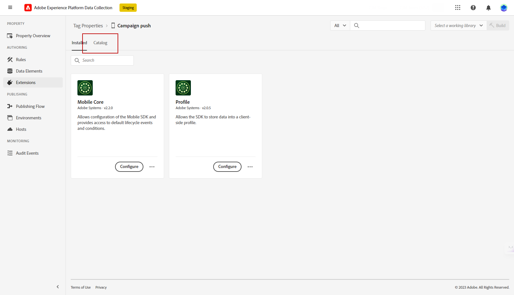

# 已修订推送通知配置 {#push-notifications-config}

Campaign v8.5引入了我们最新的推送通知服务，该服务由基于现代尖端技术构建的强大框架提供支持。 此服务旨在解锁更高级别的可扩展性，确保您的通知能够以无缝效率接触到更多受众。 通过我们增强的基础架构和优化的流程，您可以期待更高的扩展性和可靠性，使您能够以前所未有的方式吸引移动应用程序用户并与之建立联系。

>[!AVAILABILITY]
>
> 从Campaign v8.5开始，新客户可专门访问此功能，并会逐步向一组选定的客户推出。 如果您的环境是在2023年6月之前配置的，则此页面不适用于您，您必须遵循此页面[中详述的步骤](push-settings.md)。

在此更新的实施中，要在Adobe Campaign中发送推送通知，请执行以下步骤：

1. [在Adobe Experience Platform数据收集中创建应用程序表面](#create-app-surface)

1. [在Adobe Campaign中配置应用程序设置](#push-config-campaign)

1. [在Adobe Experience Platform数据收集中创建并配置移动资产](#create-mobile-property)

1. [添加Adobe Adobe Experience Platform Assurance扩展](https://developer.adobe.com/client-sdks/documentation/platform-assurance-sdk/){target="_blank"}（推荐）

1. [将Campaign Classic添加到您的移动应用程序](#campaign-mobile-ap)

1. [为iOS和Android创建投放](##push-create)

>[!NOTE]
>
> 数据收集不支持旧版FCM和APNS p12。

## 在Adobe Experience Platform数据收集中创建应用程序表面 {#create-app-surface}

您需要在[!DNL Adobe Experience Platform Data Collection]中添加移动应用程序推送凭据。

需要移动设备应用程序推送凭据注册，才能授权Adobe代表您发送推送通知。 请参阅下面详述的步骤：

1. 从[!DNL Adobe Experience Platform Data Collection]中，选择左侧面板中的&#x200B;**[!UICONTROL App Surfaces]**&#x200B;选项卡。

1. 单击&#x200B;**[!UICONTROL Create App Surface]**&#x200B;以创建新配置。

   

1. 输入配置的&#x200B;**[!UICONTROL Name]**。

1. 从&#x200B;**[!UICONTROL Mobile Application Configuration]**&#x200B;中，选择操作系统：

>[!BEGINTABS]

>[!TAB iOS]

1. 在&#x200B;**字段中输入移动应用**&#x200B;捆绑包ID **[!UICONTROL App ID (iOS Bundle ID)]**。

   在Apple开发人员帐户的&#x200B;**XCode**&#x200B;中的主目标的&#x200B;**常规**&#x200B;选项卡中可以找到应用程序捆绑包ID。

1. 打开&#x200B;**[!UICONTROL Push Credentials]**&#x200B;以添加凭据。

1. 拖放您的.p8 Apple推送通知身份验证密钥文件。

   此密钥可从您的Apple开发人员帐户的&#x200B;**证书**、**标识符**&#x200B;和&#x200B;**配置文件**&#x200B;页面获取。

1. 提供&#x200B;**密钥ID**。 这是在创建p8身份验证密钥期间分配的10字符串。

       可在Apple开发人员帐户的**Certificates**、**Identifiers**和**Profiles**页面的**Keys**选项卡下找到它。
   
1. 提供&#x200B;**团队ID**。 这是可在&#x200B;**成员资格**&#x200B;选项卡下找到的字符串值。

1. 单击&#x200B;**[!UICONTROL Save]**&#x200B;以创建您的应用程序配置。

>[!TAB Android]

1. 提供&#x200B;**[!UICONTROL App ID (Android package name)]**。 通常，包名称是`build.gradle`文件中的应用程序ID。

1. 切换&#x200B;**[!UICONTROL Push Credentials]**&#x200B;以添加凭据。

1. 拖放FCM推送凭据。 有关如何获取推送凭据的详细信息，请参阅[Google文档](https://firebase.google.com/docs/admin/setup#initialize-sdk){target="_blank"}。

1. 单击&#x200B;**[!UICONTROL Save]**&#x200B;以创建您的应用程序配置。

>[!ENDTABS]

## 在Adobe Campaign中配置应用程序设置{#push-config-campaign}

### 创建服务 {#create-service}

在发送推送通知之前，必须在Adobe Campaign中定义iOS和Android应用程序设置。

推送通知通过专用服务发送给您的应用程序用户。 用户安装您的应用程序后，会订阅此服务：Adobe Campaign依赖此服务仅定向应用程序的订阅者。 在此服务中，您需要添加要在iOS和Android设备上发送的iOS和Android应用程序。

要创建服务以发送推送通知，请执行以下步骤：

1. 浏览到&#x200B;**[!UICONTROL Profiles and Targets > Services and Subscriptions]**&#x200B;选项卡，然后单击&#x200B;**[!UICONTROL Create]**。

   {width="800" align="left"}

1. 输入&#x200B;**[!UICONTROL Label]**&#x200B;和&#x200B;**[!UICONTROL Internal name]**，然后选择&#x200B;**[!UICONTROL Mobile application]**&#x200B;类型。

   >[!NOTE]
   >
   >默认&#x200B;**[!UICONTROL Subscriber applications (nms:appSubscriptionRcp)]**&#x200B;目标映射已链接到收件人表。 如果要使用其他目标映射，则需要创建一个新的目标映射，并在服务的&#x200B;**[!UICONTROL Target mapping]**&#x200B;字段中输入该映射。 在[此页面](../audiences/target-mappings.md)中了解有关目标映射的详细信息。

1. 然后，使用右侧的&#x200B;**[!UICONTROL Add]**&#x200B;图标定义使用此服务的移动应用程序。

   

### 创建移动应用程序 {#create-sapp}

创建服务后，您现在需要定义将使用此服务的移动应用程序。

>[!BEGINTABS]

>[!TAB iOS]

要为iOS设备创建应用程序，请执行以下步骤：

1. 从您的服务中，单击&#x200B;**[!UICONTROL Add]**，然后选择&#x200B;**[!UICONTROL Create an iOS application]**。 单击 **[!UICONTROL Next]**。

   

1. 从&#x200B;**[!UICONTROL Launch app configurations list]**&#x200B;窗口中，选择之前在此部分中创建的应用程序表面。 单击 **[!UICONTROL Next]**。

   

1. （可选）您可以使用大约&#x200B;**[!UICONTROL Application variables]**&#x200B;扩充推送消息内容。 这些都是完全可自定义的，并且是发送到移动设备的消息有效负载的一部分。

   在以下示例中，添加&#x200B;**mediaURl**&#x200B;和&#x200B;**mediaExt**&#x200B;变量以创建富推送通知，然后为应用程序提供要在通知中显示的图像。

   

1. 浏览到&#x200B;**[!UICONTROL Subscription parameters]**&#x200B;选项卡以定义扩展名为&#x200B;**[!UICONTROL Subscriber applications (nms:appsubscriptionRcp)]**&#x200B;架构的映射。

1. 浏览到&#x200B;**[!UICONTROL Sounds]**&#x200B;选项卡以定义要播放的声音。 单击&#x200B;**[!UICONTROL Add]**&#x200B;并填写&#x200B;**[!UICONTROL Internal name]**&#x200B;字段，该字段必须包含嵌入在应用程序中的文件的名称或系统声音的名称。

1. 单击&#x200B;**[!UICONTROL Next]**&#x200B;开始配置开发应用程序。

1. **[!UICONTROL Integration key]**&#x200B;特定于每个应用程序。 它将移动应用程序链接到Adobe Campaign，并将在配置Campaign扩展时使用。

   确保通过SDK在Adobe Campaign和应用程序代码中定义相同的&#x200B;**[!UICONTROL Integration key]**。

   请参阅[开发人员文档](https://developer.adobe.com/client-sdks/documentation/adobe-campaign-classic/#configuration-keys){target="_blank"}以了解详情

   >[!NOTE]
   >
   > **[!UICONTROL Integration key]**&#x200B;可使用字符串值完全自定义，但需要与SDK中指定的值完全相同。
   >
   > 您不能对应用程序的开发版本（沙盒）和生产版本使用相同的证书。

   

1. 从&#x200B;**[!UICONTROL Application icon]**&#x200B;字段中选择图标以个性化服务中的移动应用程序。

1. 单击&#x200B;**[!UICONTROL Next]**&#x200B;开始配置生产应用程序，并遵循上面详述的相同步骤。 请注意，您不能对应用程序的开发版本（沙盒）和生产版本使用相同的&#x200B;**[!UICONTROL Integration key]**。

1. 单击 **[!UICONTROL Finish]**。

您的iOS应用程序现在已准备好在Campaign中使用。

>[!TAB Android]

要为Android设备创建应用程序，请执行以下步骤：

1. 从您的服务中，单击&#x200B;**[!UICONTROL Add]**，然后选择&#x200B;**[!UICONTROL Create an Android application]**。 单击 **[!UICONTROL Next]**。

   

1. 从&#x200B;**[!UICONTROL Launch app configurations list]**&#x200B;窗口中，选择在此部分中创建的应用程序表面，然后单击&#x200B;**[!UICONTROL Next]**。

   

1. 集成键特定于每个应用程序。 它将移动应用程序链接到Adobe Campaign，并将在配置Campaign扩展时使用。

   确保通过SDK在Adobe Campaign和应用程序代码中定义相同的&#x200B;**[!UICONTROL Integration key]**。

   请参阅[开发人员文档](https://developer.adobe.com/client-sdks/documentation/adobe-campaign-classic/#configuration-keys){target="_blank"}以了解详情

   >[!NOTE]
   >
   > **[!UICONTROL Integration key]**&#x200B;可使用字符串值完全自定义，但需要与SDK中指定的值完全相同。

   

1. 从&#x200B;**[!UICONTROL Application icon]**&#x200B;字段中选择图标以个性化服务中的移动应用程序。

1. （可选）如果需要，您可以使用大约&#x200B;**[!UICONTROL Application variables]**&#x200B;扩充推送消息内容。 这些都是完全可自定义的，并且是发送到移动设备的消息有效负载的一部分。

1. 浏览到&#x200B;**[!UICONTROL Subscription parameters]**&#x200B;选项卡以定义扩展名为&#x200B;**[!UICONTROL Subscriber applications (nms:appsubscriptionRcp)]**&#x200B;架构的映射。

1. 单击 **[!UICONTROL Finish]**，然后单击 **[!UICONTROL Save]**。

您的Android应用程序现在已准备好在Campaign中使用。

>[!ENDTABS]

以下是FCM有效负荷名称，用于进一步个性化您的推送通知：

| 消息类型 | 可配置消息元素（FCM有效负荷名称） | 可配置选项（FCM有效负荷名称） |
|:-:|:-:|:-:|
| 数据消息 | N/A | validate_only |
| 通知消息 | title，正文， android_channel_id，图标，声音，标记，颜色，点击操作，图像，滚动条，粘性，可见性，通知优先级，通知计数  | validate_only |

## 在Adobe Experience Platform数据收集中配置移动资产 {#create-mobile-property}

1. 在数据收集主页中，访问标记菜单。

1. 单击 **[!UICONTROL New Property]**。

   

1. 键入属性的名称并选择&#x200B;**[!UICONTROL Mobile]**&#x200B;作为平台。

   

1. 单击&#x200B;**[!UICONTROL Save]**&#x200B;以创建移动属性。

1. 访问新创建的移动资产。

1. 从您的移动属性仪表板中，访问&#x200B;**[!UICONTROL Extensions]**&#x200B;菜单，然后访问&#x200B;**[!UICONTROL Catalog]**&#x200B;选项卡。

   

1. 安装&#x200B;**[!DNL Adobe Campaign Classic]**&#x200B;扩展。 [了解有关Campaign扩展的更多信息](https://developer.adobe.com/client-sdks/documentation/adobe-campaign-classic/#configure-campaign-classic-extension)

   

1. 填写实例详细信息：

   * 在Campaign的&#x200B;**[!UICONTROL Registration endpoint]** > **[!UICONTROL Tracking endpoint]** > **[!UICONTROL Tools]**&#x200B;菜单中可以找到&#x200B;**[!UICONTROL Advanced]**&#x200B;或&#x200B;**[!UICONTROL Deployment wizard]**&#x200B;个URL。
   * 在&#x200B;**[!UICONTROL Integration keys]**&#x200B;此部分[中配置的移动应用中，可以找到](#create-app)。

   

1. 单击 **[!UICONTROL Save]**。

1. 您现在需要从&#x200B;**[!UICONTROL Publishing flow]**&#x200B;菜单发布配置。 [了解详情](https://developer.adobe.com/client-sdks/documentation/getting-started/create-a-mobile-property/#publish-the-configuration)

您的移动资产现在将自动与&#x200B;**[!UICONTROL Adobe Experience Platform Data Collection]**&#x200B;技术工作流同步。 [了解详情](../../automation/workflow/technical-workflows.md#list-technical-workflows)

## 将Campaign Classic添加到您的移动应用程序 {#campaign-mobile-app}

Adobe Experience Platform Mobile SDK 有助于在移动设备应用程序中支持 Adobe 的 Experience Cloud 解决方案和服务。 SDK配置通过数据收集UI进行管理，以实现灵活配置和基于规则的可扩展集成。

[请参阅Adobe Developer文档以了解详情](https://developer.adobe.com/client-sdks/documentation/adobe-campaign-classic/#add-campaign-classic-to-your-app){target="_blank"}。

## 创建推送通知{#push-create}

在数据收集中成功配置移动应用程序后，您现在可以在Adobe Campaign中创建并发送推送通知。

有关特定于iOS和Android通知交付的详细元素，请参阅[此页面](push.md#push-create)。
