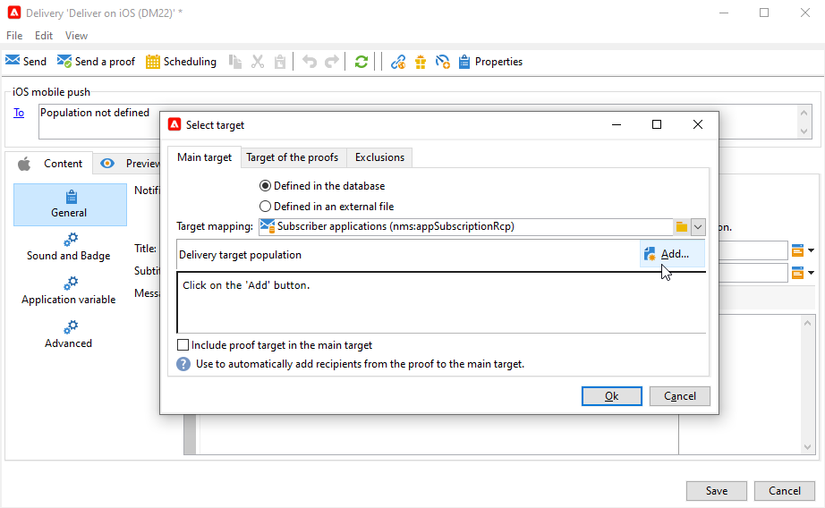

# 创建和发送推送通知

移动设备应用程序投放允许您向iOS和Android系统发送通知。

要在Adobe Campaign中发送推送通知，您需要：

1. 配置Campaign环境
1. 为移动应用程序创建移动应用程序类型信息服务。
1. 将应用程序的iOS和Android版本添加到此服务。
1. 为iOS和Android创建投放。

 了解如何开始使用 [Campaign Classicv7文档](https://experienceleague.adobe.com/docs/campaign-classic/using/sending-messages/sending-push-notifications/about-mobile-app-channel.html){target=&quot;_blank&quot;}

## 集成Campaign SDK

Campaign SDK可帮助您将移动应用程序集成到Adobe Campaign平台。

中列出了兼容的SDK版本 [Campaign兼容性矩阵](../start/compatibility-matrix.md#MobileSDK).

 了解如何在 [此部分](../config/push-config.md)

<!--
### Configure Campaign Extension in Launch

You can integrate Adobe Experience Platorm Launch SDK with Campaign, by leveraging Campaign Classic extension.

 Learn more in [Adobe Mobile SDK documentation](https://aep-sdks.gitbook.io/docs/using-mobile-extensions/adobe-campaignclassic){target="_blank"}

-->

## 在Campaign中配置应用程序设置

您必须在Adobe Campaign中定义iOS和Android应用程序设置。

 有关iOS的配置准则，请参阅 [Campaign Classicv7文档](https://experienceleague.adobe.com/docs/campaign-classic/using/sending-messages/sending-push-notifications/configure-the-mobile-app/configuring-the-mobile-application.html?lang=en#sending-messages){target=&quot;_blank&quot;}

 Android的配置准则详见 [Campaign Classicv7文档](https://experienceleague.adobe.com/docs/campaign-classic/using/sending-messages/sending-push-notifications/configure-the-mobile-app/configuring-the-mobile-application-android.html?lang=en#sending-messages){target=&quot;_blank&quot;}

## 创建您的第一个推送通知

本节详细介绍特定于iOS和Android通知交付的元素。

>[!CAUTION]
>
>在 [企业(FFDA)部署](../architecture/enterprise-deployment.md)，则移动注册现在为 **异步**. [了解详情](../architecture/staging.md)

要创建新投放，请浏览 **[!UICONTROL Campaigns]** ，单击 **[!UICONTROL Deliveries]** ，然后单击 **[!UICONTROL Create]** 按钮。

 有关如何创建投放的全局信息，请参阅 [Campaign Classicv7文档](https://experienceleague.adobe.com/docs/campaign-classic/using/sending-messages/key-steps-when-creating-a-delivery/steps-about-delivery-creation-steps.html?lang=en#sending-messages){target=&quot;_blank&quot;}

### 在iOS上发送通知 {#send-notifications-on-ios}

>[!NOTE]
>
>此功能从Campaign v8.3开始可用。要检查您的版本，请参阅 [此部分](../start/compatibility-matrix.md#how-to-check-your-campaign-version-and-buildversion)

1. 选择 **[!UICONTROL Deliver on iOS]** 投放模板。

   

1. 要定义通知的目标，请单击 **[!UICONTROL To]** 链接，然后单击 **[!UICONTROL Add]**.

   

1. 选择 **[!UICONTROL Subscribers of an iOS mobile application (iPhone, iPad)]**，选择与移动应用程序相关的服务，然后选择应用程序的iOS版本。

   

1. 选择 **[!UICONTROL Notification type]** 介于 **[!UICONTROL General notification (Alert, Sound, Badge)]** 或 **[!UICONTROL Silent notification]**.

   

   >[!NOTE]
   >
   >的 **静默推送** 模式允许向移动应用程序发送“静默”通知。 用户未知晓通知的到达。 它将直接转给应用程序。

1. 在 **[!UICONTROL Title]** 字段，输入要在通知中心提供的通知列表中显示的标题标签。

   利用此字段，可定义 **标题** iOS通知有效负载的参数。

1. 您可以添加 **[!UICONTROL Subtitle]**，值 **字幕** iOS通知有效负载的参数。

1. 在 **[!UICONTROL Message content]** 的子菜单。

1. 从 **[!UICONTROL Sound and Badge]** 选项卡，您可以编辑以下选项：

   * **[!UICONTROL Clean Badge]**:启用此选项可刷新标记值。

   * **[!UICONTROL Value]**:设置一个数字，该数字将用于直接在应用程序图标上显示新的未读信息数。

   * **[!UICONTROL Critical alert mode]**:启用此选项，即使用户的手机设置为焦点模式或iPhone静音，也可向通知添加声音。

   * **[!UICONTROL Name]**:选择在收到通知时移动终端要播放的声音。

   * **[!UICONTROL Volume]**:音量从0到100。

      >[!NOTE]
      > 
      >必须在应用程序中包含声音，并在创建服务时定义声音。
      >
      >有关iOS的配置准则，请参阅 [Campaign Classicv7文档](https://experienceleague.adobe.com/docs/campaign-classic/using/sending-messages/sending-push-notifications/configure-the-mobile-app/configuring-the-mobile-application.html?lang=en).
   

1. 从 **[!UICONTROL Application variables]** 选项卡， **[!UICONTROL Application variables]** 会自动添加。 例如，通过它们可定义通知行为，您可以将特定应用程序屏幕配置为在用户激活通知时显示。

   如需详细信息，请参阅[此部分](https://experienceleague.adobe.com/docs/campaign-classic/using/sending-messages/sending-push-notifications/configure-the-mobile-app/configuring-the-mobile-application.html?lang=en)。

1. 从 **[!UICONTROL Advanced]** 选项卡，您可以编辑以下常规选项：

   * **[!UICONTROL Mutable content]**:启用此选项，以允许移动应用程序下载媒体内容。

   * **[!UICONTROL Thread-id]**:用于将相关通知分组在一起的标识符。

   * **[!UICONTROL Category]**:将显示操作按钮的类别ID的名称。 这些通知为用户提供了一种更快的方式，无需在应用程序中打开或导航即可响应通知执行不同任务。

   

1. 对于时间敏感通知，您可以指定以下选项：

   * **[!UICONTROL Target content ID]**:标识符，用于定位在打开通知时要转发的应用程序窗口。

   * **[!UICONTROL Launch image]**:要显示的launch图像文件的名称。 如果用户选择启动您的应用程序，则将显示选定的图像，而不是应用程序的启动屏幕。

   * **[!UICONTROL Interruption level]**:

      * **[!UICONTROL Active]**:默认情况下，系统会立即显示通知、点亮屏幕并播放声音。 通知不会突破“焦点”模式。

      * **[!UICONTROL Passive]**:系统将通知添加到通知列表，而不会点亮屏幕或播放声音。 通知不会突破“焦点”模式。

      * **[!UICONTROL Time sensitive]** 系统会立即显示通知、点亮屏幕、播放声音并打破“聚焦”模式。 此级别不需要Apple的特殊许可。

      * **[!UICONTROL Critical]** 系统立即显示通知，将屏幕点亮，并绕过静音开关或聚焦模式。 请注意，此级别需要获得Apple的特殊许可。
   * **[!UICONTROL Relevance score]**:将相关性得分设置为0到100。 系统将使用它对通知摘要中的通知进行排序。

   

1. 配置通知后，单击 **[!UICONTROL Preview]** 选项卡来预览通知。

   

### 在Android上发送通知 {#send-notifications-on-android}

1. 选择 **[!UICONTROL Deliver on Android (android)]** 投放模板。

   

1. 要定义通知的目标，请单击 **[!UICONTROL To]** 链接，然后单击 **[!UICONTROL Add]**.

   

1. 选择 **[!UICONTROL Subscribers of an Android mobile application]**，选择与移动应用程序相关的服务（在本例中为Neotrips），然后选择应用程序的Android版本。

   

1. 然后输入通知的内容。

   

1. 单击 **[!UICONTROL Insert emoticon]** 图标将表情符号插入推送通知。

1. 在 **[!UICONTROL Application variables]** 字段，输入每个变量的值。 例如，您可以配置在用户激活通知时显示的特定应用程序屏幕。

1. 配置通知后，单击 **[!UICONTROL Preview]** 选项卡来预览通知。

   <!---->

## 测试、发送和监视推送通知

要发送校样并发送最终投放，请使用与电子邮件投放相同的流程。 请参阅 Campaign Classic v7 文档以了解详情：

* 验证投放并发送校样
    [了解验证投放的关键步骤](https://experienceleague.adobe.com/docs/campaign-classic/using/sending-messages/key-steps-when-creating-a-delivery/steps-validating-the-delivery.html){target=&quot;_blank&quot;}

* 确认并发送投放
    [了解发送投放的关键步骤](https://experienceleague.adobe.com/docs/campaign-classic/using/sending-messages/key-steps-when-creating-a-delivery/steps-sending-the-delivery.html?lang=en){target=&quot;_blank&quot;}

发送消息后，您可以监控和跟踪投放内容。 请参阅 Campaign Classic v7 文档以了解详情：

* 推送通知隔离
    [了解有关推送通知隔离的更多信息](https://experienceleague.adobe.com/docs/campaign-classic/using/sending-messages/monitoring-deliveries/understanding-quarantine-management.html?lang=en#push-notification-quarantines){target=&quot;_blank&quot;}

* 故障排除
    [了解如何排查推送通知故障](https://experienceleague.adobe.com/docs/campaign-classic/using/sending-messages/sending-push-notifications/troubleshooting.html?lang=en){target=&quot;_blank&quot;}
