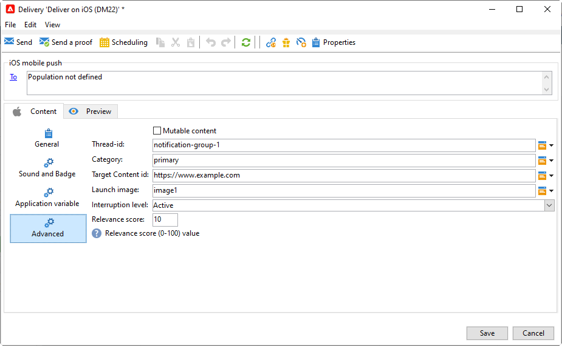

# 创建和发送推送通知{#push-notifications-create}

移动应用程序投放可让您向iOS和Android设备发送通知。

在开始使用Adobe Campaign发送推送通知之前，您需要确保移动应用程序和Adobe Experience Platform中的标记已具有配置和集成。 [了解有关推送配置的更多信息。](push-settings.md)。

>[!CAUTION]
>
>Android Firebase Cloud Messaging (FCM)服务的一些重要更改将于2024年发布，可能会影响您的Adobe Campaign实施。 您可能需要更新 Android 推送消息的订阅服务配置，才能支持此更改。您已经可以检查并执行操作。

## 创建您的第一个推送通知 {#push-create}

此部分详细介绍特定于iOS和Android通知交付的元素。

>[!IMPORTANT]
>
>在[企业(FFDA)部署](../architecture/enterprise-deployment.md)的上下文中，移动注册现在为&#x200B;**异步**。 [了解详情](../architecture/staging.md)

要创建新投放，请浏览到&#x200B;**[!UICONTROL Campaigns]**&#x200B;选项卡，单击&#x200B;**[!UICONTROL Deliveries]**，然后单击现有投放列表上方的&#x200B;**[!UICONTROL Create]**&#x200B;按钮。

默认情况下，Adobe Campaign附带两个投放模板：一个用于iOS，一个用于Android。 您可以复制它们以定义您自己的设置。 基于这些模板配置推送投放的步骤详述如下。

>[!BEGINTABS]

>[!TAB iOS]

要在iOS设备上发送通知，请执行以下步骤：

1. 选择&#x200B;**[!UICONTROL Deliver on iOS]**&#x200B;投放模板。

   

1. 要定义通知的目标，请单击&#x200B;**[!UICONTROL To]**&#x200B;链接，然后单击&#x200B;**[!UICONTROL Add]**。

   

1. 选择&#x200B;**[!UICONTROL Subscribers of an iOS mobile application (iPhone, iPad)]**，选择与您的移动应用程序相关的服务，然后选择应用程序的iOS版本。

   

1. 选择介于&#x200B;**[!UICONTROL Notification type]**&#x200B;或&#x200B;**[!UICONTROL General notification (Alert, Sound, Badge)]**&#x200B;之间的&#x200B;**[!UICONTROL Silent notification]**。

   

   >[!NOTE]
   >
   >**静默推送**&#x200B;模式允许将“静默”通知发送到移动应用程序。 其中并不通知用户已送达通知。而是直接将通知传送到应用程序。

1. 在&#x200B;**[!UICONTROL Title]**&#x200B;字段中，输入要显示在通知中心可用通知列表中的标题标签。

   此字段允许您定义iOS通知有效负载的&#x200B;**title**&#x200B;参数的值。

1. 您可以添加iOS通知有效负载的&#x200B;**[!UICONTROL Subtitle]** subtitle **参数的**&#x200B;值。

1. 在向导的&#x200B;**[!UICONTROL Message content]**&#x200B;部分中输入消息的内容。

1. 在&#x200B;**[!UICONTROL Sound and Badge]**&#x200B;选项卡中，可以编辑以下选项：

   * **[!UICONTROL Clean Badge]**：启用此选项以刷新标记值。

   * **[!UICONTROL Value]**：设置将用于直接在应用程序图标上显示的新未读信息数。

   * **[!UICONTROL Critical alert mode]**：启用此选项以在通知中添加声音，即使用户的手机设置为焦点模式或iPhone处于静音状态也是如此。

   * **[!UICONTROL Name]**：在收到通知时，选择要由移动终端播放的声音。

   * **[!UICONTROL Volume]**：声音的音量从0到100。

     >[!NOTE]
     > 
     >声音必须包含在应用程序中，并在创建服务时定义。
     >

   

1. 在&#x200B;**[!UICONTROL Application variables]**&#x200B;选项卡中，您的&#x200B;**[!UICONTROL Application variables]**&#x200B;将自动添加。 它们允许您定义通知行为，例如，您可以配置在用户激活通知时显示的特定应用程序屏幕。

1. 在&#x200B;**[!UICONTROL Advanced]**&#x200B;选项卡中，可以编辑以下常规选项：

   * **[!UICONTROL Mutable content]**：启用此选项以允许移动应用程序下载媒体内容。

   * **[!UICONTROL Thread-id]**：用于将相关通知分组在一起的标识符。

   * **[!UICONTROL Category]**：将显示操作按钮的类别ID的名称。 这些通知为用户提供了一种更快的方式，无需在应用程序中打开或导航即可响应通知执行不同任务。

   

1. 对于时效性通知，可以指定以下选项：

   * **[!UICONTROL Target content ID]**：标识符，用于定位打开通知时要转发的应用程序窗口。

   * **[!UICONTROL Launch image]**：要显示的启动图像文件的名称。 如果用户选择启动您的应用程序，则会显示选定的图像而不是应用程序的启动屏幕。

   * **[!UICONTROL Interruption level]**：

      * **[!UICONTROL Active]**：默认设置，系统立即显示通知，在屏幕上亮起，可以播放声音。 通知不会突破焦点模式。

      * **[!UICONTROL Passive]**：系统将通知添加到通知列表，而不打开屏幕或播放声音。 通知不会突破焦点模式。

      * **[!UICONTROL Time sensitive]**&#x200B;系统立即显示通知，打开屏幕，可以播放声音并突破焦点模式。 此级别不需要Apple的特殊权限。

      * **[!UICONTROL Critical]**&#x200B;系统立即显示通知，在屏幕上亮起，并绕过静音开关或聚焦模式。 请注意，此级别需要Apple的特殊权限。

   * **[!UICONTROL Relevance score]**：将相关性得分从0设置为100。 系统使用此选项对通知摘要中的通知进行排序。

   

1. 配置通知后，单击&#x200B;**[!UICONTROL Preview]**&#x200B;选项卡预览通知。

   

>[!TAB Android]

要在Android设备上发送通知，请执行以下步骤：

1. 选择&#x200B;**[!UICONTROL Deliver on Android (android)]**&#x200B;投放模板。

   

   >[!NOTE]
   > 
   >使用最新的FCM API (HTTP v1)，您必须为Android推送通知更新&#x200B;**投放模板**&#x200B;以增加批处理消息数量。 为此，请浏览到Android投放模板的属性，然后在&#x200B;**投放**&#x200B;选项卡中，将[消息批次数量](../../v8/send/configure-and-send.md#delivery-batch-quantity)设置为&#x200B;**256**。 将此更改应用于您的Android投放使用的所有投放模板，以及您所有现有的Android投放。

1. 要定义通知的目标，请单击&#x200B;**[!UICONTROL To]**&#x200B;链接，然后单击&#x200B;**[!UICONTROL Add]**。

   

1. 选择&#x200B;**[!UICONTROL Subscribers of an Android mobile application]**，选择与您的移动应用程序相关的服务（在本例中为Neotrips），然后选择应用程序的Android版本。

   

1. 然后，输入通知的内容。

   

1. 单击&#x200B;**[!UICONTROL Insert emoticon]**&#x200B;图标将表情符号插入到您的推送通知中。

1. 在&#x200B;**[!UICONTROL Application variables]**&#x200B;字段中，输入每个变量的值。 例如，您可以配置在用户激活通知时显示的特定应用程序屏幕。

1. 配置通知后，单击&#x200B;**[!UICONTROL Preview]**&#x200B;选项卡预览通知。

   <!---->

>[!ENDTABS]

## 测试、发送和监控推送通知 {#push-test}

要发送验证并发送最终投放，请按照与其他投放相同的流程操作。

了解如何在[此页面](preview-and-proof.md)中验证投放。

了解如何在[此页面](send.md)中确认并发送投放

发送消息后，您可以监控和跟踪投放。 在[此页面](delivery-failures.md#push-error-types)中了解有关推送通知投放失败原因的更多信息。

