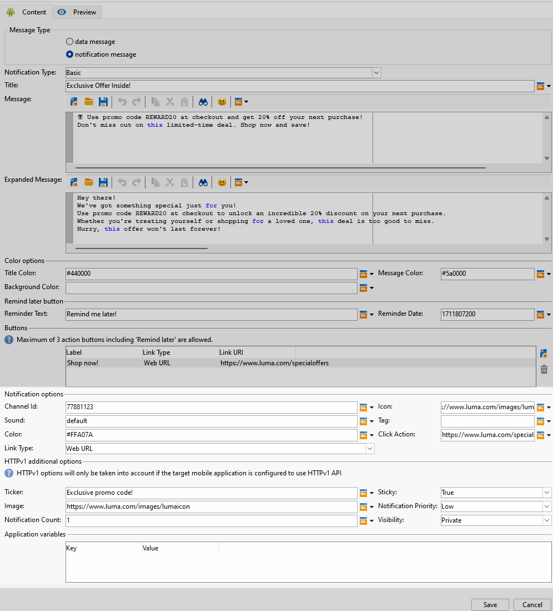
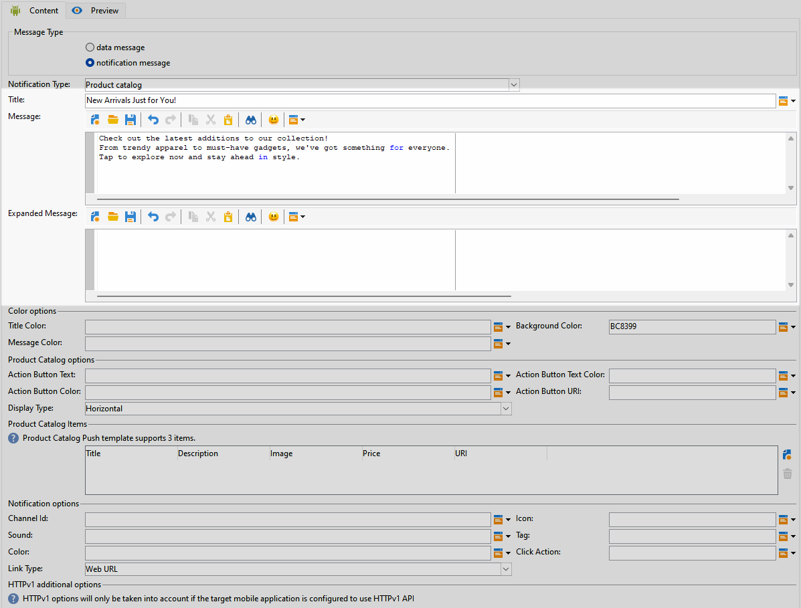
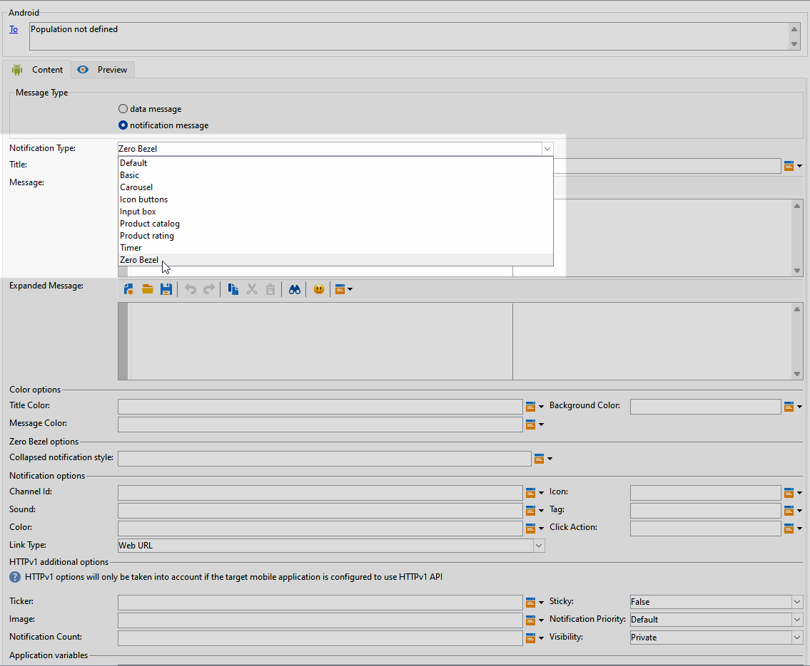

# 设计 Android 富推送投放 {#rich-push}

>[!IMPORTANT]
>
>在设计富推送通知之前，您首先需要配置V2连接器。 有关详细过程，请参阅[此页面](https://experienceleague.adobe.com/en/docs/campaign-classic/using/sending-messages/sending-push-notifications/configure-the-mobile-app/configuring-the-mobile-application-android#configuring-external-account-android)。

使用Firebase Cloud Messaging，您可以选择两种类型的消息：

* **[!UICONTROL Data message]**&#x200B;由客户端应用程序处理。 这些消息将直接发送到移动设备应用程序，后者在设备上生成并显示Android通知。 数据消息仅包含您的自定义应用程序变量。

* 由FCM SDK自动处理的&#x200B;**[!UICONTROL Notification message]**。 FCM会代表客户端应用程序在用户设备上自动显示消息。 通知消息包含预定义的一组参数和选项，但仍可以使用自定义应用程序变量进一步个性化。

如果您的界面上禁用了滚动条，请访问&#x200B;**[!UICONTROL Administration]** `>` **[!UICONTROL Platform]** `>` **[!UICONTROL Options]**，并将&#x200B;**[!UICONTROL XtkUseScrollBar]**&#x200B;选项设置为1。

## 定义Android通知的内容 {#push-message}

创建推送投放后，您可以使用以下模板之一定义其内容：

* **默认**&#x200B;允许您发送带有简单图标和随附图像的通知。

* **基本**&#x200B;可以在通知中包含文本、图像和按钮。

* 通过&#x200B;**轮播**，您可以发送包含用户可以轻扫的文本和多个图像的通知。

* **图标按钮**&#x200B;允许您发送带有图标和相应图像的通知。

* **输入框**&#x200B;通过通知直接收集用户输入和反馈。

* **产品目录**&#x200B;显示各种产品图像。

* **产品评级**&#x200B;允许用户提供反馈并对产品评级。

* **计时器**&#x200B;在通知中包含实时倒计时器。

* **零挡板**&#x200B;使用图像的整个背景表面，文本无缝覆盖。

浏览以下选项卡，详细了解如何个性化这些模板。

>[!BEGINTABS]

>[!TAB 默认值]

1. 从&#x200B;**[!UICONTROL Notification type]**&#x200B;下拉列表中选择&#x200B;**[!UICONTROL Default]**。

   

1. 若要撰写邮件，请在&#x200B;**[!UICONTROL Title]**&#x200B;和&#x200B;**[!UICONTROL Message]**&#x200B;字段中输入您的文本。

   

1. 使用动态个性化字段定义内容、个性化数据和添加动态内容。 [了解详情](../send/personalize.md)

1. 要进一步个性化您的推送通知，请配置推送通知的&#x200B;**[!UICONTROL Notification options]**&#x200B;和&#x200B;**[!UICONTROL HTTPv1 additional options]**。 [了解详情](#push-advanced)

   

定义消息内容后，您可以使用测试订阅者来预览和测试消息。

>[!TAB 基本]

1. 从&#x200B;**[!UICONTROL Notification Type]**&#x200B;下拉列表中选择&#x200B;**[!UICONTROL Basic]**。

   

1. 若要撰写邮件，请在&#x200B;**[!UICONTROL Title]**、**[!UICONTROL Message]**&#x200B;和&#x200B;**[!UICONTROL Expanded message]**&#x200B;字段中输入您的文本。

   展开通知时，显示&#x200B;**[!UICONTROL Expanded message]**&#x200B;时，**[!UICONTROL Message]**&#x200B;文本将显示在折叠视图中。

   

1. 使用动态个性化字段定义内容、个性化数据和添加动态内容。 [了解详情](../send/personalize.md)

1. 在&#x200B;**[!UICONTROL Color options]**&#x200B;菜单下，输入&#x200B;**[!UICONTROL Title]**、**[!UICONTROL Message]**&#x200B;和&#x200B;**[!UICONTROL Background]**&#x200B;的十六进制颜色代码。

1. 根据需要添加&#x200B;**[!UICONTROL Remind later button]**。 在相应的字段中输入您的&#x200B;**[!UICONTROL Reminder Text]**&#x200B;和&#x200B;**日期**。

   **[!UICONTROL Reminder Date]**&#x200B;字段需要一个表示纪元的值（以秒为单位）。

1. 单击&#x200B;**[!UICONTROL Add button]**&#x200B;并填写以下字段：

   * **[!UICONTROL Label]**：按钮上显示的文本。
   * **[!UICONTROL Link URI]**：指定单击按钮时要执行的URI。

   您可以选择在推送通知中最多包含三个按钮。 如果您选择&#x200B;**[!UICONTROL Remind later button]**，则最多只能包含两个按钮。

1. 选择按钮链接URL的&#x200B;**[!UICONTROL Link type]**：

   * **[!UICONTROL Web URL]**： Web URL可将用户指引到在线内容。 单击后，它们将提示设备的默认Web浏览器打开并导航到指定的URL。

   * **[!UICONTROL Deeplink]**：深层链接是指引导用户访问应用程序内特定部分的URL，即使应用程序已关闭也是如此。 单击时，会显示一个对话框，允许用户从能够处理链接的各种应用程序中进行选择。

   * **[!UICONTROL Open App]**：打开应用程序URL允许您直接连接到应用程序中的内容。 它使您的应用程序能够绕过消除歧义对话框，将自身确立为特定类型链接的默认处理程序。

   有关如何处理Android应用程序链接的更多信息，请参阅[Android开发人员文档](https://developer.android.com/training/app-links)。

   

1. 要进一步个性化您的推送通知，请配置推送通知的&#x200B;**[!UICONTROL Notification options]**&#x200B;和&#x200B;**[!UICONTROL HTTPv1 additional options]**。 [了解详情](#push-advanced)

   

定义消息内容后，您可以使用测试订阅者来预览和测试消息。

>[!TAB 轮播]

1. 从&#x200B;**[!UICONTROL Notification Type]**&#x200B;下拉列表中选择&#x200B;**[!UICONTROL Carousel]**。

   

1. 若要撰写邮件，请在&#x200B;**[!UICONTROL Title]**、**[!UICONTROL Message]**&#x200B;和&#x200B;**[!UICONTROL Expanded message]**&#x200B;字段中输入您的文本。

   展开通知时，显示&#x200B;**[!UICONTROL Expanded message]**&#x200B;时，**[!UICONTROL Message]**&#x200B;文本将显示在折叠视图中。

   

1. 使用表达式编辑器定义内容、个性化数据和添加动态内容。 [了解详情](../send/personalize.md)

1. 在&#x200B;**[!UICONTROL Color options]**&#x200B;菜单下，输入&#x200B;**[!UICONTROL Title]**、**[!UICONTROL Message]**&#x200B;和&#x200B;**[!UICONTROL Background]**&#x200B;的十六进制颜色代码。

1. 选择&#x200B;**[!UICONTROL Carousel]**&#x200B;的运行方式：

   * **[!UICONTROL Auto]**：将图像作为幻灯片自动循环，以预定义的间隔转换。
   * **[!UICONTROL Manual]**：允许用户在幻灯片之间手动滑动以浏览图像。

1. 从&#x200B;**[!UICONTROL Layout]**&#x200B;下拉列表中，选择&#x200B;**[!UICONTROL Filmstrip]**&#x200B;选项，在主幻灯片旁包含上一张和下一张图像的预览。

1. 单击&#x200B;**[!UICONTROL Add image]**&#x200B;并输入图像URL、文本和操作URL。

   确保您至少包含三个图像，最多包含五个图像。

   

1. 要进一步个性化您的推送通知，请配置推送通知的&#x200B;**[!UICONTROL Notification options]**&#x200B;和&#x200B;**[!UICONTROL HTTPv1 additional options]**。 [了解详情](#push-advanced)

   

定义消息内容后，您可以使用测试订阅者来预览和测试消息。

>[!TAB 图标按钮]

1. 从&#x200B;**[!UICONTROL Notification Type]**&#x200B;下拉列表中选择&#x200B;**[!UICONTROL Icon buttons]**。

   

1. 在&#x200B;**[!UICONTROL Color options]**&#x200B;菜单下，输入&#x200B;**[!UICONTROL Background]**&#x200B;的十六进制颜色代码。

   

1. 提供&#x200B;**[!UICONTROL Cancel button image]**&#x200B;的URL。

1. 在&#x200B;**[!UICONTROL Icon image buttons]**&#x200B;下，单击&#x200B;**[!UICONTROL Add image]**。 然后，输入&#x200B;**图像URL**、**链接类型**&#x200B;和&#x200B;**链接URI**。

   确保您至少包含三个图像以及最多五个按钮。

   

1. 要进一步个性化您的推送通知，请配置推送通知的&#x200B;**[!UICONTROL Notification options]**&#x200B;和&#x200B;**[!UICONTROL HTTPv1 additional options]**。 [了解详情](#push-advanced)

   

定义消息内容后，您可以使用测试订阅者来预览和测试消息。

>[!TAB 输入框]

1. 从&#x200B;**[!UICONTROL Notification Type]**&#x200B;下拉列表中选择&#x200B;**[!UICONTROL Input box]**。

   

1. 若要撰写邮件，请在&#x200B;**[!UICONTROL Title]**、**[!UICONTROL Message]**&#x200B;和&#x200B;**[!UICONTROL Expanded message]**&#x200B;字段中输入您的文本。

   展开通知时，显示&#x200B;**[!UICONTROL Expanded message]**&#x200B;时，**[!UICONTROL Message]**&#x200B;文本将显示在折叠视图中。

   

1. 在&#x200B;**[!UICONTROL Color options]**&#x200B;菜单下，输入&#x200B;**[!UICONTROL Title]**、**[!UICONTROL Message]**&#x200B;和&#x200B;**[!UICONTROL Background]**&#x200B;的十六进制颜色代码。

1. 在&#x200B;**[!UICONTROL Input box options]**&#x200B;菜单中，填写以下选项：

   * **[!UICONTROL Input receiver name]**：输入输入接收者的名称或标识符。
   * **[!UICONTROL Input text]**：输入&#x200B;**输入框**&#x200B;的文本。
   * **[!UICONTROL Feedback text]**：输入回复后要显示的文本。
   * **[!UICONTROL Feedback image]**：为回复后显示的图像添加URL。

   

1. 要进一步个性化您的推送通知，请配置推送通知的&#x200B;**[!UICONTROL Notification options]**&#x200B;和&#x200B;**[!UICONTROL HTTPv1 additional options]**。 [了解详情](#push-advanced)

   

定义消息内容后，您可以使用测试订阅者来预览和测试消息。

>[!TAB 产品目录]

1. 从&#x200B;**[!UICONTROL Notification Type]**&#x200B;下拉列表中选择&#x200B;**[!UICONTROL Product catalog]**。

   

1. 若要撰写邮件，请在&#x200B;**[!UICONTROL Title]**、**[!UICONTROL Message]**&#x200B;和&#x200B;**[!UICONTROL Expanded message]**&#x200B;字段中输入您的文本。

   展开通知时，显示&#x200B;**[!UICONTROL Expanded message]**&#x200B;时，**[!UICONTROL Message]**&#x200B;文本将显示在折叠视图中。

   

1. 在&#x200B;**[!UICONTROL Color options]**&#x200B;菜单下，输入&#x200B;**[!UICONTROL Title]**、**[!UICONTROL Message]**&#x200B;和&#x200B;**[!UICONTROL Background]**&#x200B;的十六进制颜色代码。

1. 在&#x200B;**[!UICONTROL Product catalog options]**&#x200B;菜单下，填写以下选项：

   * **[!UICONTROL Action button text]**：按钮上显示的文本。
   * **[!UICONTROL Action button text color]**：操作按钮文本的颜色。
   * **[!UICONTROL Action button color]**：操作按钮的颜色。
   * **[!UICONTROL Action button URI]**：指定单击按钮时要执行的URI。
   * **[!UICONTROL Display type]**：选择垂直显示还是水平显示。

   

1. 在&#x200B;**[!UICONTROL Product catalog items]**&#x200B;菜单中，单击&#x200B;**[!UICONTROL Add]**&#x200B;并为每个项目输入以下详细信息：

   * **[!UICONTROL Title]**
   * **[!UICONTROL Description]**
   * **[!UICONTROL Image URL]**
   * **[!UICONTROL Price]**
   * **[!UICONTROL URI]**

   确保您最多包含三个项目。

   

1. 要进一步个性化您的推送通知，请配置推送通知的&#x200B;**[!UICONTROL Notification options]**&#x200B;和&#x200B;**[!UICONTROL HTTPv1 additional options]**。 [了解详情](#push-advanced)

定义消息内容后，您可以使用测试订阅者来预览和测试消息。

>[!TAB 产品评级]

1. 从&#x200B;**[!UICONTROL Notification Type]**&#x200B;下拉列表中选择&#x200B;**[!UICONTROL Product rating]**。

   

1. 若要撰写邮件，请在&#x200B;**[!UICONTROL Title]**、**[!UICONTROL Message]**&#x200B;和&#x200B;**[!UICONTROL Expanded message]**&#x200B;字段中输入您的文本。

   展开通知时，显示&#x200B;**[!UICONTROL Expanded message]**&#x200B;时，**[!UICONTROL Message]**&#x200B;文本将显示在折叠视图中。

   

1. 在&#x200B;**[!UICONTROL Color options]**&#x200B;菜单下，输入&#x200B;**[!UICONTROL Title]**、**[!UICONTROL Message]**&#x200B;和&#x200B;**[!UICONTROL Background]**&#x200B;的十六进制颜色代码。

1. 在&#x200B;**[!UICONTROL Product rating options]**&#x200B;菜单中，输入&#x200B;**[!UICONTROL Rating icon in unselected state]**&#x200B;和&#x200B;**[!UICONTROL Rating icon in selected state]**&#x200B;的URL。

   

1. 在&#x200B;**[!UICONTROL Product rating items]**&#x200B;菜单下，单击&#x200B;**[!UICONTROL Add]**&#x200B;并输入您的&#x200B;**[!UICONTROL Link URI]**&#x200B;并选择您的&#x200B;**[!UICONTROL Link type]**。

   * **[!UICONTROL Web URL]**： Web URL可将用户指引到在线内容。 单击后，它们将提示设备的默认Web浏览器打开并导航到指定的URL。

   * **[!UICONTROL Deeplink]**：深层链接是指引导用户访问应用程序内特定部分的URL，即使应用程序已关闭也是如此。 单击时，会显示一个对话框，允许用户从能够处理链接的各种应用程序中进行选择。

   * **[!UICONTROL Open App]**：打开应用程序URL允许您直接连接到应用程序中的内容。 它使您的应用程序能够绕过消除歧义对话框，将自身确立为特定类型链接的默认处理程序。

   * **[!UICONTROL Dismiss]**：没有与按钮关联的URL；单击只是关闭对话框或界面。

   确保您至少包含三个值，最多包含五个值。

   

1. 要进一步个性化您的推送通知，请配置推送通知的&#x200B;**[!UICONTROL Notification options]**&#x200B;和&#x200B;**[!UICONTROL HTTPv1 additional options]**。 [了解详情](#push-advanced)

   

定义消息内容后，您可以使用测试订阅者来预览和测试消息。

>[!TAB 计时器]

1. 从&#x200B;**[!UICONTROL Notification Type]**&#x200B;下拉列表中选择&#x200B;**[!UICONTROL Timer]**。

   

1. 若要撰写邮件，请在&#x200B;**[!UICONTROL Title]**、**[!UICONTROL Message]**&#x200B;和&#x200B;**[!UICONTROL Expanded message]**&#x200B;字段中输入您的文本。

   展开通知时，显示&#x200B;**[!UICONTROL Expanded message]**&#x200B;时，**[!UICONTROL Message]**&#x200B;文本将显示在折叠视图中。

   

1. 在&#x200B;**[!UICONTROL Alternate title]**、**[!UICONTROL Alternate message]**&#x200B;和&#x200B;**[!UICONTROL Alternate expanded message]**&#x200B;字段中输入计时器过期后显示的文本。

1. 在&#x200B;**[!UICONTROL Color options]**&#x200B;菜单下，输入&#x200B;**[!UICONTROL Title]**、**[!UICONTROL Message]**、**[!UICONTROL Background]**&#x200B;和&#x200B;**[!UICONTROL Timer]**&#x200B;的十六进制颜色代码。

   

1. 将您的&#x200B;**[!UICONTROL Timer duration]**&#x200B;设置为秒，或将&#x200B;**[!UICONTROL Timer end timestamp]**&#x200B;设置为特定纪元时间戳，并添加将在计时器过期后显示的&#x200B;**[!UICONTROL Alternate image]** URL。

   

1. 要进一步个性化您的推送通知，请配置推送通知的&#x200B;**[!UICONTROL Notification options]**&#x200B;和&#x200B;**[!UICONTROL HTTPv1 additional options]**。 [了解详情](#push-advanced)

定义消息内容后，您可以使用测试订阅者来预览和测试消息。

>[!TAB 零挡板]

1. 从&#x200B;**[!UICONTROL Notification Type]**&#x200B;下拉列表中选择&#x200B;**[!UICONTROL Zero bezel]**。

   

1. 若要撰写邮件，请在&#x200B;**[!UICONTROL Title]**、**[!UICONTROL Message]**&#x200B;和&#x200B;**[!UICONTROL Expanded message]**&#x200B;字段中输入您的文本。

   展开通知时，显示&#x200B;**[!UICONTROL Expanded message]**&#x200B;时，**[!UICONTROL Message]**&#x200B;文本将显示在折叠视图中。

   

1. 在&#x200B;**[!UICONTROL Color options]**&#x200B;菜单下，输入&#x200B;**[!UICONTROL Title]**、**[!UICONTROL Message]**&#x200B;和&#x200B;**[!UICONTROL Background]**&#x200B;的十六进制颜色代码。

1. 在&#x200B;**[!UICONTROL Zero bezel options]**&#x200B;菜单中，在&#x200B;**[!UICONTROL Collapsed notification style]**&#x200B;字段中添加图像URL。

   

1. 要进一步个性化您的推送通知，请配置推送通知的&#x200B;**[!UICONTROL Notification options]**&#x200B;和&#x200B;**[!UICONTROL HTTPv1 additional options]**。 [了解详情](#push-advanced)

定义消息内容后，您可以使用测试订阅者来预览和测试消息。

>[!ENDTABS]

## 推送通知高级设置 {#push-advanced}

### 通知选项 {#notification-options}

| 参数 | 说明 |
|---------|---------|
| **[!UICONTROL Channel ID]** | 设置通知的渠道ID。 在收到任何具有此渠道ID的通知之前，应用程序必须创建具有此渠道ID的渠道。 |
| **[!UICONTROL Icon]** | 将通知的图标设置为显示在用户档案的设备上。 |
| **[!UICONTROL Sound]** | 设置设备收到通知时播放的声音。 |
| **[!UICONTROL Tag]** | 设置用于替换通知抽屉中现有通知的标识符。 这有助于防止累积多个通知，并确保只显示最新的相关通知。 |
| **[!UICONTROL Color]** | 使用十六进制颜色代码设置通知的图标颜色。 |
| **[!UICONTROL Click action]** | 设置与用户单击您的通知关联的操作。 |
| **[!UICONTROL Notification background color]** | 使用十六进制颜色代码设置通知背景的颜色。 |
| **[!UICONTROL Link type]** | <ul><li>Web URL： Web URL可将用户指引到在线内容。 单击后，它们将提示设备的默认Web浏览器打开并导航到指定的URL。</li><li>深层链接：深层链接是指引导用户访问应用程序中的特定部分的URL，即使应用程序已关闭也是如此。 单击时，会显示一个对话框，允许用户从能够处理链接的各种应用程序中进行选择。</li><li> 打开应用程序：打开应用程序URL允许您直接连接到应用程序中的内容。 它使您的应用程序能够绕过消除歧义对话框，将自身确立为特定类型链接的默认处理程序。</li></ul> |

### HTTPv1其他选项 {#additional-options}

| 参数 | 说明 |
|---------|---------|
| **[!UICONTROL Ticker]** | 设置通知的滚动条文本。 仅适用于设置为Android 5.0 Lollipop的设备。 |
| **[!UICONTROL Sticky]** | 激活后，通知仍保持可见，即使用户单击它也是如此。  如果停用，则当用户与通知交互时，该通知将自动取消。 粘性行为允许重要通知在屏幕上保留较长时间。 |
| **[!UICONTROL Image]** | 设置要在通知中显示的图像URL。 |
| **[!UICONTROL Notification Priority]** | 设置通知的优先级，可以是默认、最小、低或高。 优先级决定了通知的重要性和紧迫性，会影响通知的显示方式以及它是否可以绕过某些系统设置。 有关详细信息，请参阅[FCM文档](https://firebase.google.com/docs/reference/fcm/rest/v1/projects.messages#notificationpriority)。 |
| **[!UICONTROL Notification Count]** | 设置直接在应用程序图标上显示的新未读信息数。 这样用户即可迅速了解待处理通知的数量。 |
| **[!UICONTROL Visibility]** | 设置通知的可见性级别，可以是公共、私有或机密。 可见性级别确定通知内容在锁屏界面和其他敏感区域上显示的程度。 有关详细信息，请参阅[FCM文档](https://firebase.google.com/docs/reference/fcm/rest/v1/projects.messages#visibility)。 |
| **[!UICONTROL Application variables]** | 允许您定义通知行为。 可完全自定义这些变量，并将其纳入发送到移动设备的消息负载。 |
