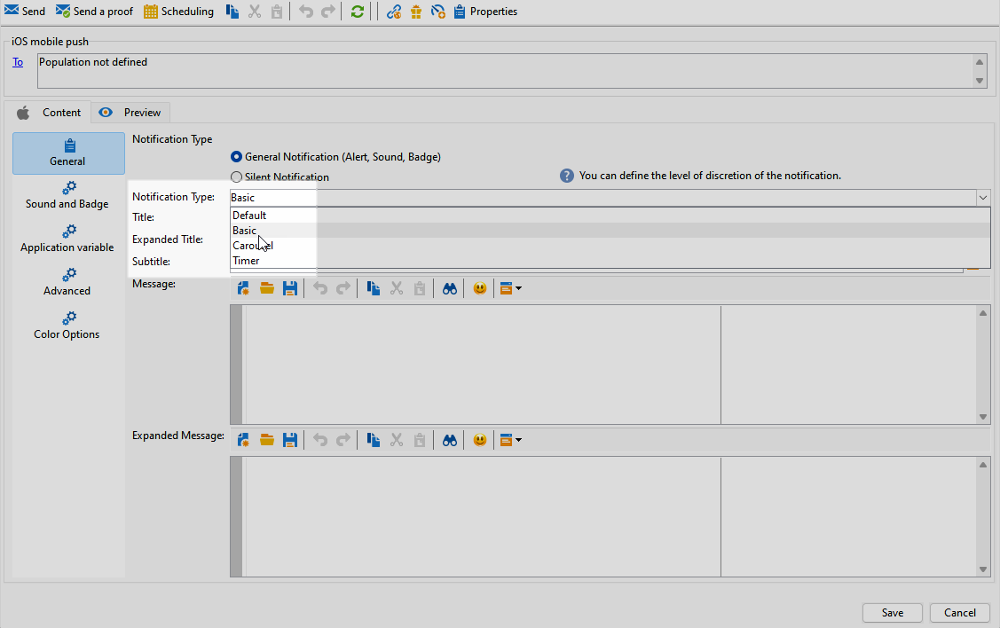

# 设计 iOS 富推送投放 {#rich-push}

>[!IMPORTANT]
>
>在设计富推送通知之前，您首先需要配置V2连接器。 有关详细过程，请参阅[此页面](https://experienceleague.adobe.com/en/docs/campaign-classic/using/sending-messages/sending-push-notifications/configure-the-mobile-app/configuring-the-mobile-application)。

## 定义iOS通知的内容 {#push-message}

创建推送投放后，您可以使用以下模板之一定义其内容：

* **默认**&#x200B;允许您发送带有简单图标和随附图像的通知。

* **基本**&#x200B;可以在通知中包含文本、图像和按钮。

* 通过&#x200B;**轮播**，您可以发送包含用户可以轻扫的文本和多个图像的通知。

浏览以下选项卡，详细了解如何个性化这些模板。

>[!BEGINTABS]

>[!TAB 默认值]

1. 选择&#x200B;**[!UICONTROL General notification (Alert, Sound, Badge)]**&#x200B;作为您的&#x200B;**[!UICONTROL Notification type]**。

1. 从&#x200B;**[!UICONTROL Notification Type]**&#x200B;下拉列表中选择&#x200B;**[!UICONTROL Default]**。

   

1. 在&#x200B;**[!UICONTROL Title]**&#x200B;字段中，输入要显示在通知中心可用通知列表中的标题标签。

   此字段允许您定义iOS通知有效负载的&#x200B;**title**&#x200B;参数的值。

1. 或者，添加与iOS通知有效负载的&#x200B;**subtitle**&#x200B;参数相对应的&#x200B;**[!UICONTROL Subtitle]**。

1. 在向导的&#x200B;**[!UICONTROL Message content]**&#x200B;部分中输入消息的内容。

   

1. 导航到&#x200B;**[!UICONTROL Sound and Badge]**&#x200B;选项卡以自定义其他设置，如通知的声音和徽章选项。 [了解详情](#sound-badge)

   

1. 在&#x200B;**[!UICONTROL Application variables]**&#x200B;选项卡中，您的&#x200B;**[!UICONTROL Application variables]**&#x200B;将自动添加。 它们允许您定义通知行为，例如，您可以配置在用户激活通知时显示的特定应用程序屏幕。

1. 要进一步自定义，请浏览可用于推送通知的&#x200B;**[!UICONTROL Advanced options]**。 [了解详情](#push-advanced)

   

1. 配置通知后，单击&#x200B;**[!UICONTROL Preview]**&#x200B;选项卡预览通知。

>[!TAB 基本]

1. 选择&#x200B;**[!UICONTROL General notification (Alert, Sound, Badge)]**&#x200B;作为您的&#x200B;**[!UICONTROL Notification type]**。

1. 从&#x200B;**[!UICONTROL Notification Type]**&#x200B;下拉列表中选择&#x200B;**[!UICONTROL Basic]**。

   

1. 若要撰写邮件，请在&#x200B;**[!UICONTROL Title]**、**[!UICONTROL Expanded message]**、**[!UICONTROL Message]**&#x200B;和&#x200B;**[!UICONTROL Expanded message]**&#x200B;字段中输入您的文本。

   展开通知时，显示&#x200B;**[!UICONTROL Expanded message]**&#x200B;时，**[!UICONTROL Message]**&#x200B;文本将显示在折叠视图中。

   

1. 或者，添加与iOS通知有效负载的&#x200B;**subtitle**&#x200B;参数相对应的&#x200B;**[!UICONTROL Subtitle]**。

1. 导航到&#x200B;**[!UICONTROL Sound and Badge]**&#x200B;选项卡以自定义其他设置，如通知的声音和徽章选项。 [了解详情](#sound-badge)

1. 在&#x200B;**[!UICONTROL Application variables]**&#x200B;选项卡中，您的&#x200B;**[!UICONTROL Application variables]**&#x200B;将自动添加。 它们允许您定义通知行为，例如，您可以配置在用户激活通知时显示的特定应用程序屏幕。

1. 要进一步自定义，请浏览可用于推送通知的&#x200B;**[!UICONTROL Advanced options]**。 [了解详情](#push-advanced)

   

1. 在&#x200B;**[!UICONTROL Color options]**&#x200B;菜单中，输入&#x200B;**[!UICONTROL Title]**、**[!UICONTROL Message]**&#x200B;和&#x200B;**[!UICONTROL Background]**&#x200B;的十六进制颜色代码。

   

定义消息内容后，您可以使用测试订阅者来预览和测试消息。

>[!TAB 轮播]

1. 选择&#x200B;**[!UICONTROL General notification (Alert, Sound, Badge)]**&#x200B;作为您的&#x200B;**[!UICONTROL Notification type]**。

1. 从&#x200B;**[!UICONTROL Notification Type]**&#x200B;下拉列表中选择&#x200B;**[!UICONTROL Carousel]**。

   

1. 若要撰写邮件，请在&#x200B;**[!UICONTROL Title]**、**[!UICONTROL Expanded Title]**&#x200B;和&#x200B;**[!UICONTROL Message]**&#x200B;字段中输入您的文本。

   

1. 导航到&#x200B;**[!UICONTROL Sound and Badge]**&#x200B;选项卡以自定义其他设置，如通知的声音和徽章选项。 [了解详情](#sound-badge)

1. 在&#x200B;**[!UICONTROL Application variables]**&#x200B;选项卡中，您的&#x200B;**[!UICONTROL Application variables]**&#x200B;将自动添加。 它们允许您定义通知行为，例如，您可以配置在用户激活通知时显示的特定应用程序屏幕。

   

1. 要进一步自定义，请浏览可用于推送通知的&#x200B;**[!UICONTROL Advanced options]**。 [了解详情](#push-advanced)

1. 在&#x200B;**[!UICONTROL Color options]**&#x200B;菜单中，输入&#x200B;**[!UICONTROL Title]**、**[!UICONTROL Message]**&#x200B;和&#x200B;**[!UICONTROL Background]**&#x200B;的十六进制颜色代码。

1. 选择&#x200B;**[!UICONTROL Carousel]**&#x200B;在&#x200B;**[!UICONTROL Carousel options]**&#x200B;选项卡中的操作方式：

   * **[!UICONTROL Auto]**：将图像作为幻灯片自动循环，以预定义的间隔转换。
   * **[!UICONTROL Manual]**：允许用户在幻灯片之间手动滑动以浏览图像。

1. 单击&#x200B;**[!UICONTROL Add image]**&#x200B;并输入您的&#x200B;**[!UICONTROL Image URL]**、**[!UICONTROL Text]**&#x200B;和&#x200B;**[!UICONTROL Action URL]**。

   确保您至少包含三个图像，最多包含五个图像。

   

定义消息内容后，您可以使用测试订阅者来预览和测试消息。

>[!TAB 计时器]

1. 选择&#x200B;**[!UICONTROL General notification (Alert, Sound, Badge)]**&#x200B;作为您的&#x200B;**[!UICONTROL Notification type]**。

1. 从&#x200B;**[!UICONTROL Notification Type]**&#x200B;下拉列表中选择&#x200B;**[!UICONTROL Timer]**。

   

1. 若要撰写邮件，请在&#x200B;**[!UICONTROL Title]**、**[!UICONTROL Expanded title]**、**[!UICONTROL Message]**&#x200B;和&#x200B;**[!UICONTROL Expanded message]**&#x200B;字段中输入您的文本。

   展开通知时，显示&#x200B;**[!UICONTROL Expanded message]**&#x200B;时，**[!UICONTROL Message]**&#x200B;文本将显示在折叠视图中。

   

1. 或者，添加与iOS通知有效负载的&#x200B;**subtitle**&#x200B;参数相对应的&#x200B;**[!UICONTROL Subtitle]**。

1. 导航到&#x200B;**[!UICONTROL Sound and Badge]**&#x200B;选项卡以自定义其他设置，如通知的声音和徽章选项。 [了解详情](#sound-badge)

1. 在&#x200B;**[!UICONTROL Application variables]**&#x200B;选项卡中，您的&#x200B;**[!UICONTROL Application variables]**&#x200B;将自动添加。 它们允许您定义通知行为，例如，您可以配置在用户激活通知时显示的特定应用程序屏幕。

1. 要进一步自定义，请浏览可用于推送通知的&#x200B;**[!UICONTROL Advanced options]**。 [了解详情](#push-advanced)

1. 在&#x200B;**[!UICONTROL Color options]**&#x200B;菜单中，输入&#x200B;**[!UICONTROL Title]**、**[!UICONTROL Message]**&#x200B;和&#x200B;**[!UICONTROL Background]**&#x200B;的十六进制颜色代码。

   

1. 在&#x200B;**[!UICONTROL Timer]**&#x200B;选项卡中，以秒为单位设置您的&#x200B;**[!UICONTROL Timer duration]**，或将&#x200B;**[!UICONTROL Timer end timestamp]**&#x200B;设置为特定纪元时间戳。

1. 在&#x200B;**[!UICONTROL Alternate title]**、**[!UICONTROL Alternate message]**&#x200B;和&#x200B;**[!UICONTROL Alternate image]**&#x200B;字段中输入计时器过期后显示的文本和图像。

   

定义消息内容后，您可以使用测试订阅者来预览和测试消息。

>[!ENDTABS]

## 推送通知高级设置 {#push-advanced}

### 声音和徽章选项 {#sound-badge}

| 参数 | 说明 |
|---------|---------|
| **[!UICONTROL Clean Badge]** | 启用此选项以刷新标记值。 |
| **[!UICONTROL Value]** | 设置一个数字，该数字将用于直接在应用程序图标上显示新未读信息的数量。 |
| **[!UICONTROL Critical alert mode]** | 启用此选项后，即使用户的手机设置为焦点模式或iPhone处于静音状态，也可以向通知添加声音。 |
| **[!UICONTROL Name]** | 当接收到通知时，选择移动终端要播放的声音。 |
| **[!UICONTROL Volume]** | 将音量从0设置为100。 声音必须包含在应用程序中，并在创建服务时定义。 |

### 高级选项 {#notification-options}

| 参数 | 说明 |
|---------|---------|
| **[!UICONTROL Mutable content]** | 启用此选项可允许移动应用程序下载媒体内容。 |
| **[!UICONTROL Thread-id]** | 设置用于将相关通知分组在一起的标识符。 |
| **[!UICONTROL Category]** | 设置将显示操作按钮的类别ID的名称。 这些通知为用户提供了一种更快的方式，无需在应用程序中打开或导航即可响应通知执行不同任务。 |
| **[!UICONTROL Target content ID]** | 设置标识符，用于在打开通知时定向要前转的应用程序窗口。 |
| **[!UICONTROL Launch image]** | 设置要显示的启动图像文件的名称。 如果用户选择启动您的应用程序，则会显示选定的图像而不是应用程序的启动屏幕。 |
| **[!UICONTROL Click action]** | 设置与用户单击您的通知关联的操作。 |
| **[!UICONTROL Interruption level]** | <ul><li>活动：默认设置为，系统立即显示通知，在屏幕上亮起，并可播放声音。 通知不会突破焦点模式。</li><li>被动：系统将通知添加到通知列表，而不打开屏幕或播放声音。 通知不会突破焦点模式。</li><li> 时效性：系统立即显示通知，在屏幕上亮起，可以播放声音并突破焦点模式。 此级别不需要Apple的特殊权限。</li><li>严重：系统立即显示通知，在屏幕上亮起，并绕过静音开关或聚焦模式。 请注意，此级别需要Apple的特殊权限。</li></ul> |
| **[!UICONTROL Relevance score]** | 将相关性得分从0设置为100。 系统使用此选项对通知摘要中的通知进行排序。 |
