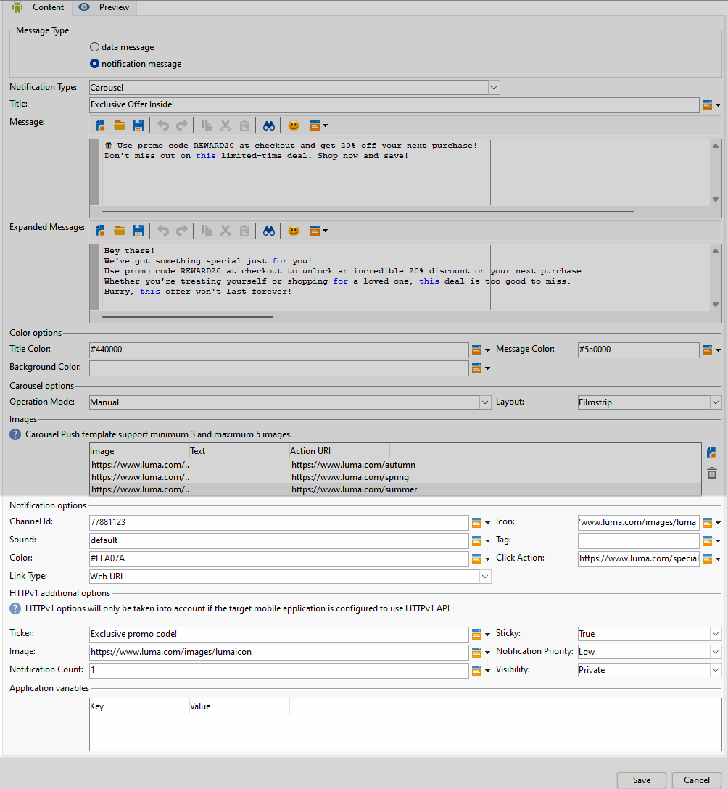

# 设计Android富推送投放 {#rich-push}

使用Firebase Cloud Messaging，您可以选择两种类型的消息：

* 此 **[!UICONTROL Data message]** 由客户端应用程序处理。 这些消息直接发送到移动设备应用程序，后者在设备上生成并显示Android通知。 数据消息仅包含您的自定义应用程序变量。

* 此 **[!UICONTROL Notification message]**，由FCM SDK自动处理。 FCM会代表客户端应用程序在用户设备上自动显示消息。 通知消息包含预定义的一组参数和选项，但仍可以使用自定义应用程序变量进一步个性化。

## 定义通知的内容 {#push-message}

创建推送投放后，即可定义其内容。 提供了三个模板：

* **默认模板** 允许您发送带有简单图标和随附图像的通知。

* **基本模板** 可以在通知中包含文本、图像和按钮。

* **轮播模板** 允许您发送包含用户可以轻扫的文本和多个图像的通知。

浏览以下选项卡，了解如何为每个模板撰写消息。

>[!BEGINTABS]

>[!TAB 默认模板]

1. 从 **[!UICONTROL Notification type]** 下拉列表，选择 **[!UICONTROL Default]**.

   

1. 要撰写消息，请在 **[!UICONTROL Title]** 和 **[!UICONTROL Message]** 字段。

   

1. 使用动态个性化字段定义内容、个性化数据和添加动态内容。 [了解详情](../send/personalize.md)

1. 要进一步个性化您的推送通知，请配置 **[!UICONTROL Notification options]** 和 **[!UICONTROL HTTPv1 additional options]** 的推送通知。 [了解详情](#push-advanced)

   

定义消息内容后，您可以使用测试订阅者来预览和测试消息。

>[!TAB 基本模板]

1. 从 **[!UICONTROL Notification Type]** 下拉列表，选择 **[!UICONTROL Basic]**.

   

1. 要撰写消息，请在 **[!UICONTROL Title]**， **[!UICONTROL Message]** 和 **[!UICONTROL Expanded message]** 字段。

   此 **[!UICONTROL Message]** 文本显示在折叠的视图中，而 **[!UICONTROL Expanded message]** 在展开通知时显示。

   

1. 使用动态个性化字段定义内容、个性化数据和添加动态内容。 [了解详情](../send/personalize.md)

1. 在 **[!UICONTROL Color options]** 菜单，输入您的菜单的十六进制颜色代码 **[!UICONTROL Title]**， **[!UICONTROL Message]** 和 **[!UICONTROL Background]**.

1. 添加 **[!UICONTROL Remind later button]** 如果需要。 输入您的 **[!UICONTROL Reminder Text]** 和 **日期** （在相应的字段中）。

   此 **[!UICONTROL Reminder Date]** 字段需要一个值，以秒为单位表示纪元。

1. 单击 **[!UICONTROL Add button]** 并填写以下字段：

   * **[!UICONTROL Label]**：按钮上显示的文本。
   * **[!UICONTROL Link URI]**：指定单击按钮时要执行的URI。

   您可以选择在推送通知中最多包含三个按钮。 如果您选择 **[!UICONTROL Remind later button]**&#x200B;中，您最多只能包含两个按钮。

1. 选择 **[!UICONTROL Link type]** 的链接URL的路径：

   * **[!UICONTROL Web URL]**：Web URL可将用户指引到在线内容。 单击后，它们将提示设备的默认Web浏览器打开并导航到指定的URL。

   * **[!UICONTROL Deeplink]**：深层链接是指引导用户访问应用程序中特定部分的URL，即使应用程序已关闭。 单击时，会显示一个对话框，允许用户从能够处理链接的各种应用程序中进行选择。

   * **[!UICONTROL Open App]**：打开应用程序URL，以便直接连接到应用程序中的内容。 它使您的应用程序能够绕过消除歧义对话框，将自身确立为特定类型链接的默认处理程序。

   有关如何处理Android应用程序链接的更多信息，请参阅 [Android开发人员文档](https://developer.android.com/training/app-links).

   

1. 要进一步个性化您的推送通知，请配置 **[!UICONTROL Notification options]** 和 **[!UICONTROL HTTPv1 additional options]** 的推送通知。 [了解详情](#push-advanced)

   

定义消息内容后，您可以使用测试订阅者来预览和测试消息。

>[!TAB 轮播模板]

1. 从 **[!UICONTROL Notification Type]** 下拉列表，选择 **[!UICONTROL Carousel]**.

   

1. 要撰写消息，请在 **[!UICONTROL Title]**， **[!UICONTROL Message]** 和 **[!UICONTROL Expanded message]** 字段。

   此 **[!UICONTROL Message]** 文本显示在折叠的视图中，而 **[!UICONTROL Expanded message]** 在展开通知时显示。

   

1. 使用表达式编辑器定义内容、个性化数据和添加动态内容。 [了解详情](../send/personalize.md)

1. 在 **[!UICONTROL Color options]** 菜单，输入您的菜单的十六进制颜色代码 **[!UICONTROL Title]**， **[!UICONTROL Message]** 和 **[!UICONTROL Background]**.

1. 选择如何 **[!UICONTROL Carousel]** 运行：

   * **[!UICONTROL Auto]**：将图像作为幻灯片自动循环，以预定义的时间间隔转换。
   * **[!UICONTROL Manual]**：允许用户在幻灯片之间手动滑动以浏览图像。

1. 从 **[!UICONTROL Layout]** 下拉列表，选择 **[!UICONTROL Filmstrip]** 选项，在主幻灯片旁包括上一张和下一张图像的预览。

1. 单击 **[!UICONTROL Add image]** 并输入图像URL、文本和操作URL。

   确保您至少包含三个图像，最多包含五个图像。

   

1. 要进一步个性化您的推送通知，请配置 **[!UICONTROL Notification options]** 和 **[!UICONTROL HTTPv1 additional options]** 的推送通知。 [了解详情](#push-advanced)

   

定义消息内容后，您可以使用测试订阅者来预览和测试消息。

>[!ENDTABS]

## 推送通知高级设置 {#push-advanced}

### 通知选项 {#notification-options}

| 参数 | 说明 |
|---------|---------|
| **[!UICONTROL Channel ID]** | 设置通知的渠道ID。 在收到任何具有此渠道ID的通知之前，应用程序必须创建具有此渠道ID的渠道。 |
| **[!UICONTROL Icon]** | 将通知的图标设置为显示在用户档案的设备上。 |
| **[!UICONTROL Sound]** | 设置设备收到通知时播放的声音。 |
| **[!UICONTROL Tag]** | 设置用于替换通知抽屉中现有通知的标识符。 这有助于防止累积多个通知，并确保只显示最新的相关通知。 |
| **[!UICONTROL Color]** | 使用十六进制颜色代码设置通知的图标颜色。 |
| **[!UICONTROL Click action]** | 设置与用户单击您的通知关联的操作。 |
| **[!UICONTROL Notification background color]** | 使用十六进制颜色代码设置通知背景的颜色。 |
| **[!UICONTROL Link type]** | <ul><li>Web URL： Web URL可将用户指引到在线内容。 单击后，它们将提示设备的默认Web浏览器打开并导航到指定的URL。</li><li>深层链接：深层链接是指引导用户访问应用程序中的特定部分的URL，即使应用程序已关闭也是如此。 单击时，会显示一个对话框，允许用户从能够处理链接的各种应用程序中进行选择。</li><li> 打开应用程序：打开应用程序URL允许您直接连接到应用程序中的内容。 它使您的应用程序能够绕过消除歧义对话框，将自身确立为特定类型链接的默认处理程序。</li></ul> |

### HTTPv1其他选项 {#additional-options}

| 参数 | 说明 |
|---------|---------|
| **[!UICONTROL Ticker]** | 设置通知的滚动条文本。 仅适用于设置为Android 5.0 Lollipop的设备。 |
| **[!UICONTROL Sticky]** | 激活后，通知仍保持可见，即使用户单击它也是如此。  如果停用，则当用户与通知交互时，会自动取消通知。 粘性行为允许重要通知在屏幕上保留较长时间。 |
| **[!UICONTROL Image]** | 设置要在通知中显示的图像URL。 |
| **[!UICONTROL Notification Priority]** | 设置通知的优先级，可以是默认、最小、低或高。 优先级决定了通知的重要性和紧迫性，会影响通知的显示方式以及它是否可以绕过某些系统设置。 有关详细信息，请参见 [FCM文档](https://firebase.google.com/docs/reference/fcm/rest/v1/projects.messages#notificationpriority). |
| **[!UICONTROL Notification Count]** | 设置直接在应用程序图标上显示的新未读信息数。 这样用户即可迅速了解待处理通知的数量。 |
| **[!UICONTROL Visibility]** | 设置通知的可见性级别，可以是公共、私有或机密。 可见性级别确定通知内容在锁屏界面和其他敏感区域上显示的程度。 欲了解更多信息，请参见 [FCM文档](https://firebase.google.com/docs/reference/fcm/rest/v1/projects.messages#visibility). |
| **[!UICONTROL Application variables]** | 允许您定义通知行为。 可完全自定义这些变量，并将其纳入发送到移动设备的消息负载。 |
