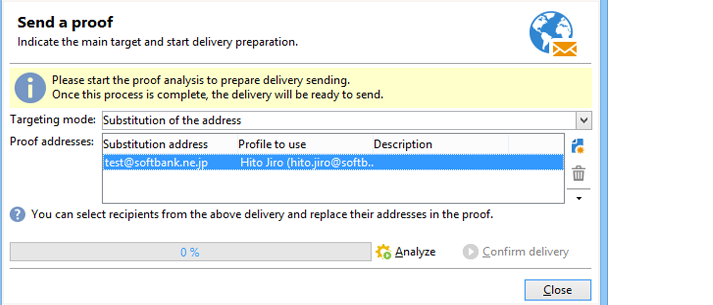

# 在日本手机上发送电子邮件 {#sending-emails-on-japanese-mobiles}

## 日本手机版的电子邮件格式 {#email-formats-for-japanese-mobiles}

Adobe Campaign为手机上的电子邮件管理三种特定的日文格式：**装饰邮件** (DoCoMo mobiles)、**装饰邮件** (Softbank mobiles)和&#x200B;**装饰邮件** (KDDI AU mobiles)。 这些格式施加特定的编码、结构和大小限制。 在[本节](#limitations-and-recommendations)中了解关于限制和建议的更多信息。

为了让收件人正确接收这些格式之一的邮件，我们建议在相应的用户档案中选择&#x200B;**[!UICONTROL Deco-mail (DoCoMo)]**、**[!UICONTROL Decore Mail (Softbank)]**&#x200B;或&#x200B;**[!UICONTROL Decoration Mail (KDDI AU)]**：

但是，如果您将&#x200B;**[!UICONTROL Email format]**&#x200B;选项保留为&#x200B;**[!UICONTROL Unknown]**、**[!UICONTROL HTML]**&#x200B;或&#x200B;**[!UICONTROL Text]**，Adobe Campaign将自动检测（发送电子邮件时）要使用的日语格式，以便正确显示邮件。

此自动检测系统基于&#x200B;**[!UICONTROL Management of Email Formats]**&#x200B;邮件规则集中定义的预定义域列表。 有关管理电子邮件格式的更多信息，请参阅[Campaign Classic文档](https://experienceleague.adobe.com/docs/campaign-classic/using/installing-campaign-classic/additional-configurations/email-deliverability.html?lang=zh-Hans#managing-email-formats)。

## 限制和建议 {#limitations-and-recommendations}

对于发送将在日本供应商(Softbank、DoCoMo、KDDI AU)运营的移动设备上读取的电子邮件，存在一定数量的限制。

因此，您必须：

* 仅使用JPEG或GIF格式的图像
* 创建一个包含严格小于10 000字节的文本和HTML部分的投放（对于KDDI AU和DoCoMo）
* 使用总大小（编码前）小于100 KB的图像
* 每条消息使用的图像不超过20个
* 使用缩小的HTML格式（每个运算符可用的标记数量有限）

>[!NOTE]
>
>创建消息时，必须考虑特定于每个操作员的限制。 请参阅他们的产品文档。

## 测试电子邮件内容 {#testing-the-email-content}

### 预览消息 {#previewing-the-message}

Adobe Campaign允许您检查消息格式是否适合发送到日本移动设备。

定义内容并输入电子邮件主题后，您可以在创建消息时检查显示和格式设置。

在内容编辑窗口的&#x200B;**[!UICONTROL Preview]**&#x200B;选项卡中，单击&#x200B;**[!UICONTROL More... > Deco-mail diagnostic]**&#x200B;允许您：

* 检查HTML内容标记是否符合日语格式限制
* 检查消息中的图像数量是否未超过格式所施加的限制（20个图像）
* 检查邮件总大小（小于100kB）

  

### 运行类型规则 {#running-typology-rule}

除了预览诊断之外，在发送证明或投放时还会执行第二次检查：在分析期间启动特定分类规则&#x200B;**[!UICONTROL Deco-mail check]**。

>[!IMPORTANT]
>
>仅当至少有一个收件人配置为接收&#x200B;**[!UICONTROL Deco-mail (DoCoMo)]**、**[!UICONTROL Decore Mail (Softbank)]**&#x200B;或&#x200B;**[!UICONTROL Decoration Mail (KDDI AU)]**&#x200B;格式的电子邮件时，才会执行此分类规则。

通过此分类规则，您可以确保投放符合日语运算符定义的[格式约束](#limitations-and-recommendations)，尤其是相对于电子邮件的总大小、HTML和文本部分的大小、邮件中的图像数量以及HTML内容中的标记。

### 发送校样 {#sending-proofs}

您可以发送校样以测试您的投放。 发送验证时，如果使用替换地址，请输入与所用用户档案的电子邮件格式对应的地址。

例如，如果事先在&#x200B;**[!UICONTROL Decore Mail (Softbank)]**&#x200B;上定义了此配置文件的电子邮件格式，则可以使用test@softbank.ne.jp替换此配置文件的地址。

## 发送消息 {#sending-messages}

要使用Campaign向日语电子邮件格式的收件人发送电子邮件，可以使用两个选项：

* 创建两个投放：一个仅用于日本收件人，另一个用于其他收件人 — 请参阅[此章节](#designing-a-specific-delivery-for-japanese-formats)。
* 创建一个投放，Adobe Campaign将自动检测要使用的格式 — 请参阅[此章节](#designing-a-delivery-for-all-formats)。

### 为日语格式设计特定投放 {#designing-a-specific-delivery-for-japanese-formats}

您可以创建一个包含两个投放的工作流：一个投放在日本移动设备上读取，另一个投放适用于具有标准电子邮件格式的收件人。

为此，请在工作流中使用&#x200B;**[!UICONTROL Split]**&#x200B;活动，并将日文电子邮件格式（装饰邮件、装饰邮件和装饰邮件）定义为筛选条件。

### 为所有格式设计投放 {#designing-a-delivery-for-all-formats}

当Adobe Campaign根据域（具有定义为&#x200B;**[!UICONTROL Unknown]**、**[!UICONTROL HTML]**&#x200B;或&#x200B;**[!UICONTROL Text]**&#x200B;的电子邮件格式的用户档案）动态管理格式时，您可以向所有收件人发送相同的投放。

消息联系人将在日本手机上正确显示给用户，就像标准收件人一样。

>[!IMPORTANT]
>
>请确保遵守与每种日语电子邮件格式（装饰邮件、装饰邮件和装饰邮件）相关的特殊功能。 有关限制的更多信息，请参阅[此章节](#limitations-and-recommendations)。
