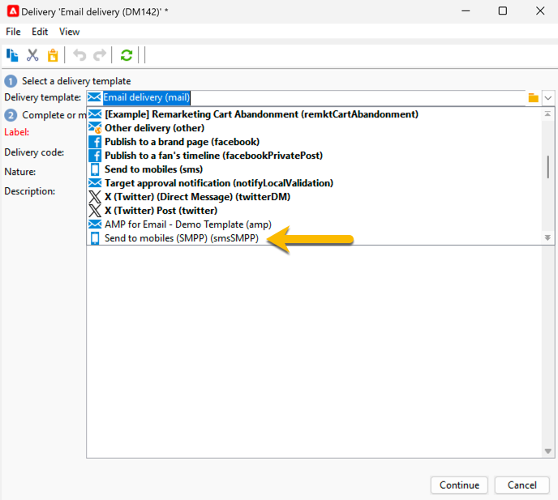

# 创建您的第一个短信投放 {#sms-delivery}

要创建新的短信投放，请执行以下步骤：

1. 创建新投放并选择您为短信发送创建的[短信投放模板](sms-mid-sourcing.md#sms-delivery-template)。

   {zoomable="yes"}

   [此页面](../../start/create-message.md)中详细介绍了投放创建步骤。

<!--
 * For standalone instance,  [learn more here](sms-standalone-instance.md#sms-delivery-template).
* For mid-sourcing infrastructure,
-->

1. 在&#x200B;**[!UICONTROL Label]**&#x200B;字段中重命名您的投放，并根据跟踪需要，在&#x200B;**[!UICONTROL Delivery code]**&#x200B;字段和&#x200B;**[!UICONTROL Nature]**&#x200B;列表中添加信息。 您还可以向投放添加&#x200B;**[!UICONTROL Description]**。

1. 单击&#x200B;**[!UICONTROL Continue]**&#x200B;按钮。 现在，您的投放中提供了模板的所有设置。

1. 您可以签入&#x200B;**[!UICONTROL Properties]**&#x200B;按钮，确认所有设置都已根据需要完成。 [了解有关短信选项卡的更多信息](sms-delivery-settings.md#sms-tab)

   {zoomable="yes"}

1. [定义投放的内容](sms-content.md)。

1. [选择受众](sms-audience.md)。

定义受众的步骤详见[此页面](../../audiences/create-audiences.md)。

## 验证并发送短信 {#sms-validate}

创建投放后，您可以：

1. [发送校样](sms-proofs.md)以验证渲染和内容，

1. 然后，[发送给最终受众](sms-send.md)。

## 监测和跟踪短信 {#sms-monitor}

发送后，[了解如何监视和跟踪你的短信](sms-monitor.md)。
