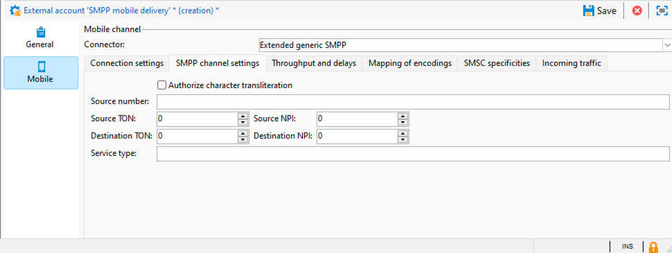

# SMPP外部帐户设置 {#smpp-external-account}

Adobe Campaign使用SMPP协议向服务提供商发送短信。

>[!IMPORTANT]
>
>Adobe Campaign支持SMPP协议版本3.4。

Adobe Campaign中的SMS连接器提供了许多选项来调整其行为，以便与大多数SMPP提供商兼容，这些SMPP提供商往往与官方规范稍有偏差。

>[!IMPORTANT]
>
>建立与新提供商的连接可能需要一些技术技能、TCP知识、二进制、十六进制表示和文本编码。 它还需要与提供者积极合作。

SMS服务提供商端的网络设备通常称为SMSC。

## 连接设置 {#smpp-connection-settings}

{zoomable="yes"}

以下是设置连接所需的参数及其角色：

* **SMSC实施名称**：设置SMSC实施的名称。 它应设置为您的提供商的名称。 此字段的角色在SMPP错误管理部分中描述。
* **服务器**：要连接的服务器的DNS名称或IP地址。
* **端口**：要连接的TCP端口。
* **帐户**：连接的登录名。 在BIND PDU的system_id字段中传递。
* **密码**： SMPP连接的密码。 在BIND PDU的密码字段中传递。
* **系统类型**： BIND PDU的system_type字段中传递的值。 某些提供商需要在此指定特定值。
* **MTA子连接数**：这定义每个发送线程打开的连接数。
可使用以下公式计算连接总数：
  *总连接数= SMS进程数*发送线程数* MTA子连接数*

   * 短信进程数通常为1。 在某些非常高性能实例上，多个短信进程可能并行启动。
   * 在serverConf中设置发送线程数（sendingThreads设置）。 默认为1。
   * MTA子连接数是外部帐户中的此设置。

  使用缺省值，此设置直接设置连接数。

在&#x200B;**收发器模式**&#x200B;中，这是连接总数。

在&#x200B;**发射器+接收器模式**中，这将定义发射器+接收器对（一对=一个发射器+一个接收器）的数量。
无法改变发送器和接收器之间的平衡。

* **通过专用进程发送消息**：
对于Adobe Campaign v8.7.2及更高版本，应始终启用此选项。 它对消息的处理方式具有许多影响。
* **SMPP连接模式**：
以收发器模式或分开的发送器+接收器模式设置连接。
   * 发射器+接收器（或TX+RX）：两个单独的TCP连接用于发送和接收消息。
   * 收发器（或TRX）：单个TCP连接用于发送和接收消息。
* **为接收方使用不同的参数**：
仅在发射器+接收器模式下可用。
如果未选中该框，则会对发射器和接收器使用相同的设置。 选中该框后，标准设置将仅应用于发射器，而接收器设置将仅应用于接收器。
* **接收服务器，端口，帐户，密码，系统类型**
这些设置适用于处于发射器+接收器模式的接收器。 它们的工作方式与发射器部分类似，请参阅上面的[更多详细信息](#smpp-connection-settings)。
* **在日志文件中启用详细的SMPP跟踪**
启用后，会将额外的日志输出到日志文件。 这对于故障排除非常有用，但如果不需要故障排除，则应在高吞吐量实例上保持禁用状态。

## SMPP渠道设置 {#smpp-channel-settings}

{zoomable="yes"}

### 授权字符音译

音译是查找与缺少的字符等价的字符的过程。 例如，GSM编码中缺少法语“e”（带抑扬符）字符，但它可以替换为“e”，而不会太妨碍可读性。

如果未选中此框，则当无法按原样对字符串进行编码时，文本编码将失败。

选中此框后，文本编码将尝试将字符串转换为近似版本，而不是失败。 如果某些字符在目标编码中没有等效字符，则文本编码将失败。

请参阅[定义编码设置的特定映射](#mapping-encodings)，以获取编码过程的更一般说明。

### 来源编号

定义消息的默认源地址。 此设置仅适用于投放中源编号留空的情况。 默认情况下，不会传递源编号字段，因此提供商会将其替换为短代码。

这将启用发件人地址/ADC覆盖功能。

### Source TON/NPI，目的地TON/NPI

TON（编号类型）和NPI（编号计划指示器）（见SMPP 3.4规范的第5.2.5节）。 应将这些值设置为提供商所需的任何值。

它们按原样在SUBMIT_SM PDU的source_addr_ton 、 source_addr_npi 、 dest_addr_ton和dest_addr_npi字段中传输。

### 服务类型

此字段将按原样在SUBMIT_SM PDU的service_type字段中传输。 将此参数设置为提供商所需的任何值。

## 吞吐量和延迟 {#smpp-delays}

{zoomable="yes"}

这些设置控制SMPP频道的所有计时方面。 某些提供商需要非常精确地控制消息速率、窗口和重试时限，因此这些设置应该设置为与提供商的容量和合同中指示的条件匹配的值。

### 发送窗口

窗口是无需等待匹配的SUBMIT_SM_RESP即可发送的SUBMIT_SM PDU数。

最大窗口为4的传输示例：

{zoomable="yes"}

当网络链路具有高等待时间时，该窗口有助于提高吞吐量。 窗口的值必须至少是SMS/s数乘以链接的延迟（以秒为单位），以便连接器在发送下一个消息之前从不等待SUBMIT_SM_RESP。

如果窗口太大，则在出现连接问题（极少数情况下）时，可能会发送更多重复消息。 此外，大多数提供商对窗口都有非常严格的限制，并拒绝超出限制的消息。

如何计算最佳发送窗口公式：

测量SUBMIT_SM和SUBMIT_SM_RESP之间的最大延迟。
将该值（以秒为单位）乘以最大MT吞吐量：可得出最佳发送窗口值。
示例：如果在最大MT吞吐量中设置300 SMS/s，并且SUBMIT_SM和SUBMIT_SM_RESP之间平均延迟100毫秒，则最佳值将为300×0.1 = 30。

如有疑问，请选择更大的窗口以避免出现性能问题。

### 最大 MT 吞吐量

每秒和每个连接的最大MT数。 必须严格执行此设置，MTA绝不会以快于此限制的速度推送消息。 它对于需要精确节流的提供商非常有用。

要了解总吞吐量限制，请将此数字乘以连接总数（请参阅上面的公式）。

0表示没有限制，MTA将尽快发送MT。

通常建议将此设置保持在1000以下，因为无法保证超过此数量的精确吞吐量，除非对最终架构进行了正确基准并专门请求了SMPP提供商。 最好将连接数增加到1000 MT/s以上。

### 重新连接前的时间

当TCP连接丢失时，连接器将等待此秒数，然后再尝试建立连接。

### MT 的有效期限

这是SUBMIT_SM与其匹配的SUBMIT_SM_RESP之间的超时。 如果未及时收到RESP，则消息将被视为失败，并且将应用MTA的全局重试策略。

### 绑定超时

TCP连接尝试与BIND_*_RESP回复之间的超时。 如果超时，连接将由Campaign连接器关闭，并且它将等待一段时间后再重新连接，然后重试。

### 查询链接期

inquire_link是一种特殊类型的PDU，发送的目的是保持连接处于活动状态。 此时间段以秒为单位。 Campaign连接器仅在连接空闲时发送inquire_link以节省带宽。 如果在此时间段后两次未收到RESP，则连接将被视为无效，并触发重新连接过程。

## 编码映射 {#mapping-encodings}

有关文本编码的详细信息，请参阅[短信文本编码部分](sms-channel.md#sms-text-encoding)。

此设置允许定义与规范不同的自定义编码映射。 您将能够声明一个编码列表及其data_coding值。 MTA将尝试使用列表中的第一个编码进行编码；如果失败，将尝试使用列表中的下一个编码，依此类推。如果无法使用编码对消息进行编码，则会发生错误。 找到编码后，MTA将使用编码文本创建SUBMIT_SM PDU，并使用表中指定的值设置data_coding字段。

表中的项目顺序很重要：编码是从上到下尝试的。 您应该将最便宜或最推荐的编码放在列表的顶部，然后是越来越昂贵（或不太理想）的编码。

请注意，UCS-2永远不会失败，因为它可以编码Campaign支持的所有字符。 请注意，UCS-2 SMS的最大长度要小得多（仅限70个字符）。

也可以使用此设置通过仅声明映射表中的1行来强制始终使用特定编码。

未选中该复选框时使用的默认映射等效于下表：

| 数据编码 | 编码 |
|:-:|:-:|
| 0 | GSM |
| 8 | UCS-2 |

这意味着MTA将尝试在GSM中编码消息，如果成功，则在将data_coding设置为0的情况下发送消息。

如果无法以GSM对消息进行编码，则将以UCS-2对消息进行编码，并将data_coding设置为8。

## SMSC特性 {#smsc-specificities}

{zoomable="yes"}

### 激活 message_payload

取消选中后，长SMS将由MTA拆分，并使用UDH在多个SUBMIT_SM PDU中发送。 该消息将根据UDH数据由手机重新组合。

选中后，长SMS将在一个SUBMIT_SM PDU中发送，并将文本放置在message_payload可选字段中（有关此内容的详细信息，请参阅SMPP规范）。

如果启用此功能，Campaign将无法单独计算短信部件数量：所有消息都将被计为在一部分发送。

### 发送完整的电话号码

如果未选中此复选框，则只向提供商发送电话号码的号码（SUBMIT_SM字段的destination_addr字段）。 这是默认行为，因为SMPP中的国际数字指示符（通常为+前缀）被替换为TON和NPI字段。

选中此复选框后，电话号码将按原样发送，不进行任何预处理（并且可能包含空格、+前缀或井号/井号/星号）。

此功能还对自动回复隔离功能的行为产生影响：如果未选中此复选框，则会在插入隔离表的电话号码中添加+前缀，以补偿SMPP协议本身从电话号码中删除的+前缀。

### 绑定TON/NPI

TON（编号类型）和NPI（编号计划指示器）（见SMPP 3.4规范的第5.2.5节）。 应将这些值设置为提供商所需的任何值。

它们按原样在BIND PDU的addr_ton和addr_npi字段中传输。

### 地址范围

在BIND PDU的address_range字段中按原样发送。 此值应设置为提供商所需的任何值。

### 无效 ID 确认计数

限制可以为单个SR发送的“消息ID无效”DELIVER_SM_RESP的数量。 **这仅作为解决方法用于故障排除目的**，并在正常情况下设置为0。

详细说明：假设您将此设置设置为2：

* 提供程序发送ID为“1234”的SR (DELIVER_SM)
* 在数据库中找不到ID“1234”
* 连接器计算该ID的1个“无效ID”错误，因此它会发送DELIVER_SM_RESP并显示“消息ID无效”错误代码（正常行为）。
* 提供程序重试ID为“1234”的相同SR
* 在数据库中仍然找不到ID“1234”
* 连接器计算该ID的2个“无效ID”错误，因此即使未正确处理，也会发送DELIVER_SM_RESP“正常”。

此功能旨在当无效的SR阻止无法处理的合法消息时，刷新提供程序端的SR缓冲区。

将此字段设置为0将禁用机制，因此“消息ID无效”始终返回，这是正常行为。

将此字段设置为1可使连接器始终响应“确定”，即使ID无效也是如此。 此值应设置为1，仅在监督下进行故障排除并在最短时间内使用，例如，从提供商方的问题中恢复。

### SR 中 ID 的提取正则表达式

SMPP协议规范未严格强制实施SR格式。 它只是规范附录B中描述的建议。 因此，一些SMPP实施者以不同的方式设置此字段的格式，因此Campaign需要一种方法来提取正确的字段。

默认情况下，它最多捕获“id：”后10个字母数字字符。

正则表达式必须正好具有一个捕获组（包含在括号中的部分）。 括号必须括住与ID对应的部分。 正则表达式格式为PCRE。

调整此设置时，请确保包含尽可能多的上下文，以避免误触发。 如果有特定的前缀（例如，标准中的“id：”），请将其包含在正则表达式中。 同时尽量使用单词分隔符(\b)，以避免在单词中间捕获文本。

在正则表达式中不包含足够的上下文可能会引入一个小的安全缺陷：消息的实际内容可以包含在SR中，因此，如果您只匹配没有上下文的特定ID格式（例如UUID），则它可能会解析实际文本内容（例如，嵌入到文本字段中的UUID），而不是ID。

### SR 中状态的提取正则表达式

此正则表达式从SR消息的文本字段中捕获状态。

默认情况下，它会捕获“stat：”后的5到15个字符。

正则表达式必须有&#x200B;**正好一个捕获组**（包含在括号中的部分）。 必须将对应于状态的部件括在括号中。 正则表达式格式为PCRE。

### 应用正则表达式来确定成功状态

此正则表达式应用于上一个正则表达式（“状态的提取正则表达式”）的结果。 如果正则表达式匹配，则该消息被视为成功。

默认情况下，它匹配以“DELIV”开头的所有内容。 它与标准值“DELIVRD”匹配。

### 应用正则表达式来确定错误状态

此正则表达式应用于上一个正则表达式（“状态的提取正则表达式”）的结果。 如果正则表达式匹配，则该消息被视为错误。

默认情况下，它与规范中描述的所有各种错误状态相匹配。

### SR 中错误代码的提取正则表达式

此正则表达式从SR消息的文本字段中捕获错误代码。

可以在投放日志鉴别中鉴别错误代码。

默认情况下，它会捕获“err：”后3个字符。

### MT确认中的ID格式

这指示SUBMIT_SM_RESP PDU的message_id字段中返回的ID的格式。

* **请勿修改**：该ID在数据库中以ASCII编码文本的形式按原样存储。 不进行预处理或过滤。
* **十进制数**：ID应为ASCII格式的十进制数。 使用此设置时，将删除前导和尾随空格以及前导零。
* **十六进制数字**：ID应为ASCII形式的十六进制数字，不能以0x开头，也不能以h结尾。然后，该ID在存储到数据库中之前被转换为十进制数。
* **十六进制字符串**： ID应为ASCII编码的文本，其本身是编码为十六进制的字节字符串。 例如，在PDU中，您会找到0x34 0x31 0x34 0x32 0x34 0x33，它转换为ASCII“414243”；然后此字符串被解码为十六进制字节字符串，因此您获得“ABC”：您将在数据库中存储ID“ABC”。

### SR 中的 ID 格式

这指示由SR中ID的提取正则表达式捕获的ID的格式。 值与上述MT中的格式具有相同的含义和行为。

### 可选字段中的 SR ID 或错误代码

如果选中，可选字段的内容将附加到上述正则表达式处理的文本中。 文本的格式为“ 0xTAG：VALUE”，0xTAG是标记的4位十六进制值，用大写表示（例如0x002E）。

例如，您可能希望在received_message_id字段中捕获ID。 为此，请启用此复选框，并将以下文本添加到状态：

0x001E：05e3299e-8d37-49d0-97c6-8e4fe60c7739

在本例中，0x001E是可选字段的标记，UUID是字段的值。

为了捕获此值，您现在可以在SR字段中ID的提取正则表达式中设置以下正则表达式：

\b0x001E：([0-9a-f]{8}-[0-9a-f]{4}-[0-9a-f]{4}-[0-9a-f]{4}-[0-9a-f]{12})\b

>[!IMPORTANT]
>
>您只能捕获具有8位文本(ASCII/UTF-8)值的可选字段。 具体而言，使用当前的正则表达式系统无法可靠地捕获二进制字段。

### 文本字段中的 SR ID 或错误代码

如果选中，则在处理SR的状态文本期间将保留文本：字段。 如果提供商将重要数据（如ID或状态）放置在此字段中，这将很有用。 通常，此字段可以安全丢弃，因为它可能包含使用非ASCII编码的文本并中断正则表达式处理。

如果SR字段中的ID提取正则表达式不够具体，则启用此选项可能会引入非常小的安全缺陷：文本字段的内容可能会解析为ID，并且攻击者可能会使用它注入伪造的ID，这可能会导致部分拒绝服务情况。

### 服务ID

允许添加自定义TLV。 此字段设置以十六进制值传递的标记，格式为&#x200B;**0x1234**。

必须在投放的高级参数的“服务或项目ID”字段的投放中设置自定义TLV的值。 该值将作为UTF-8编码文本发送。

此设置仅允许每条消息添加一个TLV选项。

>[!NOTE]
>
>此选项被传递参数中更为强大的&#x200B;**可选SMPP参数(TLV)**&#x200B;设置所取代。 这些特征是互斥的，不能同时使用。

### 通过 SMPP 启用 TLS

如果启用，所有与SMSC的连接将使用TLS加密。

### 证书验证

* **完全证书验证**：连接时检查TLS证书和远程主机名。 此值提供最高级别的安全性。
* **跳过主机名验证**：检查远程TLS证书，但不检查远程主机名是否匹配。 略微降低了安全性。
* **跳过证书验证**：根本不检查TLS证书。 该连接仍被加密，但容易遭受中间人攻击。 会降低安全性。

## 传入流量 {#incoming-traffic}

{zoomable="yes"}

### MO中的可选SMPP参数(TLV)

Campaign允许在MO中接收3个额外的字段（nms：inSms表）：链接短信、别名和大型帐户。 使用SMPP连接器，这些字段中可以填入来自任何可选SMPP参数(TLV)的数据，并具有任何通用格式。

对于每个字段，您可以设置关联的标记及其格式。 要求SMPP服务提供商提供此信息。

* 标记：标记值，以十进制格式(例如12345)或带0x前缀的十六进制（例如0x12ab）。 标记可以介于0和65535之间。
* 格式：用于值的格式。 二进制值都是大字节序带符号的二进制值。 对于文本字段，请选择SMPP提供商使用的编码。

### 自动回复发送至 MO

此功能允许快速向MO回复文本并处理每个短代码黑名单。

*关键字*&#x200B;和&#x200B;*短代码*&#x200B;列定义条件以触发自动回复：如果两个字段匹配，则发送MO并触发其他操作。 要指定通配符，只需将该字段留空。 关键字与MO文本中的第一个字母数字单词匹配，忽略标点和前导空格。 这意味着Keyword字段不能包含空格，并且必须是单个单词。

另外，*关键字*&#x200B;设置是前缀。 例如，如果您指定“AD”，则会匹配“AD”、“ADAPT”和“ADOBE”。 如果您有多个具有相同前缀的关键字，请注意顺序，将从上到下处理关键字。

*Reply*&#x200B;列是要回复的文本。 此字段无可用的个性化设置，回复文本始终相同。 如果您将此字段留空，将不会回复任何消息，但将仍触发其他操作。

*Additional*&#x200B;操作列提供了当关键字和短代码均匹配时要执行的额外操作（空短代码与所有短代码匹配）。 目前，您可以将其添加到隔离或从隔离中删除。 如果您指定其他操作但保留回复字段为空，则将执行操作，但不发送回复。 仅对指定的短代码应用隔离，如果字段留空，则对所有短代码应用隔离。

表中所有条目都按指定的顺序进行处理，直到一个规则匹配为止。 如果多个规则匹配一个MO，则仅应用最顶层的规则。

>[!NOTE]
>
>**发送完整电话号码**&#x200B;设置对自动回复隔离机制的行为产生影响：如果未选中发送完整电话号码，则被隔离的电话号码将带有加号(“+”)前缀，以便与国际电话号码格式兼容。

>[!NOTE]
>
>在中间源架构中，对扩展SMPP连接器应用自动回复需要为外部帐户文件夹上的中间运算符添加写入权限。

>[!IMPORTANT]
>
>在自动回复中应谨慎使用编码，尤其是在复制粘贴时。 文字处理软件倾向于添加额外的格式，例如添加不间断的空格或更改引号到撇号。
