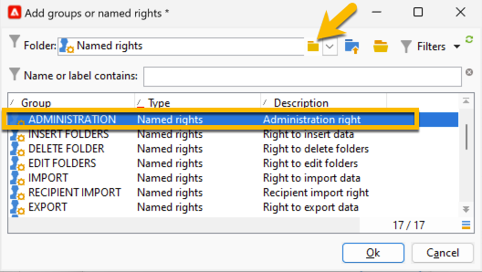
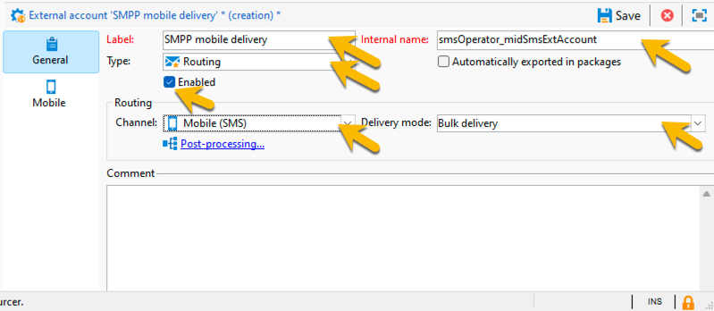
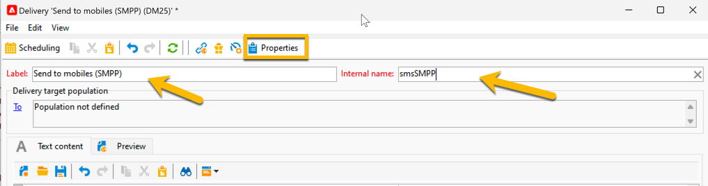

# 中间源基础设施中的SMS {#sms-mid}

>[!IMPORTANT]
>
>本文档适用于Adobe Campaign v8.7.2及更高版本。
>
>对于旧版本，请阅读[Campaign Classicv7文档](https://experienceleague.adobe.com/en/docs/campaign-classic/using/sending-messages/sending-messages-on-mobiles/sms-set-up/sms-set-up)。

使用中间源基础设施发送SMS投放需要：

1. 中间服务器上的短信操作员。 [在此处了解如何创建它](#sms-operator-mid)
1. 营销服务器上的短信外部帐户，它将使用之前创建的运算符。 [在此处了解如何创建它](#sms-external-account)
1. 中间服务器上的SMPP外部帐户，指定渠道和中间源投放模式。 [在此处了解如何创建它](#smpp-external-account-mid)
1. 引用外部帐户以简化发送过程的投放模板。 [在此处了解如何创建它](#sms-delivery-template)

## 在中间服务器上创建短信运算符 {#sms-operator-mid}

首先，您需要在中间服务器上创建一个SMS运算符，该运算符将由Marketing服务器上的短信外部帐户使用。

要创建短信运算符，请执行以下步骤：

1. 在&#x200B;**[!UICONTROL Administration]** > **[!UICONTROL Access management]** > **[!UICONTROL Operators]**&#x200B;中，单击&#x200B;**[!UICONTROL New]**&#x200B;并在打开的新窗口中填写表单。

   * **[!UICONTROL Name (login)]**&#x200B;和&#x200B;**[!UICONTROL Label]**&#x200B;是必需的。
   * 密码不是强制性的，但出于安全考虑，强烈建议使用密码。

   请注意，名称（登录）稍后用于在中间服务器中命名您的SMPP外部帐户。

   {zoomable="yes"}

1. 在&#x200B;**[!UICONTROL Groups and named rights]**&#x200B;部分中，单击&#x200B;**[!UICONTROL Add]**&#x200B;按钮。
在打开的新窗口中，从&#x200B;**[!UICONTROL Folder]**&#x200B;列表中选择&#x200B;**[!UICONTROL Named rights]**，然后在右侧列表中选择&#x200B;**[!UICONTROL ADMINISTRATION]**。

1. 单击&#x200B;**[!UICONTROL Ok]**&#x200B;按钮。

   {zoomable="yes"}

1. 单击&#x200B;**[!UICONTROL Save]**&#x200B;按钮以完成短信操作员的创建。

   {zoomable="yes"}

您现在可以在运算符列表中看到它。

{zoomable="yes"}

## 在营销服务器上创建短信外部帐户 {#sms-external-account}

在中间基础架构中，您需要在营销服务器上创建短信外部帐户，如下所示

>[!IMPORTANT]
>
>对多个外部SMS帐户使用相同的帐户和密码可能会导致帐户之间的冲突和重叠。 在[SMS疑难解答页面](smpp-connection.md#sms-troubleshooting)上了解详情。

1. 在&#x200B;**[!UICONTROL Administration]** > **[!UICONTROL Platform]** > **[!UICONTROL External Accounts]**&#x200B;中，单击&#x200B;**[!UICONTROL New]**&#x200B;图标

   {zoomable="yes"}

1. 设置外部帐户的&#x200B;**[!UICONTROL Label]**&#x200B;和&#x200B;**[!UICONTROL Internal name]**。 将帐户类型定义为&#x200B;**[!UICONTROL Routing]**，选中&#x200B;**[!UICONTROL Enabled]**&#x200B;框，为渠道选择&#x200B;**[!UICONTROL Mobile (SMS)]**，为投放模式选择&#x200B;**[!UICONTROL Mid-sourcing]**。

   {zoomable="yes"}

1. 在&#x200B;**[!UICONTROL Mid-sourcing]**&#x200B;选项卡中，使用中间源服务器URL和之前在中间服务器上创建的SMS运算符填写表单。

   单击&#x200B;**[!UICONTROL Test the connection]**&#x200B;按钮确认连接。

   {zoomable="yes"}

1. 单击 **[!UICONTROL Save]**。

## 在中间服务器上创建SMPP外部帐户 {#smpp-external-account-mid}

>[!IMPORTANT]
>
>对多个外部SMS帐户使用相同的帐户和密码可能会导致帐户之间的冲突和重叠。 请参阅[短信疑难解答页面](smpp-connection.md#sms-troubleshooting)。

目标现在是在中间服务器上建立SMPP外部帐户。

为此请执行以下操作步骤：

1. 在中间服务器的&#x200B;**[!UICONTROL Administration]** > **[!UICONTROL Platform]** > **[!UICONTROL External Accounts]**&#x200B;中，单击&#x200B;**[!UICONTROL New]**&#x200B;图标

1. 设置外部帐户的&#x200B;**[!UICONTROL Label]**&#x200B;和&#x200B;**[!UICONTROL Internal name]**。

   >[!WARNING]
   >
   >分配内部名称时，请确保遵循指定的命名约定： `SMS Operator Name_Internal Name of the Marketing SMS external account`。
   >

   将帐户类型定义为&#x200B;**[!UICONTROL Routing]**，选中&#x200B;**[!UICONTROL Enabled]**&#x200B;框，为渠道选择&#x200B;**[!UICONTROL Mobile (SMS)]**，为投放模式选择&#x200B;**[!UICONTROL Bulk delivery]**。
   {zoomable="yes"}

1. 在&#x200B;**[!UICONTROL Mobile]**&#x200B;选项卡中，将&#x200B;**[!UICONTROL Extended generic SMPP]**&#x200B;保留在&#x200B;**[!UICONTROL Connector]**&#x200B;下拉列表中。

   默认情况下，**[!UICONTROL Send messages through a dedicated process]**&#x200B;框处于选中状态。

   {zoomable="yes"}

   要设置连接，您需要填写此表单的选项卡。 有关详细信息，[了解有关SMPP外部帐户的更多信息](smpp-external-account.md#smpp-connection-settings)。

## 配置投放模板 {#sms-delivery-template}

为了便于创建短信投放，请创建引用了所有设置的短信投放模板。

在营销服务器上的&#x200B;**[!UICONTROL Resources]** > **[!UICONTROL Templates]** > **[!UICONTROL Delivery templates]**&#x200B;中，右键单击现有的Mobile投放模板，然后选择&#x200B;**[!UICONTROL Duplicate]**。

{zoomable="yes"}

更改模板的&#x200B;**[!UICONTROL Label]**&#x200B;和&#x200B;**[!UICONTROL Internal name]**&#x200B;以轻松识别它，然后单击&#x200B;**[!UICONTROL Properties]**&#x200B;按钮。

{zoomable="yes"}

在&#x200B;**[!UICONTROL General]**&#x200B;选项卡的&#x200B;**[!UICONTROL Routing]**&#x200B;中，选择您的SMPP外部帐户。

{zoomable="yes"}

在&#x200B;**[!UICONTROL SMS]**&#x200B;选项卡中，可以向模板添加可选参数。

{zoomable="yes"}

[了解有关此短信选项卡配置的更多信息](sms-delivery-settings.md)。