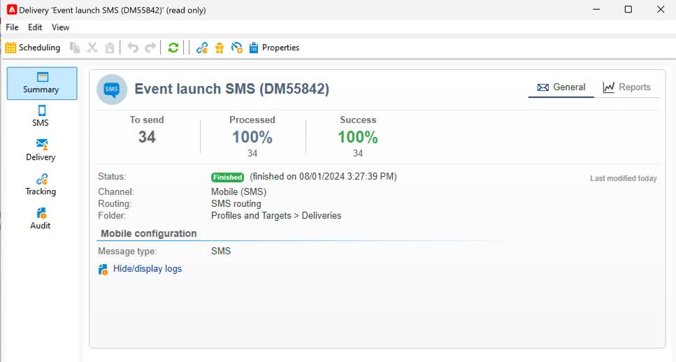
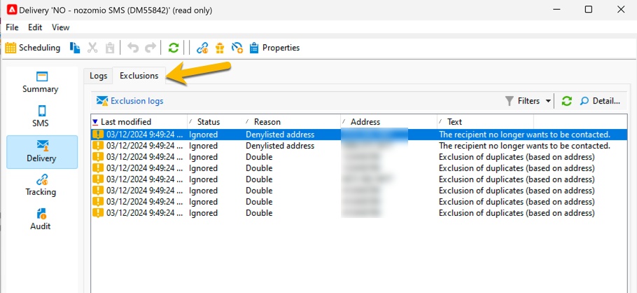

# 监控和跟踪短信

务必监测短信投放，以确保营销活动有效。

下面是您必须了解发送投放后发生情况的可能性

## 了解短信投放仪表板

投放仪表板为您提供关于短信的诸多信息。

要访问仪表板，请在投放列表中双击您的投放。

在&#x200B;**[!UICONTROL Summary]**&#x200B;选项卡中，您拥有主要数据，如已处理的消息数和成功数。

{zoomable="yes"}

发送短信后，无法再访问与投放内容相关的&#x200B;**[!UICONTROL SMS]**&#x200B;选项卡以进行更改。

在&#x200B;**[!UICONTROL Delivery]**&#x200B;选项卡中，您了解有关投放日志的信息。 对于每个联系的地址，您可以查看该短信是否已发送

{zoomable="yes"}

您可以在&#x200B;**[!UICONTROL Exclusions]**&#x200B;选项卡中查看有关为什么从目标中排除某些地址的详细信息。

{zoomable="yes"}

**[!UICONTROL Tracking]**&#x200B;选项卡与跟踪有关。 以下是短信内容中跟踪的URL示例。

{zoomable="yes"}

最后，**[!UICONTROL Audit]**&#x200B;选项卡包含投放启动期间的所有详细信息：

{zoomable="yes"}

## 了解短信故障

SMS的失败类型和失败原因与电子邮件相同。

详细了解[投放失败](../delivery-failures.md)，特别是有关[SMS隔离](../delivery-failures.md#sms-quarantines)。

