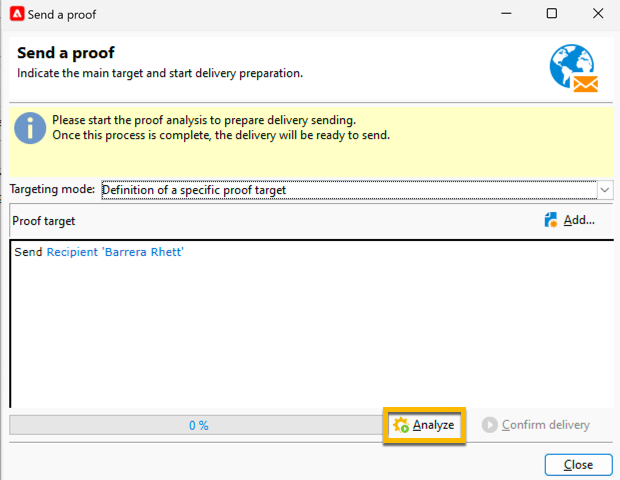

# 发送短信投放的证明 {#sms-proof}

Adobe强烈建议设置投放验证周期。 在将内容发送给受众之前，请确保内容已获批准。

您可以发送短信投放的验证来验证它：

1. 单击&#x200B;**[!UICONTROL Send a proof]**&#x200B;按钮，将打开一个窗口

   {zoomable="yes"}

   您可使用多种模式来发送验证：

   * **[!UICONTROL Definition of a specific proof target]**：允许您使用过滤器查询数据库中的地址作为验证目标
   * **[!UICONTROL Substitution of the address]**：允许您输入测试地址，并使用目标收件人数据验证内容。 可以手动输入替代地址，也可以从下拉列表中选择替代地址。 关联的枚举是&#x200B;**[!UICONTROL Substitution address (rcpAddress)]**。
默认情况下，会随机执行替换，但您可以通过&#x200B;**[!UICONTROL Detail]**&#x200B;图标从主目标中选择特定收件人。
   * **[!UICONTROL Seed addresses]**：允许您访问种子地址作为验证目标。 这些地址可以从文件导入或手动输入。
   * **[!UICONTROL Specific target and Seed addresses]**：允许您合并来自收件人的种子地址和地址。

1. 选择您的&#x200B;**[!UICONTROL Targeting mode]**&#x200B;后，根据它添加您的证明地址

   在以下示例中，我们选择&#x200B;**[!UICONTROL Definition of a specific proof target]**&#x200B;并添加收件人：

   {zoomable="yes"}

1. 单击&#x200B;**[!UICONTROL Analyze]**&#x200B;按钮。
Adobe Campaign将在验证验证发送之前执行所有控制。 在分析结束时，**[!UICONTROL Confirm delivery]**&#x200B;按钮将可点击。

   {zoomable="yes"}

1. 要发送短信投放的证明，请单击&#x200B;**[!UICONTROL Confirm delivery]**&#x200B;按钮。

如果在此阶段一切正常，则您可以继续并[将您的短信投放发送给受众](sms-audience.md)。
