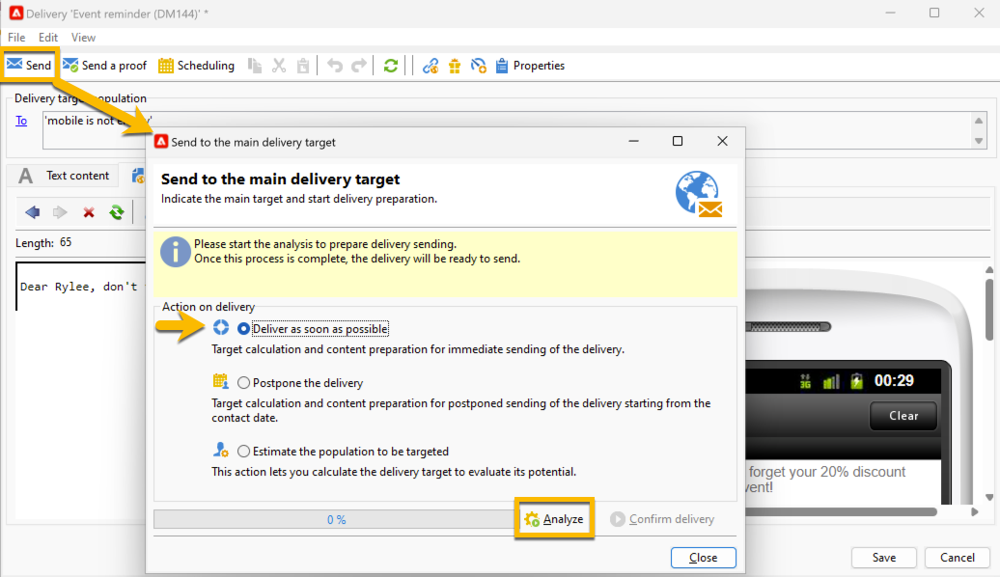

# 向受众发送短信投放 {#sms-send-audience}

验证短信后，您现在可以将其发送给受众。

1. 单击&#x200B;**[!UICONTROL Send]**&#x200B;按钮。
在打开的窗口中，选择适合您的正确操作。

   在以下示例中，我们选择&#x200B;**[!UICONTROL Deliver it as soon as possible]**，将显示&#x200B;**[!UICONTROL Analyze]**&#x200B;按钮。 我们单击该&#x200B;**[!UICONTROL Analyze]**&#x200B;按钮。

   {zoomable="yes"}

   Adobe Campaign将在验证验证发送之前执行所有控制。 您将看到实际受众数量。 在分析结束时，**[!UICONTROL Confirm delivery]**&#x200B;按钮将可点击。

   {zoomable="yes"}

1. 要将短信投放发送给受众，请单击&#x200B;**[!UICONTROL Confirm delivery]**&#x200B;按钮。
