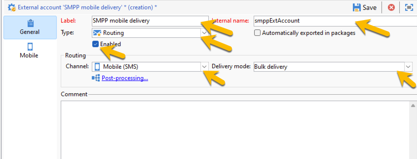
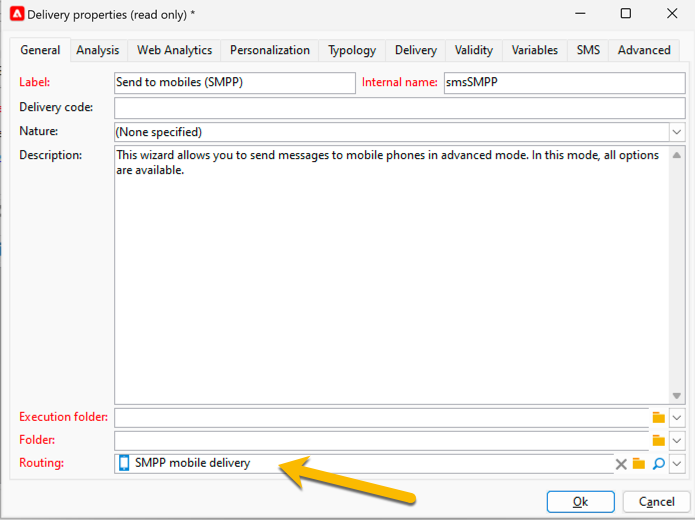
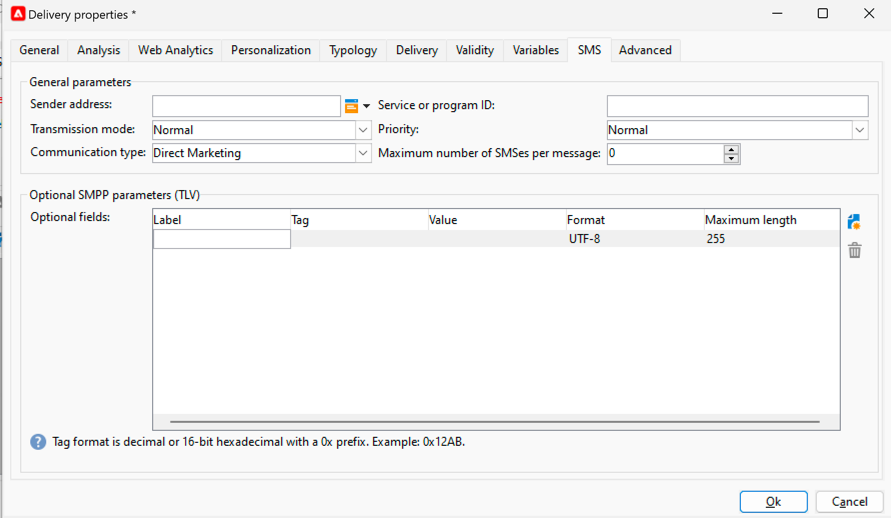

# 独立实例中的短信 {#sms-standalone}

>[!IMPORTANT]
>
>本文档适用于Adobe Campaign v8.7.2及更高版本。
>
>对于旧版本，请阅读[Campaign Classic v7文档](https://experienceleague.adobe.com/en/docs/campaign-classic/using/sending-messages/sending-messages-on-mobiles/sms-set-up/sms-set-up)。

在独立实例中，发送短信投放需要：

1. 指定连接器和消息类型的&#x200B;**外部帐户**，[在此处了解详情](#external-account)

1. 引用此外部帐户的&#x200B;**投放模板**，[在此处了解详情](#sms-delivery-template)

## 创建外部帐户 {#external-account}

>[!IMPORTANT]
>
>对多个外部SMS帐户使用相同的帐户和密码可能会导致帐户之间的冲突和重叠。 在[SMS疑难解答页面](smpp-connection.md#sms-troubleshooting)上了解详情。

以下是创建SMPP外部帐户的步骤：

1. 在&#x200B;**[!UICONTROL Administration]** > **[!UICONTROL Platform]** > **[!UICONTROL External Accounts]**&#x200B;中，单击&#x200B;**[!UICONTROL New]**&#x200B;图标

   {zoomable="yes"}

1. 设置外部帐户的&#x200B;**[!UICONTROL Label]**&#x200B;和&#x200B;**[!UICONTROL Internal name]**。 将帐户类型定义为&#x200B;**[!UICONTROL Routing]**，选中&#x200B;**[!UICONTROL Enabled]**&#x200B;框，为渠道选择&#x200B;**[!UICONTROL Mobile (SMS)]**，为投放模式选择&#x200B;**[!UICONTROL Bulk delivery]**。

   {zoomable="yes"}

1. 在&#x200B;**[!UICONTROL Mobile]**&#x200B;选项卡中，将&#x200B;**[!UICONTROL Extended generic SMPP]**&#x200B;保留在&#x200B;**[!UICONTROL Connector]**下拉列表中。
默认情况下，**[!UICONTROL Send messages through a dedicated process]**&#x200B;框处于选中状态。

   {zoomable="yes"}

   要设置连接，您需要填写此表单的选项卡。 有关详细信息，[了解有关SMPP外部帐户的更多信息](smpp-external-account.md#smpp-connection-settings)。

## 配置投放模板 {#sms-delivery-template}

为了便于创建短信投放，请创建引用SMPP外部帐户的短信投放模板。

在&#x200B;**[!UICONTROL Resources]** > **[!UICONTROL Templates]** > **[!UICONTROL Delivery templates]**&#x200B;中，右键单击现有的Mobile投放模板，然后选择&#x200B;**[!UICONTROL Duplicate]**。

{zoomable="yes"}

更改模板的&#x200B;**[!UICONTROL Label]**&#x200B;和&#x200B;**[!UICONTROL Internal name]**&#x200B;以轻松识别它，然后单击&#x200B;**[!UICONTROL Properties]**&#x200B;按钮。

{zoomable="yes"}

在&#x200B;**[!UICONTROL General]**&#x200B;选项卡的&#x200B;**[!UICONTROL Routing]**&#x200B;中，选择您的SMPP外部帐户。

{zoomable="yes"}

在&#x200B;**[!UICONTROL SMS]**&#x200B;选项卡中，可以向模板添加可选参数。

{zoomable="yes"}

[了解有关此短信选项卡配置的更多信息](sms-delivery-settings.md)。
