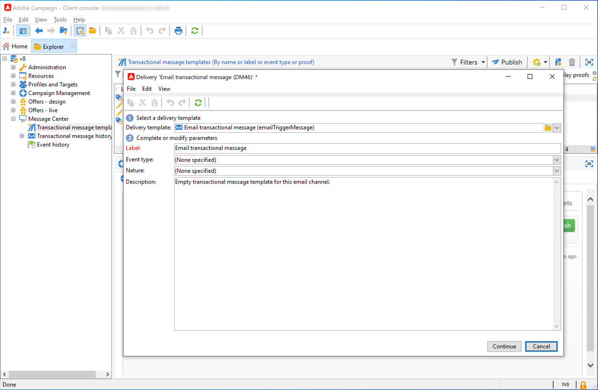

# 事务型消息传递入门{#send-transactional-messages}

事务型消息传递（消息中心）是一个Campaign模块，用于管理触发器消息。 这些通知是从信息系统触发的事件生成的，可以是：发票、订单确认、发运确认、密码更改、产品不可用通知、帐户对帐单、网站帐户创建等。

  作为托管Cloud Services用户， [联系Adobe](../start/campaign-faq.md#support){target=&quot;_blank&quot;}，在您的环境中安装和配置Campaign事务型消息传递。

事务型消息用于发送：

* 通知，例如订单确认或密码重置
* 对客户行动的个人实时响应
* 非促销内容

 有关事务性消息传递设置的详细信息，请参阅 [此部分](../config/transactional-msg-settings.md).

 了解事务型消息传递架构 [本页](../architecture/architecture.md).

## 事务型消息传递工作原理 {#transactional-messaging-operating-principle}

Adobe Campaign事务型消息传递模块集成到信息系统中，该信息系统可返回要更改为个性化事务型消息的事件。 这些消息可以单独发送，也可以通过电子邮件、短信或推送通知批量发送。

例如，假设您是一家拥有网站的公司，客户可以在该网站购买产品。

Adobe Campaign允许您向将产品添加到购物车的客户发送通知电子邮件。 如果其中某人离开您的网站但未完成购买（触发促销活动事件的外部事件），则会自动向他们发送购物车放弃电子邮件（事务型消息投放）。

实施此功能的主要步骤如下所述：

1. [创建事件类型](#create-event-types).
1. [创建和设计消息模板](#create-message-template). 在此步骤中，您必须将事件链接到消息。
1. [测试消息](#test-message-template).
1. [发布消息模板](#publish-message-template).

设计并发布事务型消息模板后，如果触发了相应的事件，则相关数据将通过PushEvent和PushEvents发送到Campaign [SOAP方法](https://experienceleague.adobe.com/docs/campaign-classic/using/transactional-messaging/processing/event-description.html){target=&quot;_blank&quot;}，则投放会发送到目标收件人。

## 创建事件类型 {#create-event-types}

要确保每个事件都可以更改为个性化消息，您首先需要创建 **事件类型**.

When [创建消息模板](#create-message-template)，则将选择与要发送的消息匹配的事件类型。

>[!IMPORTANT]
>
>您必须先创建事件类型，然后才能在消息模板中使用它们。

要创建将由Adobe Campaign处理的事件类型，请执行以下步骤：

1. 登录到 **控制实例**.

1. 转到 **[!UICONTROL Administration > Platform > Enumerations]** 文件夹。

1. 选择 **[!UICONTROL Event type]** 列表。

1. 单击 **[!UICONTROL Add]** 创建枚举值。 这可以是订单确认、密码更改、订单交付更改等。

   <!---->

   >[!IMPORTANT]
   >
   >每个事件类型必须匹配 **[!UICONTROL Event type]** 枚举。

1. 创建分项列表值后，请注销并重新登录到您的实例，以便创建生效。

>[!NOTE]
>
>了解有关 [Campaign Classicv7文档](https://experienceleague.adobe.com/docs/campaign-classic/using/getting-started/administration-basics/managing-enumerations.html){target=&quot;_blank&quot;}。

## 定义事务型消息模板 {#create-message-template}

每个事件都可触发个性化消息。 要实现此目的，您需要创建一个消息模板以匹配每个事件类型。 模板包含个性化事务型消息的必需信息。 您还可以使用模板来测试消息预览，并在将消息投放到最终目标之前使用种子地址发送校样。

### 创建模板

要创建消息模板，请执行以下步骤：

1. 转到 **[!UICONTROL Message Center >Transactional message templates]** 文件夹。
1. 在事务型消息模板列表中，右键单击并选择 **[!UICONTROL New]** 中，或单击 **[!UICONTROL New]** 按钮。

   

1. 在投放窗口中，选择适合您要使用的渠道的投放模板。

   

1. 如有必要，请更改其标签。
1. 选择与要发送的消息匹配的事件类型。

   

   必须事先创建要由Adobe Campaign处理的事件类型。

   >[!CAUTION]
   >
   >事件类型绝不应链接到多个模板。

1. 输入性质和描述，然后单击 **[!UICONTROL Continue]** 创建消息正文。 请参阅 [创建消息内容](#create-message-content).

### 创建内容{#create-message-content}

事务型消息内容的定义与Adobe Campaign中所有投放的定义相同。 例如，对于电子邮件投放，您可以创建HTML或文本格式的内容、添加附件或个性化投放对象。 如需详细信息，请参阅[此部分](../start/create-message.md)。

>[!CAUTION]
>
>消息中包含的图像必须可以公开访问。 Adobe Campaign不为事务型消息提供任何图像上传机制。\
>与JSSP或webApp不同， `<%=` 没有任何默认转义。
>
>您必须正确转义来自事件的每个数据。 此转义取决于此字段的使用方式。 例如，在URL中，请使用encodeURIComponent。 要在HTML中显示，可以使用escXMLString。

定义消息内容后，您可以将事件信息集成到消息正文中并对其进行个性化。 由于个性化标记，事件信息会插入到文本正文中。

* 所有个性化字段都来自有效负载。
* 可以在事务型消息中引用一个或多个个性化块。 块内容将在发布到执行实例期间添加到投放内容。

要将个性化标记插入电子邮件正文，请应用以下步骤：

1. 在消息模板中，单击与电子邮件格式(HTML或文本)匹配的选项卡。
1. 输入消息的正文。
1. 在文本的正文中，使用 **[!UICONTROL Real time events>Event XML]** 菜单。

   

1. 使用以下语法填写标记： **元素名称**.@**属性名称** 如下所示。

   

## 测试事务型消息模板 {#test-message-template}

### 添加种子地址{#add-seeds}

种子地址允许您在发送消息之前显示消息预览、发送校样并测试消息个性化。 种子地址已链接到投放，无法用于其他投放。

1. 在事务型消息模板中，单击 **[!UICONTROL Seed addresses]** ，然后单击 **[!UICONTROL Add]** 按钮。

   

1. 为其分配标签以供稍后选择，然后输入种子地址（电子邮件或手机，具体取决于通信渠道）。

1. 输入外部标识符：此可选字段允许您输入业务键（唯一ID、名称+电子邮件等） 网站上所有用于标识用户档案的应用程序都通用的配置文件。 如果此字段也存在于Adobe Campaign营销数据库中，则可以将事件与数据库中的用户档案进行协调。

   

1. 插入测试数据。 请参阅[此小节](#personalization-data)。

   

1. 单击 **[!UICONTROL Ok]** 确认创建种子地址。

1. 重复该过程以根据需要创建任意数量的地址。

   

创建地址后，即可访问其预览和个性化。

### 添加个性化数据{#personalization-data}

您可以在消息模板中添加数据以测试事务型消息的个性化。 这将允许您生成预览或发送校样。 如果安装 **投放能力** 模块中，此数据允许您显示各种桌面、web或移动客户端的消息渲染。

此数据旨在在消息最终投放之前对其进行测试。 这些消息与消息中心要处理的实际数据不一致。 但是，XML结构必须与执行实例中存储的事件的结构相同，如下所示。

此信息允许您使用个性化标记对消息内容进行个性化。

1. 在消息模板中，单击 **[!UICONTROL Seed addresses]** 选项卡。
1. 在事件内容中，以XML格式输入测试信息。

   

### 预览事务型消息{#transactional-message-preview}

创建一个或多个种子地址和消息正文后，即可预览消息并检查其个性化。

1. 在消息模板中，单击 **[!UICONTROL Preview]** 选项卡，然后选择 **[!UICONTROL A seed address]** 中。

   

1. 选择之前创建的种子地址以显示个性化消息。

   

### 发送验证

您可以通过向之前创建的种子地址发送校样来测试消息投放。

发送校样的过程与任何投放的过程相同。

 在中了解有关校样的更多信息 [Campaign Classicv7文档](https://experienceleague.adobe.com/docs/campaign-classic/using/sending-messages/key-steps-when-creating-a-delivery/steps-validating-the-delivery.html?lang=zh-Hans){target=&quot;_blank&quot;}

但是，要发送事务型消息的校样，您需要执行以下操作：

* 创建一个或多个 [种子地址](#add-seeds) 使用个性化测试数据
* 创建消息内容

要发送校样，请执行以下操作：

1. 单击 **[!UICONTROL Send a proof]** 按钮。
1. 分析投放。
1. 更正任何错误并确认投放。

   

1. 检查消息是否已发送到种子地址，且其内容符合您的配置。

   

可通过 **[!UICONTROL Audit]** 选项卡。

## 发布模板 {#publish-message-template}

在控制实例上创建的消息模板完成后，您可以发布该消息模板。 此过程还将在所有执行实例上发布该实例。

>[!NOTE]
>
>发布事务型消息模板时，也会在执行实例上自动发布分类规则。

通过发布，您可以在执行实例上自动创建两个消息模板，以便发送链接到实时事件和批量事件的消息。

>[!CAUTION]
>
>每当对模板进行任何更改时，请确保再次发布该模板，以便这些更改在事务型消息投放期间生效。

1. 在控制实例上，转到 **[!UICONTROL Message Center > Transactional message templates]** 文件夹。
1. 选择要在执行实例上发布的模板。
1. 单击 **[!UICONTROL Publish]**。

   

发布完成后，将在的生产实例树中创建要应用于批量事件和实时类型事件的消息模板，该树位于 **[!UICONTROL Administration > Production > Message Center Execution> Default > Transactional message templates]** 文件夹。

发布模板后，如果触发了相应的事件，则执行实例将收到该事件，将其链接到事务型模板，并向每个收件人发送相应的事务型消息。

>[!NOTE]
>
>如果将事务型消息模板的现有字段（如发件人地址）替换为空值，则再次发布事务型消息后，将不会更新执行实例上的相应字段。 它仍将包含上一个值。
>
>但是，如果添加非空值，则相应字段将像往常一样在下次发布后更新。

## 取消发布模板

在执行实例上发布消息模板后，即可取消发布该模板。

* 事实上，如果触发了相应的事件，则仍可以调用已发布的模板：如果您不再使用消息模板，建议取消发布该模板。 这是为了避免错误地发送不需要的事务型消息。

   例如，您发布了一个仅用于圣诞促销活动的消息模板。 在圣诞节结束后，您可能想要取消发布它，并在明年再次发布它。

* 此外，您还无法删除具有 **[!UICONTROL Published]** 状态。 必须先取消发布它。

要取消发布事务型消息模板，请执行以下步骤。

1. 在控制实例上，浏览到 **[!UICONTROL Message Center > Transactional message templates]** 文件夹。
1. 选择要取消发布的模板。
1. 单击 **[!UICONTROL Unpublish]**。
1. 单击 **[!UICONTROL Start]**。

事务型消息模板状态从 **[!UICONTROL Published]** to **[!UICONTROL Being edited]**.

取消发布完成后：

* 这两个消息模板（应用于批处理和实时类型事件）都将从每个执行实例中删除。

   它们不再显示在 **[!UICONTROL Administration > Production > Message Center Execution > Default > Transactional message templates]** 文件夹。

* 取消发布模板后，您可以从控制实例中将其删除。

   要执行此操作，请从列表中选择它，然后单击 **[!UICONTROL Delete]** 按钮。
