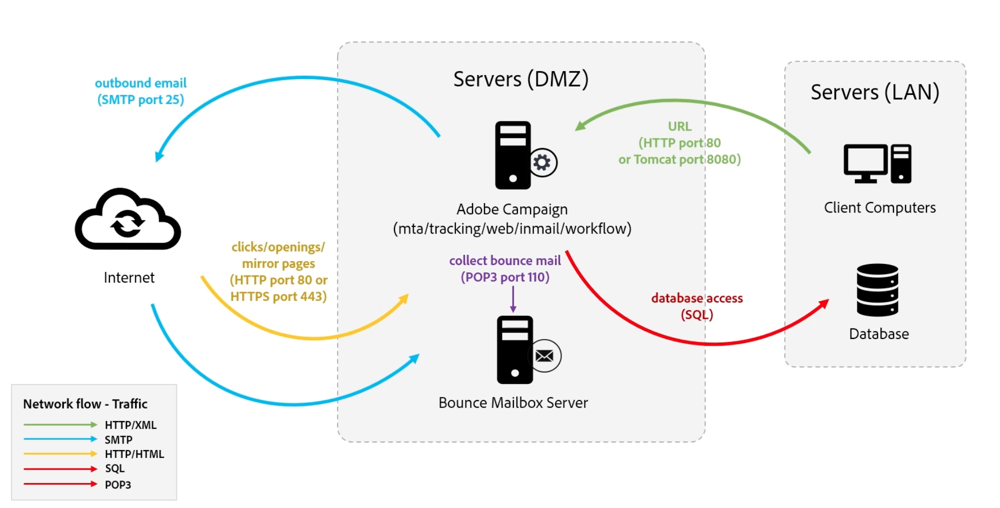

# 了解 Campaign 组件和流程 {#components-and-processes}

Adobe Campaign 是一款跨渠道营销解决方案，可自动执行电子邮件、移动设备、社交和离线营销活动。在 Adobe Campaign，您可以一站式访问客户数据和用户档案。使用 Adobe Campaign 为客户编排一致的体验，跨渠道设计、执行和个性化营销活动，同时改进每个设备和接触点上的客户体验。借助 Adobe Campaign，您可以通过拖放式可视化工作流界面管理多个数据源、定义受众细分，还可以规划和执行多步骤、跨渠道营销活动。

在[此页面](../start/get-started.md)了解有关 Campaign 关键功能的详细信息。

## Campaign 组件 {#ac-components}

Adobe Campaign 组件和全局架构详述如下。

### 呈现层{#presentation-layer}

您可以通过富客户端、瘦客户端或 API 集成访问 Adobe Campaign。

* 富客户端

  Campaign 富客户端是一个原生应用程序，它通过标准 Internet 协议（如 SOAP 和 HTTP）与 Adobe Campaign 应用程序服务器进行通信。[了解关于 Campaign 客户端控制台的更多信息](../start/connect.md)。

* 瘦客户端

  通过 Adobe Campaign Web 访问功能，您可以通过 Web 浏览器在 HTML 用户界面下使用部分 Campaign 功能。使用此 Web 界面可访问报告、控制和验证消息、访问监控仪表板等。[了解关于 Campaign Web 访问的更多信息](../start/connect.md)。

* 具有 API 的外部应用程序

  在某些情况下，可以使用通过 SOAP 协议公开的 Web 服务 API 从外部应用程序调用系统。[了解关于 Campaign API 的更多信息](../dev/api.md)。

### 持久层{#persistance-layer}

Campaign 数据库用作持久层，并包含 Adobe Campaign 管理的几乎所有信息和数据。这包括：功能数据（例如配置文件、订阅、内容）；技术数据（例如投放作业和日志、跟踪日志）；以及工作数据（购买、潜在客户）。

数据库的可靠性至关重要，因为大多数 Adobe Campaign 组件都需要访问数据库才能执行其任务（重定向模块除外）。

### 逻辑应用层{#logical-app-layer}

Campaign 逻辑应用层可以轻松配置，以满足复杂的业务需求。您可以将 Campaign 作为平台与不同应用程序配合使用，以创建一个可扩展的开放式架构。每个 Campaign 实例都是应用层中的流程集合，其中一些是共享的，另一些是专用的。

## Campaign 托管式云服务{#ac-managed-services}

Adobe Campaign v8 以托管服务的形式部署：Adobe Campaign 的所有组件（包括用户界面、执行管理引擎和 Campaign 数据库）均完全由 Adobe 托管，包括电子邮件执行、镜像页面、跟踪服务器和面向外部的 Web 组件（例如取消订阅页面/首选项中心和登陆页面）。

## Campaign 流程

Campaign Web 服务器控制对 Campaign Web 流程的访问。Javascript 是用于核心产品功能和自定义的服务器端语言。Tomcat 是后端引擎，作为 Web 流程的一部分嵌入到 Campaign 产品中。例如，在 JSP 或 JSSP 页面中使用 Javascript 来呈现动态内容。

Campaign 客户端控制台通过 HTTP 使用 SOAP XML 连接到 Web 服务器。Web 服务器提供安全层，使用 Javascript 将请求传递到应用层，Campaign 内部流程使用 SQL 访问数据库。

<!--The overall communication between Campaign processes are described in the following standalone deployment diagram: all Campaign components are installed in the same machine.

 -->

用户使用 HTTP 连接到 Campaign 应用程序服务器。所有数据和信息都在 Campaign 数据库中进行管理。如果 Campaign 开发人员执行任何配置更改，则会将其更新到数据库中。如果营销人员创建新营销活动，则与此新营销活动相关的所有信息和数据也将在数据库中管理。营销人员执行营销活动时，会通过 SMTP 服务器将电子邮件投放从 Campaign 服务器发送到用户档案。当用户档案与电子邮件投放交互时（如打开电子邮件），跟踪数据会发送回跟踪服务器。

[了解关于 Campaign 流程的更多信息](../architecture/general-architecture.md#dev-env)。
