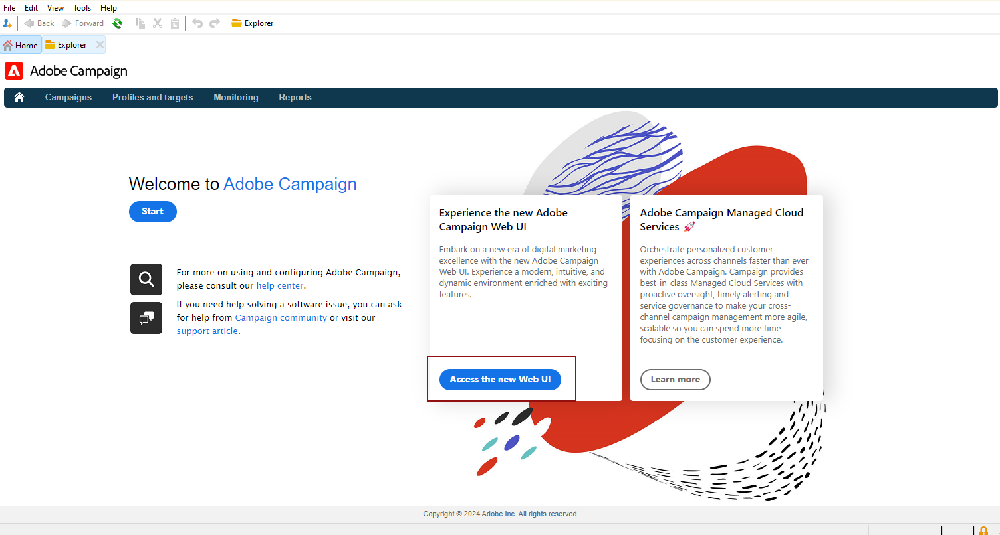

# 探索用户界面 {#ui-client-console}

您可以通过客户端控制台或 Web 用户界面访问 Adobe Campaign。您还可以使用 API 在 Campaign 平台中管理数据和执行任务。

* **客户端控制台** - Campaign 客户端控制台是一个原生应用程序，它通过标准 Internet 协议（如 SOAP 和 HTTP）与 Adobe Campaign 应用程序服务器进行通信。Campaign 客户端控制台集中了所有功能和设置，并且由于依赖本地缓存，需要的带宽很少。Campaign 客户端控制台旨在实现轻松部署，可以从 Internet 浏览器部署，可以自动更新，并且不需要任何特定的网络配置，因为它只生成 HTTP(S) 流量。[了解详情](#ui-access)

  在[此部分](../start/connect.md)中了解如何安装和配置 Campaign 客户端控制台。

* **Web 访问** - 通过 Adobe Campaign Web 访问功能，您可以通过 Web 浏览器在 HTML 用户界面下使用部分 Campaign 功能。使用此 Web 界面可访问报告、控制和验证消息、访问监控仪表板等。[在此部分中](../start/connect.md#web-access)了解有关 Campaign Web 访问权限的详细信息。

* **API** - 为处理更多用例，可以使用通过 SOAP 协议公开的 Web 服务 API 从外部应用程序调用该系统。[在此页面中](../dev/api.md)了解有关 Campaign API 的详细信息。

* **Web 用户界面** - 作为 Campaign v8 用户，从 v8.6.1 版本开始，您现在可以通过中央 Adobe Experience Cloud 用户界面访问 Web 环境。然后，您可以从 Web 浏览器连接到 Adobe Campaign。通过这个新的界面，您可以创建、管理和执行重要的营销操作。但是，并非所有 Campaign 功能都可用。[了解详情](#ac-web-ui)。

  >[!AVAILABILITY]
  >
  >Campaign Web用户界面仅适用于通过Adobe ID连接到Campaign的Campaign v8用户。 了解有关 [Adobe 身份管理系统 (IMS)](https://helpx.adobe.com/cn/enterprise/using/identity.html){target="_blank"} 的更多信息。
  >

>[!CAUTION]
>
>本文档重点介绍 Campaign 客户端控制台用法。作为Campaign v8用户，如果您使用的是Campaign Web用户界面，请参阅[本文档](https://experienceleague.adobe.com/docs/campaign-web/v8/campaign-web-home.html?lang=zh-Hans){target="_blank"}。

## 使用客户端控制台 {#ui-access}

Campaign 客户端控制台是一个原生应用程序，它通过标准 Internet 协议（如 SOAP 和 HTTP）与 Adobe Campaign 应用程序服务器进行通信。Campaign 客户端控制台集中了所有功能和设置，并且由于依赖本地缓存，需要的带宽很少。Campaign 客户端控制台旨在实现轻松部署，可以从 Internet 浏览器部署，可以自动更新，并且不需要任何特定的网络配置，因为它只生成 HTTP(S) 流量。[了解关于 Campaign 客户端控制台的更多信息](../start/connect.md)。

>[!BEGINTABS]

>[!TAB Campaign v8]

连接到Campaign后，即可访问Adobe Campaign主页。 在Campaign v8中，使用中心卡浏览新的Campaign Web用户界面和Campaign控制面板。

>[!NOTE]
>
>如果未显示Web用户界面卡，请确保您的A[Adobe Experience Cloud外部帐户](../config/external-accounts.md)中的以下字段不留空： **服务器**、**租户**、**回拨服务器**&#x200B;和&#x200B;**关联标记**。

您还可以从主页访问[促销活动控制面板](../config/self-service.md)。

>[!TAB Campaign Classic v7]

连接到Campaign后，即可访问Adobe Campaign主页，其中提供了用于访问各项功能、文档、技术支持网站和Campaign社区的链接和快捷方式。

>[!ENDTABS]

您还可以使用 Web 浏览器访问 Campaign。在这种情况下，仅可使用部分 Campaign 功能。[了解详情](#web-browser)

### 浏览界面 {#ui-browse}

连接到Campaign客户端控制台后，浏览上方部分中的选项卡以访问Campaign关键功能：

>[!NOTE]
>
>您可以访问的核心功能列表取决于您的权限和实现方式。

对于每个功能，您都可以在 **[!UICONTROL Browsing]** 部分中访问关键功能集。通过 **[!UICONTROL More]** 链接，可访问所有其他组件。

例如，在浏览到 **[!UICONTROL Profiles and targets]** 选项卡时，您可以访问收件人列表、订阅服务、现有的目标选择工作流以及创建所有这些组件的快捷方式。

在屏幕中选择某个元素时，该元素将加载到新选项卡中，以便您轻松浏览内容。

### 创建元素 {#create-an-element}

使用屏幕左侧 **[!UICONTROL Create]** 部分中的快捷方式添加新元素。您也可以使用列表上方的 **[!UICONTROL Create]** 按钮向当前列表中添加新元素。

例如，在投放页面上，使用 **[!UICONTROL Create]** 按钮创建新的投放。

<!--
## Use a web browser {#web-browser}

You can also access a subset of Campaign capabilities through the a web browser.

The web access interface is similar to the console interface. From a browser, you can use the same navigation and display features as in the console, but you can perform only a reduced set of actions on campaigns. For example, you can view and cancel campaigns, but you cannot modify campaigns. 

[Learn more about Campaign web access](../start/connect.md#web-access).-->

### 访问 Campaign 资源管理器 {#ac-explorer-ui}

浏览 Campaign 资源管理器以访问所有 Adobe Campaign 功能和设置。

在此工作区中您可以访问资源管理器树，以浏览所有功能和选项。

* 左侧部分显示 Campaign 资源管理器树，您可以根据权限浏览实例的所有组件和设置。您可以添加和自定义文件夹，详见[此页面](../audiences/folders-and-views.md)。

* 上部显示当前文件夹中的记录列表。这些列表是完全可自定义的。[了解详情](../config/ui-settings.md)

* 下部显示所选记录的详细信息。

## Campaign Web 用户界面 {#ac-web-ui}

从v8.6.1版本开始，Campaign v8用户可以通过Adobe Experience Cloud中央用户界面访问Web环境。 Experience Cloud 是 Adobe 的数字营销应用程序、产品和服务的集成系列。通过其直观的界面，您可以快速访问云应用程序、产品功能和服务。

>[!AVAILABILITY]
>
>Campaign Web用户界面仅适用于通过Adobe ID连接到Campaign的Campaign v8用户。 了解有关 [Adobe 身份管理系统 (IMS)](https://helpx.adobe.com/cn/enterprise/using/identity.html){target="_blank"} 的更多信息。
>

在[此文档](https://experienceleague.adobe.com/docs/campaign-web/v8/campaign-web-home.html?lang=zh-Hans){target="_blank"}中详细了解新的 Campaign Web 用户界面。您还可以在 Campaign Web 用户界面文档中访问[常见问题解答页面](https://experienceleague.adobe.com/zh-hans/docs/campaign-web/v8/start/faq){target="_blank"}。

其他高级功能、配置和设置仅在客户端控制台中可用。要了解有关两种用户界面中的可用功能的更多信息，请访问 [Campaign Web 用户界面文档](https://experienceleague.adobe.com/docs/campaign-web/v8/start/capability-matrix.html?lang=zh-Hans){target="_blank"}。

## 支持的语言 {#languages}

支持的语言取决于用户界面。

* 对于Campaign客户端控制台界面，支持的语言包括：

   * 英语（英国）
   * 英语（美国）
   * 法语
   * 德语
   * 日语

  >[!CAUTION]
  >
  >在安装过程中选择语言，此后不能更改&#x200B;****。

* 有关 Campaign Web 用户界面支持的语言，[请参阅此页面](https://experienceleague.adobe.com/docs/campaign-web/v8/start/connect-to-campaign.html?lang=zh-Hans#language-pref){target="_blank"}。

## 格式

语言会影响日期和时间的格式。

美式英语和英式英语的主要差别如下：

<table> 
 <thead> 
  <tr> 
   <th> 格式  </th> 
   <th> 英语（美国）  </th> 
   <th> 英语（英国）  </th> 
  </tr> 
 </thead> 
 <tbody> 
  <tr> 
   <td> 日期  </td> 
   <td> 周日是一周的起始日  </td> 
   <td> 周一是一周的起始日  </td> 
  </tr> 
  <tr> 
   <td> 短日期  </td> 
   <td> 
%2M/%2D/%4Y

<strong>例如：2025年9月25日</strong>
 </td> 
   <td> 
%2D/%2M/%4Y

<strong>例如：2025年9月25日</strong>
 </td> 
  </tr> 
  <tr> 
   <td> 带时间的短日期  </td> 
   <td> 
%2M/%2D/%4Y %I:%2N:%2S %P

<strong>例如：2025年9月25日10:47:25下午</strong>
 </td> 
   <td> 
%2D/%2M/%4Y %2H:%2N:%2S

<strong>例如：2025年9月25日22:47:25</strong>
 </td> 
  </tr> 
 </tbody> 
</table>

## 其他资源

* **[使用枚举](../config/enumerations.md)** — 使用预定义的下拉列表标准化字段值，以便更快、更一致地输入数据。
* **[筛选器数据](../audiences/create-filters.md)** — 发现现有的内置筛选器以访问Campaign数据的特定子集、如何创建快速筛选器或设计和共享您自己的高级筛选器。