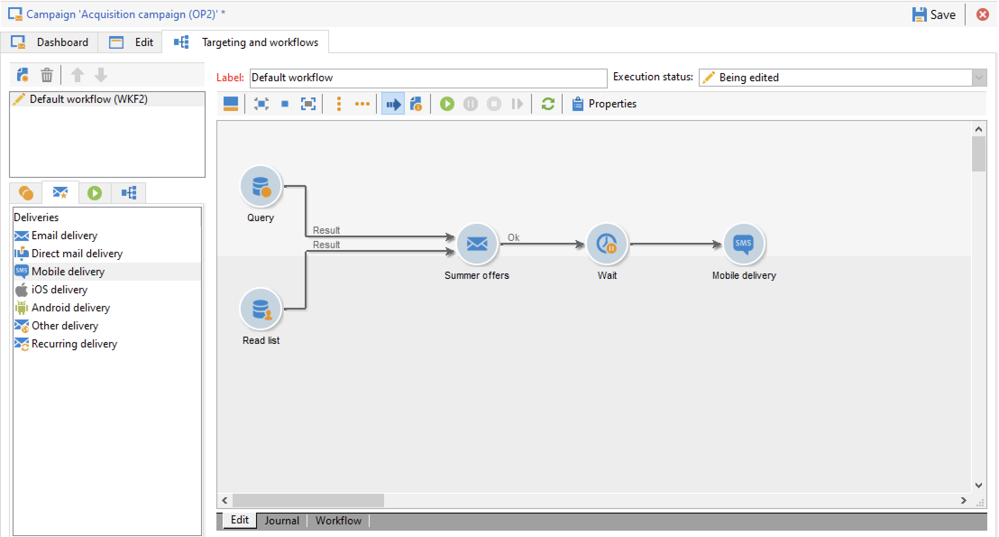

# 营销活动入门{#gs-ac-campaigns}

Adobe Campaign 提供了一套解决方案，可帮助您在所有线上和线下渠道个性化和交付活动。 您可以创建、配置、执行和分析营销活动。 所有营销活动都可从统一的控制中心进行管理。在此部分了解如何浏览和创建营销活动。

活动包括操作（投放）和流程（导入或提取文件）以及资源（营销文档、投放概要）。 它们用于营销活动。活动是项目的一部分，项目包含在活动计划中。

## 跨渠道营销活动编排

您可以利用 Adobe Campaign 在多个渠道上设计和编排有针对性的个性化活动：电子邮件、直邮、SMS、推送通知等。通过单个界面为您提供计划、编排、配置、个性化、自动化、执行和衡量所有活动和通信所需的全部功能。

### 核心概念

在开始实施营销活动之前，您需要熟悉以下概念：

* **营销活动**：活动集中了与营销活动相关的所有元素：投放、定位规则、成本、导出文件、相关文档等。每个活动都附属于项目。

* **项目**：项目允许您定义日历期间的营销行动：发布、调查意见、忠诚度等。每个项目都包含链接到日历的活动，日历提供了概览。

* **计划**：营销计划可包含多个项目。它链接到日历期间，有分配的预算，也可以链接到文档和目标。

* **活动工作流**：活动工作流包含用于构建活动逻辑的活动。使用活动工作流定义受众并为所有可用渠道创建投放。

* **周期性活动**：周期性活动是从定义要执行的工作流程模板和执行计划的特定模板创建的。

* **定期活动**：定期活动是根据模板的执行计划自动创建的活动。

## 营销活动工作区

Adobe Campaign 允许您从一个统一的控制中心创建、配置、执行和分析所有营销活动。

↗️ 请参阅 [Campaign Classic v7 文档](https://experienceleague.adobe.com/docs/campaign-classic/using/orchestrating-campaigns/about-marketing-campaigns/accessing-marketing-campaigns.html?lang=zh-Hans#orchestrating-campaigns){target=&quot;_blank&quot;}以了解如何访问和实施营销活动

## 开始的关键步骤

创建跨渠道营销活动的关键步骤有：

1. **规划和设计营销项目和活动**

   定义层次结构和计划、设置预算、添加资源、选择运算符。

   ↗️ 请参阅 [Campaign Classic v7 文档](https://experienceleague.adobe.com/docs/campaign-classic/using/orchestrating-campaigns/orchestrate-campaigns/setting-up-marketing-campaigns.html?lang=zh-Hans#creating-plan-and-program-hierarchy){target=&quot;_blank&quot;}以了解如何创建营销计划并配置活动

   所有营销活动均基于存储主要设置和功能的模板。提供了内置模板以用于创建尚未定义特定配置的活动。您可以创建和配置活动模板，然后从这些模板创建活动。

   ↗️ 请参阅 [Campaign Classic v7 文档](https://experienceleague.adobe.com/docs/campaign-classic/using/orchestrating-campaigns/orchestrate-campaigns/marketing-campaign-templates.html?lang=zh-Hans#orchestrating-campaigns){target=&quot;_blank&quot;}以了解如何使用活动模板

   ↗️ 请参阅 [Campaign Classic v7 文档](https://experienceleague.adobe.com/docs/campaign-classic/using/orchestrating-campaigns/orchestrate-campaigns/setting-up-marketing-campaigns.html?lang=zh-Hans#recurring-and-periodic-campaigns){target=&quot;_blank&quot;}以了解周期性活动和配置方法

1. **定义受众**

   您可以在工作流程中构建受众或选择现有群组，如收件人列表、新闻稿订阅者、以前投放的收件人或任何筛选条件。

   

   ↗️ 请参阅 [Campaign Classic v7 文档](https://experienceleague.adobe.com/docs/campaign-classic/using/orchestrating-campaigns/orchestrate-campaigns/marketing-campaign-target.html?lang=zh-Hans#orchestrating-campaigns){target=&quot;_blank&quot;}以了解如何定义消息的受众

1. **创建投放**

   选择渠道、定义消息内容并开始投放。

   

   ↗️ 请参阅 [Campaign Classic v7 文档](https://experienceleague.adobe.com/docs/campaign-classic/using/orchestrating-campaigns/orchestrate-campaigns/marketing-campaign-deliveries.html?lang=zh-Hans#creating-deliveries){target=&quot;_blank&quot;}以了解如何创建和开始营销活动投放

   您可以将各种文档与活动关联起来：报表、照片、网页、图表等。

   ↗️ 请参阅 [Campaign Classic v7 文档](https://experienceleague.adobe.com/docs/campaign-classic/using/orchestrating-campaigns/orchestrate-campaigns/marketing-campaign-assets.html?lang=zh-Hans#adding-documents){target=&quot;_blank&quot;}以了解关于关联文档的更多信息

1. **设置审批流程**

   Adobe Campaign 允许您为营销活动的主要阶段设置协作审批流程。对于每个活动，您可以批准投放目标、内容和成本。负责审批工作的 Adobe Campaign 操作员收到电子邮件通知后，可通过控制台或 Web 连接批准或拒绝批准相关请求。

   ↗️ 请参阅 [Campaign Classic v7 文档](https://experienceleague.adobe.com/docs/campaign-classic/using/orchestrating-campaigns/orchestrate-campaigns/marketing-campaign-approval.html?lang=zh-Hans#orchestrating-campaigns){target=&quot;_blank&quot;}以了解如何设置和管理审批

