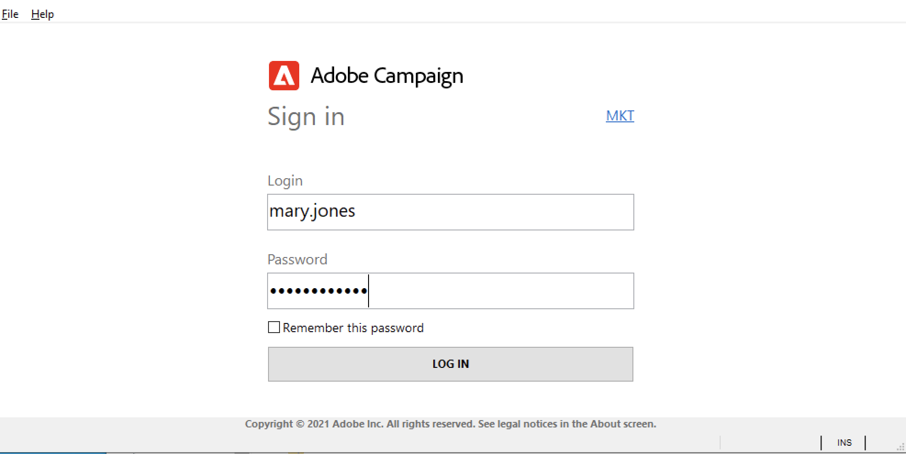

# 连接到Adobe Campaign v8{#gs-ac-connect}

活动 Client Console是一个富客户端，通过它可以连接到您的活动应用程序服务器。

>[!CAUTION]
>
>在启动之前，您需要检查活动[兼容性矩阵](compatibility-matrix.md)，获取活动服务器URL和用户凭据。

## 下载并安装客户端控制台

首次使用活动时，或者如果需要升级到较新版本，则需要下载客户端控制台并安装它。

有两个选项可用：

1. 作为活动管理员，请连接到Adobe[软件分发](https://experience.adobe.com/#/downloads/content/software-distribution/encampaign.html)并下载客户端控制台安装项目。 然后，您可以将它安装到本地计算机上。

1. 作为最终用户，Adobe可以为您部署控制台：更新控制台后，系统会提示您在弹出窗口中下载最新的客户端控制台版本。

>[!CAUTION]
>
>Adobe建议取消选择选项&#x200B;**[!UICONTROL No longer ask this question]**，以确保当有新版本的Console可用时，所有用户都会收到警告。  如果选择此选项，则用户将不会收到有关新可用版本的通知。

## 创建连接

新安装客户端控制台后，请按照以下步骤创建与应用程序服务器的连接：

1. 从&#x200B;**Adobe Campaign**&#x200B;项目组的Windows **[!UICONTROL Start]**&#x200B;菜单开始控制台。

1. 单击凭据字段右上角的链接以访问连接配置窗口。

1. 单击&#x200B;**[!UICONTROL Add > Connection]**&#x200B;并输入Adobe Campaign应用程序服务器的标签和URL。

1. 指定通过URL与Adobe Campaign应用程序服务器的连接。 使用DNS或计算机的别名，或您的IP地址。

   例如，可以使用[`https://<machine>.<domain>.com`](https://myserver.adobe.com)类型URL。

1. 如果为您的组织配置了Adobe Identity Management系统(IMS)，请选中选项&#x200B;**[!UICONTROL Connect with an Adobe ID]**。

1. 单击&#x200B;**[!UICONTROL Ok]**&#x200B;保存设置。

例如，您可以根据需要添加任意数量的连接以连接到测试、舞台和生产环境。

>[!NOTE]
>
>通过&#x200B;**[!UICONTROL Add]**&#x200B;按钮可创建&#x200B;**[!UICONTROL folders]**&#x200B;来组织所有连接。 只需将每个连接拖放到某个文件夹中。

## 登录到Adobe Campaign

要登录到现有实例，请执行以下步骤：

1. 从&#x200B;**Adobe Campaign**&#x200B;项目组的Windows **[!UICONTROL Start]**&#x200B;菜单开始控制台。

1. 单击凭据字段右上角的链接以访问连接配置窗口。

1. 选择您需要登录的活动实例。

1. 单击 **[!UICONTROL Ok]**。

1. 输入用户登录凭据，然后单击&#x200B;**[!UICONTROL LOG IN]**。

   

根据您的配置，您的凭据可以：

* 由授予您访问权限的活动管理员提供
* 您的Adobe ID

## 授予用户访问权限

Adobe Campaign允许您定义和管理分配给各种运算符的权限。 这些权利和限制授权或拒绝：

* 访问某些功能(通过已命名权限),
* 访问某些元素，
* 创建、修改和/或删除元素(投放、联系人、活动、组等)。

了解有关用户以及如何在[本节](permissions.md)中定义其权限的更多信息。

作为活动管理员，您负责创建操作符并与用户共享其凭据。

## 使用您的Adobe ID连接到活动{#connect-ims}

活动用户可以通过Adobe Identity Management系统(IMS)使用Adobe ID连接到Adobe Campaign控制台。 此实施具有以下优势：

* 所有 Experience Cloud 解决方案都可以使用相同的 ID。
* 使用具有不同集成的 Adobe Campaign 时，可以记住该连接。
* 更强大的密码管理策略。
* 使用联合 ID 帐户（外部 ID 提供商）。

:speech_balloon:作为受管Cloud Services用户，[联系Adobe](support.md#support)用活动实现Adobe IMS。

## 使用LDAP登录名连接到活动

Adobe Campaign可以配置，以便用户通过其LDAP身份验证访问平台。

:speech_balloon:作为“托管Cloud Services”用户，[与Adobe](support.md#support)联系以配置LDAP与活动的集成。

## Web访问

应用程序的某些部分可通过简单的Web浏览器使用HTML用户界面访问：报告、投放批准、实例监控等。
