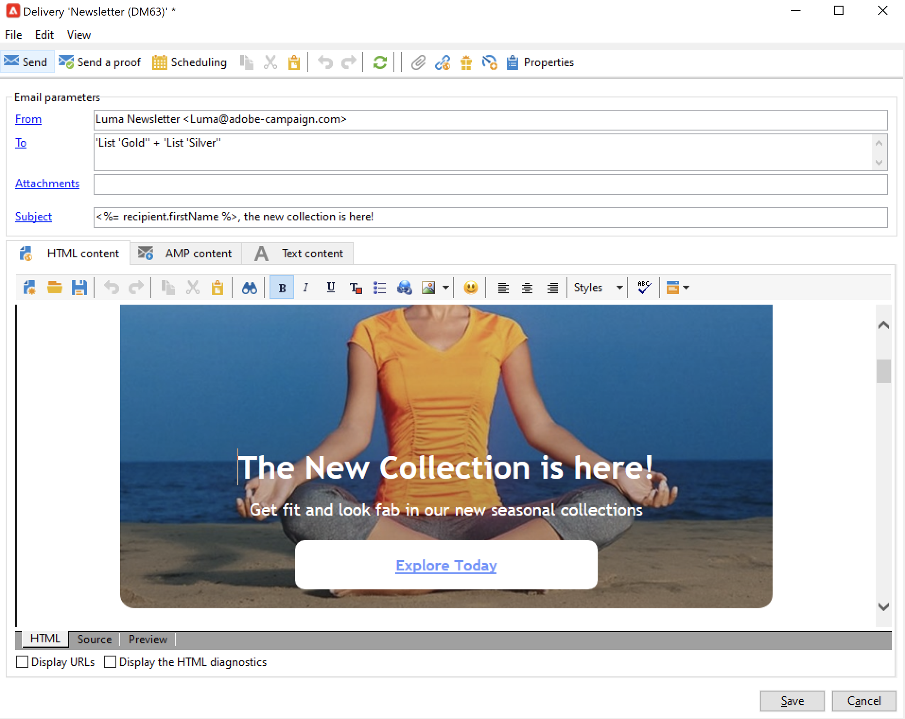
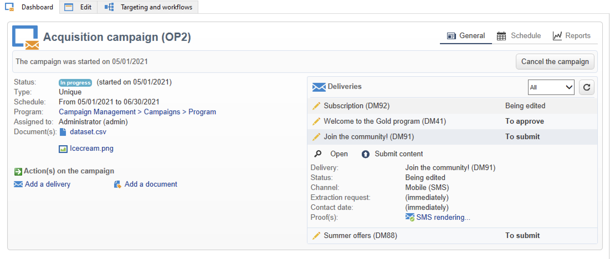
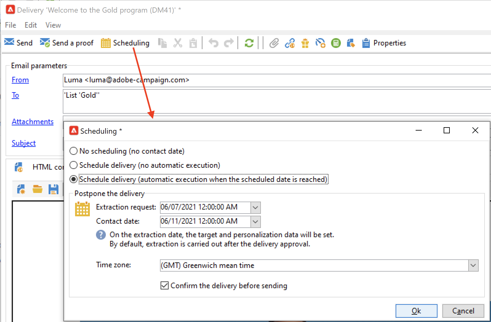

# 消息入门{#gs-ac-audiences}

借助 Adobe Campaign，您可以发送跨渠道活动内容，包括电子邮件、短信、推送通知和直邮，并使用各种专门的报告衡量其有效性。这些消息通过投放设计和发送，并且可以针对每个收件人进行个性化。

核心功能包括定位、消息定义和个性化、通信执行和相关的运营报告。主要功能接入点是投放助手。此接入点可导向 Adobe Campaign 涵盖的多种功能。

请参阅[ Campaign Classic v7 文档](https://experienceleague.adobe.com/docs/campaign-classic/using/sending-messages/key-steps-when-creating-a-delivery/steps-about-delivery-creation-steps.html?lang=zh-Hans)以了解创建投放的重要步骤。

Adobe Campaign v8 附带以下投放渠道：

* **电子邮件渠道**：电子邮件投放可让您向目标群体发送个性化电子邮件。请参阅[此页面](../send/email.md)以了解详情。

* **直邮渠道**：直邮投放允许您生成包含目标群体数据的提取文件。请参阅[此页面](../send/direct-mail.md)以了解详情

* **移动渠道**：移动渠道中的投放可让您向目标群体发送个性化短信。请参阅[此页面](../send/sms.md)以了解详情

* **移动应用程序渠道**：移动应用程序投放可让您向 iOS 和 Android 系统发送通知。请参阅[此页面](../send/push.md)以了解详情

<!--
* **LINE channel**: LINE deliveries let you send messages on LINE, an instant messaging application available on all smartphones. Learn more in [this page](../send/line.md)
-->

## 选择发送消息的方式{#gs-send-msg}

创建消息并对其内容进行设计和测试后，您可以选择发送消息的方式。Campaign 提供了一套功能用于：

* 手动将消息发送到主目标

   

   请参阅 [Campaign Classic v7 文档](https://experienceleague.adobe.com/docs/campaign-classic/using/sending-messages/sending-emails/sending-an-email/sending-messages.html?lang=zh-Hans){target=&quot;_blank&quot;}以了解如何发送消息

* 发送与[营销活动](campaigns.md)关联的消息

   

   在 [Campaign Classic v7 文档](https://experienceleague.adobe.com/docs/campaign-classic/using/orchestrating-campaigns/orchestrate-campaigns/marketing-campaign-deliveries.html?lang=zh-Hans){target=&quot;_blank&quot;}中了解如何在营销活动上下文中发送消息

* 通过[工作流](../config/workflows.md)发送消息

   

    请参阅 [Campaign Classic v7 文档](https://experienceleague.adobe.com/docs/campaign-classic/using/automating-with-workflows/action-activities/delivery.html?lang=zh-Hans)以了解如何自动投放电子邮件{target=&quot;_blank&quot;}

* 从事件[触发消息](../send/transactional.md)
    [用例：了解如何发送带有附件的事务性电子邮件](https://experienceleague.adobe.com/docs/campaign-classic/using/transactional-messaging/transactional-email-with-attachments.html?lang=zh-Hans){target=&quot;_blank&quot;}

* 计划消息发送

   

    [用例：了解如何计划和发送生日电子邮件](https://experienceleague.adobe.com/docs/campaign-classic/using/automating-with-workflows/use-cases/deliveries/sending-a-birthday-email.html?lang=zh-Hans){target=&quot;_blank&quot;}

## 添加个性化内容{#personalization}

由 Adobe Campaign 投放的消息可以通过各种方式实现个性化。

您可以：

* 插入动态的个性化字段。
    请参阅 [Campaign Classic v7 文档](https://experienceleague.adobe.com/docs/campaign-classic/using/sending-messages/personalizing-deliveries/personalization-fields.html?lang=zh-Hans)以了解如何使用个性化字段{target=&quot;_blank&quot;}
* 插入预定义的个性化块。
   请参阅 [Campaign Classic v7 文档](https://experienceleague.adobe.com/docs/campaign-classic/using/sending-messages/personalizing-deliveries/personalization-blocks.html?lang=zh-Hans){target=&quot;_blank&quot;}以了解什么是个性化块及其使用方法
* 创建条件内容。
    请参阅 [Campaign Classic v7 文档](https://experienceleague.adobe.com/docs/campaign-classic/using/sending-messages/personalizing-deliveries/conditional-content.html?lang=zh-Hans)以了解如何插入条件内容{target=&quot;_blank&quot;}

## 发送事务性消息{#gs-transac-messages}

事务性消息（消息中心）是用于管理触发消息的 Campaign 模块。

 请参阅[本节](../architecture/architecture.md#transac-msg-archi)以了解关于事务性消息功能的更多信息

 有关配置和发送事务性消息的步骤详情，请参阅[此页面](../send/transactional.md)

 请参阅 [Campaign Classic v7 文档](https://experienceleague.adobe.com/docs/campaign-classic/using/transactional-messaging/transactional-email-with-attachments.html?lang=zh-Hans)以了解此功能在端到端用例中的作用{target=&quot;_blank&quot;}

## 投放和跟踪日志{#gs-tracking-logs}

在发送后监测投放是确保营销活动有效并接触到客户的重要步骤。您可以在发送投放后进行监测，并了解如何管理投放失败和隔离。

 请参阅 [Campaign Classic v7文档](https://experienceleague.adobe.com/docs/campaign-classic/using/sending-messages/monitoring-deliveries/about-delivery-monitoring.html?lang=zh-Hans#sending-messages){target=&quot;_blank&quot;}以了解如何监测投放

**Campaign Classic v7 文档**&#x200B;中的相关主题：

* [投放最佳实践](https://experienceleague.adobe.com/docs/campaign-classic/using/sending-messages/key-steps-when-creating-a-delivery/delivery-bestpractices/delivery-best-practices.html?lang=zh-Hans){target=&quot;_blank&quot;}

* [测试并发送电子邮件](https://experienceleague.adobe.com/docs/campaign-classic/using/sending-messages/sending-emails/sending-an-email/sending-messages.html?lang=zh-Hans){target=&quot;_blank&quot;}

* [发送验证](https://experienceleague.adobe.com/docs/campaign-classic/using/sending-messages/key-steps-when-creating-a-delivery/steps-validating-the-delivery.html?lang=zh-Hans){target=&quot;_blank&quot;}
