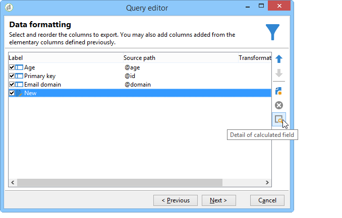

# 定义过滤器条件{#filter-conditions}

要设计查询，必须在查询编辑器中选择筛选条件。 有关可用功能和用例的详情，请参阅此页面。

## 选择运算符 {#choose-operator}

在筛选条件中，您需要使用运算符将两个值链接在一起。

以下是可用的运算符列表：

<table> 
 <thead> 
  <tr> 
   <th> 运算符  </th> 
   <th> 用途  </th> 
   <th> 示例  </th> 
  </tr> 
 </thead> 
 <tbody> 
  <tr> 
   <td> 等于   </td> 
   <td> 返回与在第二个Value列中输入的数据相同的结果。  </td> 
   <td> <strong>姓氏(@lastName)等于“Jones”</strong>将仅返回姓氏为Jones的收件人。  </td> 
  </tr> 
  <tr> 
   <td> 大于   </td> 
   <td> 返回大于输入值的值。  </td> 
   <td> <strong>年龄(@age)大于50</strong>，将返回所有大于'50'的值，即'51'、'52'等。  </td> 
  </tr> 
  <tr> 
   <td> 小于   </td> 
   <td> 返回小于输入值的值。  </td> 
   <td> <strong>创建日期(@created)早于“DaysAgo(100)”</strong>时，将返回所有在100天内创建的收件人。  </td> 
  </tr> 
  <tr> 
   <td> 大于或等于   </td> 
   <td> 返回等于或大于输入值的所有值。  </td> 
   <td> <strong>年龄(@age)大于或等于“30”</strong>将返回年龄为30岁或以上的所有收件人。  </td> 
  </tr> 
  <tr> 
   <td> 小于或等于   </td> 
   <td> 返回等于或小于输入值的所有值。  </td> 
   <td> <strong>年龄(@age)小于或等于“60”</strong>将返回年龄为60岁或以下的所有收件人。  </td> 
  </tr> 
  <tr> 
   <td> 不等于   </td> 
   <td> 返回与输入值不相同的所有值。  </td> 
   <td> <strong>语言(@language)等于“英语”</strong>。  </td> 
  </tr> 
  <tr> 
   <td> 开始于   </td> 
   <td> 返回以输入的值开头的结果。  </td> 
   <td> <strong>帐户# (@account)以“32010”开头。</strong>  </td> 
  </tr> 
  <tr> 
   <td> 不以开头  </td> 
   <td> 返回不以输入的值 开头的结果 </td> 
   <td> <strong>帐户# (@account)不以“20”</strong>开头。  </td> 
  </tr> 
  <tr> 
   <td> 包含   </td> 
   <td> 返回至少包含输入值的结果。  </td> 
   <td> <strong>包含“mail”的电子邮件域(@domain)</strong>将返回包含“mail”的所有域名。 因此，还将返回“gmail.com”域。  </td> 
  </tr> 
  <tr> 
   <td> 不包含   </td> 
   <td> 返回不包含输入值的结果。  </td> 
   <td> <strong>电子邮件域(@domain)不包含“vo”</strong>。 在这种情况下，将不返回包含“vo”的域名。 'voila.fr'域名将不会显示在结果中。  </td> 
  </tr> 
  <tr> 
   <td> 相似   </td> 
   <td> 相似与包含运算符非常相似。它允许您在值中插入%通配符。  </td> 
   <td> <strong>姓氏(@lastName)，如“Jon%s”</strong>。 在本例中，如果操作员忘记了'n'和's'之间的缺少字母，则使用通配符作为“绝招”来查找名称“Jones”。  </td> 
  </tr> 
  <tr> 
   <td> 不相似   </td> 
   <td> 与Like相似。 用于不恢复输入的值。 在本例中，输入的值也必须包含 % 个通配符字段。  </td> 
   <td> <strong>姓氏(@lastName)不像“Smi%h”</strong>。 在此，将不会返回姓氏为“Smi%h”的收件人。  </td> 
  </tr> 
  <tr> 
   <td> 为空   </td> 
   <td> 在这种情况下，我们要查找的结果与第二个“值”列中的空值匹配。  </td> 
   <td> <strong>Mobile (@mobilePhone)为空</strong>返回所有没有手机号码的收件人。  </td> 
  </tr> 
  <tr> 
   <td> 不为空   </td> 
   <td> 与Is empty运算符相反。 无需在第二“值”列中输入数据。  </td> 
   <td> <strong>电子邮件(@email)不为空</strong>。  </td> 
  </tr> 
  <tr> 
   <td> 包含在  中 </td> 
   <td> 返回指定值中包含的结果。 这些值必须以逗号分隔。  </td> 
   <td> <strong>出生日期(@birthDate)包含在“12/10/1979,12/10/1984”</strong>中，将返回这些日期之间出生的收件人。  </td> 
  </tr> 
  <tr> 
   <td> 未包含在  中 </td> 
   <td> 工作方式与运算符中的Include类似。 在此，我们要根据输入的值排除收件人。  </td> 
   <td> <strong>出生日期(@birthDate)不包含在'12/10/1979,12/10/1984'</strong>中。 与上一个示例不同，不会返回这些日期内出生的收件人。  </td> 
  </tr> 
 </tbody> 
</table>

## 使用AND、OR，但 {#using-and--or--except}

对于使用多个筛选条件的查询，需要定义条件之间的链接。 有三种可能的链接：

* **[!UICONTROL And]**&#x200B;允许您组合两个过滤条件，
* **[!UICONTROL Or]**&#x200B;允许您提供替代方案，
* **[!UICONTROL Except]**&#x200B;允许您定义异常。

单击&#x200B;**[!UICONTROL And]**（默认提供）并从下拉列表中选择。

* **[!UICONTROL And]**：添加条件并启用过度筛选。
* **[!UICONTROL Or]**：添加条件并启用过度筛选。

  以下示例允许您查找其电子邮件域包含“orange.co.uk”或其邮政编码以“NW”开头的收件人。

  

* **[!UICONTROL Except]**：如果您有两个过滤器，但第一个过滤器未返回值，则此类型的链接会创建异常。

  在以下示例中，我们希望返回其电子邮件域包含“orange.co.uk”的收件人，除非收件人的姓氏为“Smith”。

  

此示例显示了一个用于显示的过滤器：说西班牙语的收件人、使用手机号码的女性收件人、没有帐号且公司名称以字母“N”开头的收件人。

## 区分条件的优先级 {#prioritizing-conditions}

本节将介绍如何借助工具栏中的蓝色箭头来排列条件的优先级。

* 通过指向右侧的箭头，可以向过滤器添加一定级别的圆括号。
* 通过指向左侧的箭头，可从筛选器中删除选定的括号级别。

  

* 垂直箭头允许您移动条件，从而更改其执行顺序。

此示例说明如何使用箭头删除括号级别。 从以下筛选条件开始： **[!UICONTROL City equal to London OR gender equal to male and mobile not indicated OR account # starts with "95" and company name starts with "A"]**。

将光标置于&#x200B;**[!UICONTROL Gender (@gender) equal to Male]**&#x200B;过滤条件上并单击&#x200B;**[!UICONTROL Remove a parenthesis level]**&#x200B;箭头。

**[!UICONTROL Gender (@gender) equal to Male]**&#x200B;条件已移出其圆括号。 它已经达到与“伦敦与金融城相等”的水平。 这些条件链接在一起(**[!UICONTROL And]**)。

## 选择要提取的数据 {#selecting-data-to-extract}

可用字段因表而异。 所有字段都存储在称为&#x200B;**[!UICONTROL Main element]**&#x200B;的主节点中。 在以下示例中，可用字段位于收件人表中。 字段始终按字母顺序显示。

所选字段的详细信息将显示在窗口底部。 例如，**[!UICONTROL Email domain]**&#x200B;字段是&#x200B;**[!UICONTROL Calculated SQL field]**，其扩展名为&#x200B;**[!UICONTROL (@domain)]**。

>[!NOTE]
>
>使用&#x200B;**[!UICONTROL Search]**&#x200B;工具查找可用字段。

双击可用字段以将其添加到输出列。 在查询结束时，每个选定的字段都会在&#x200B;**[!UICONTROL Data preview]**&#x200B;窗口中创建一个列。

默认情况下，不显示高级字段。 单击可用字段右下角的&#x200B;**[!UICONTROL Display advanced fields]**&#x200B;以显示所有内容。 再次单击可返回到前视图。

例如，在收件人表中，高级字段为&#x200B;**Boolean 1**、**[!UICONTROL Boolean 2]**、**[!UICONTROL Boolean 3]**、**[!UICONTROL Foreign key of "Folder" link]**&#x200B;等。

以下示例显示了收件人表的高级字段。

各种类别的字段：

<table> 
 <thead> 
  <tr> 
   <th> 图标  </th> 
   <th> 说明  </th> 
   <th> 示例  </th> 
  </tr> 
 </thead> 
 <tbody> 
  <tr> 
   <td>  </td> 
   <td> 简单字段  </td> 
   <td> 电子邮件、性别等。  </td> 
  </tr> 
  <tr> 
   <td>  </td> 
   <td> 主键。 此SQL字段用于标识表中的记录。  </td> 
   <td> 标识符收件人为主键，标识符按定义是唯一的。  </td> 
  </tr> 
  <tr> 
   <td>  </td> 
   <td> 外键。 用作指向另一个表的链接。  </td> 
   <td> 收件人外键、服务外键等  </td> 
  </tr> 
  <tr> 
   <td>  </td> 
   <td> 计算字段。 根据请求，使用数据库中的值计算此类型的字段。  </td> 
   <td> 年龄、电子邮件域等  </td> 
  </tr> 
  <tr> 
   <td>  </td> 
   <td> 包含长文本的字段。  </td> 
   <td> 评论、完整地址等  </td> 
  </tr> 
  <tr> 
   <td>  </td> 
   <td> 已编制索引的SQL字段。  </td> 
   <td> 全名、ISO代码等。  </td> 
  </tr> 
 </tbody> 
</table>

链接到表和收集要素：

<table> 
 <thead> 
  <tr> 
   <th> 图标  </th> 
   <th> 说明  </th> 
   <th> 示例  </th> 
  </tr> 
 </thead> 
 <tbody> 
  <tr> 
   <td>  </td> 
   <td> 尤其是指向表的链接。 这些规则与1-1类型关联一致。 源表的出现只能与目标表的一个出现一致。 例如，一个国家/地区只能链接一个收件人。  </td> 
   <td> 文件夹、州/省、国家/地区等。  </td> 
  </tr> 
  <tr> 
   <td>  </td> 
   <td> 特定表上的收集要素。 它们与1-N类型关联一致。 一个源表格出现次数可以与目标表格的多个出现次数一致，但目标表格出现次数可以只与源表格出现次数一致。 例如，一个收件人可以订阅'n'个订阅信。  </td> 
   <td> 订阅、列表、排除日志等  </td> 
  </tr> 
 </tbody> 
</table>

>[!NOTE]
>
>* 使用&#x200B;**[!UICONTROL Add]**&#x200B;按钮（侧图标栏上方）添加要编辑表达式的输出列。 有关编辑表达式的详细信息，请参阅[本节](#building-expressions)。
>* 通过单击红色的“x”（**删除**）删除输出列。
>* 使用箭头更改输出列的顺序。
>* **[!UICONTROL Distribution of values]**&#x200B;用于查看所选字段值的分布情况（例如，链接到收件人城镇、收件人语言等的分布情况）。

## 创建计算字段 {#creating-calculated-fields}

如有必要，请在设置数据格式期间添加列。 计算字段将列添加到数据预览部分。 单击 **[!UICONTROL Add a calculated field]**。

有四种类型的计算字段：

* **[!UICONTROL Fixed string]**：用于添加字符串。

  

* **[!UICONTROL String with JavaScript tags]**：计算字段的值将字符串和JavaScript指令组合在一起。

  

* **[!UICONTROL JavaScript expression]**：计算字段的值是JavaScript函数评估的结果。 可以键入返回的值（数字、日期等）。

  

* **[!UICONTROL Enumerations]**：此类型的字段允许您使用/修改新列中某个输出列的内容。

  可以使用列的源值并为它指定目标值。 此目标值将显示在新输出列中。

  添加计算字段类型&#x200B;**[!UICONTROL Enumerations]**&#x200B;的示例可用，请参阅[此部分](../../workflow/using/adding-enumeration-type-calculated-field.md)。

  

  **[!UICONTROL Enumerations]**&#x200B;类型计算字段可以包括4个条件：

   * **[!UICONTROL Keep the source value]**&#x200B;将源值还原到目标而不更改它。
   * **[!UICONTROL Use the following value]**&#x200B;允许您为未定义的源值输入默认目标值。
   * **[!UICONTROL Generate a warning and continue]**&#x200B;警告用户无法更改源值。
   * **[!UICONTROL Generate an error and reject the line]**&#x200B;阻止计算和导入该行。

单击&#x200B;**[!UICONTROL Detail of calculated field]**&#x200B;可查看插入字段的详细信息。

要删除此计算字段，请单击&#x200B;**[!UICONTROL Remove the calculated field]**&#x200B;十字。

## 构建表达式 {#building-expressions}

表达式编辑工具允许您使用表达式计算聚合、生成函数或编辑公式。

以下示例说明如何对主键运行计数。

应用以下步骤：

1. 在&#x200B;**[!UICONTROL Add]**&#x200B;窗口中单击&#x200B;**[!UICONTROL Data to extract]**。 在&#x200B;**[!UICONTROL Formula type]**&#x200B;窗口中，选择公式类型以输入表达式。

   有多种类型的公式可用： **[!UICONTROL Field only]**、**[!UICONTROL Aggregate]**、**[!UICONTROL Expression]**。

   选择&#x200B;**[!UICONTROL Process on an aggregate function]**&#x200B;和&#x200B;**[!UICONTROL Count]**。 单击 **[!UICONTROL Next]**。

   

1. 计算主键。

   

以下是&#x200B;**[!UICONTROL Formula types]**&#x200B;窗口中可用选项的详细视图：

1. **[!UICONTROL Field only]**&#x200B;允许您返回&#x200B;**[!UICONTROL Field to select]**&#x200B;窗口。
1. **[!UICONTROL Aggregate (Process on an aggregate function)]**。 以下是聚合使用的一些示例：

   * **[!UICONTROL Count]**&#x200B;允许您运行主键计数。
   * **[!UICONTROL Sum]**&#x200B;允许您合计客户在一年以上的所有购买次数。
   * **[!UICONTROL Maximum value]**&#x200B;允许您查找购买最多“n”个产品的客户。
   * **[!UICONTROL Minimum value]**&#x200B;允许您对客户进行排序，并查找最近订阅了优惠的用户。
   * **[!UICONTROL Average]**。 此函数允许您计算收件人的平均年龄。

     **[!UICONTROL Distinct]**&#x200B;框允许您恢复列的唯一值和非零值。 例如，您可以恢复所有收件人的跟踪日志，这些跟踪日志将更改为值1，因为它们都涉及同一收件人。

1. **[!UICONTROL Expression]**&#x200B;打开&#x200B;**[!UICONTROL Edit the expression]**&#x200B;窗口。 这样，您就可以检测包含太多数字（可能是输入错误）的电话号码。

   

   有关所有可用函数的列表，请参阅[函数列表](#list-of-functions)。

## 函数列表 {#list-of-functions}

如果选择&#x200B;**[!UICONTROL Expression]**&#x200B;类型公式，您将被带到“编辑表达式”窗口。 各种类别的函数可以与可用字段关联： **[!UICONTROL Aggregates]**、**[!UICONTROL String]**、**[!UICONTROL Date]**、**[!UICONTROL Numerical]**、**[!UICONTROL Currency]**、**[!UICONTROL Geomarketing]**、**[!UICONTROL Windowing function]**&#x200B;和&#x200B;**[!UICONTROL Others]**。

表达式编辑器如下所示：

它允许您选择数据库表中的字段并向它们添加高级函数。 可以使用以下函数：

**聚合**

<table> 
 <tbody> 
  <tr> 
   <td> <strong>名称</strong>  </td> 
   <td> <strong>说明</strong>  </td> 
   <td> <strong>语法</strong>  </td> 
  </tr> 
  <tr> 
   <td> <strong>平均</strong>  </td> 
   <td> 返回数字类型列 的平均值 </td> 
   <td> Avg（&lt;值&gt;） </td> 
  </tr> 
  <tr> 
   <td> <strong>计数</strong>  </td> 
   <td> 计算列 的非空值 </td> 
   <td> Count（&lt;值&gt;） </td>  
  </tr> 
  <tr> 
   <td> <strong>CountAll</strong>  </td> 
   <td> 计算返回的值（所有字段）  </td> 
   <td> CountAll()  </td> 
  </tr> 
  <tr> 
   <td> <strong>Countdistinct</strong>  </td> 
   <td> 计算列 的不同非空值 </td> 
   <td> Countdistinct（&lt;值&gt;） </td> 
  </tr> 
  <tr> 
   <td> <strong>最大</strong>  </td> 
   <td> 返回数字、字符串或日期类型列 的最大值 </td> 
   <td> Max（&lt;值&gt;） </td>  
  </tr> 
  <tr> 
   <td> <strong>分钟</strong>  </td> 
   <td> 返回数字、字符串或日期类型列 的最小值 </td> 
   <td> Min（&lt;值&gt;） </td> 
  </tr> 
  <tr> 
   <td> <strong>StdDev</strong>  </td> 
   <td> 返回数字、字符串或日期列 的标准偏差 </td> 
   <td> StdDev（&lt;值&gt;） </td> 
  </tr> 
  <tr> 
   <td> <strong>总和</strong>  </td> 
   <td> 返回数字、字符串或日期类型列 的值的总和 </td> 
   <td> Sum（&lt;值&gt;） </td> 
  </tr> 
 </tbody> 
</table>

**字符串**

<table> 
 <tbody> 
  <tr> 
   <td> <strong>名称</strong>  </td> 
   <td> <strong>说明</strong>  </td> 
   <td> <strong>语法</strong>  </td> 
  </tr> 
  <tr> 
   <td> <strong>AllNonNull2</strong>  </td> 
   <td> 指示所有参数是否为非 null 且不为空  </td> 
   <td> AllNonNull2（&lt;字符串&gt;， &lt;字符串&gt;） </td> 
  </tr> 
  <tr> 
   <td> <strong>AllNonNull3</strong>  </td> 
   <td> 指示所有参数是否为非 null 且不为空  </td> 
   <td> AllNonNull3（&lt;字符串&gt;， &lt;字符串&gt;， &lt;字符串&gt;） </td> 
  </tr> 
  <tr> 
   <td> <strong>Ascii</strong>  </td> 
   <td> 返回字符串中第一个字符的ASCII值。  </td> 
   <td> Ascii（&lt;字符串&gt;） </td> 
  </tr> 
  <tr> 
   <td> <strong>Char</strong>  </td> 
   <td> 返回与 ASCII 代码"n"对应的字符  </td> 
   <td> Char（&lt;数字&gt;） </td>  
  </tr> 
  <tr> 
   <td> <strong>Charindex</strong>  </td> 
   <td> 返回字符串1中字符串2的位置。  </td> 
   <td> Charindex（&lt;字符串&gt;， &lt;字符串&gt;） </td> 
  </tr> 
  <tr> 
   <td> <strong>GetLine</strong>  </td> 
   <td> 返回字符串的 n（从 1 到 n）行  </td> 
   <td> GetLine（&lt;字符串&gt;） </td> 
  </tr> 
  <tr> 
   <td> <strong>IfEquals</strong>  </td> 
   <td> 如果前两个参数相等，则返回第三个参数。 如果不是，则返回最后一个参数  </td> 
   <td> IfEquals（&lt;字符串&gt;， &lt;字符串&gt;， &lt;字符串&gt;， &lt;字符串&gt;） </td> 
  </tr> 
  <tr> 
   <td> <strong>IsMemoNull</strong>  </td> 
   <td> 指示作为参数传递的 Memo 是否为 null  </td> 
   <td> IsMemoNull(&lt;memo&gt;) </td> 
  </tr> 
  <tr> 
   <td> <strong>JuxtWords</strong>  </td> 
   <td> 将作为参数传递的字符串连接起来。 如有必要，在字符串之间添加空格。  </td> 
   <td> JuxtWords（&lt;字符串&gt;， &lt;字符串&gt;） </td> 
  </tr> 
  <tr> 
   <td> <strong>JuxtWords3</strong>  </td> 
   <td> 将作为参数传递的字符串连接起来。 如有必要，在字符串之间添加空格  </td> 
   <td> JuxtWords3（&lt;字符串&gt;， &lt;字符串&gt;， &lt;字符串&gt;） </td>  
  </tr> 
  <tr> 
   <td> <strong>LPad</strong>  </td> 
   <td> 返回左侧的已完成字符串  </td> 
   <td> LPad（&lt;字符串&gt;， &lt;数字&gt;， &lt;字符&gt;） </td> 
  </tr> 
  <tr> 
   <td> <strong>Left</strong>  </td> 
   <td> 返回字符串的前 n 个字符  </td> 
   <td> Left（&lt;字符串&gt;， &lt;数字&gt;） </td> 
  </tr> 
  <tr> 
   <td> <strong>Length</strong>  </td> 
   <td> 返回字符串 的长度 </td> 
   <td> Length（&lt;字符串&gt;） </td> 
  </tr> 
  <tr> 
   <td> <strong>Lower</strong>  </td> 
   <td> 以小写形式返回字符串  </td> 
   <td> Lower（&lt;字符串&gt;） </td> 
  </tr> 
  <tr> 
   <td> <strong>Ltrim</strong>  </td> 
   <td> 删除字符串左侧的空格  </td> 
   <td> Ltrim（&lt;字符串&gt;） </td> 
  </tr> 
  <tr> 
   <td> <strong>Md5Digest</strong>  </td> 
   <td> 返回字符串以十六进制表示的 MD5 键值  </td> 
   <td> Md5Digest（&lt;字符串&gt;） </td> 
  </tr> 
  <tr> 
   <td> <strong>MemoContains</strong>  </td> 
   <td> 指定 Memo 是否包含作为参数传递的字符串  </td> 
   <td> MemoContains（&lt;memo&gt;， &lt;字符串&gt;） </td> 
  </tr> 
  <tr> 
   <td> <strong>RPad</strong>  </td> 
   <td> 返回右侧的已完成字符串  </td> 
   <td> RPad（&lt;字符串&gt;， &lt;数字&gt;， &lt;字符&gt;） </td> 
  </tr> 
  <tr> 
   <td> <strong>Right</strong>  </td> 
   <td> 返回字符串的最后 n 个字符  </td> 
   <td> Right(&lt;字符串&gt;)  </td> 
  </tr> 
  <tr> 
   <td> <strong>Rtrim</strong>  </td> 
   <td> 删除字符串右侧的空格  </td> 
   <td> Rtrim(&lt;字符串&gt;)  </td> 
  </tr> 
  <tr> 
   <td> <strong>Smart</strong>  </td> 
   <td> 以大写方式返回带每个单词的第一个字母的字符串  </td> 
   <td> Smart(&lt;字符串&gt;)  </td> 
  </tr> 
  <tr> 
   <td> <strong>Substring</strong>  </td> 
   <td> 提取从字符串的字符n1开始的、长度为n2 的子字符串 </td> 
   <td> Substring(&lt;字符串&gt;, &lt;偏移&gt;, &lt;长度&gt;)  </td>  
  </tr> 
  <tr> 
   <td> <strong>ToString</strong>  </td> 
   <td> 将数字转换为字符串  </td> 
   <td> ToString（&lt;数字&gt;， &lt;数字&gt;）  </td>  
  </tr> 
  <tr> 
   <td> <strong>Upper</strong>  </td> 
   <td> 返回以大写表示的字符串  </td> 
   <td> Upper(&lt;字符串&gt;)  </td>  
  </tr> 
  <tr> 
   <td> <strong>VirtualLink</strong>  </td> 
   <td> 如果其他两个参数相等，则返回作为参数传递的链接的外键  </td> 
   <td> VirtualLink(&lt;数字&gt;, &lt;数字&gt;, &lt;数字&gt;)  </td>  
  </tr> 
  <tr> 
   <td> <strong>VirtualLinkStr</strong>  </td> 
   <td> 如果其他两个参数相等，则返回作为参数传递的链接的外键（文本）  </td> 
   <td> VirtualLinkStr(&lt;字符串&gt;, &lt;数字&gt;, &lt;数字&gt;)  </td>  
  </tr> 
  <tr> 
   <td> <strong>数据长度</strong>  </td> 
   <td> 返回字符串大小  </td> 
   <td> dataLength（&lt;字符串&gt;）  </td>  
  </tr> 
 </tbody> 
</table>

**日期**

<table> 
 <tbody> 
  <tr> 
   <td> <strong>名称</strong>  </td> 
   <td> <strong>说明</strong>  </td> 
   <td> <strong>语法</strong>  </td> 
  </tr> 
  <tr> 
   <td> <strong>AddDays</strong>  </td> 
   <td> 向日期添加天数  </td> 
   <td> AddDays(&lt;日期&gt;, &lt;数字&gt;)  </td>  
  </tr> 
  <tr> 
   <td> <strong>AddHours</strong>  </td> 
   <td> 向日期添加小时数  </td> 
   <td> AddHours(&lt;日期&gt;, &lt;数字&gt;)  </td>  
  </tr> 
  <tr> 
   <td> <strong>AddMinutes</strong>  </td> 
   <td> 向日期添加分钟数  </td> 
   <td> AddMinutes(&lt;日期&gt;, &lt;数字&gt;)  </td>  
  </tr> 
  <tr> 
   <td> <strong>AddMonths</strong>  </td> 
   <td> 向日期添加月数  </td> 
   <td> AddMonths(&lt;日期&gt;, &lt;数字&gt;)  </td>  
  </tr> 
  <tr> 
   <td> <strong>AddSeconds</strong>  </td> 
   <td> 向日期添加秒数  </td> 
   <td> AddSeconds(&lt;日期&gt;, &lt;数字&gt;)  </td>  
  </tr> 
  <tr> 
   <td> <strong>AddYears</strong>  </td> 
   <td> 向日期添加年数  </td> 
   <td> AddYears(&lt;日期&gt;, &lt;数字&gt;)  </td>  
  </tr> 
  <tr> 
   <td> <strong>DateOnly</strong>  </td> 
   <td> 仅返回日期（时间为00:00）*  </td> 
   <td> DateOnly(&lt;日期&gt;)  </td>  
  </tr> 
  <tr> 
   <td> <strong>Day</strong>  </td> 
   <td> 返回表示日期天数的数字  </td> 
   <td> Day(&lt;日期&gt;)  </td>  
  </tr> 
  <tr> 
   <td> <strong>DayOfYear</strong>  </td> 
   <td> 返回日期 年中的天数 </td> 
   <td> DayOfYear(&lt;日期&gt;)  </td>  
  </tr> 
  <tr> 
   <td> <strong>DaysAgo</strong>  </td> 
   <td> 返回与当前日期对应的日期减去n天  </td> 
   <td> DaysAgo(&lt;数字&gt;)  </td>  
  </tr> 
  <tr> 
   <td> <strong>DaysAgoInt</strong>  </td> 
   <td> 返回对应于当前日期减去n天 的日期（整数yyyymmdd） </td> 
   <td> DaysAgoInt(&lt;数字&gt;)  </td>  
  </tr> 
  <tr> 
   <td> <strong>DaysDiff</strong>  </td> 
   <td> 两个日期之间的天数差  </td> 
   <td> DaysDiff(&lt;结束日期&gt;, &lt;开始日期&gt;)  </td>  
  </tr> 
  <tr> 
   <td> <strong>DaysOld</strong>  </td> 
   <td> 返回日期的年龄（以天为单位）  </td> 
   <td> DaysOld(&lt;日期&gt;)  </td>  
  </tr> 
  <tr> 
   <td> <strong>GetDate</strong>  </td> 
   <td> 返回服务器的当前系统日期  </td> 
   <td> GetDate()  </td> 
  </tr> 
  <tr> 
   <td> <strong>Hour</strong>  </td> 
   <td> 返回日期的小时数  </td> 
   <td> Hour(&lt;日期&gt;)  </td>  
  </tr> 
  <tr> 
   <td> <strong>HoursDiff</strong>  </td> 
   <td> 返回两个日期之间的小时数之差  </td> 
   <td> HoursDiff(&lt;结束日期&gt;, &lt;开始日期&gt;)  </td>  
  </tr> 
  <tr> 
   <td> <strong>Minute</strong>  </td> 
   <td> 返回日期的分钟数  </td> 
   <td> Minute(&lt;日期&gt;)  </td>  
  </tr> 
  <tr> 
   <td> <strong>MinutesDiff</strong>  </td> 
   <td> 返回两个日期之间的分钟数之差  </td> 
   <td> MinutesDiff(&lt;结束日期&gt;, &lt;开始日期&gt;)  </td>  
  </tr> 
  <tr> 
   <td> <strong>Month</strong>  </td> 
   <td> 返回表示日期月份的数字  </td> 
   <td> Month(&lt;日期&gt;)  </td>  
  </tr> 
  <tr> 
   <td> <strong>MonthsAgo</strong>  </td> 
   <td> 返回对应于当前日期 n 个月的日期  </td> 
   <td> MonthsAgo(&lt;数字&gt;)  </td>  
  </tr> 
  <tr> 
   <td> <strong>MonthsDiff</strong>  </td> 
   <td> 返回两个日期之间的月数之差  </td> 
   <td> MonthsDiff(&lt;结束日期&gt;, &lt;开始日期&gt;)  </td>  
  </tr> 
  <tr> 
   <td> <strong>MonthsOld</strong>  </td> 
   <td> 返回日期的年龄（以月为单位）  </td> 
   <td> MonthsOld(&lt;日期&gt;)  </td>  
  </tr> 
  <tr> 
   <td> <strong>Second</strong>  </td> 
   <td> 返回日期的秒数  </td> 
   <td> Second(&lt;日期&gt;)  </td>  
  </tr> 
  <tr> 
   <td> <strong>SecondsDiff</strong>  </td> 
   <td> 返回两个日期之间的秒数之差  </td> 
   <td> SecondsDiff(&lt;结束日期&gt;, &lt;开始日期&gt;)  </td>  
  </tr> 
  <tr> 
   <td> <strong>SubDays</strong>  </td> 
   <td> 从日期减去天数  </td> 
   <td> SubDays(&lt;日期&gt;, &lt;数字&gt;)  </td>  
  </tr> 
  <tr> 
   <td> <strong>SubHours</strong>  </td> 
   <td> 从日期减去小时数  </td> 
   <td> SubHours(&lt;日期&gt;, &lt;数字&gt;)  </td>  
  </tr> 
  <tr> 
   <td> <strong>SubMinutes</strong>  </td> 
   <td> 从日期减去分钟数  </td> 
   <td> SubMinutes(&lt;日期&gt;, &lt;数字&gt;)  </td>  
  </tr> 
  <tr> 
   <td> <strong>SubMonths</strong>  </td> 
   <td> 从日期减去月数  </td> 
   <td> SubMonths(&lt;日期&gt;, &lt;数字&gt;)  </td>  
  </tr> 
  <tr> 
   <td> <strong>SubSeconds</strong>  </td> 
   <td> 从日期减去秒数  </td> 
   <td> SubSeconds(&lt;日期&gt;, &lt;数字&gt;)  </td>  
  </tr> 
  <tr> 
   <td> <strong>SubYears</strong>  </td> 
   <td> 从日期减去年数  </td> 
   <td> SubYears(&lt;日期&gt;, &lt;数字&gt;)  </td>  
  </tr> 
  <tr> 
   <td> <strong>ToDate</strong>  </td> 
   <td> 将日期+时间转换为日期  </td> 
   <td> ToDate(&lt;日期 + 时间&gt;)  </td>  
  </tr> 
  <tr> 
   <td> <strong>ToDateTime</strong>  </td> 
   <td> 将字符串转换为日期+时间  </td> 
   <td> ToDateTime(&lt;字符串&gt;)  </td>  
  </tr> 
  <tr> 
   <td> <strong>TruncDate</strong>  </td> 
   <td> 将日期+时间舍入到最接近的秒数  </td> 
   <td> TruncDate(@lastModified, &lt;秒数&gt;)  </td> 
  </tr> 
  <tr> 
   <td> <strong>TruncDateTZ</strong>  </td> 
   <td> 将日期+时间舍入为以秒表示的精度  </td> 
   <td> TruncDateTZ(&lt;日期&gt;, &lt;秒数&gt;, &lt;时区&gt;&gt;)  </td> 
  </tr> 
  <tr> 
   <td> <strong>TruncQuarter</strong>  </td> 
   <td> 将日期舍入到季度  </td> 
   <td> TruncQuarter(&lt;日期&gt;)  </td>  
  </tr> 
  <tr> 
   <td> <strong>TruncTime</strong>  </td> 
   <td> 将时间部分舍入到最接近的秒  </td> 
   <td> TruncTim（e&lt;日期&gt;， &lt;秒数&gt;）  </td>  
  </tr> 
  <tr> 
   <td> <strong>TruncWeek</strong>  </td> 
   <td> 将日期舍入到周  </td> 
   <td> TruncWeek(&lt;日期&gt;)  </td>  
  </tr> 
  <tr> 
   <td> <strong>TruncYear</strong>  </td> 
   <td> 将日期+时间舍入到年度的 1 月 1 日  </td> 
   <td> TruncYear(&lt;日期&gt;)  </td>  
  </tr> 
  <tr> 
   <td> <strong>TruncWeek</strong>  </td> 
   <td> 返回表示日期一周中某天的日期数字  </td> 
   <td> WeekDay(&lt;日期&gt;)  </td>  
  </tr> 
  <tr> 
   <td> <strong>Year</strong>  </td> 
   <td> 返回表示日期年份的数字  </td> 
   <td> Year(&lt;日期&gt;)  </td>  
  </tr> 
  <tr> 
   <td> <strong>YearAnd Month</strong>  </td> 
   <td> 返回表示日期的年份和月份的数字  </td> 
   <td> YearAndMonth(&lt;日期&gt;)  </td>  
  </tr> 
  <tr> 
   <td> <strong>YearsDiff</strong>  </td> 
   <td> 返回两个日期之间的年数之差  </td> 
   <td> YearsDiff(&lt;结束日期&gt;, &lt;开始日期&gt;)  </td>  
  </tr> 
  <tr> 
   <td> <strong>YearsOld</strong>  </td> 
   <td> 返回日期的年龄（以年为单位）  </td> 
   <td> YearsOld(&lt;日期&gt;)  </td>  
  </tr> 
 </tbody> 
</table>

>[!NOTE]
>
>请注意，**Dateonly**&#x200B;函数考虑的是服务器的时区，而不是运算符的时区。

**数值**

<table> 
 <tbody> 
  <tr> 
   <td> <strong>名称</strong>  </td> 
   <td> <strong>说明</strong>  </td> 
   <td> <strong>语法</strong>  </td> 
  </tr> 
  <tr> 
   <td> <strong>Abs</strong>  </td> 
   <td> 返回数字的绝对值  </td> 
   <td> Abs(&lt;数字&gt;)  </td>  
  </tr> 
  <tr> 
   <td> <strong>Ceil</strong>  </td> 
   <td> 返回大于或等于某个数字的最小整数  </td> 
   <td> Ceil(&lt;数字&gt;)  </td>  
  </tr> 
  <tr> 
   <td> <strong>Floor</strong>  </td> 
   <td> 返回大于或等于数字 的最大整数 </td> 
   <td> Floor(&lt;数字&gt;)  </td>  
  </tr> 
  <tr> 
   <td> <strong>Greatest</strong>  </td> 
   <td> 返回两个数字中的较大者  </td> 
   <td> Greatest(&lt;数字 1&gt;, &lt;数字 2&gt;)  </td>  
  </tr> 
  <tr> 
   <td> <strong>Least</strong>  </td> 
   <td> 返回两个数字中的较小者  </td> 
   <td> Least(&lt;数字 1&gt;, &lt;数字 2&gt;)  </td>  
  </tr> 
  <tr> 
   <td> <strong>Mod</strong>  </td> 
   <td> 返回n1除以n2 的整数除余数 </td> 
   <td> Mod(&lt;数字 1&gt;, &lt;数字 2&gt;)  </td>  
  </tr> 
  <tr> 
   <td> <strong>Percent</strong>  </td> 
   <td> 返回两个数字的比值，以百分比表示  </td> 
   <td> Percent(&lt;数字 1&gt;, &lt;数字 2&gt;)  </td>  
  </tr> 
  <tr> 
   <td> <strong>Random</strong>  </td> 
   <td> 返回随机值  </td> 
   <td> Random()  </td> 
  </tr> 
  <tr> 
   <td> <strong>Round</strong>  </td> 
   <td> 将数字舍入为 n 位小数  </td> 
   <td> Round(&lt;数字&gt;, &lt;小数&gt;)  </td>  
  </tr> 
  <tr> 
   <td> <strong>Sign</strong>  </td> 
   <td> 返回数字的符号  </td> 
   <td> Sign(&lt;数字&gt;)  </td>  
  </tr> 
  <tr> 
   <td> <strong>ToDouble</strong>  </td> 
   <td> 将整数转换为浮点  </td> 
   <td> ToDouble(&lt;数字&gt;)  </td>  
  </tr> 
  <tr> 
   <td> <strong>ToInt64</strong>  </td> 
   <td> 将浮点转换为 64 位整数  </td> 
   <td> ToInt64(&lt;数字&gt;)  </td>  
  </tr> 
  <tr> 
   <td> <strong>ToInteger</strong>  </td> 
   <td> 将浮点转换为整数  </td> 
   <td> ToInteger(&lt;数字&gt;)  </td>  
  </tr> 
  <tr> 
   <td> <strong>Trunc</strong>  </td> 
   <td> 将 n1 取整到 n2 位小数  </td> 
   <td> Trunc(&lt;n1&gt;, &lt;n2&gt;)  </td>  
  </tr> 
 </tbody> 
</table>

1. 货币

<table> 
 <tbody> 
  <tr> 
   <td> <strong>名称</strong>  </td> 
   <td> <strong>说明</strong>  </td> 
   <td> <strong>语法</strong>  </td> 
  </tr> 
  <tr> 
   <td> <strong>ConvertCurrency</strong>  </td> 
   <td> 将以源货币表示的金额转换为以目标货币表示的金额  </td> 
   <td> ConvertCurrency（&lt;金额&gt;， &lt;源货币&gt;， &lt;目标货币&gt;， &lt;兑换日期&gt;）  </td>  
  </tr> 
  <tr> 
   <td> <strong>FormatCurrency</strong>  </td> 
   <td> 根据所选货币设置设置显示的金额格式  </td> 
   <td> FormatCurrency（&lt;金额&gt;， &lt;货币&gt;）  </td>  
  </tr> 
 </tbody> 
</table>

**地理营销**

<table> 
 <tbody> 
  <tr> 
   <td> <strong>名称</strong>  </td> 
   <td> <strong>说明</strong>  </td> 
   <td> <strong>语法</strong>  </td> 
  </tr> 
  <tr> 
   <td> <strong>Distance</strong>  </td> 
   <td> 返回由经度和纬度定义的两点之间的距离，以度表示。  </td> 
   <td> Distance(&lt;经度 A&gt;, &lt;纬度 A&gt;, &lt;经度 B&gt;, &lt;纬度 B&gt;)  </td>  
  </tr> 
 </tbody> 
</table>

**其他**

<table> 
 <tbody> 
  <tr> 
   <td> <strong>名称</strong>  </td> 
   <td> <strong>说明</strong>  </td> 
   <td> <strong>语法</strong>  </td> 
  </tr> 
  <tr> 
   <td> <strong>Case</strong>  </td> 
   <td> 如果条件为true，则返回值1。 如果不存在，则返回值2.  </td> 
   <td> Case(When(&lt;条件&gt;, &lt;值 1&gt;), Else(&lt;值 2&gt;))  </td> 
  </tr> 
  <tr> 
   <td> <strong>ClearBit</strong>  </td> 
   <td> 删除值中的标志  </td> 
   <td> ClearBit(&lt;标识符&gt;, &lt;标识&gt;)  </td>  
  </tr> 
  <tr> 
   <td> <strong>Coalesce</strong>  </td> 
   <td> 如果值 1 为 0 或 null，则返回值 2，否则返回值 1  </td> 
   <td> Coalesce(&lt;值 1&gt;, &lt;值 2&gt;)  </td>  
  </tr> 
  <tr> 
   <td> <strong>Decode</strong>  </td> 
   <td> 如果值1 =值2，则返回值3。 如果未返回值4.  </td> 
   <td> Decode(&lt;值 1&gt;, &lt;值 2&gt;, &lt;值 3&gt;, &lt;值 4&gt;)  </td>  
  </tr> 
  <tr> 
   <td> <strong>Else</strong>  </td> 
   <td> 返回值 1（只能用作 case 函数的参数）  </td> 
   <td> Else（&lt;值1&gt;， &lt;值2&gt;）  </td>  
  </tr> 
  <tr> 
   <td> <strong>GetEmailDomain</strong>  </td> 
   <td> 从电子邮件地址提取域名  </td> 
   <td> GetEmailDomain(&lt;值&gt;)  </td>  
  </tr> 
  <tr> 
   <td> <strong>GetMirrorURL</strong>  </td> 
   <td> 检索镜像页面服务器的 URL  </td> 
   <td> GetMirrorURL(&lt;值&gt;)  </td>  
  </tr> 
  <tr> 
   <td> <strong>Iif</strong>  </td> 
   <td> 如果表达式为true，则返回值1。 如果不存在，则返回值2  </td> 
   <td> Iif(&lt;条件&gt;, &lt;值 1&gt;, &lt;值 2&gt;)  </td>  
  </tr> 
  <tr> 
   <td> <strong>IsBitSet</strong>  </td> 
   <td> 指示标志是否在值中  </td> 
   <td> IsBitSet(&lt;标识符&gt;, &lt;标识&gt;)  </td>  
  </tr> 
  <tr> 
   <td> <strong>IsEmptyString</strong>  </td> 
   <td> 如果字符串1为空，则返回值2，否则返回值3  </td> 
   <td> IsEmptyString（&lt;值1&gt;， &lt;值2&gt;， &lt;值3&gt;）  </td>  
  </tr> 
  <tr> 
   <td> <strong>NoNull</strong>  </td> 
   <td> 如果参数为 NULL，则返回空字符串  </td> 
   <td> NoNull(&lt;值&gt;)  </td>   
  </tr> 
  <tr> 
   <td> <strong>RowId</strong>  </td> 
   <td> 返回行号  </td> 
   <td> RowId  </td> 
  </tr> 
  <tr> 
   <td> <strong>SetBit</strong>  </td> 
   <td> 强制将标志设在值中  </td> 
   <td> SetBit(&lt;标识符&gt;, &lt;标识&gt;)  </td>  
  </tr> 
  <tr> 
   <td> <strong>ToBoolean</strong>  </td> 
   <td> 将数字转换为布尔值  </td> 
   <td> ToBoolean(&lt;数字&gt;)  </td>   
  </tr> 
  <tr> 
   <td> <strong>When</strong>  </td> 
   <td> 如果表达式为true，则返回值1。 如果不是，则返回值2（只能用作case函数的参数）  </td> 
   <td> When(&lt;条件&gt;, &lt;值 1&gt;)  </td>  
  </tr> 
 </tbody> 
</table>

**窗口函数**

<table> 
 <tbody> 
  <tr> 
   <td> <strong>名称</strong>  </td> 
   <td> <strong>说明</strong>  </td> 
   <td> <strong>语法</strong>  </td> 
  </tr> 
  <tr> 
   <td> <strong>Desc</strong>  </td> 
   <td> 应用降序排序  </td> 
   <td> Desc(&lt;值 1&gt;)  </td>  
  </tr> 
  <tr> 
   <td> <strong>OrderBy</strong>  </td> 
   <td> 对分区中的结果进行排序  </td> 
   <td> OrderBy(&lt;值 1&gt;)  </td>  
  </tr> 
  <tr> 
   <td> <strong>PartitionBy</strong>  </td> 
   <td> 对表格上的查询结果进行分区  </td> 
   <td> PartitionBy(&lt;值 1&gt;)  </td>  
  </tr> 
  <tr> 
   <td> <strong>RowNum</strong>  </td> 
   <td> 根据表分区和排序顺序生成行号。  </td> 
   <td> RowNum(PartitionBy(&lt;值 1&gt;), OrderBy(&lt;值 1&gt;))  </td> 
  </tr> 
 </tbody> 
</table>
